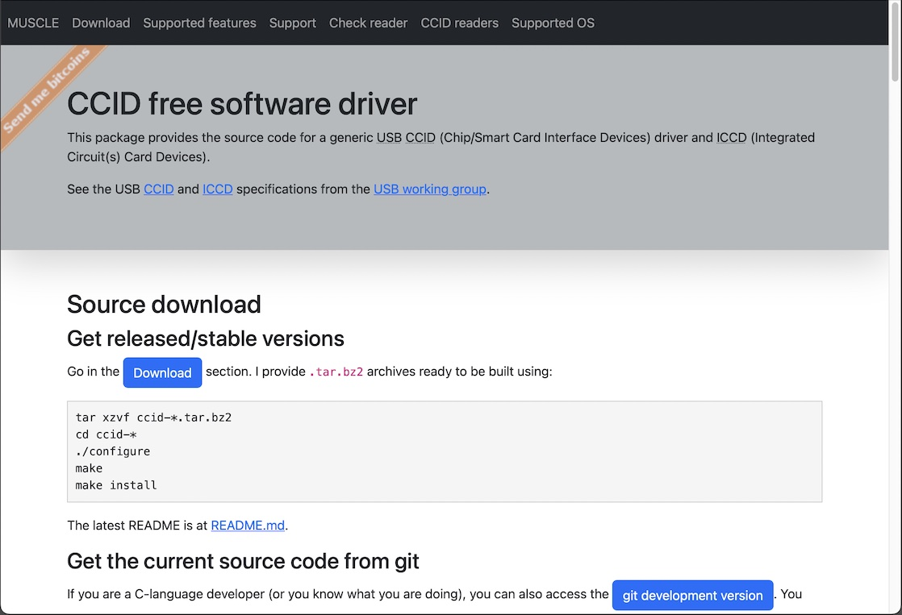
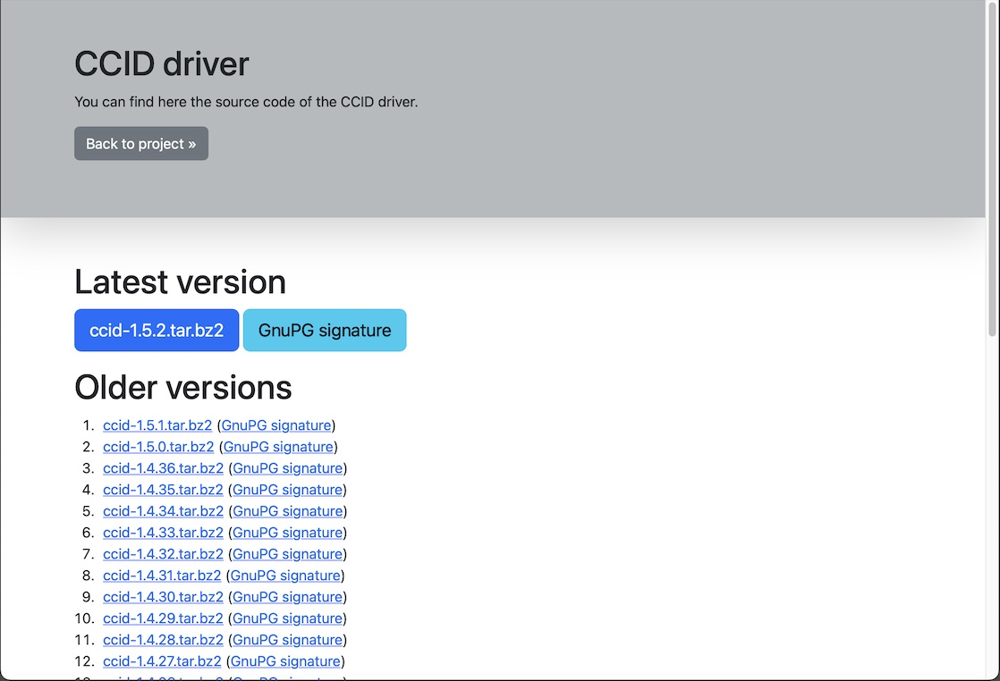
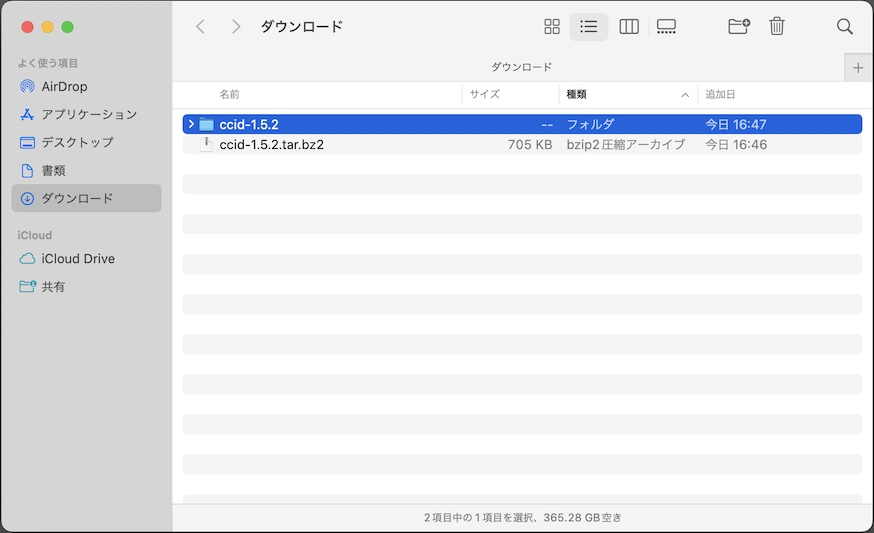
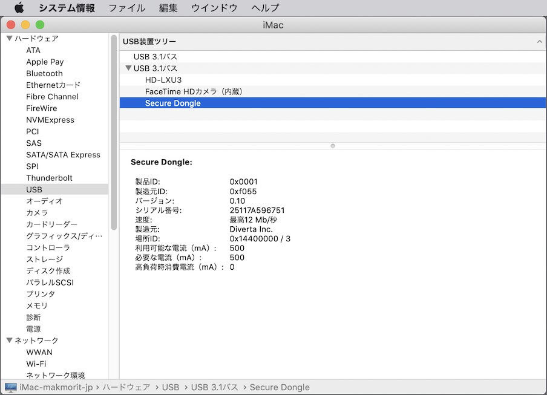

# CCIDドライバー修正ビルド手順

最終更新日：2023/1/16

macOSにプレインストールされているCCIDドライバーを修正ビルドする手順について掲載しています。

#### 経緯・目的

[MDBT50Q Dongle](../FIDO2Device/MDBT50Q_Dongle/README.md)はUSB-IF（[USB Implementers Forum, Inc.](https://www.usb.org)）に参加・届出をしていない製造者のデバイスであるため、macOSでCCIDデバイスとして認識されません。<br>
このため、MDBT50Q Dongleは、macOS上でCCIDインターフェースを使用する機能（PIV、OpenPGP、OATH）を実行させることができません。

他方、MDBT50Q Dongleは仮の製造元ID「`0xF055`」が付与されています。<br>
（当然ですが、これはUSB-IFの管理対象ではありません）<br>
この製造元IDを、macOSにインストールされているCCIDドライバーで管理対象とさせるためには、macOSにプレインストールされているCCIDドライバーを、ソースコードから修正ビルドする必要があります。

本ドキュメントの手順によりCCIDドライバーを修正ビルドし、これをmacOSにインストールすることにより、MDBT50Q DongleをCCIDデバイスとしてmacOSに認識させることができるようになります。

#### 注意点

本手順書で使用するCCIDドライバーは、その更新のたびに追従作業が必要となります。<br>
適宜、[USB-IFの該当ページ](https://ccid.apdu.fr/files/)で、更新情報を確認する必要があります。

最終更新日現在のCCIDドライバーのバージョンは、[`1.5.1`](https://salsa.debian.org/rousseau/CCID/blob/master/README.md)となっております。

## 作業手順

#### パッケージを導入

ビルド作業のために必要となるパッケージを、`brew`などで事前にインストールしておきます。<br>
通常のmacOS環境では`libusb`が導入されていないため、追加インストールします。

```
bash-3.2$ brew install libusb
Running `brew update --preinstall`...
（中略）
==> Fetching libusb
==> Downloading https://ghcr.io/v2/homebrew/core/libusb/manifests/1.0.26
######################################################################## 100.0%
==> Downloading https://ghcr.io/v2/homebrew/core/libusb/blobs/sha256:72ed40aec0356157f3d5071ecb28c481b3f3502985a320ec184
==> Downloading from https://pkg-containers.githubusercontent.com/ghcr1/blobs/sha256:72ed40aec0356157f3d5071ecb28c481b3f
######################################################################## 100.0%
==> Upgrading libusb
  1.0.24 -> 1.0.26

==> Pouring libusb--1.0.26.catalina.bottle.tar.gz
🍺  /usr/local/Cellar/libusb/1.0.26: 22 files, 532.0KB
==> Running `brew cleanup libusb`...
（中略）
==> Checking for dependents of upgraded formulae...
==> No broken dependents found!
bash-3.2$
```

`libusb`は、`/usr/local/Cellar/libusb/1.0.26/lib`に導入されます。

```
bash-3.2$ ls -al /usr/local/Cellar/libusb/1.0.26/lib
total 608
drwxr-xr-x   6 makmorit  staff     192  4 10  2022 .
drwxr-xr-x  13 makmorit  staff     416  1 16 11:02 ..
-r--r--r--   1 makmorit  staff  141344  1 16 11:02 libusb-1.0.0.dylib
-r--r--r--   1 makmorit  staff  165968  4 10  2022 libusb-1.0.a
lrwxr-xr-x   1 makmorit  staff      18  4 10  2022 libusb-1.0.dylib -> libusb-1.0.0.dylib
drwxr-xr-x   3 makmorit  staff      96  1 16 11:02 pkgconfig
bash-3.2$
```

ビルド作業や、ビルド後のCCIDドライバー実行の際は、動的リンクが不要であるため、必ず`.dylib`ファイルをリネームしておくようにします。

```
bash-3.2$ cd /usr/local/Cellar/libusb/1.0.26/lib
bash-3.2$ mv libusb-1.0.0.dylib __libusb-1.0.0.dylib
bash-3.2$ mv libusb-1.0.dylib __libusb-1.0.dylib
bash-3.2$
bash-3.2$ ls -al
total 608
drwxr-xr-x   6 makmorit  staff     192  1 16 11:21 .
drwxr-xr-x  13 makmorit  staff     416  1 16 11:02 ..
-r--r--r--   1 makmorit  staff  141344  1 16 11:02 __libusb-1.0.0.dylib
lrwxr-xr-x   1 makmorit  staff      18  4 10  2022 __libusb-1.0.dylib -> libusb-1.0.0.dylib
-r--r--r--   1 makmorit  staff  165968  4 10  2022 libusb-1.0.a
drwxr-xr-x   3 makmorit  staff      96  1 16 11:02 pkgconfig
bash-3.2$
```

#### ソースコードを取得

下記サイトから[ソースコード（`ccid-1.5.1.tar.bz2`）](https://ccid.apdu.fr/files/ccid-1.5.1.tar.bz2)をダウンロードします。
- <b>[CCID free software driver](https://ccid.apdu.fr)</b>

サイト[`https://ccid.apdu.fr`](https://ccid.apdu.fr)を表示し、青い「Download」ボタンをクリックします。



遷移先ページにある「Latest version」のリンクをクリックします。



ダウンロードした「`ccid-1.5.1.tar.bz2`」を解凍します。



解凍したフォルダー`ccid-1.5.1`を、`${HOME}/opt/`配下に<b>移動します</b>。

```
bash-3.2$ ls -al ${HOME}/Downloads
total 1464
drwx------@  6 makmorit  staff     192  1 16 11:24 .
drwxr-xr-x+ 42 makmorit  staff    1344  1 16 09:06 ..
:
drwxr-xr-x@ 31 makmorit  staff     992 11 14 19:42 ccid-1.5.1
-rw-r--r--@  1 makmorit  staff  702586  1 16 11:23 ccid-1.5.1.tar.bz2
bash-3.2$
bash-3.2$ mv ${HOME}/Downloads/ccid-1.5.1 ${HOME}/opt
bash-3.2$
bash-3.2$ ls -al ${HOME}/opt/
total 32
drwxr-xr-x  10 makmorit  staff    320  1 16 11:25 .
drwxr-xr-x+ 42 makmorit  staff   1344  1 16 09:06 ..
:
drwxr-xr-x@ 31 makmorit  staff    992 11 14 19:42 ccid-1.5.1
:
bash-3.2$

```

#### メイクファイルの生成

ソースコードフォルダー`ccid-1.4.32`に移動したら、シェル`./MacOSX/configure`を実行し、メイクファイルを生成します。

```
bash-3.2$ cd ${HOME}/opt/ccid-1.5.1/
bash-3.2$ ./MacOSX/configure
+ ./configure 'CFLAGS= -DRESPONSECODE_DEFINED_IN_WINTYPES_H' PCSC_CFLAGS=-I/Users/makmorit/opt/ccid-1.5.1/MacOSX 'PCSC_LIBS=-framework PCSC' LIBUSB_CFLAGS=-I/usr/local/Cellar/libusb/1.0.26/include/libusb-1.0 'LIBUSB_LIBS=-L/usr/local/Cellar/libusb/1.0.26/lib -lusb-1.0 -lobjc -Wl,-framework,IOKit -Wl,-framework,CoreFoundation -Wl,-framework,Security' LDFLAGS= --enable-usbdropdir=/usr/local/libexec/SmartCardServices/drivers --disable-dependency-tracking --enable-oslog --disable-static --disable-pcsclite --enable-composite-as-multislot
checking for a BSD-compatible install... /usr/local/bin/ginstall -c
checking whether build environment is sane... yes
checking for a race-free mkdir -p... /usr/local/bin/gmkdir -p
（中略）
libccid has been configured with following options:

Version:             1.5.1
Host:                x86_64-apple-darwin19.6.0
Compiler:            gcc
Preprocessor flags:  
Compiler flags:       -DRESPONSECODE_DEFINED_IN_WINTYPES_H
（中略）
libusb support:          yes
composite as multislot:  yes
multi threading:         yes
bundle directory name:   ifd-ccid.bundle
USB drop directory:      /usr/local/libexec/SmartCardServices/drivers
serial Twin support:     no
serial twin install dir: /usr/local/libexec/SmartCardServices/drivers/serial
serial config directory:
compiled for pcsc-lite:  no
syslog debug:            no
os_log debug:            yes
class driver:            yes
（中略）
+ r=0
+ rm -f src/Info.plist
+ exit 0
bash-3.2$ echo $?
0
bash-3.2$
```

#### サポートデバイスリストの修正内容

新たにmacOSでサポートさせたいデバイスとなる、MDBT50Q Dongleの製品ID（VID／PID）を、サポートデバイスリストに追記します。

MDBT50Q Dongleは、製造元ID＝`0xF055`、製品ID＝`0x0001`とします。<br>
この値を、`readers/supported_readers.txt`というファイルに追記します。<br>
記述フォーマットは下記の通りです。

```
# <製造者名>
<VID>:<PID>:<製造者名> <製品名>
```

下記は設定例になります。
- 製造者名: `Diverta Inc.`
- 製品名: `Secure Dongle`
- VID: `0xF055`
- PID: `0x0001`

```
# Diverta Inc.
0xF055:0x0001:Diverta Inc. Secure Dongle
```

#### サポートデバイスリストの修正（パッチ適用）
先述のサポートデバイスリスト`supported_readers.txt`を修正するためのパッチを用意しております。<br>
以下のコマンドを実行すると、エディター等を使用しなくても、サポートデバイスリストを修正することができます。

```
cd ${HOME}/opt/ccid-1.5.1/
patch readers/supported_readers.txt < ${HOME}/GitHub/onecard-fido/CCID/macOSDriver/supported_readers.txt.patch
```

下記は実行例になります。

```
bash-3.2$ patch readers/supported_readers.txt < ${HOME}/GitHub/onecard-fido/CCID/macOSDriver/supported_readers.txt.patch
patching file readers/supported_readers.txt
Hunk #1 succeeded at 926 with fuzz 2 (offset 134 lines).
bash-3.2$
bash-3.2$ cat readers/supported_readers.txt | grep Diverta
# Diverta Inc.
0xF055:0x0001:Diverta Inc. Secure Dongle
bash-3.2$
```

#### ビルドの実行

`make`コマンドを実行し、ビルドを実行します。

```
bash-3.2$ make
/Applications/Xcode.app/Contents/Developer/usr/bin/make  all-recursive
Making all in readers
make[2]: Nothing to be done for `all'.
（中略）
make[3]: Nothing to be done for `all-am'.
Making all in src
  CC       parse-parse.o
  CC       parse-debug.o
  CC       parse-ccid_usb.o
（中略）
  CCLD     libccid.la
make[2]: Nothing to be done for `all-am'.
bash-3.2$
bash-3.2$ echo $?
0
bash-3.2$
```

以上でビルドは完了になります。

#### インストールの実行

動作確認を行うため、コマンド`sudo make install`を使用し、ビルドしたCCIDドライバーをシステム（macOS）にインストールします。

```
bash-3.2$ sudo make install
Password:
Making install in readers
make[2]: Nothing to be done for `install-exec-am'.
make[2]: Nothing to be done for `install-data-am'.
（中略）
Making install in src
./create_Info_plist.pl ./../readers/supported_readers.txt ./Info.plist.src --target=libccid.dylib --version=1.5.1  > Info.plist
/bin/sh /Users/makmorit/opt/ccid-1.5.1/install-sh -d "/usr/local/libexec/SmartCardServices/drivers/ifd-ccid.bundle/Contents/MacOS/"
cp Info.plist "/usr/local/libexec/SmartCardServices/drivers/ifd-ccid.bundle/Contents/"
cp .libs/libccid.dylib "/usr/local/libexec/SmartCardServices/drivers/ifd-ccid.bundle/Contents/MacOS/libccid.dylib"
***************
copy the src/92_pcscd_ccid.rules file in udev directory (/etc/udev/rules.d/)
***************
make[2]: Nothing to be done for `install-exec-am'.
make[2]: Nothing to be done for `install-data-am'.
bash-3.2$
bash-3.2$ echo $?
0
bash-3.2$
```

この作業をおこなっても、macOSにプレインストールされたCCIDドライバー`/usr/libexec/SmartCardServices`は、上書き修正されません。<br>
本件インストール実行では、`/usr/local/libexec/SmartCardServices`という場所にインストールされます。

インストールされたCCIDドライバーのパッケージファイルを直接参照し、新たに追加したサポート対象デバイスが、サポートデバイスリストに記載されていることを為念確認します。

```
bash-3.2$ cd /usr/local/libexec/SmartCardServices/drivers/ifd-ccid.bundle/Contents/
bash-3.2$ cat Info.plist | grep Diverta
		<string>Diverta Inc. Secure Dongle</string>
bash-3.2$
```

以上でインストールは完了になります。

#### 動作確認

PCを再起動し、インストールしたCCIDドライバーを有効化させます。<br>
その後、MDBT50Q Dongle（＝新たに追加されたサポート対象デバイス）を、PCのUSBポートに接続します。

macOSの「システム情報」アプリを実行し、認識・接続されるかどうかを確認します。<br>
下図のように、製品ID＝`0x0001`、製造元ID＝`0xF055`が表示されればOKです。



以上で動作確認は完了です。

## インストーラーの作成

他のmacOSを搭載したPCに、上記手順で作成したCCIDドライバーをインストールするためのインストーラー（再頒布用パッケージ）を作成します。

#### インストーラー作成用媒体の配置

`${HOME}/GitHub/onecard-fido/CCID/macOSDriver`に、インストーラーを作成するためのファイルを配置します。

まずは、このフォルダーの直下に`CCIDDriver.plist`というファイルを以下の内容で生成します。

```
<?xml version="1.0" encoding="UTF-8"?>
<!DOCTYPE plist PUBLIC "-//Apple//DTD PLIST 1.0//EN" "http://www.apple.com/DTDs/PropertyList-1.0.dtd">
<plist version="1.0">
<array>
	<dict>
		<key>BundleHasStrictIdentifier</key>
		<true/>
		<key>BundleIsRelocatable</key>
		<false/>
		<key>BundleIsVersionChecked</key>
		<false/>
		<key>BundleOverwriteAction</key>
		<string>upgrade</string>
		<key>RootRelativeBundlePath</key>
		<string>ifd-ccid.bundle</string>
	</dict>
</array>
</plist>
```

次に、`bundle`というサブディレクトリーに、前述の手順で生成したドライバー`ifd-ccid.bundle`を、権限を変えずにコピーします。<br>
以下は実行例になります。

```
bash-3.2$ cp -prv /usr/local/libexec/SmartCardServices/drivers/ifd-ccid.bundle ${HOME}/GitHub/onecard-fido/CCID/macOSDriver/bundle
/usr/local/libexec/SmartCardServices/drivers/ifd-ccid.bundle -> /Users/makmorit/GitHub/onecard-fido/CCID/macOSDriver/bundle/ifd-ccid.bundle
/usr/local/libexec/SmartCardServices/drivers/ifd-ccid.bundle/Contents -> /Users/makmorit/GitHub/onecard-fido/CCID/macOSDriver/bundle/ifd-ccid.bundle/Contents
/usr/local/libexec/SmartCardServices/drivers/ifd-ccid.bundle/Contents/MacOS -> /Users/makmorit/GitHub/onecard-fido/CCID/macOSDriver/bundle/ifd-ccid.bundle/Contents/MacOS
/usr/local/libexec/SmartCardServices/drivers/ifd-ccid.bundle/Contents/MacOS/libccid.dylib -> /Users/makmorit/GitHub/onecard-fido/CCID/macOSDriver/bundle/ifd-ccid.bundle/Contents/MacOS/libccid.dylib
/usr/local/libexec/SmartCardServices/drivers/ifd-ccid.bundle/Contents/Info.plist -> /Users/makmorit/GitHub/onecard-fido/CCID/macOSDriver/bundle/ifd-ccid.bundle/Contents/Info.plist
bash-3.2$
```

#### インストーラーの作成

インストーラー作成のために必要なファイルが揃ったら、以下のコマンドを実行します。

```
cd ${HOME}/GitHub/onecard-fido/CCID/macOSDriver/
rm -rfv CCIDDriver.pkg
pkgbuild --root bundle --component-plist CCIDDriver.plist --identifier jp.co.diverta.CCIDDriver --version 1.5.1 --install-location /usr/local/libexec/SmartCardServices/drivers CCIDDriver.pkg
```

下記は実行例になります。<br>
`CCIDDriver.pkg`というファイル（CCIDドライバーのインストーラー）が作成されます。<br>
この`CCIDDriver.pkg`を、適宜ほかのmacOS環境に配布し、CCIDドライバーをインストールすることになります。

```
bash-3.2$ cd ${HOME}/GitHub/onecard-fido/CCID/macOSDriver/
bash-3.2$ rm -rfv CCIDDriver.pkg
CCIDDriver.pkg
bash-3.2$ pkgbuild --root bundle --component-plist CCIDDriver.plist --identifier jp.co.diverta.CCIDDriver --version 1.5.1 --install-location /usr/local/libexec/SmartCardServices/drivers CCIDDriver.pkg
pkgbuild: Reading components from CCIDDriver.plist
pkgbuild: Adding component at ifd-ccid.bundle
pkgbuild: Wrote package to CCIDDriver.pkg
bash-3.2$
bash-3.2$ ls -al *.pkg
-rw-r--r--  1 makmorit  staff  125513  1 16 13:04 CCIDDriver.pkg
bash-3.2$
```


以上で、CCIDドライバーのインストーラー作成は完了です。
