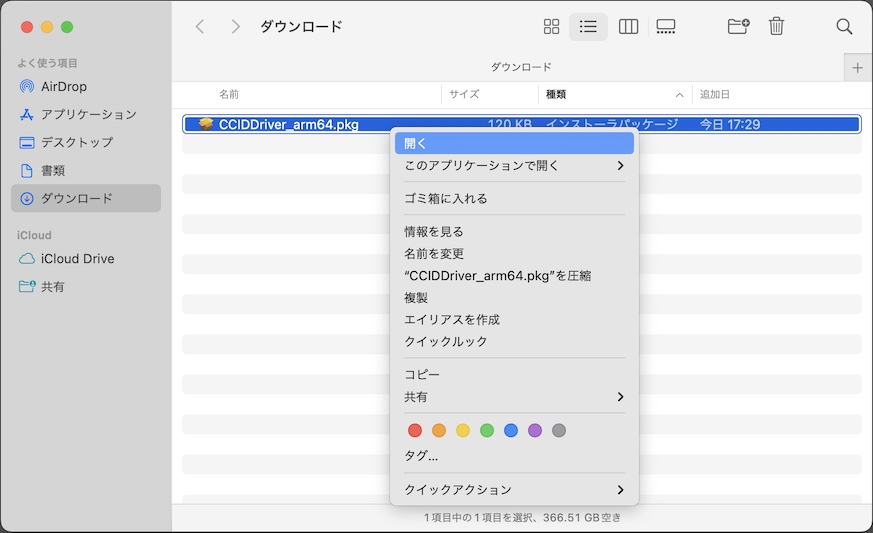
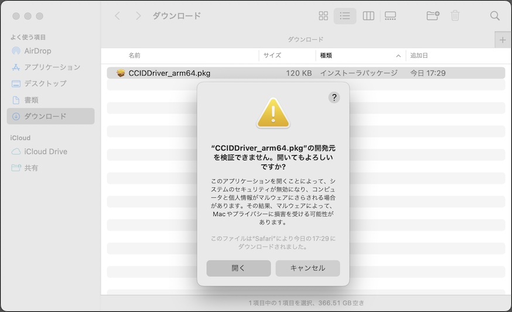

# CCIDドライバーインストール手順

## 概要
[MDBT50Q Dongle](../FIDO2Device/MDBT50Q_Dongle/README.md)のCCIDインターフェース専用ドライバー（以下単に「CCIDドライバー」）を、macOS環境にインストールする手順を掲載しています。

#### ご参考
Windows10 環境では、CCIDドライバーが最初からシステムに組み込まれているため、CCIDドライバーのインストールは不要です。

## インストール媒体の取得

CCIDドライバー「[CCIDDriver.pkg](../CCID/macOSDriver/CCIDDriver.pkg)」を、GitHubからダウンロード／解凍します。 
該当ページの「Download」ボタンをクリックすると、[CCIDDriver.pkg](../CCID/macOSDriver/CCIDDriver.pkg)がダウンロードできます。

## インストールの実行

ダウンロードされたファイルを右クリックし「開く」を実行してください。 
（2020/07/21現在、アプリに署名がされていないので、アイコンをダブルクリックしても実行することができないための措置になります）

警告画面が表示されますが、続いて「開く」を実行します。

インストーラーが起動しますので、指示に従いインストールを進めます。

インストールが完了します。

インストーラを閉じたら、PCを再起動します。

再起動が完了してログインしたら、MDBT50Q DongleをPCのUSBポートに装着します。 
１〜２秒ほどで、下図のような「スマートカードペアリング」画面が表示されます。

ここではペアリングせず、キャンセルをクリックして画面を閉じてください。 
（2020/07/21現在、PIVアプリケーションがMDBT50Q Dongleに搭載されていないため、macOSとMDBT50Q Dongleのペアリングは不可能となっております）

これで、CCIDドライバーのインストールは完了です。
