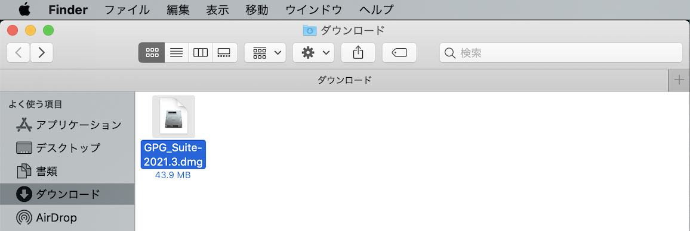
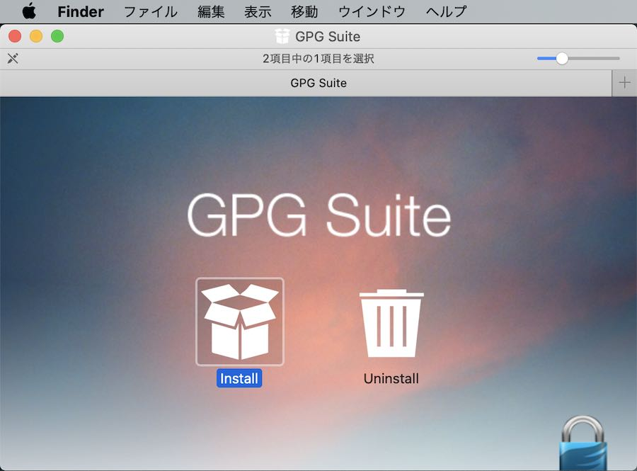
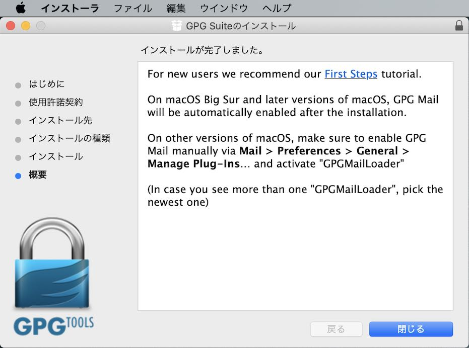
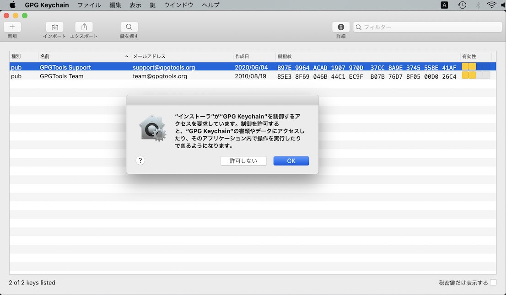
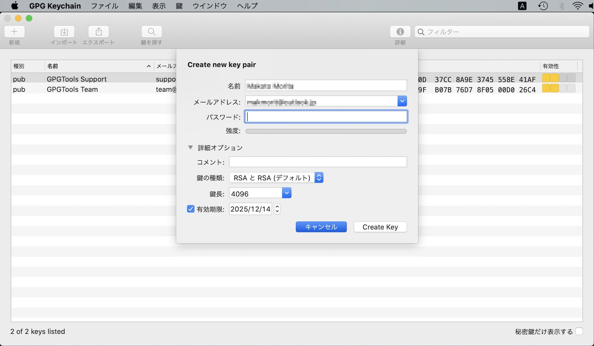

# GPG Suiteインストール手順

GPGツール群「GPG Suite」を、macOS環境にインストールする手順について掲載します。

## 概要

[MDBT50Q Dongle](../../FIDO2Device/MDBT50Q_Dongle/README.md)のOpenPGPカードエミュレーション機能を、macOS環境上で利用するためには、GPGツール群である「GPG Suite」をインストールする必要があります。

GPG Suiteをインストールすると、以下の機能が利用できます。
- ファイルの署名およびその検証
- ファイルの暗号化およびその復号化
- 上記機能を利用するために必要となる秘密鍵／公開鍵の生成

## 事前準備

#### CCIDドライバーのインストール

OpenPGPカードエミュレーション機能は、USB CCIDインターフェース上で動作します。 
したがいまして、事前に「CCIDドライバー」をインストールする必要があります。

詳細な手順につきましては、手順書「<b>[CCIDドライバーインストール手順](../../CCID/INSTALLPRG.md)</b>」をご参照願います。

CCIDドライバーのインストールが完了したら、[MDBT50Q Dongle](../../FIDO2Device/MDBT50Q_Dongle/README.md)をPCのUSBポートに装着すると、MDBT50Q DongleがmacOSにより、OpenPGPカードデバイスとして認識されるようになります。

## ダウンロード

こちらのサイトにアクセスします。 
https://gpgtools.org 
下図のような画面に遷移します。

画面中央の「Download」ボタンをクリックしてダウンロードを実行すると「GPG_Suite-2021.3.dmg」というファイルがダウンロードされます。

## インストール

ダウンロードされた「GPG_Suite-2020.2.dmg」をダブルクリックしてインストールを実行します。 
下図のような画面（パッケージフォルダー）が表示されたら、左側の「Install」をダブルクリックします。

インストーラが起動しますので、画面の案内にしたがってインストールを進めます。

インストールが完了したら「閉じる」ボタンをクリックします。

「GPG Keychain」というアプリが自動的に起動します。 
表示されたポップアップ画面の「OK」ボタンをクリックして閉じてください。

続いて表示されたポップアップ画面の「キャンセル」ボタンをクリックして閉じてください。

GPG Keychainアプリを終了させます。

最後に、インストール用媒体を閉じます。 
メニューから「"GPG Suite"を取り出す」を選択して実行します。

以上でGPG Suiteのインストールは完了です。
