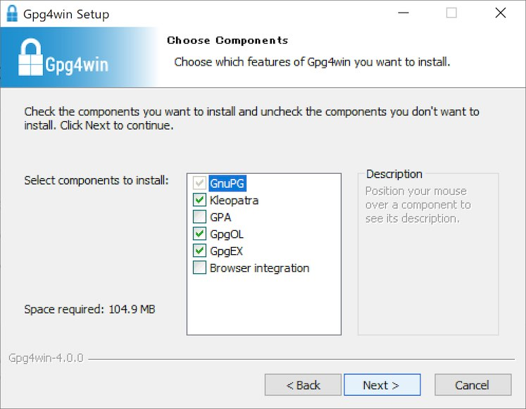

# Gpg4winインストール手順

GPGツール群「Gpg4win」を、Windows環境にインストールする手順について掲載します。

## 概要

[MDBT50Q Dongle](../../FIDO2Device/MDBT50Q_Dongle/README.md)のOpenPGPカードエミュレーション機能を、Windows環境上で利用するためには、GPGツール群である「Gpg4win」をインストールする必要があります。

Gpg4winをインストールすると、以下の機能が利用できます。
- ファイルの署名およびその検証
- ファイルの暗号化およびその復号化
- 上記機能を利用するために必要となる秘密鍵／公開鍵の生成

## ダウンロード

こちらのサイトにアクセスします。 
https://www.gnupg.org 
下図のような画面に遷移します。

画面上部の「Download」というプルダウンメニューをクリックします。

遷移先画面を下側にスクロールすると「GNUPG BINARY RELEASES」という欄があるので、その中にある「Gpg4win」という青いリンクをクリックします。

「Download」画面に遷移するので、中央の「Gpg4win」という緑色のリンクをクリックします。

遷移先画面の「$0」をクリック後、表示される「Download」のリンクをクリックすると、ダウンロードが開始されます。

「`gpg4win-4.0.0.exe`」というファイルがダウンロードされます。

## インストール

ダウンロードされた「`gpg4win-4.0.0.exe`」を開くと、下図のようなインストーラーが起動します。 
「Next」をクリックします。

画面の案内にしたがってインストールを進めます。 
画面入力内容は別段変更せず「Next」ボタンをクリックします。

こちらも画面入力内容は別段変更しないままにします。 
「Install」ボタンをクリックすると、インストールが開始されます。

インストールが完了したら「Next」ボタンをクリックします。

遷移先画面の「Finish」ボタンをクリックします。

「Kleopatra」というアプリが自動的に起動します。 
表示された画面右上の「×」ボタンをクリックして閉じてください。

以上でGpg4winのインストールは完了です。
