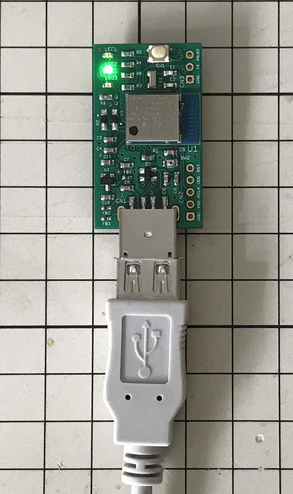

# GPG Suiteによる鍵インストール手順

[MDBT50Q Dongle](../../FIDO2Device/MDBT50Q_Dongle/README.md)のOpenPGPカードエミュレーション機能のために必要となる、秘密鍵のインストール手順について掲載します。

## 概要

GPGツール群「[GPG Suite](https://gpgtools.org)」を使用し、[MDBT50Q Dongle](../../FIDO2Device/MDBT50Q_Dongle/README.md)に、秘密鍵をインストールします。

`gpg`というコマンドを使用し、概ね以下の流れで作業を進めます。
- `gpg`コマンドを使用し、秘密鍵をPC上に生成
- 生成された秘密鍵を、`gpg`コマンドでMDBT50Q Dongleに移動

#### サポートされるアルゴリズム
現状「RSA-2048」のみとなっております。

#### 参考文献
手順検証につきましては、下記リンクの記事を参考にさせていただきました。<br>
「GPG ToolsでYubiKeyを使う」<br>
　https://yoshi0808.github.io/new-technology/2021/02/13/yubikey_gpg/

## 事前準備

生成された秘密鍵の移動先である[MDBT50Q Dongle](../../FIDO2Device/MDBT50Q_Dongle/README.md)と、`gpg`コマンドを実行するために必要なGPGツール群「[GPG Suite](https://gpgtools.org)」を準備します。

#### MDBT50Q Dongleの準備

[version 0.3.1](https://github.com/diverta/onecard-fido/blob/doc-20210311/nRF52840_app/firmwares/secure_device_app)以降の[nRF52840アプリケーション](../../nRF52840_app/firmwares/secure_device_app)が書き込まれたMDBT50Q Dongleを、あらかじめ準備します。<br>
具体的な手順は、別ドキュメント「[nRF52840アプリケーション更新手順書](../../nRF52840_app/firmwares/secure_device_app/UPDATEAPP.md)」をご参照ください。

#### GPG Suiteのインストール
`gpg`コマンドを実行するためには、macOS環境にGPG Suiteをインストールする必要があります。<br>
具体的な手順は、別ドキュメント<b>「[GPG Suiteインストール手順](../../CCID/OpenPGP/GPGINSTMAC.md)」</b>をご参照ください。

## 秘密鍵／公開鍵の生成手順

`gpg`コマンドを使用し、秘密鍵をPC上に生成するとともに、暗号化等で必要な公開鍵を生成します。<br>
以下の流れで作業を進めます。
- 作業用フォルダー生成
- 秘密鍵（主鍵）生成
- 秘密鍵（副鍵）生成
- 作成された鍵の確認
- 作業用フォルダーのバックアップ
- 公開鍵ファイル生成

#### 作業用フォルダー生成
鍵を生成するための一時フォルダー（作業用フォルダー）を、PC上に生成します。<br>
コマンド`export GNUPGHOME=$(mktemp -d)`を実行します。

以下は実行例になります。

```
bash-3.2$ export GNUPGHOME=$(mktemp -d)
bash-3.2$ echo $GNUPGHOME
/var/folders/df/jr7rkh_j5sb26jw69mk9p1hc0000gp/T/tmp.uLhQPtof
bash-3.2$
```

#### 秘密鍵（主鍵）生成

１点のメイン鍵（主鍵）を生成します。<br>
コマンド`gpg --expert --full-gen-key`を実行します。

以下は実行例になります。<br>
主鍵の有効期限は無期限としております。

```
bash-3.2$ gpg --expert --full-gen-key
gpg (GnuPG/MacGPG2) 2.2.24; Copyright (C) 2020 Free Software Foundation, Inc.
This is free software: you are free to change and redistribute it.
There is NO WARRANTY, to the extent permitted by law.

gpg: keybox'/var/folders/df/jr7rkh_j5sb26jw69mk9p1hc0000gp/T/tmp.uLhQPtof/pubring.kbx'が作成されました
ご希望の鍵の種類を選択してください:
   (1) RSA と RSA (デフォルト)
   (2) DSA と Elgamal
   (3) DSA (署名のみ)
   (4) RSA (署名のみ)
   (7) DSA (機能をあなた自身で設定)
   (8) RSA (機能をあなた自身で設定)
   (9) ECC と ECC
  (10) ECC (署名のみ)
  (11) ECC (機能をあなた自身で設定)
  (13) 既存の鍵
  (14) カードに存在する鍵
あなたの選択は? 8

鍵RSAに認められた操作: Sign Certify Encrypt Authenticate
現在の認められた操作: Sign Certify Encrypt

   (S) 署名機能を反転する
   (E) 暗号機能を反転する
   (A) 認証機能を反転する
   (Q) 完了

あなたの選択は? S

鍵RSAに認められた操作: Sign Certify Encrypt Authenticate
現在の認められた操作: Certify Encrypt

   (S) 署名機能を反転する
   (E) 暗号機能を反転する
   (A) 認証機能を反転する
   (Q) 完了

あなたの選択は? E

鍵RSAに認められた操作: Sign Certify Encrypt Authenticate
現在の認められた操作: Certify

   (S) 署名機能を反転する
   (E) 暗号機能を反転する
   (A) 認証機能を反転する
   (Q) 完了

あなたの選択は? Q
RSA 鍵は 1024 から 4096 ビットの長さで可能です。
鍵長は? (3072) 2048
要求された鍵長は2048ビット
鍵の有効期限を指定してください。
         0 = 鍵は無期限
      <n>  = 鍵は n 日間で期限切れ
      <n>w = 鍵は n 週間で期限切れ
      <n>m = 鍵は n か月間で期限切れ
      <n>y = 鍵は n 年間で期限切れ
鍵の有効期間は? (0)0
鍵は無期限です
これで正しいですか? (y/N) y

GnuPGはあなたの鍵を識別するためにユーザIDを構成する必要があります。

本名: makmorit
電子メール・アドレス: makmorit@test.jp
コメント: for test
次のユーザIDを選択しました:
    "makmorit (for test) <makmorit@test.jp>"

名前(N)、コメント(C)、電子メール(E)の変更、またはOK(O)か終了(Q)? O
たくさんのランダム・バイトの生成が必要です。キーボードを打つ、マウスを動か
す、ディスクにアクセスするなどの他の操作を素数生成の間に行うことで、乱数生
成器に十分なエントロピーを供給する機会を与えることができます。
gpg: /var/folders/df/jr7rkh_j5sb26jw69mk9p1hc0000gp/T/tmp.uLhQPtof/trustdb.gpg: 信用データベースができました
gpg: 鍵CDEE9F389A419798を究極的に信用するよう記録しました
gpg: ディレクトリ'/var/folders/df/jr7rkh_j5sb26jw69mk9p1hc0000gp/T/tmp.uLhQPtof/openpgp-revocs.d'が作成されました
gpg: 失効証明書を '/var/folders/df/jr7rkh_j5sb26jw69mk9p1hc0000gp/T/tmp.uLhQPtof/openpgp-revocs.d/6179EE132A2A2673A56F6588CDEE9F389A419798.rev' に保管しました。
公開鍵と秘密鍵を作成し、署名しました。

pub   rsa2048 2021-03-09 [C]
      6179EE132A2A2673A56F6588CDEE9F389A419798
uid                      makmorit (for test) <makmorit@test.jp>

bash-3.2$
```

以上で、RSA-2048秘密鍵（主鍵）が生成されました。

#### 秘密鍵（副鍵）生成

３点のサブキー（副鍵）を生成します。<br>
以下のコマンドを実行します。
```
export KEYID=<主鍵のID>
gpg --expert --edit-key $KEYID
```

以下は実行例になります。<br>
副鍵の有効期限は１年間としております。

```
bash-3.2$ export KEYID=CDEE9F389A419798
bash-3.2$ gpg --expert --edit-key $KEYID
gpg (GnuPG/MacGPG2) 2.2.24; Copyright (C) 2020 Free Software Foundation, Inc.
This is free software: you are free to change and redistribute it.
There is NO WARRANTY, to the extent permitted by law.

秘密鍵が利用できます。

gpg: 信用データベースの検査
gpg: marginals needed: 3  completes needed: 1  trust model: pgp
gpg: 深さ: 0  有効性:   1  署名:   0  信用: 0-, 0q, 0n, 0m, 0f, 1u
sec  rsa2048/CDEE9F389A419798
     作成: 2021-03-09  有効期限: 無期限      利用法: C   
     信用: 究極        有効性: 究極
[  究極  ] (1). makmorit (for test) <makmorit@test.jp>

gpg> addkey
ご希望の鍵の種類を選択してください:
   (3) DSA (署名のみ)
   (4) RSA (署名のみ)
   (5) Elgamal (暗号化のみ)
   (6) RSA (暗号化のみ)
   (7) DSA (機能をあなた自身で設定)
   (8) RSA (機能をあなた自身で設定)
  (10) ECC (署名のみ)
  (11) ECC (機能をあなた自身で設定)
  (12) ECC (暗号化のみ)
  (13) 既存の鍵
  (14) カードに存在する鍵
あなたの選択は? 4
RSA 鍵は 1024 から 4096 ビットの長さで可能です。
鍵長は? (3072) 2048
要求された鍵長は2048ビット
鍵の有効期限を指定してください。
         0 = 鍵は無期限
      <n>  = 鍵は n 日間で期限切れ
      <n>w = 鍵は n 週間で期限切れ
      <n>m = 鍵は n か月間で期限切れ
      <n>y = 鍵は n 年間で期限切れ
鍵の有効期間は? (0)1y
鍵は水  3/ 9 16:38:40 2022 JSTで期限切れとなります
これで正しいですか? (y/N) y
本当に作成しますか? (y/N) y
たくさんのランダム・バイトの生成が必要です。キーボードを打つ、マウスを動か
す、ディスクにアクセスするなどの他の操作を素数生成の間に行うことで、乱数生
成器に十分なエントロピーを供給する機会を与えることができます。

sec  rsa2048/CDEE9F389A419798
     作成: 2021-03-09  有効期限: 無期限      利用法: C   
     信用: 究極        有効性: 究極
ssb  rsa2048/E37F997C90391EA6
     作成: 2021-03-09  有効期限: 2022-03-09  利用法: S   
[  究極  ] (1). makmorit (for test) <makmorit@test.jp>

gpg> addkey
ご希望の鍵の種類を選択してください:
   (3) DSA (署名のみ)
   (4) RSA (署名のみ)
   (5) Elgamal (暗号化のみ)
   (6) RSA (暗号化のみ)
   (7) DSA (機能をあなた自身で設定)
   (8) RSA (機能をあなた自身で設定)
  (10) ECC (署名のみ)
  (11) ECC (機能をあなた自身で設定)
  (12) ECC (暗号化のみ)
  (13) 既存の鍵
  (14) カードに存在する鍵
あなたの選択は? 6
RSA 鍵は 1024 から 4096 ビットの長さで可能です。
鍵長は? (3072) 2048
要求された鍵長は2048ビット
鍵の有効期限を指定してください。
         0 = 鍵は無期限
      <n>  = 鍵は n 日間で期限切れ
      <n>w = 鍵は n 週間で期限切れ
      <n>m = 鍵は n か月間で期限切れ
      <n>y = 鍵は n 年間で期限切れ
鍵の有効期間は? (0)1y
鍵は水  3/ 9 16:39:25 2022 JSTで期限切れとなります
これで正しいですか? (y/N) y
本当に作成しますか? (y/N) y
たくさんのランダム・バイトの生成が必要です。キーボードを打つ、マウスを動か
す、ディスクにアクセスするなどの他の操作を素数生成の間に行うことで、乱数生
成器に十分なエントロピーを供給する機会を与えることができます。

sec  rsa2048/CDEE9F389A419798
     作成: 2021-03-09  有効期限: 無期限      利用法: C   
     信用: 究極        有効性: 究極
ssb  rsa2048/E37F997C90391EA6
     作成: 2021-03-09  有効期限: 2022-03-09  利用法: S   
ssb  rsa2048/0435AE09C8A4773C
     作成: 2021-03-09  有効期限: 2022-03-09  利用法: E   
[  究極  ] (1). makmorit (for test) <makmorit@test.jp>

gpg> addkey
ご希望の鍵の種類を選択してください:
   (3) DSA (署名のみ)
   (4) RSA (署名のみ)
   (5) Elgamal (暗号化のみ)
   (6) RSA (暗号化のみ)
   (7) DSA (機能をあなた自身で設定)
   (8) RSA (機能をあなた自身で設定)
  (10) ECC (署名のみ)
  (11) ECC (機能をあなた自身で設定)
  (12) ECC (暗号化のみ)
  (13) 既存の鍵
  (14) カードに存在する鍵
あなたの選択は? 8

鍵RSAに認められた操作: Sign Encrypt Authenticate
現在の認められた操作: Sign Encrypt

   (S) 署名機能を反転する
   (E) 暗号機能を反転する
   (A) 認証機能を反転する
   (Q) 完了

あなたの選択は? S

鍵RSAに認められた操作: Sign Encrypt Authenticate
現在の認められた操作: Encrypt

   (S) 署名機能を反転する
   (E) 暗号機能を反転する
   (A) 認証機能を反転する
   (Q) 完了

あなたの選択は? E

鍵RSAに認められた操作: Sign Encrypt Authenticate
現在の認められた操作:

   (S) 署名機能を反転する
   (E) 暗号機能を反転する
   (A) 認証機能を反転する
   (Q) 完了

あなたの選択は? A

鍵RSAに認められた操作: Sign Encrypt Authenticate
現在の認められた操作: Authenticate

   (S) 署名機能を反転する
   (E) 暗号機能を反転する
   (A) 認証機能を反転する
   (Q) 完了

あなたの選択は? Q
RSA 鍵は 1024 から 4096 ビットの長さで可能です。
鍵長は? (3072) 2048
要求された鍵長は2048ビット
鍵の有効期限を指定してください。
         0 = 鍵は無期限
      <n>  = 鍵は n 日間で期限切れ
      <n>w = 鍵は n 週間で期限切れ
      <n>m = 鍵は n か月間で期限切れ
      <n>y = 鍵は n 年間で期限切れ
鍵の有効期間は? (0)1y
鍵は水  3/ 9 16:40:06 2022 JSTで期限切れとなります
これで正しいですか? (y/N) y
本当に作成しますか? (y/N) y
たくさんのランダム・バイトの生成が必要です。キーボードを打つ、マウスを動か
す、ディスクにアクセスするなどの他の操作を素数生成の間に行うことで、乱数生
成器に十分なエントロピーを供給する機会を与えることができます。

sec  rsa2048/CDEE9F389A419798
     作成: 2021-03-09  有効期限: 無期限      利用法: C   
     信用: 究極        有効性: 究極
ssb  rsa2048/E37F997C90391EA6
     作成: 2021-03-09  有効期限: 2022-03-09  利用法: S   
ssb  rsa2048/0435AE09C8A4773C
     作成: 2021-03-09  有効期限: 2022-03-09  利用法: E   
ssb  rsa2048/5DE85C788B879EB5
     作成: 2021-03-09  有効期限: 2022-03-09  利用法: A   
[  究極  ] (1). makmorit (for test) <makmorit@test.jp>

gpg> save
bash-3.2$
```

以上で、RSA-2048秘密鍵（副鍵）が生成されました。

#### 作成された鍵の確認
コマンド`gpg -v -K`を実行します。<br>
以下は実行例になります。

```
bash-3.2$ gpg -v -K
gpg: pgp信用モデルを使用
/var/folders/df/jr7rkh_j5sb26jw69mk9p1hc0000gp/T/tmp.uLhQPtof/pubring.kbx
-------------------------------------------------------------------------
sec   rsa2048 2021-03-09 [C]
      6179EE132A2A2673A56F6588CDEE9F389A419798
uid           [  究極  ] makmorit (for test) <makmorit@test.jp>
ssb   rsa2048 2021-03-09 [S] [有効期限: 2022-03-09]
ssb   rsa2048 2021-03-09 [E] [有効期限: 2022-03-09]
ssb   rsa2048 2021-03-09 [A] [有効期限: 2022-03-09]

bash-3.2$
```

#### 作業用フォルダーのバックアップ

PC上に作成された鍵を、別のファイルにバックアップしておきます。
- `mastersub.key`: 主鍵のバックアップファイル
- `sub.key`: 副鍵のバックアップファイル
- `GNUPGHOME.tgz`: 一時フォルダー全体のバックアップ（圧縮済み）

以下のコマンドを実行します。

```
gpg --armor --export-secret-keys $KEYID > $GNUPGHOME/mastersub.key
gpg --armor --export-secret-subkeys $KEYID > $GNUPGHOME/sub.key
cd $GNUPGHOME
tar -cvzf GNUPGHOME.tgz .
```

以下は実行例になります。<br>
バックアップ先は、便宜的にダウンロードフォルダーとしておきました。

```
bash-3.2$ gpg --armor --export-secret-keys $KEYID > $GNUPGHOME/mastersub.key
bash-3.2$ gpg --armor --export-secret-subkeys $KEYID > $GNUPGHOME/sub.key
bash-3.2$
bash-3.2$ cd $GNUPGHOME
bash-3.2$ pwd
/var/folders/df/jr7rkh_j5sb26jw69mk9p1hc0000gp/T/tmp.uLhQPtof
bash-3.2$ tar -cvzf GNUPGHOME.tgz .
a .
a ./GNUPGHOME.tgz: Can't add archive to itself
a ./mastersub.key
a ./openpgp-revocs.d
a ./private-keys-v1.d
a ./pubring.kbx
a ./pubring.kbx~
a ./S.gpg-agent: tar format cannot archive socket
a ./S.gpg-agent.browser: tar format cannot archive socket
a ./S.gpg-agent.extra: tar format cannot archive socket
a ./S.gpg-agent.ssh: tar format cannot archive socket
a ./sub.key
a ./tofu.db
a ./trustdb.gpg
a ./private-keys-v1.d/3B99CA13F6260B1F8365F159900F089EA40DDE64.key
a ./private-keys-v1.d/42204433BC1E6A7A6F23A7743A8F6D9414B0F268.key
a ./private-keys-v1.d/81F18CAEEEAD7EBB5CA8F0BDAA7C665F659AC041.key
a ./private-keys-v1.d/FF9FE99FABF4F087B04DB5D9785C72B38D695512.key
a ./openpgp-revocs.d/6179EE132A2A2673A56F6588CDEE9F389A419798.rev
bash-3.2$
bash-3.2$ mv GNUPGHOME.tgz ${HOME}/Downloads/
bash-3.2$
```

#### 公開鍵ファイル生成

ファイル暗号化実行時に必要となる、公開鍵ファイルを生成します。<br>
コマンド`gpg --armor --output <ファイル名> --export <鍵ID>`を実行します。

以下は実行例になります。<br>
生成先は、便宜的にダウンロードフォルダーとしておきました。

```
bash-3.2$ gpg --armor --output ${HOME}/Downloads/public_key.pgp --export $KEYID
bash-3.2$
```

この公開鍵ファイルは、ファイル暗号化時、GPGツール（GPG Keychain）にインポートして使用することになります。

以上で、秘密鍵／公開鍵の生成は完了となります。

## 秘密鍵の移動手順

PC上に生成された秘密鍵を、`gpg`コマンドでMDBT50Q Dongleに移動します。<br>
その後は、PC上から秘密鍵を削除するようにします。

この手順を実行した結果、PC上には秘密鍵が残らず、かつ２度とMDBT50Q Dongleから取り出すことが出来なくなります。

#### MDBT50Q DongleをPCに装着

始めに、MDBT50Q Dongleを、PCのUSBポートに装着します。<br>
下図のように、基板上の緑色LEDが点滅している状態になります。



#### 秘密鍵をPC上から移動

PC上に生成した秘密鍵を、MDBT50Q Dongleに移動します。<br>
コマンド`gpg --edit-key <鍵ID>`を実行します。

以下は実行例になります。

```
bash-3.2$ gpg --edit-key $KEYID
gpg (GnuPG/MacGPG2) 2.2.24; Copyright (C) 2020 Free Software Foundation, Inc.
This is free software: you are free to change and redistribute it.
There is NO WARRANTY, to the extent permitted by law.

秘密鍵が利用できます。

sec  rsa2048/CDEE9F389A419798
     作成: 2021-03-09  有効期限: 無期限      利用法: C   
     信用: 究極        有効性: 究極
ssb  rsa2048/E37F997C90391EA6
     作成: 2021-03-09  有効期限: 2022-03-09  利用法: S   
ssb  rsa2048/0435AE09C8A4773C
     作成: 2021-03-09  有効期限: 2022-03-09  利用法: E   
ssb  rsa2048/5DE85C788B879EB5
     作成: 2021-03-09  有効期限: 2022-03-09  利用法: A   
[  究極  ] (1). makmorit (for test) <makmorit@test.jp>

gpg> key 1

sec  rsa2048/CDEE9F389A419798
     作成: 2021-03-09  有効期限: 無期限      利用法: C   
     信用: 究極        有効性: 究極
ssb* rsa2048/E37F997C90391EA6
     作成: 2021-03-09  有効期限: 2022-03-09  利用法: S   
ssb  rsa2048/0435AE09C8A4773C
     作成: 2021-03-09  有効期限: 2022-03-09  利用法: E   
ssb  rsa2048/5DE85C788B879EB5
     作成: 2021-03-09  有効期限: 2022-03-09  利用法: A   
[  究極  ] (1). makmorit (for test) <makmorit@test.jp>

gpg> keytocard
鍵を保管する場所を選択してください:
   (1) 署名鍵
   (3) 認証鍵
あなたの選択は? 1

sec  rsa2048/CDEE9F389A419798
     作成: 2021-03-09  有効期限: 無期限      利用法: C   
     信用: 究極        有効性: 究極
ssb* rsa2048/E37F997C90391EA6
     作成: 2021-03-09  有効期限: 2022-03-09  利用法: S   
ssb  rsa2048/0435AE09C8A4773C
     作成: 2021-03-09  有効期限: 2022-03-09  利用法: E   
ssb  rsa2048/5DE85C788B879EB5
     作成: 2021-03-09  有効期限: 2022-03-09  利用法: A   
[  究極  ] (1). makmorit (for test) <makmorit@test.jp>

gpg> key 1

sec  rsa2048/CDEE9F389A419798
     作成: 2021-03-09  有効期限: 無期限      利用法: C   
     信用: 究極        有効性: 究極
ssb  rsa2048/E37F997C90391EA6
     作成: 2021-03-09  有効期限: 2022-03-09  利用法: S   
ssb  rsa2048/0435AE09C8A4773C
     作成: 2021-03-09  有効期限: 2022-03-09  利用法: E   
ssb  rsa2048/5DE85C788B879EB5
     作成: 2021-03-09  有効期限: 2022-03-09  利用法: A   
[  究極  ] (1). makmorit (for test) <makmorit@test.jp>

gpg> key 2

sec  rsa2048/CDEE9F389A419798
     作成: 2021-03-09  有効期限: 無期限      利用法: C   
     信用: 究極        有効性: 究極
ssb  rsa2048/E37F997C90391EA6
     作成: 2021-03-09  有効期限: 2022-03-09  利用法: S   
ssb* rsa2048/0435AE09C8A4773C
     作成: 2021-03-09  有効期限: 2022-03-09  利用法: E   
ssb  rsa2048/5DE85C788B879EB5
     作成: 2021-03-09  有効期限: 2022-03-09  利用法: A   
[  究極  ] (1). makmorit (for test) <makmorit@test.jp>

gpg> keytocard
鍵を保管する場所を選択してください:
   (2) 暗号化鍵
あなたの選択は? 2

sec  rsa2048/CDEE9F389A419798
     作成: 2021-03-09  有効期限: 無期限      利用法: C   
     信用: 究極        有効性: 究極
ssb  rsa2048/E37F997C90391EA6
     作成: 2021-03-09  有効期限: 2022-03-09  利用法: S   
ssb* rsa2048/0435AE09C8A4773C
     作成: 2021-03-09  有効期限: 2022-03-09  利用法: E   
ssb  rsa2048/5DE85C788B879EB5
     作成: 2021-03-09  有効期限: 2022-03-09  利用法: A   
[  究極  ] (1). makmorit (for test) <makmorit@test.jp>

gpg> key 2

sec  rsa2048/CDEE9F389A419798
     作成: 2021-03-09  有効期限: 無期限      利用法: C   
     信用: 究極        有効性: 究極
ssb  rsa2048/E37F997C90391EA6
     作成: 2021-03-09  有効期限: 2022-03-09  利用法: S   
ssb  rsa2048/0435AE09C8A4773C
     作成: 2021-03-09  有効期限: 2022-03-09  利用法: E   
ssb  rsa2048/5DE85C788B879EB5
     作成: 2021-03-09  有効期限: 2022-03-09  利用法: A   
[  究極  ] (1). makmorit (for test) <makmorit@test.jp>

gpg> key 3

sec  rsa2048/CDEE9F389A419798
     作成: 2021-03-09  有効期限: 無期限      利用法: C   
     信用: 究極        有効性: 究極
ssb  rsa2048/E37F997C90391EA6
     作成: 2021-03-09  有効期限: 2022-03-09  利用法: S   
ssb  rsa2048/0435AE09C8A4773C
     作成: 2021-03-09  有効期限: 2022-03-09  利用法: E   
ssb* rsa2048/5DE85C788B879EB5
     作成: 2021-03-09  有効期限: 2022-03-09  利用法: A   
[  究極  ] (1). makmorit (for test) <makmorit@test.jp>

gpg> keytocard
鍵を保管する場所を選択してください:
   (3) 認証鍵
あなたの選択は? 3

sec  rsa2048/CDEE9F389A419798
     作成: 2021-03-09  有効期限: 無期限      利用法: C   
     信用: 究極        有効性: 究極
ssb  rsa2048/E37F997C90391EA6
     作成: 2021-03-09  有効期限: 2022-03-09  利用法: S   
ssb  rsa2048/0435AE09C8A4773C
     作成: 2021-03-09  有効期限: 2022-03-09  利用法: E   
ssb* rsa2048/5DE85C788B879EB5
     作成: 2021-03-09  有効期限: 2022-03-09  利用法: A   
[  究極  ] (1). makmorit (for test) <makmorit@test.jp>

gpg> key 3

sec  rsa2048/CDEE9F389A419798
     作成: 2021-03-09  有効期限: 無期限      利用法: C   
     信用: 究極        有効性: 究極
ssb  rsa2048/E37F997C90391EA6
     作成: 2021-03-09  有効期限: 2022-03-09  利用法: S   
ssb  rsa2048/0435AE09C8A4773C
     作成: 2021-03-09  有効期限: 2022-03-09  利用法: E   
ssb  rsa2048/5DE85C788B879EB5
     作成: 2021-03-09  有効期限: 2022-03-09  利用法: A   
[  究極  ] (1). makmorit (for test) <makmorit@test.jp>

gpg> save
bash-3.2$
```

#### 移動後の確認

３つの副鍵が、`ssb> `と表示されていれば、PC上からの移動は正常に完了しています。<br>
（`ssb `となっている場合は、PC上から移動されていない状態と扱われます）

```
bash-3.2$ gpg -K
/var/folders/df/jr7rkh_j5sb26jw69mk9p1hc0000gp/T/tmp.ZITmBqhW/pubring.kbx
-------------------------------------------------------------------------
sec   rsa2048 2021-03-09 [C]
      6179EE132A2A2673A56F6588CDEE9F389A419798
uid           [  究極  ] makmorit (for test) <makmorit@test.jp>
ssb>  rsa2048 2021-03-09 [S] [有効期限: 2022-03-09]
ssb>  rsa2048 2021-03-09 [E] [有効期限: 2022-03-09]
ssb>  rsa2048 2021-03-09 [A] [有効期限: 2022-03-09]

bash-3.2$
```

#### PC上から秘密鍵を削除

PC上に生成された秘密鍵を削除します。<br>
以下のコマンドを実行します。
```
gpg --delete-secret-key $KEYID
rm -rfv $GNUPGHOME
unset GNUPGHOME
```

以下は実行例になります。
```
bash-3.2$ gpg --delete-secret-key $KEYID
gpg (GnuPG/MacGPG2) 2.2.24; Copyright (C) 2020 Free Software Foundation, Inc.
This is free software: you are free to change and redistribute it.
There is NO WARRANTY, to the extent permitted by law.


sec  rsa2048/CDEE9F389A419798 2021-03-09 makmorit (for test) <makmorit@test.jp>

この鍵を鍵リングから削除しますか? (y/N) y
これは秘密鍵です! 本当に削除しますか? (y/N) y
bash-3.2$
bash-3.2$ rm -rfv $GNUPGHOME
/var/folders/df/jr7rkh_j5sb26jw69mk9p1hc0000gp/T/tmp.ZITmBqhW/mastersub.key
/var/folders/df/jr7rkh_j5sb26jw69mk9p1hc0000gp/T/tmp.ZITmBqhW/openpgp-revocs.d/6179EE132A2A2673A56F6588CDEE9F389A419798.rev
/var/folders/df/jr7rkh_j5sb26jw69mk9p1hc0000gp/T/tmp.ZITmBqhW/openpgp-revocs.d
/var/folders/df/jr7rkh_j5sb26jw69mk9p1hc0000gp/T/tmp.ZITmBqhW/private-keys-v1.d
/var/folders/df/jr7rkh_j5sb26jw69mk9p1hc0000gp/T/tmp.ZITmBqhW/pubring.kbx
/var/folders/df/jr7rkh_j5sb26jw69mk9p1hc0000gp/T/tmp.ZITmBqhW/pubring.kbx~
/var/folders/df/jr7rkh_j5sb26jw69mk9p1hc0000gp/T/tmp.ZITmBqhW/reader_0.status
/var/folders/df/jr7rkh_j5sb26jw69mk9p1hc0000gp/T/tmp.ZITmBqhW/S.gpg-agent
/var/folders/df/jr7rkh_j5sb26jw69mk9p1hc0000gp/T/tmp.ZITmBqhW/S.gpg-agent.browser
/var/folders/df/jr7rkh_j5sb26jw69mk9p1hc0000gp/T/tmp.ZITmBqhW/S.gpg-agent.extra
/var/folders/df/jr7rkh_j5sb26jw69mk9p1hc0000gp/T/tmp.ZITmBqhW/S.gpg-agent.ssh
/var/folders/df/jr7rkh_j5sb26jw69mk9p1hc0000gp/T/tmp.ZITmBqhW/S.scdaemon
/var/folders/df/jr7rkh_j5sb26jw69mk9p1hc0000gp/T/tmp.ZITmBqhW/sshcontrol
/var/folders/df/jr7rkh_j5sb26jw69mk9p1hc0000gp/T/tmp.ZITmBqhW/sub.key
/var/folders/df/jr7rkh_j5sb26jw69mk9p1hc0000gp/T/tmp.ZITmBqhW/tofu.db
/var/folders/df/jr7rkh_j5sb26jw69mk9p1hc0000gp/T/tmp.ZITmBqhW/trustdb.gpg
/var/folders/df/jr7rkh_j5sb26jw69mk9p1hc0000gp/T/tmp.ZITmBqhW
bash-3.2$ unset GNUPGHOME
bash-3.2$
```

<b>以上で、GPG Suiteによる鍵インストールは完了になります。</b>

## ご参考

#### バックアップ（`tgz`）からの戻し
秘密鍵をバックアップから戻す場合は、適宜一時フォルダーを作成後、そのフォルダー配下でコマンド`tar -xvzf GNUPGHOME.tgz`を実行してください。<br>
以下は実行例になります。

```
bash-3.2$ export GNUPGHOME=$(mktemp -d)
bash-3.2$ cd $GNUPGHOME
bash-3.2$ pwd
/var/folders/df/jr7rkh_j5sb26jw69mk9p1hc0000gp/T/tmp.ZITmBqhW
bash-3.2$
bash-3.2$ tar -xvzf /Users/eagle/Downloads/GNUPGHOME.tgz
x ./
x ./mastersub.key
x ./openpgp-revocs.d/
x ./private-keys-v1.d/
x ./pubring.kbx
x ./pubring.kbx~
x ./sub.key
x ./tofu.db
x ./trustdb.gpg
x ./private-keys-v1.d/3B99CA13F6260B1F8365F159900F089EA40DDE64.key
x ./private-keys-v1.d/42204433BC1E6A7A6F23A7743A8F6D9414B0F268.key
x ./private-keys-v1.d/81F18CAEEEAD7EBB5CA8F0BDAA7C665F659AC041.key
x ./private-keys-v1.d/FF9FE99FABF4F087B04DB5D9785C72B38D695512.key
x ./openpgp-revocs.d/6179EE132A2A2673A56F6588CDEE9F389A419798.rev
bash-3.2$ ls -al
total 152
drwx------  10 eagle  staff    340  3  9 16:54 .
drwx------@ 68 eagle  staff   2312  3  9 16:53 ..
-rw-r--r--   1 eagle  staff   7556  3  9 16:41 mastersub.key
drwx------   3 eagle  staff    102  3  9 16:37 openpgp-revocs.d
drwx------   6 eagle  staff    204  3  9 16:40 private-keys-v1.d
-rw-r--r--   1 eagle  staff   3034  3  9 16:40 pubring.kbx
-rw-r--r--   1 eagle  staff    831  3  9 16:37 pubring.kbx~
-rw-r--r--   1 eagle  staff   6626  3  9 16:41 sub.key
-rw-r--r--   1 eagle  staff  49152  3  9 16:40 tofu.db
-rw-------   1 eagle  staff   1280  3  9 16:38 trustdb.gpg
bash-3.2$
bash-3.2$ export KEYID=CDEE9F389A419798
bash-3.2$ gpg -K
/var/folders/df/jr7rkh_j5sb26jw69mk9p1hc0000gp/T/tmp.ZITmBqhW/pubring.kbx
-------------------------------------------------------------------------
sec   rsa2048 2021-03-09 [C]
      6179EE132A2A2673A56F6588CDEE9F389A419798
uid           [  究極  ] makmorit (for test) <makmorit@test.jp>
ssb   rsa2048 2021-03-09 [S] [有効期限: 2022-03-09]
ssb   rsa2048 2021-03-09 [E] [有効期限: 2022-03-09]
ssb   rsa2048 2021-03-09 [A] [有効期限: 2022-03-09]

bash-3.2$
```
