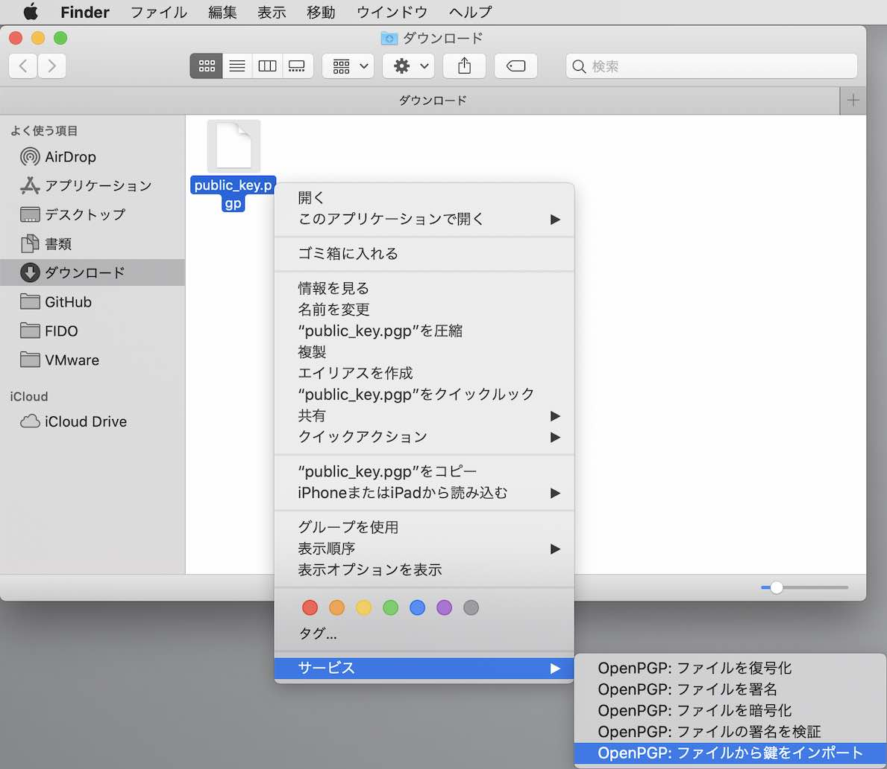
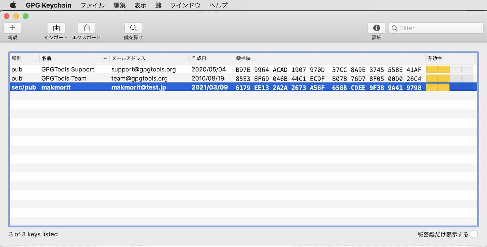
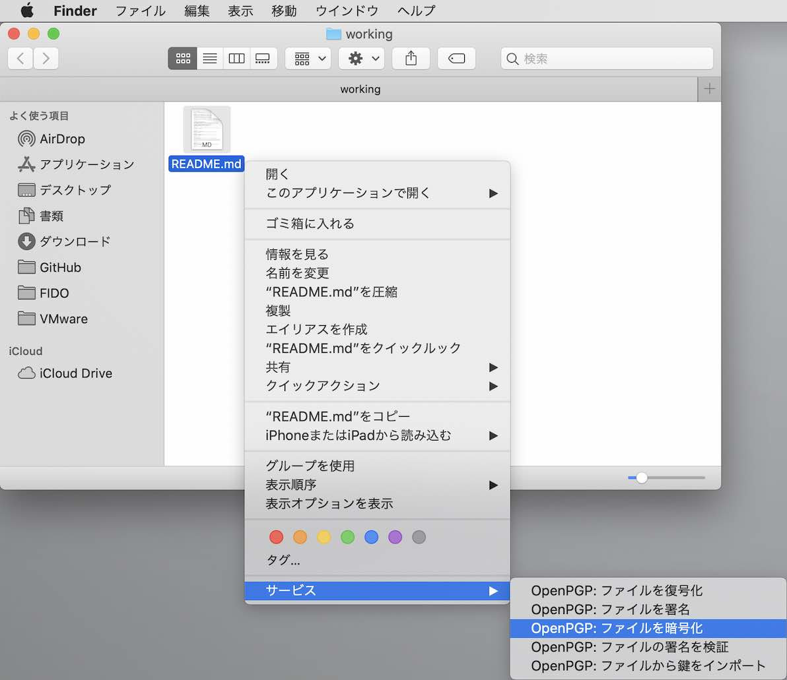
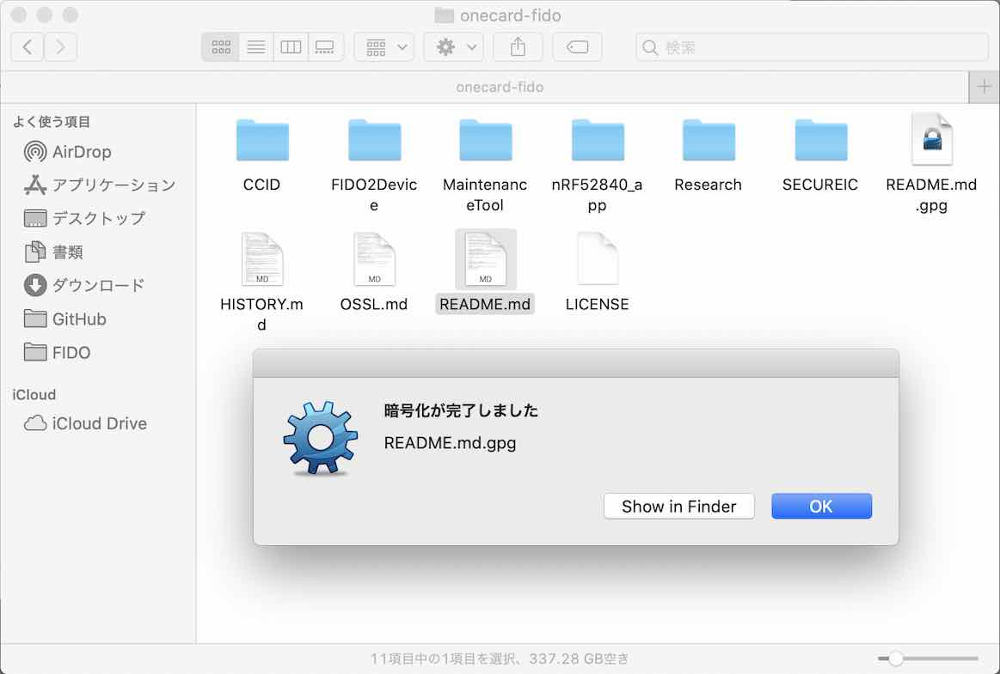
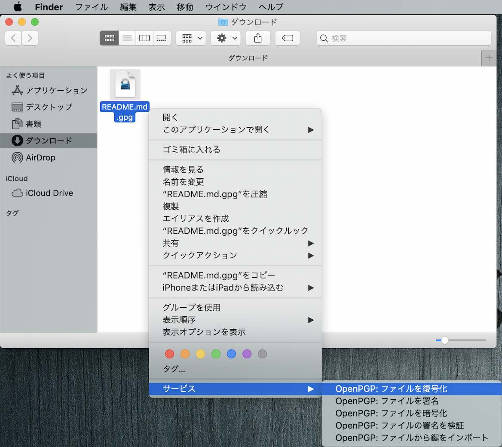
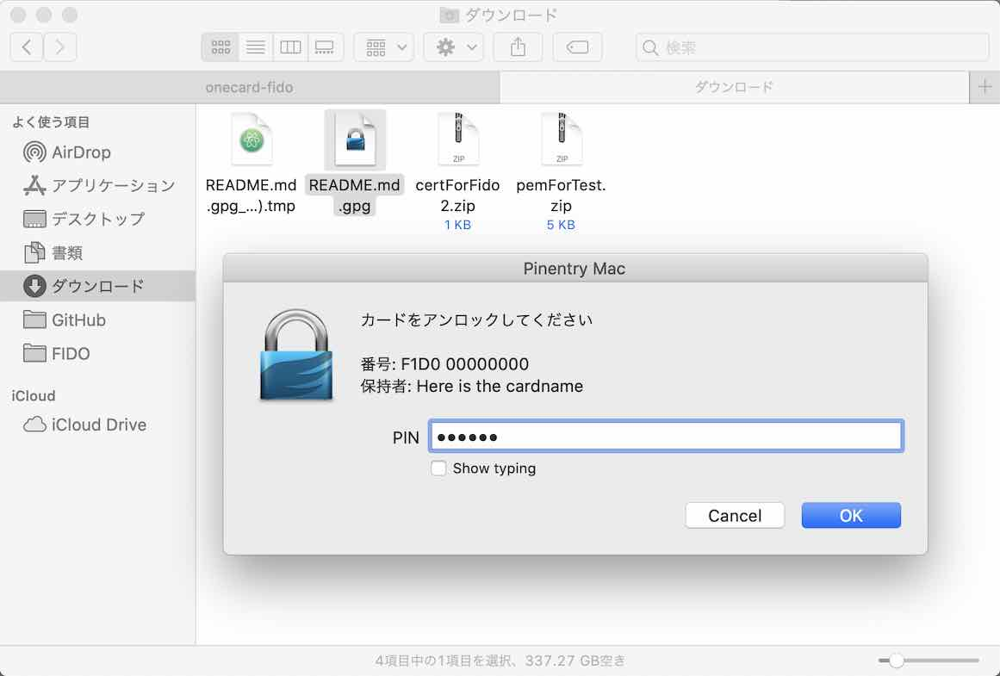
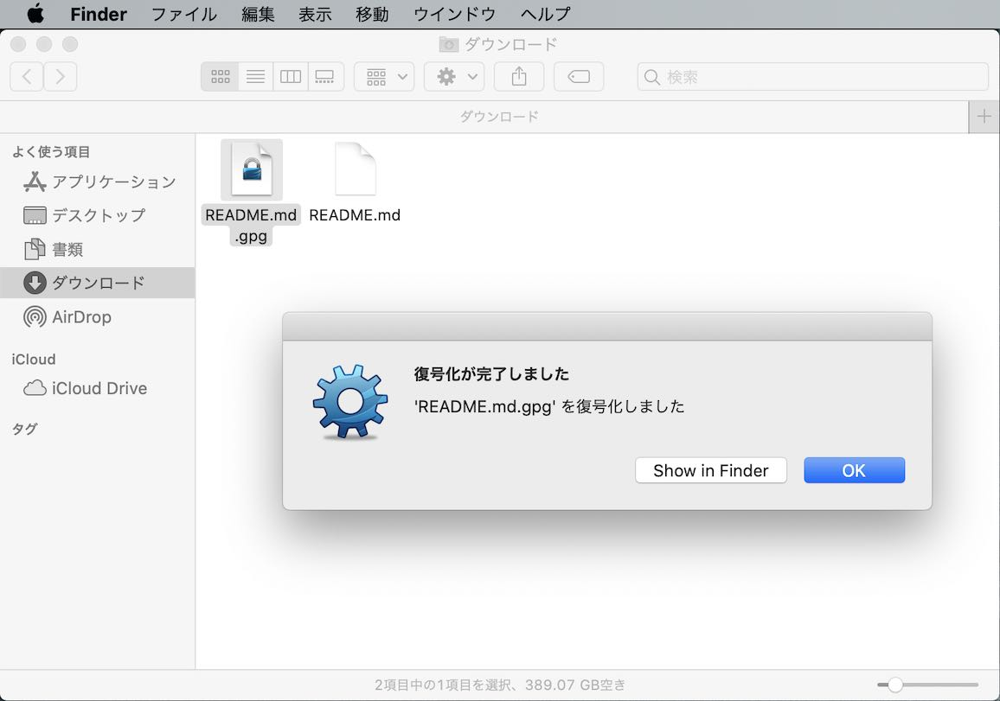

# OpenPGPを使用したファイル暗号／復号化手順

[MDBT50Q Dongle](../../FIDO2Device/MDBT50Q_Dongle/README.md)のOpenPGPカードエミュレーション機能を使用し、macOS上でファイルを暗号化／復号化をする手順について、以下に掲載いたします。

## 想定局面

通常は、ファイルを暗号化するユーザーと、復号化するユーザーが別のケースが多いかと思われます。<br>
したがって、ファイル暗号化手順と、ファイル復号化手順に分けて説明します。

## 暗号化手順

あらかじめ取得しておいた公開鍵ファイルを使用し、任意のファイルを暗号化します。

#### GPGツールのインストール
macOS環境においてOpenPGP機能を使用するためには、GPGツールをインストールする必要があります。<br>
具体的な手順は、別ドキュメント<b>「[GPG Suiteインストール手順](../../../CCID/OpenPGP/GPGINSTMAC.md)」</b>をご参照ください。

#### 公開鍵のインポート

暗号化するために必要な公開鍵ファイル（本ドキュメントではファイル名を`public_key.pgp`とします。）を、GPGツールを使用してインポートします。

公開鍵ファイルを右クリックして「OpenPGP: ファイルから鍵をインポート」を選択します。



公開鍵が、GPGツールによりインポートされます。<br>
下図のようなポップアップ画面が表示されるので「OK」ボタンをクリックして閉じます。


GUIアプリ「GPG Keychain」を使うと、先ほどの公開鍵がインポートされていることを確認できます。<br>
画面の一覧に、インポートされた公開鍵が表示されています。



#### 暗号化の実行

「`README.md`」というファイルを暗号化するものとします。<br>
`README.md`を右クリックして「OpenPGP: ファイルを暗号化」を選択します。



下図のような画面が表示されます。<br>
「あなたの鍵」が選択されていることを確認し、画面右下の「暗号化」ボタンをクリックすると、ファイルの暗号化が開始されます。


暗号化が完了し、暗号化ファイル「`README.md.gpg`」が生成されました。<br>
下図のようなポップアップ画面が表示されるので「OK」ボタンをクリックして閉じます。



以上で、公開鍵によるファイルの暗号化は完了です。

## 復号化手順

暗号化されたファイルを、秘密鍵を使用して復号化します。

秘密鍵は、手順書「[GPG Suiteによる鍵インストール手順](../../../CCID/OpenPGP/GPGKEYINST.md)」により生成し、MDBT50Q Dongleにインストールされたもの使用します。<br>
すなわち、暗号化手順で使用した公開鍵ファイル（`public_key.pgp`）の生成元である秘密鍵が使用されることになります。

#### MDBT50Q Dongleのファームウェアを更新

OpenPGP機能が動作するようにするため、MDBT50Q Dongleのファームウェアを、最新バージョンに更新しておきます。<br>
具体的な手順は、別ドキュメント<b>「[ファームウェア更新手順](../../../MaintenanceTool/macOSApp/UPDATEFIRMWARE.md)」</b>をご参照ください。

#### 公開鍵のインポート

前述の手順により、GPGツールを使用し、復号化側でも公開鍵のインポートを行う必要があります。<br>
暗号化側と同じ公開鍵ファイルを使用してください。

#### OpenPGP機能を開始

MDBT50Q DongleをPCに装着後、ターミナルからコマンド`gpg --card-status`を実行します。<br>
これにより、OpenPGP機能が稼働し、MDBT50Q Dongleに格納された秘密鍵を使用することが出来るようになります。[注1]

下記は実行例になります。

```
bash-3.2$ gpg --card-status
Reader ...........: Diverta Inc. Secure Dongle
Application ID ...: D276000124010304F1D0000000000000
Application type .: OpenPGP
Version ..........: 3.4
:
General key info..: sub  rsa2048/E37F997C90391EA6 2021-03-09 makmorit (for test) <makmorit@test.jp>
sec#  rsa2048/CDEE9F389A419798  作成: 2021-03-09  有効期限: 無期限    
ssb>  rsa2048/E37F997C90391EA6  作成: 2021-03-09  有効期限: 2022-03-09
                                カード番号: F1D0 00000000
ssb>  rsa2048/0435AE09C8A4773C  作成: 2021-03-09  有効期限: 2022-03-09
                                カード番号: F1D0 00000000
ssb>  rsa2048/5DE85C788B879EB5  作成: 2021-03-09  有効期限: 2022-03-09
                                カード番号: F1D0 00000000
bash-3.2$
```

[注1] macOS版GPG Suite（現行は、バージョン2.2.24）の不具合により、`gpg --card-status`コマンドを実行しないと、macOSのコンテキストメニューからOpenPGP機能を実行できない制約があります。次期バージョン（2.2.25）で解消されるようです。

#### 復号化の実行

暗号化されたファイル「`README.md.gpg`」をGPGツールにより復号化します。<br>
`README.md.gpg`を右クリックして「OpenPGP: ファイルを復号化」を選択します。



下図のような画面が表示されます。<br>
デフォルトのPIN番号「`123456`」[注2]を入力し、画面右下の「OK」ボタンをクリックすると、ファイルの復号化が開始されます。



復号化が完了し、暗号化前のファイル「`README.md`」が生成されました。<br>
下図のようなポップアップ画面が表示されるので「OK」ボタンをクリックして閉じます。



以上で、公開鍵によるファイルの暗号化は完了です。

[注2] 現状、PIN番号はデフォルトから変更できません。将来的に専用GUIツール制作／ファームウェア改修により対応予定です。
