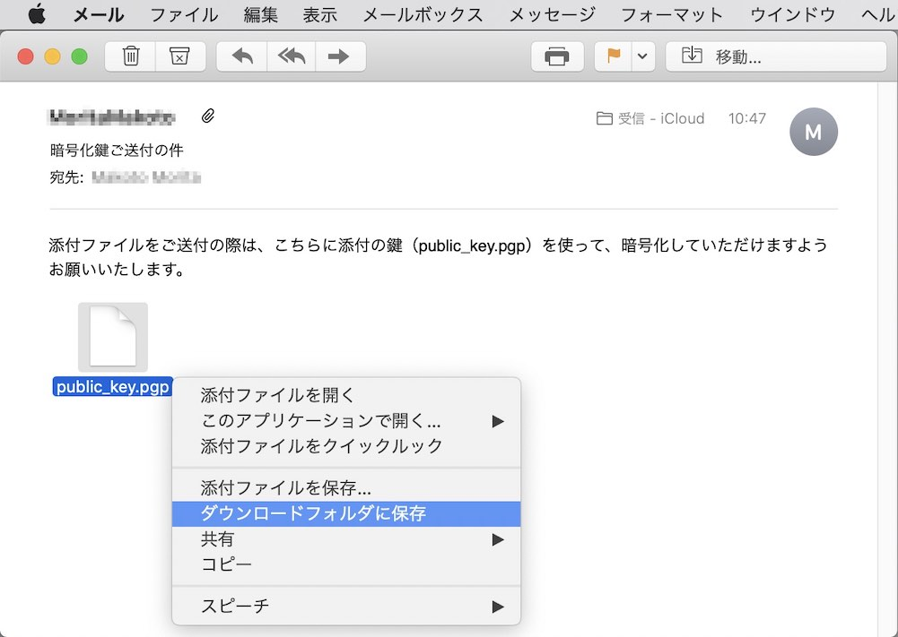
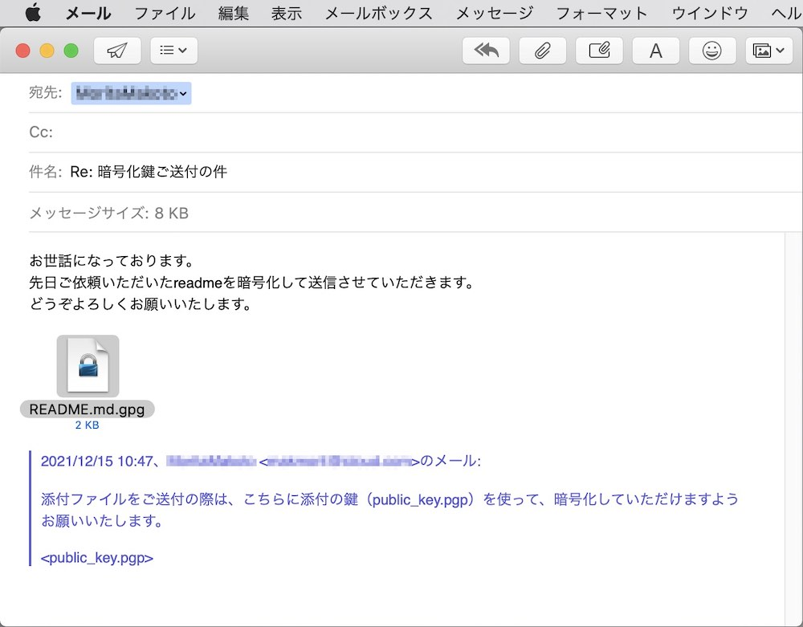
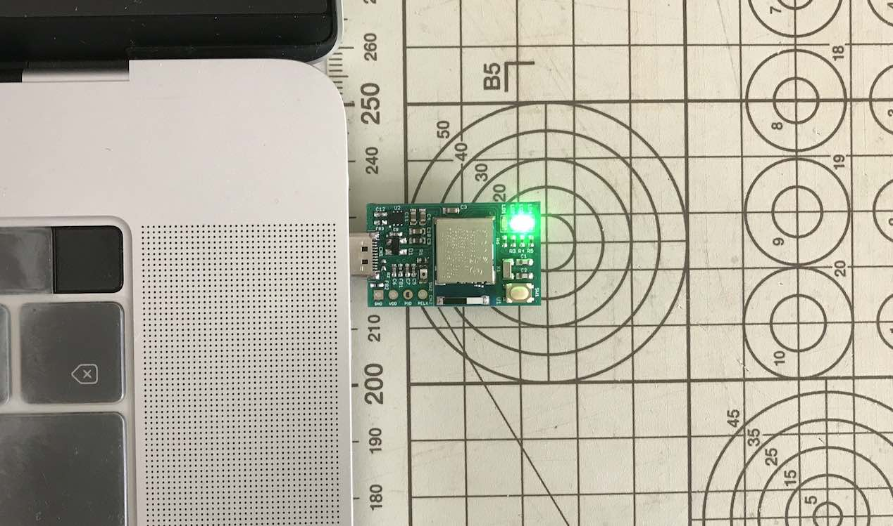
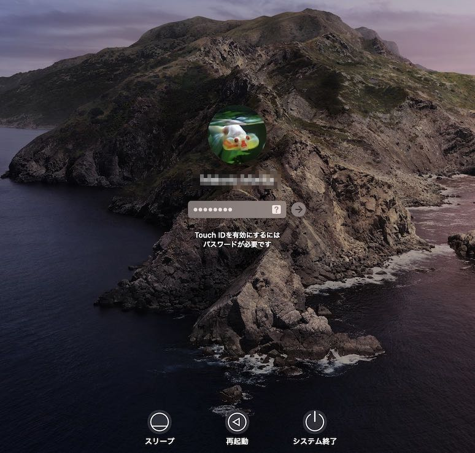
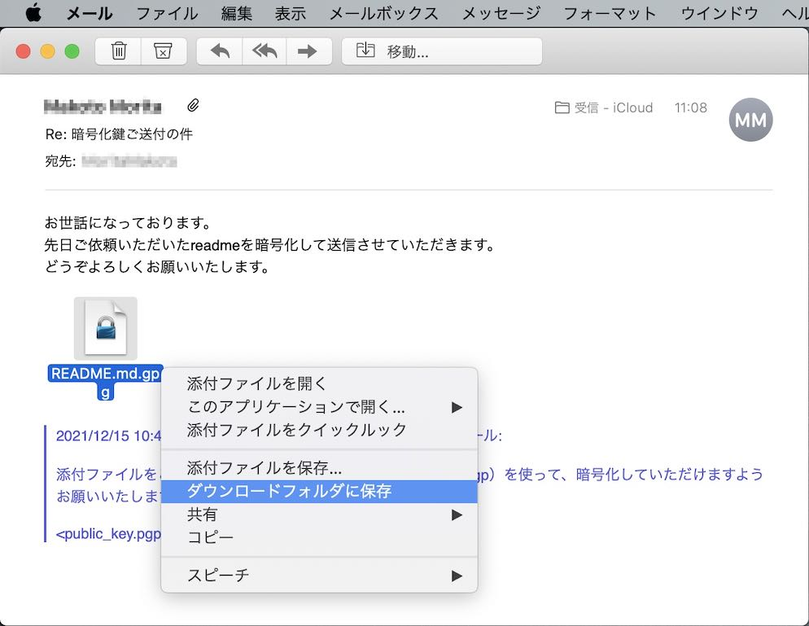

# OpenPGPを使用したファイル暗号／復号化手順

[MDBT50Q Dongle](../../FIDO2Device/MDBT50Q_Dongle/README.md)のOpenPGPカードエミュレーション機能を使用し、macOS上でファイルを暗号化／復号化をする手順について、以下に掲載いたします。

## 想定局面

 

通常は、ファイルを暗号化するユーザー（ファイル提供者）と、復号化するユーザー（ファイル受領者）が別のケースが多いかと思われます。 
したがって、暗号化手順（ファイル提供者の手順）と、復号化手順（ファイル受領者の手順）に分けて説明します。

## 事前準備

OpenPGP機能を使用するために必要なGPGツール群「[GPG Suite](https://gpgtools.org)」と、秘密鍵が格納されている[MDBT50Q Dongle](../../FIDO2Device/MDBT50Q_Dongle/README.md)を準備します。

#### GPG Suiteのインストール
macOS環境においてOpenPGP機能を使用するためには、GPGツールをインストールする必要があります。 
具体的な手順は、別ドキュメント<b>「[GPG Suiteインストール手順](../../CCID/OpenPGP/GPGINSTMAC.md)」</b>をご参照ください。

#### MDBT50Q Dongleの準備

秘密鍵が格納されているMDBT50Q Dongleを、あらかじめ準備します。[注1] 
秘密鍵を格納する手順は、別ドキュメント<b>「[GPG Suiteによる鍵インストール手順](../../CCID/OpenPGP/GPGKEYINST.md)」</b>をご参照ください。

[注1]ファイル暗号化時は公開鍵を使用するため、MDBT50Q Dongleは不要です。

## 暗号化手順

#### 公開鍵を受領

ファイルを暗号化するための公開鍵ファイルは、送信先となる方から、メールなどであらかじめ受領しておくようにします。

下図は電子メールで公開鍵を受領する例になります。 
受信した公開鍵ファイルは、任意のフォルダーに保存します。

#### 公開鍵のインポート

暗号化するために必要な公開鍵ファイル（本ドキュメントではファイル名を`public_key.pgp`とします。）を、GPGツールを使用してインポートします。

公開鍵ファイルを右クリックして「OpenPGP: ファイルから鍵をインポート」を選択します。

公開鍵が、GPGツールによりインポートされます。 
下図のようなポップアップ画面が表示されるので「OK」ボタンをクリックして閉じます。

GUIアプリ「GPG Keychain」を使うと、先ほどの公開鍵がインポートされていることを確認できます。 
画面の一覧に、インポートされた公開鍵が表示されています。

#### 暗号化の実行

「`README.md`」というファイルを暗号化するものとします。 
`README.md`を右クリックして「OpenPGP: ファイルを暗号化」を選択します。

下図のような画面が表示されます。 
先ほどインポートした公開鍵が選択されていることを確認し、画面右下の「暗号化」ボタンをクリックすると、ファイルの暗号化が開始されます。

暗号化が完了し、暗号化ファイル「`README.md.gpg`」が生成されました。 
下図のようなポップアップ画面が表示されるので「OK」ボタンをクリックして閉じます。

以上で、公開鍵によるファイルの暗号化は完了です。

#### ファイルを送信

暗号化されたファイルは、メールなどで送信します。 
下図は電子メールで暗号化されたファイルを送信する例になります。

## 復号化手順

公開鍵で暗号化されたファイルは、秘密鍵を使用して復号化します。

秘密鍵は、手順書「[GPG Suiteによる鍵インストール手順](../../CCID/OpenPGP/GPGKEYINST.md)」により生成し、MDBT50Q Dongleにインストールされたもの使用します。 
すなわち、暗号化手順で使用した公開鍵ファイル（`public_key.pgp`）の生成元である秘密鍵が使用されることになります。

#### 公開鍵のインポート

復号化側でも、前述の手順により、GPGツールを使用して公開鍵のインポートを行う必要があります。[注1] 
暗号化側と同じ公開鍵ファイルを使用してください。

[注1] 別ドキュメント「[GPG Suiteによる鍵インストール手順](../../CCID/OpenPGP/GPGKEYINST.md)」では、鍵インストール完了時、秘密鍵をPCから削除する手順としています。この手順を実行すると、秘密鍵から生成した公開鍵も同時に削除されてしまう（＝GPGツールから認識されなくなってしまう）ため、再度、GPGツールを使用し、公開鍵ファイルをインポートする必要があります。

#### OpenPGP機能を開始

まず、macOSにログインする前に、MDBT50Q DongleをPCに装着します。 
すでにmacOSにログイン済みの場合は、一旦ログアウトしてから、MDBT50Q DongleをPCに装着します。

MDBT50Q DongleをPCに装着したら、macOSにログインします。

macOSにログイン後は、すでにOpenPGP機能が稼働しているので、MDBT50Q Dongleに格納された秘密鍵を使用することが出来るようになります。

#### 暗号化ファイルを受領

暗号化されたファイルを、メールなどで受領します。

下図は電子メールで暗号化ファイルを受領する例になります。 
受信した暗号化ファイル（`README.md.gpg`）は、任意のフォルダーに保存します。

#### 復号化の実行

暗号化されたファイル「`README.md.gpg`」をGPGツールにより復号化します。 
`README.md.gpg`を右クリックして「OpenPGP: ファイルを復号化」を選択します。

下図のような画面が表示されます。 
デフォルトのPIN番号「`123456`」[注2]を入力し、画面右下の「OK」ボタンをクリックすると、ファイルの復号化が開始されます。

復号化が完了し、暗号化前のファイル「`README.md`」が生成されました。 
下図のようなポップアップ画面が表示されるので「OK」ボタンをクリックして閉じます。

以上で、秘密鍵によるファイルの復号化は完了です。

[注2] 現状、PIN番号はデフォルトから変更できません。将来的に専用GUIツール制作／ファームウェア改修により対応予定です。
