# OpenPGPを使用したファイル暗号／復号化手順

最終更新日：2022/1/19

[MDBT50Q Dongle](../../FIDO2Device/MDBT50Q_Dongle/README.md)のOpenPGPカードエミュレーション機能を使用し、Windows上でファイルを暗号化／復号化をする手順について、以下に掲載いたします。

## 想定局面

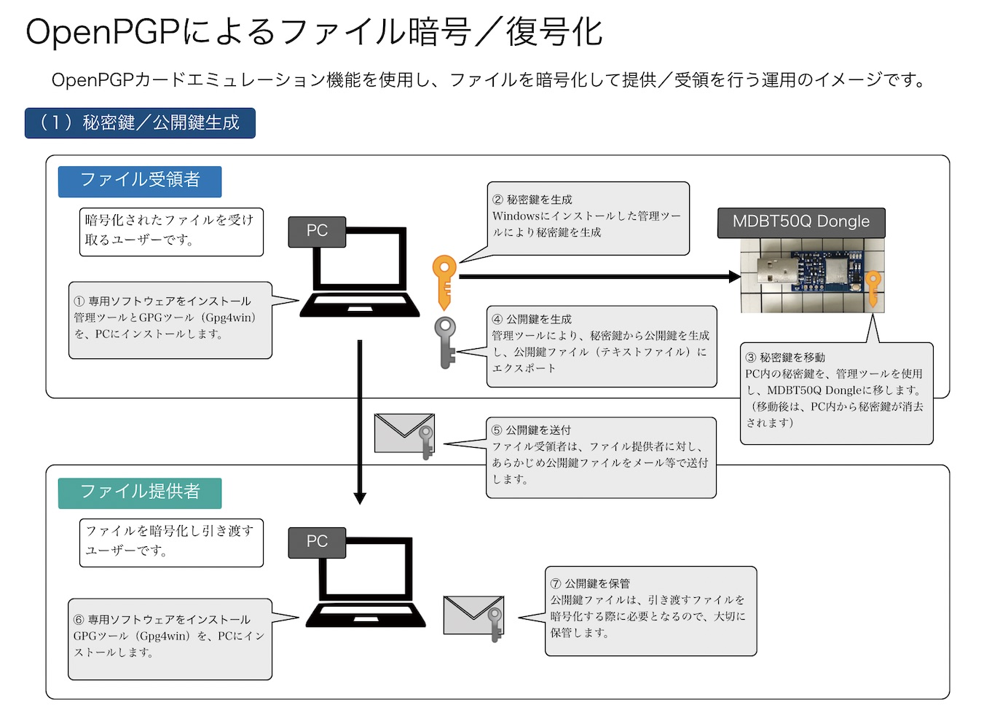 
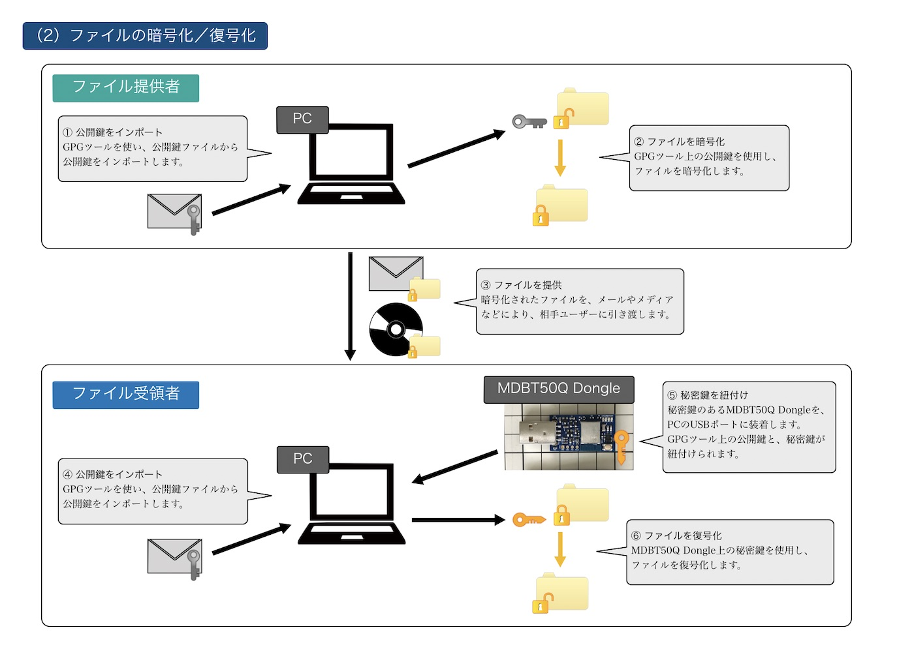

通常は、ファイルを暗号化するユーザー（ファイル提供者）と、復号化するユーザー（ファイル受領者）が別のケースが多いかと思われます。 
したがって、暗号化手順（ファイル提供者の手順）と、復号化手順（ファイル受領者の手順）に分けて説明します。

## 事前準備

OpenPGP機能を使用するために必要なGPGツール群「[Gpg4win](https://www.gnupg.org)」と、秘密鍵が格納されている[MDBT50Q Dongle](../../FIDO2Device/MDBT50Q_Dongle/README.md)を準備します。

#### Gpg4winのインストール
Windows環境においてOpenPGP機能を使用するためには、GPGツールをインストールする必要があります。

具体的な手順は、別ドキュメント<b>「[Gpg4winインストール手順](../../CCID/OpenPGP/GPGINSTWIN.md)」</b>をご参照ください。

#### MDBT50Q Dongleの準備

秘密鍵が格納されているMDBT50Q Dongleを、あらかじめ準備します。[注1] 
秘密鍵を格納する手順は、別ドキュメント<b>「[PGP鍵インストール手順書](../../MaintenanceTool/WindowsExe/PGPKEYINST.md)」</b>をご参照ください。

[注1]ファイル暗号化時は公開鍵を使用するため、MDBT50Q Dongleは不要です。

## 暗号化手順

秘密鍵を所有する方に対し、公開鍵を使用して暗号化したファイルを送信します。

公開鍵は、別ドキュメント「[PGP鍵インストール手順書](../../MaintenanceTool/WindowsExe/PGPKEYINST.md)」のインストール作業中に同時生成される公開鍵ファイル（`public_key.pgp`）を使用する前提とします。

#### 公開鍵を受領

ファイルを暗号化するための公開鍵ファイルは、ファイル送信のあて先となる方から、メールなどであらかじめ受領しておくようにします。

下図は電子メールで公開鍵を受領する例になります。 
受信した公開鍵ファイルは、任意のフォルダーに保存します。

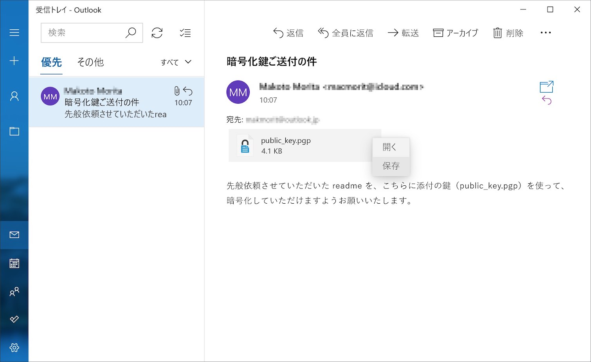

#### 公開鍵のインポート

暗号化するために必要な公開鍵ファイル（`public_key.pgp`）を、GPGツールを使用してインポートします。

公開鍵ファイルを右クリックして「More GpgEX options-->Import keys」を選択します。

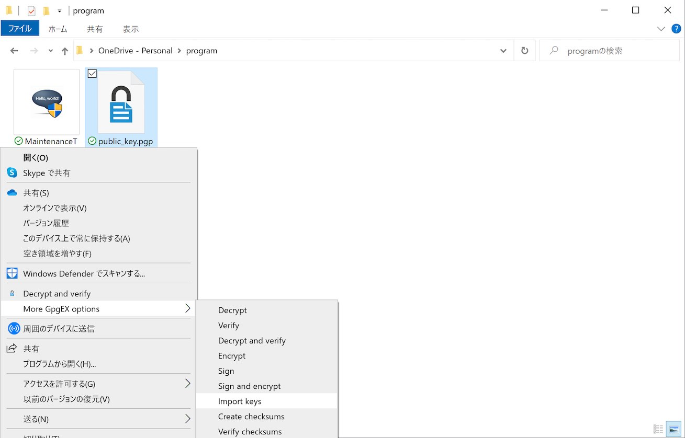

公開鍵が、GPGツールによりインポートされます。 
下図のようなポップアップ画面が表示されるので「OK」ボタンをクリックして閉じます。

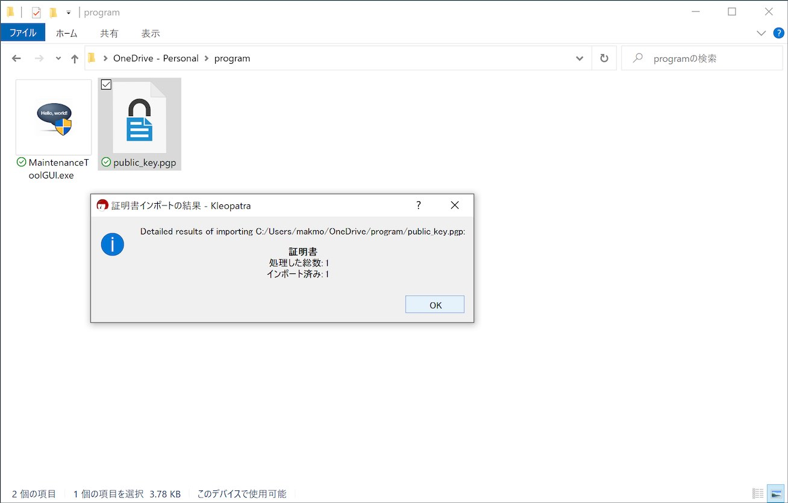

GUIアプリ「GPG Keychain」を使うと、先ほどの公開鍵がインポートされていることを確認できます。 
画面の一覧に、インポートされた公開鍵が表示されています。

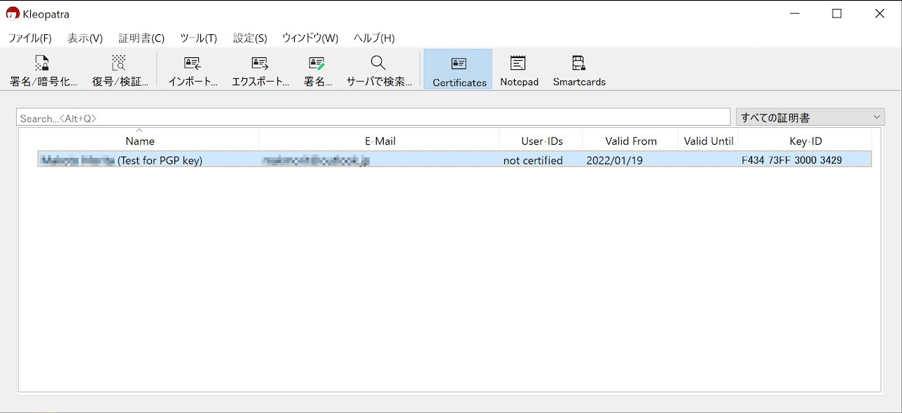

#### 暗号化の実行

「`README.md`」というファイルを暗号化するものとします。 
`README.md`を右クリックして「More GpgEX options-->Encrypt」を選択します。

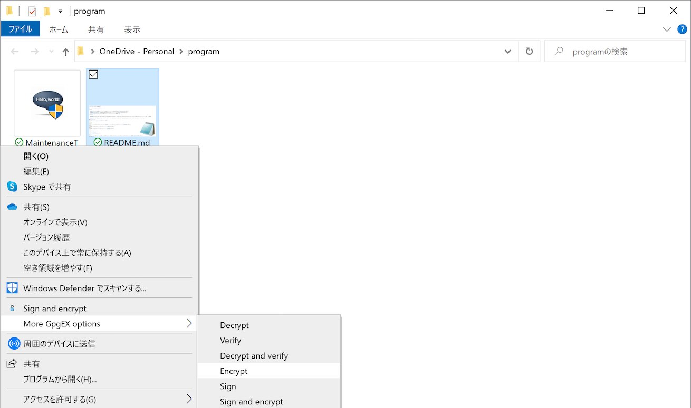

下図のような画面が表示されます。 
「Encrypt for others」の右横にあるアイコンをクリックします。

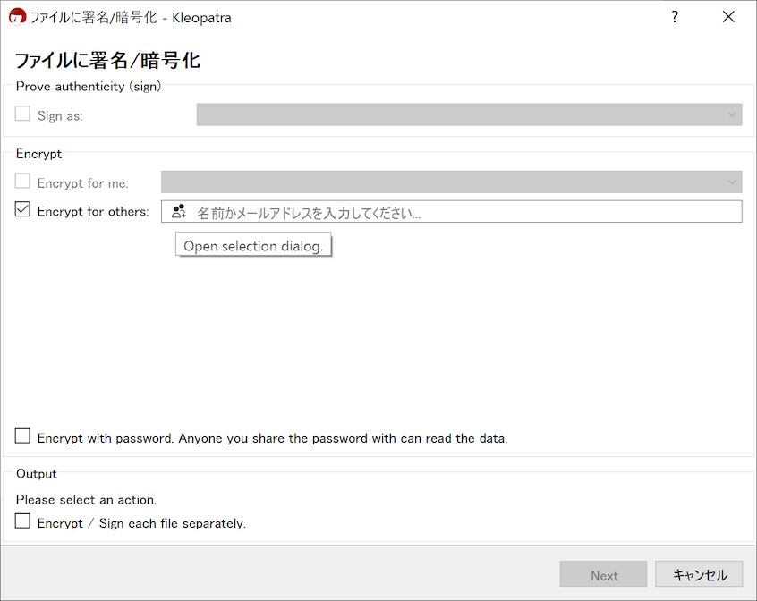

宛て先を選択するポップアップが表示されます。 
先ほどインポートした公開鍵を選択し「OK」をクリックします。

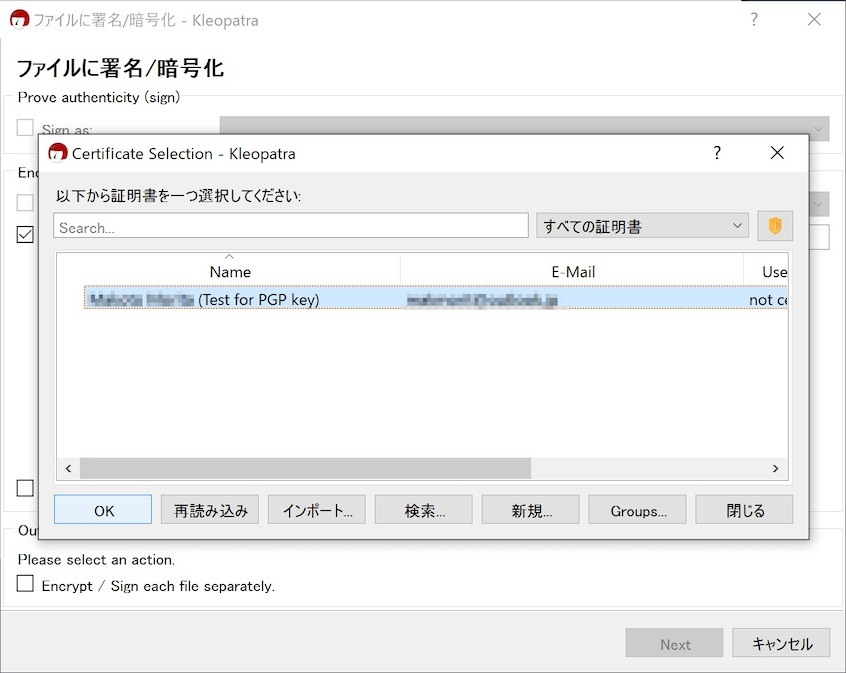

先ほどインポートした公開鍵が選択されていることを確認し、画面右下の「暗号化」ボタンをクリックすると、ファイルの暗号化が開始されます。

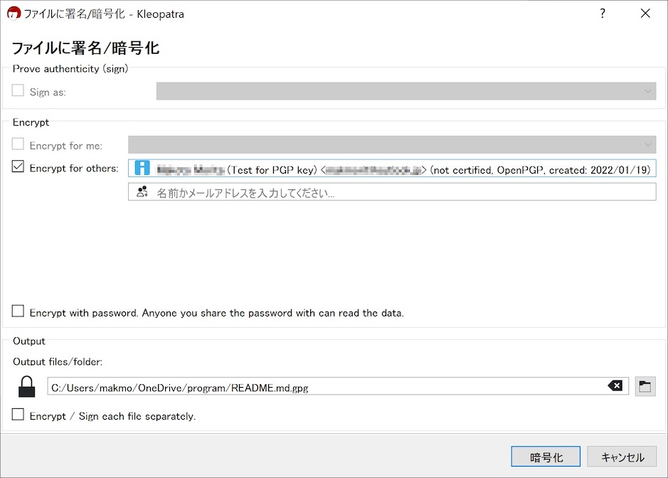

暗号化が完了しました。 
完了ボタンをクリックし、画面を閉じます。

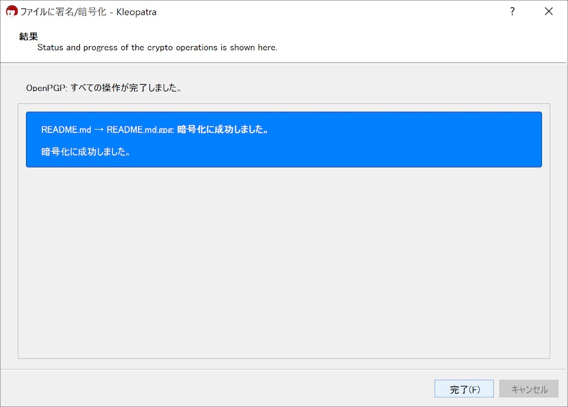

暗号化ファイル「`README.md.gpg`」が生成されたのを確認します。

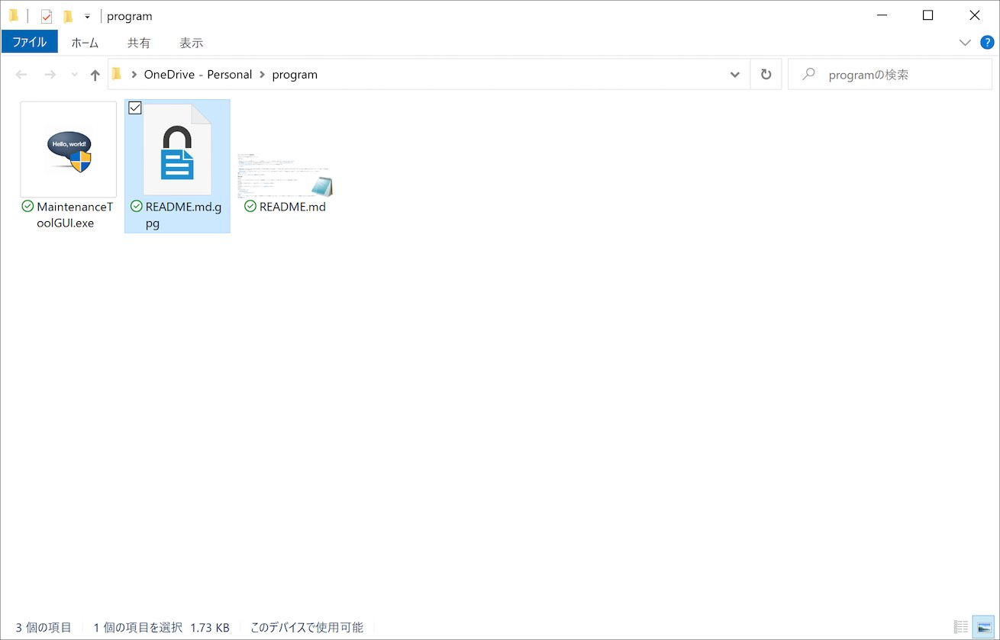

以上で、公開鍵によるファイルの暗号化は完了です。

#### ファイルを送信

暗号化されたファイルは、メールなどで送信します。 
下図は電子メールで暗号化されたファイルを送信する例になります。

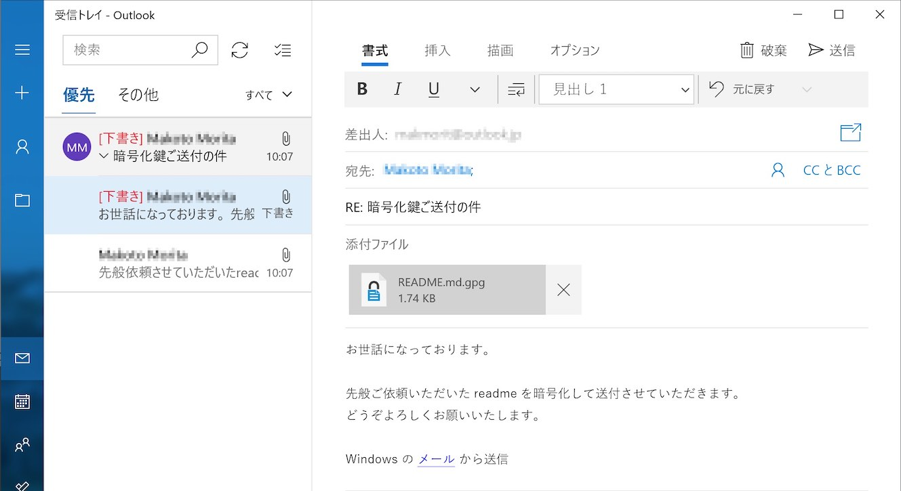

## 復号化手順

公開鍵で暗号化されたファイルを受信した方は、秘密鍵を使用して復号化します。

秘密鍵は、前述「[PGP鍵インストール手順書](../../MaintenanceTool/macOSApp/PGPKEYINST.md)」によりMDBT50Q Dongleにインストールされたものを使用し、かつインストール作業中に同時生成された公開鍵ファイル（`public_key.pgp`）は、すでにファイルの受信元に引き渡され、受信したファイルの暗号化に使用されている前提とします。

#### 公開鍵のインポート

復号化側でも、前述の手順により、GPGツールを使用して公開鍵のインポートを行う必要があります。[注1] 
暗号化側と同じ公開鍵ファイルを使用してください。

[注1]「[PGP鍵インストール手順書](../../MaintenanceTool/macOSApp/PGPKEYINST.md)」による鍵インストール処理を実行すると、鍵インストール完了時、PGP秘密鍵に対応するPGP公開鍵ファイル（`public_key.pgp`）が生成されます。ただしこれだけでは、MDBT50Q DongleにインストールされたPGP秘密鍵がWindowsに認識されないため、GPGツールによりPGP公開鍵ファイルをWindows上にインポートし、MDBT50Q Dongle上のPGP秘密鍵と紐づける（＝WindowsにPGP秘密鍵の格納場所を認識させる）必要があります。

#### OpenPGP機能を開始

まず、復号化の前に、MDBT50Q DongleをPCに装着します。

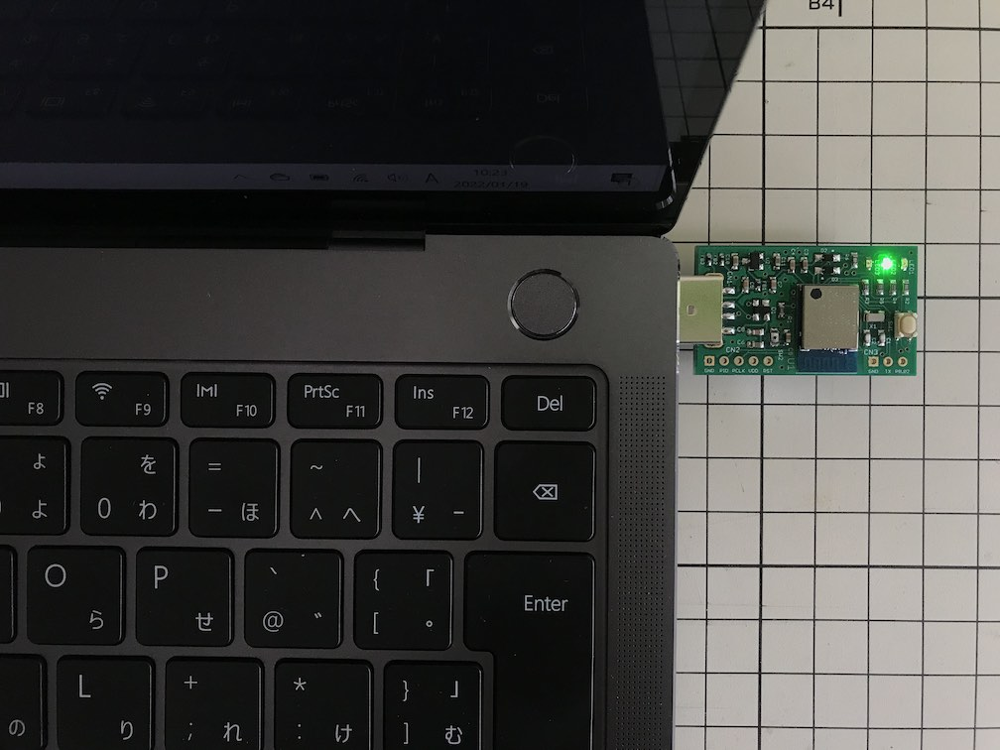

Windows環境では、MDBT50Q DongleをPCに装着した時点でOpenPGP機能が稼働しているので、MDBT50Q Dongleに格納された秘密鍵を使用することが出来るようになります。

#### 暗号化ファイルを受領

暗号化されたファイルを、メールなどで受領します。

下図は電子メールで暗号化ファイルを受領する例になります。 
受信した暗号化ファイル（`README.md.gpg`）は、任意のフォルダーに保存します。

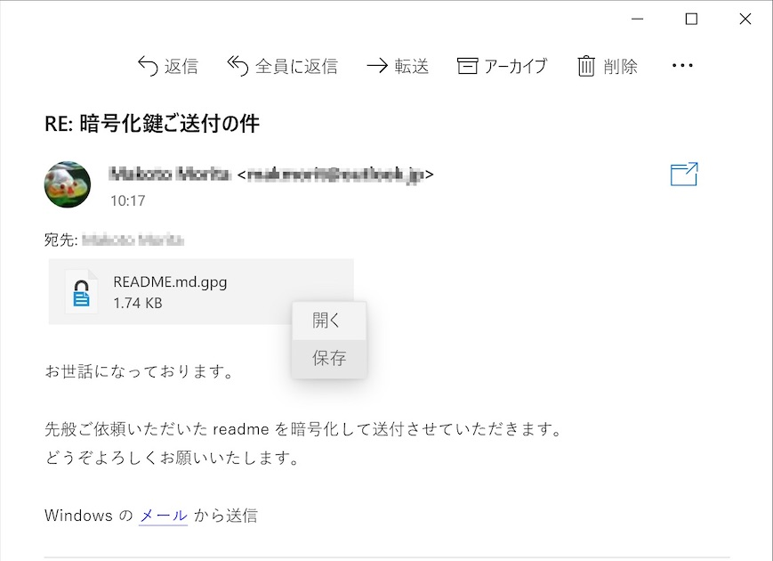

#### 復号化の実行

暗号化されたファイル「`README.md.gpg`」をGPGツールにより復号化します。 
`README.md.gpg`を右クリックして「More GpgEX options-->Decrypt」を選択します。

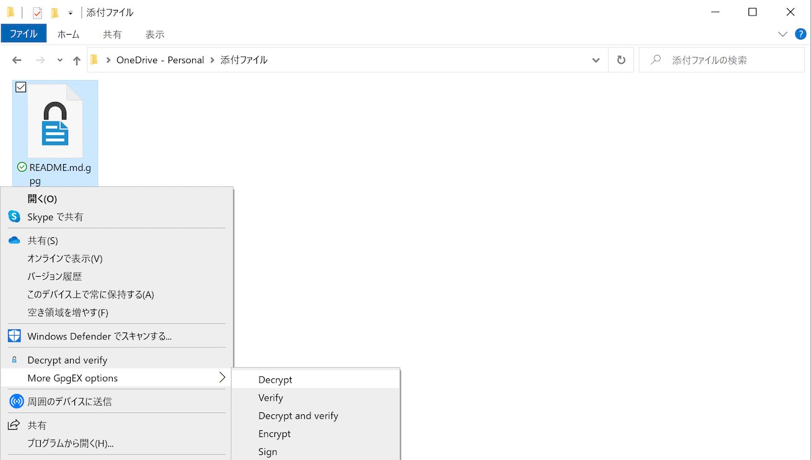

下図のような画面が表示されます。 
デフォルトのPIN番号「`123456`」[注2]を入力し、画面右下の「OK」ボタンをクリックすると、ファイルの復号化が開始されます。

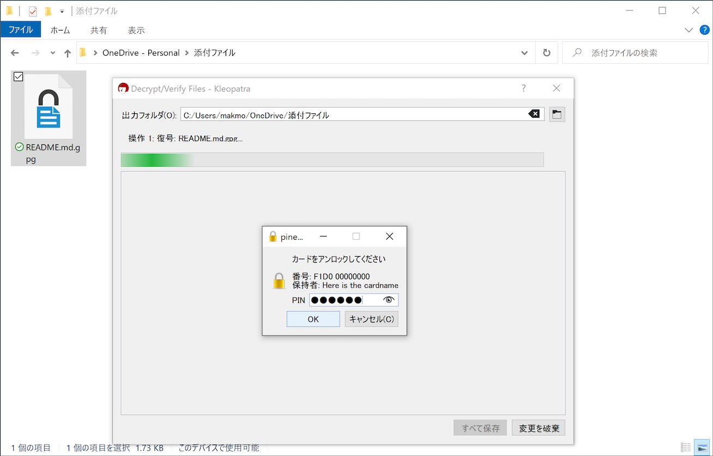

復号化が完了しました。 
「すべて保存」ボタンをクリックし、画面を閉じます。

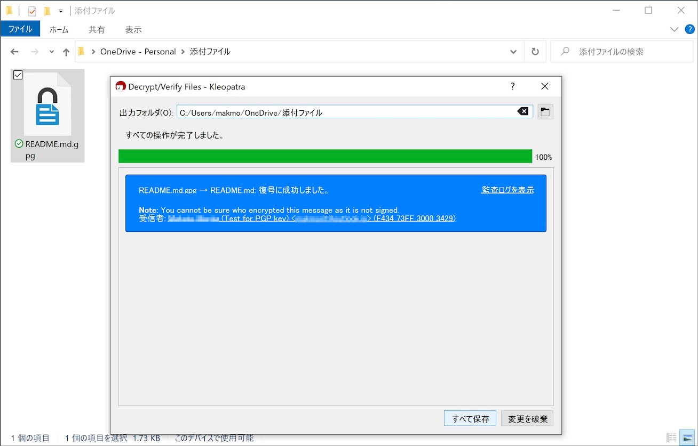

暗号化前のファイル「`README.md`」が生成されたのを確認します。

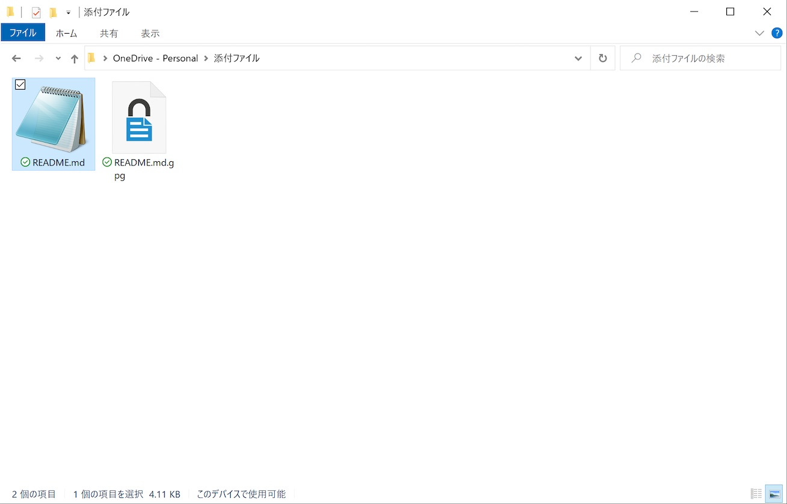

以上で、秘密鍵によるファイルの復号化は完了です。

[注2] 最終更新日現在、PIN番号はデフォルトから変更できません。将来的に管理ツール／ファームウェア双方の改修により対応予定です。
