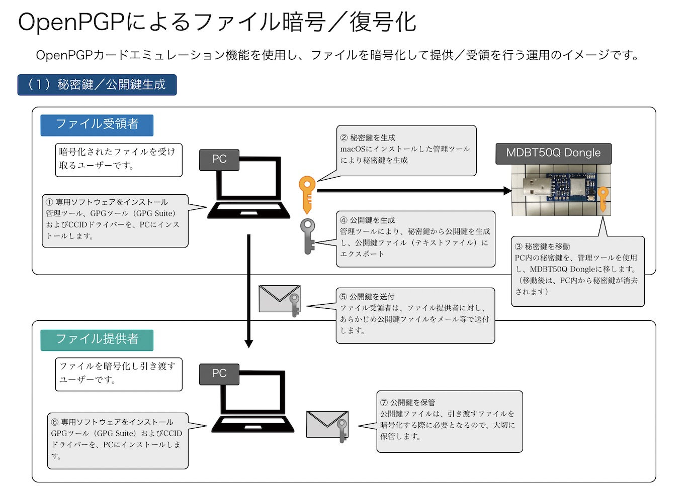
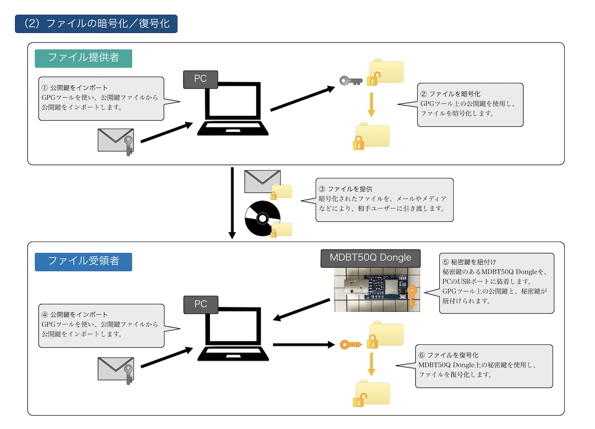

# OpenPGPカードエミュレーション対応

## 概要

[nRF52840アプリケーション](../../nRF52840_app)に、OpenPGPカードと同等の機能（OpenPGPカードエミュレーション機能）を追加する対応です。

[OpenPGPカードエミュレーション機能](../../CCID/openpgp_lib/README.md)は、[USB CCIDインターフェース](../../CCID/ccid_lib/README.md)上で動作します。

## 利用例

 

## 手順書

- <b>[CCIDドライバーインストール手順](../../CCID/INSTALLPRG.md)</b> 
[MDBT50Q Dongle](../../FIDO2Device/MDBT50Q_Dongle/README.md)のCCIDインターフェース専用ドライバー（以下単に「CCIDドライバー」）を、macOS環境にインストールする手順について掲載しています。 
WIndows 10環境では、CCIDドライバーのインストールは不要になります。

- <b>[GPG Suiteインストール手順](../../CCID/OpenPGP/GPGINSTMAC.md)</b> 
GPGツール群「[GPG Suite](https://gpgtools.org)」を、macOS環境にインストールする手順について掲載しています。

- <b>[GPG Suiteによる鍵インストール手順](../../CCID/OpenPGP/GPGKEYINST.md)</b> 
[MDBT50Q Dongle](../../FIDO2Device/MDBT50Q_Dongle/README.md)のOpenPGPカードエミュレーション機能のために必要となる、秘密鍵のインストール手順について掲載しています。

- <b>[OpenPGPを使用したファイル暗号／復号化手順](../../CCID/OpenPGP/OPGPCRYPTION.md)</b> 
[MDBT50Q Dongle](../../FIDO2Device/MDBT50Q_Dongle/README.md)のOpenPGPカードエミュレーション機能を使用し、macOS上でファイルを暗号化／復号化をする手順について掲載しています。
