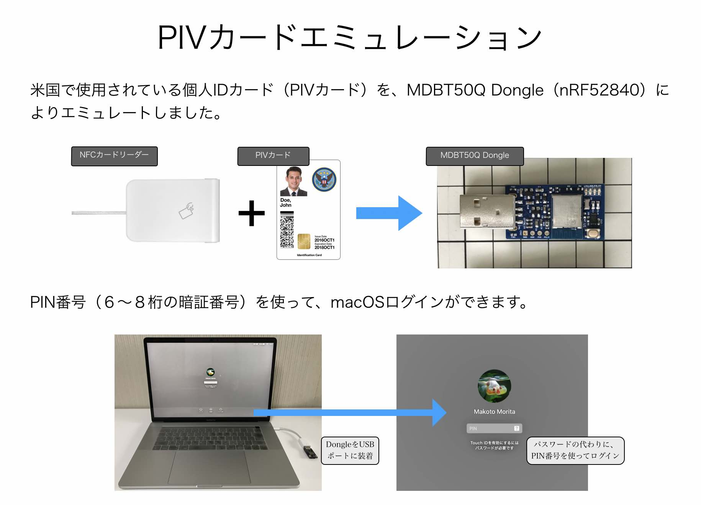
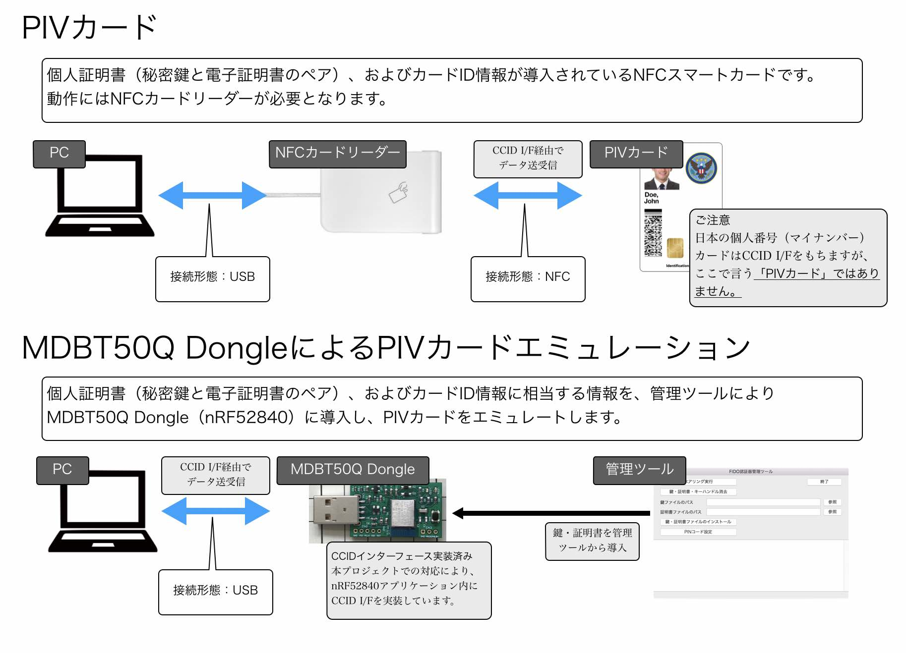

# PIVカードエミュレーション対応

最終更新日：2023/1/16

## 概要

[nRF52840アプリケーション](../../nRF52840_app)に、PIVカードと同等の機能（PIVカードエミュレーション機能）を追加する対応です。 
[PIVカードエミュレーション機能](../../CCID/ccid_lib/README_PIV.md)は、[USB CCIDインターフェース](../../CCID/ccid_lib/README.md)上で動作します。

## 利用例

nRF52840アプリケーションを搭載した[MDBT50Q Dongle](../../FIDO2Device/MDBT50Q_Dongle/README.md)をPCに装着すると、macOSにPIN番号を使ってログインできるようになります。 
詳細につきましてはドキュメント<b>「[PIN番号を使用したmacOSログイン確認手順](../../FIDO2Device/MDBT50Q_Dongle/PIVPINLOGIN.md)」</b>をご参照願います。

## 手順書

- <b>[CCIDドライバーインストール手順](../../CCID/INSTALLPRG.md)</b> 
CCIDドライバーをmacOS環境にインストールし、MDBT50Q DongleのCCIDインターフェースを利用できるようにするための手順について掲載しています。 
（Windows環境では、CCIDドライバーが最初からシステムに組み込まれているため、CCIDドライバーのインストールは不要です）

- <b>[PIV機能の設定手順](../../MaintenanceTool/macOSApp/PIVSETTING.md)</b> 
MDBT50Q Dongleに対し、[FIDO認証器管理ツール（macOS版）](../../MaintenanceTool/macOSApp/README.md)を使用して、PIV機能に必要な各種設定を行う手順を掲載します。

- <b>[PIN番号を使用したmacOSログイン確認手順](../../FIDO2Device/MDBT50Q_Dongle/PIVPINLOGIN.md)</b> 
MDBT50Q DongleのPIV機能を使用して、macOSにPIN番号でログインする手順を掲載します。

## 開発情報

- <b>[PIN番号を使用したmacOSログイン時の動作](../../FIDO2Device/MDBT50Q_Dongle/PIVPINLOGIN_DEV.md)</b> 
MDBT50Q DongleのPIV機能を使用して、macOSにPIN番号でログイン時、PC〜nRF52840間で行われるやり取りについて掲載しています。

#### 開発時に使用した手順書

- <b>[Yubico PIV Tool (command line) macOS版 導入手順](PIVTOOLMACINST.md)</b> 
PIVで使用する証明書等を導入するために利用できる「Yubico PIV Tool (command line) 」を、macOS環境に導入する手順について掲載しています。

- <b>[Yubico PIV Tool (command line) Windows版 導入手順](PIVTOOLWININST.md)</b> 
PIVで使用する証明書等を導入するために利用できる「Yubico PIV Tool (command line) 」を、Windows環境に導入する手順について掲載しています。

- <b>[Yubico PIV Toolによる初期データ導入手順](YKPIVUSAGE.md)</b> 
Yubico PIV Tool (command line) を使用して、鍵・証明書などをMDBT50Q Dongleに導入する手順について掲載しています。

- <b>[Yubico PIV Toolによる各種手順](YKPIVUSAGE_1.md)</b> 
Yubico PIV Tool (command line) を使用した（前項以外の）各種手順について掲載しています。
