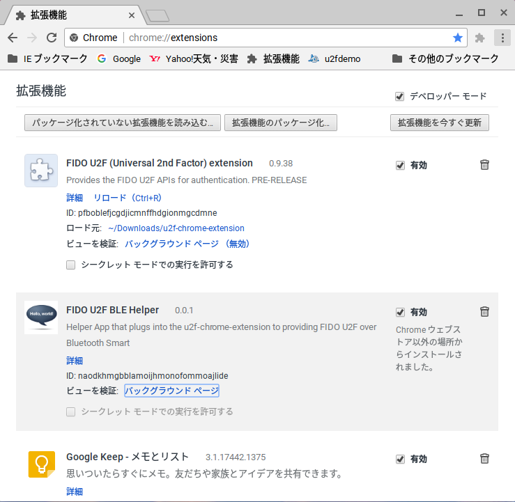
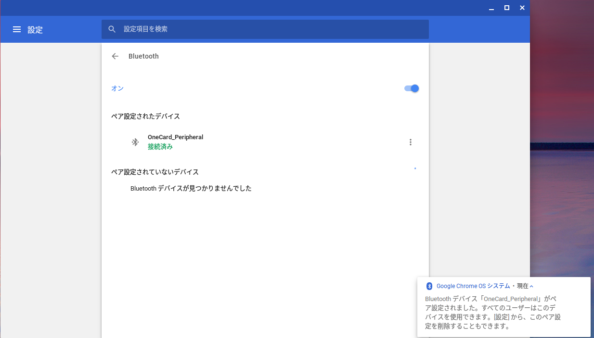
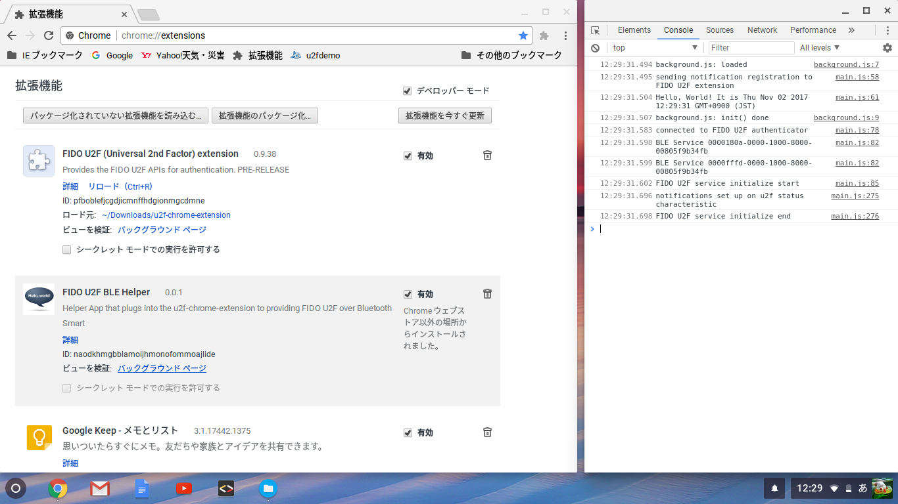
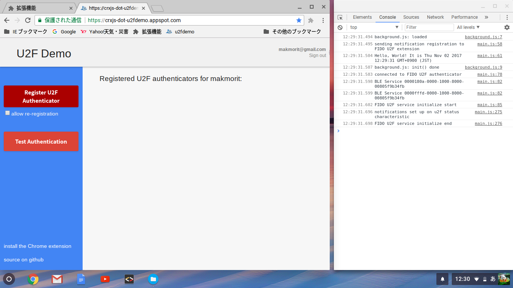
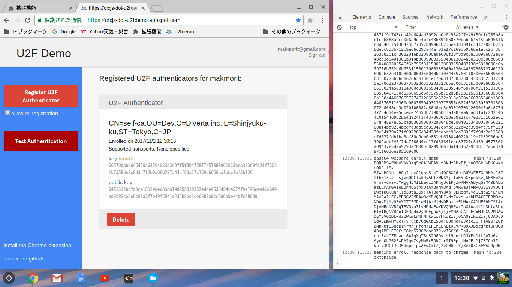
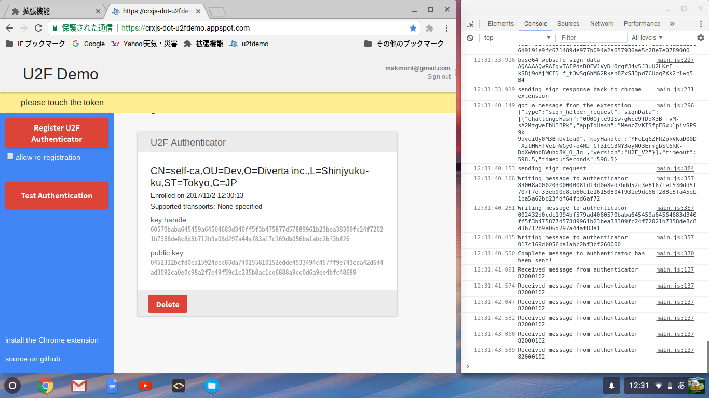
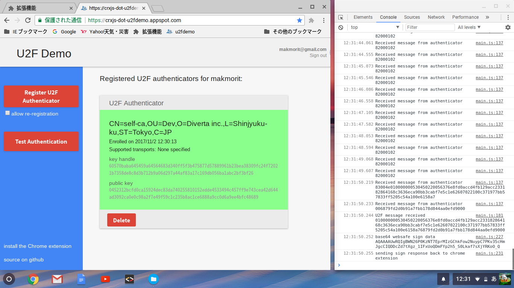

# Chrome OSでのU2F認証テスト

テスト用のChromeエクステンションを使用し、[U2F認証テストサイト](https://crxjs-dot-u2fdemo.appspot.com/)でU2F認証ができることを確認しました。 
その時の手順および結果を、以下に掲載いたします。

## エクステンションのセットアップ

テスト用のエクステンションのセットアップを、下記手順で行います。

### BLEエクステンションのカスタマイズ

有志の方が[こちらのページ](https://github.com/carybran/u2f-ble-helper)で公開している、BLE U2F対応用のBLEエクステンションをベースに、若干の修正を施して使用します。

- テスト用BLEエクステンション 
こちらからダウンロードできます。 
[u2f-ble-helper.crx](../Research/u2f-ble-helper.crx)

- （ご参考）ソースコード 
上記エクステンションは、こちらのコードからパッケージ化したバイナリーファイルです。 
[u2f-ble-helper](../Research/u2f-ble-helper/)

### BLEエクステンションのインストール

上記を、Chrome OS上のChromeブラウザーに拡張機能としてインストールします。 
Chromeブラウザーの拡張機能ページを開き、u2f-ble-helper.crxをドラッグ＆ドロップすれば、インストールは完了です。

上図の通り、インストールされたエクステンションは「FIDO U2F BLE Helper」という名称でインストールされます。

### U2Fエクステンションのインストール

「FIDO U2F BLE Helper」の親エクステンションとなる、U2Fエクステンション「FIDO U2F (Universal 2nd Factor) extension」を、Chromeにインストールします。

親エクステンション「FIDO U2F (Universal 2nd Factor) extension」のコードを、ディレクトリーごとChrome OSのDownloads配下にコピーし、「パッケージ化されていない拡張機能を読み込む...」ボタンによりインストールします。

- 親エクステンションのコード 
「u2f-chrome-extension」ディレクトリーを丸ごとコピーし、Chrome OSに配置します。 
[u2f-chrome-extension](../Research/u2f-ref-code/u2f-chrome-extension/)

- （ご参考）パッケージ化しない理由 
上記コードをパッケージ化して、作成したエクステンションをインストールすると、エクステンションのIDが変わってしまうため、テスト用サイトが指定したIDと一致しなくなり、結果認証テストが失敗します。 
このため、上記手順のとおり、パッケージ化されていない状態で、Chromeブラウザーにインストールしております。

以上で、テスト用のエクステンションのセットアップは完了です。

## テスト実行前の確認

### ペアリングされていること

事前に、Chrome OS上で、One Cardとペアリングが行われているかどうか確認します。

ペアリングが行われていない場合は、[One Cardペアリング手順](../Usage/PAIRING.md) によりペアリングをおこなってください。

### テスト用エクステンションが稼働していること

エクステンション「FIDO U2F BLE Helper」のバックグラウンドページを表示させます。 
表示されたデベロッパーツール（下図右側の画面）に、メッセージ「FIDO U2F service initialize end」が表示されていれば、テスト用エクステンションが稼働できる状態です。

## テストの実行

### Enroll（認証情報登録）のテスト

ChromeからU2Fテストサイトにアクセスします。 
https://crxjs-dot-u2fdemo.appspot.com/

その後「Register U2F Authenticator」をクリックし、Enroll（認証情報登録）を実行します。

下図のように、登録された認証情報が、ページ上に表示されます。

これで、Enroll（認証情報登録）のテストは完了です。

### Sign（認証）のテスト

「Test Authentication」をクリックし、Sign（認証情報登録）を実行します。

程なく、画面に「please touch the token」というメッセージが表示されます。

One Cardを見ると、３番目のLEDが<b>点灯</b>しているのが確認できます。 
（ユーザー所在確認を求めるため、One Card側の処理が一時的に中断されます）

ここでMAIN SWを１回押しますと、Sign処理が再開されます。

Sign処理が成功すると、画面中央部の認証情報欄が緑色に点灯します。

これで、Sign（認証）のテストは完了です。
