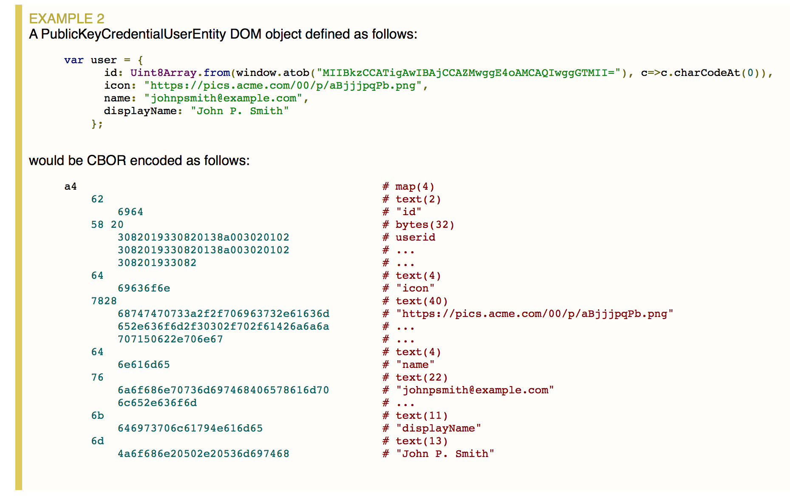
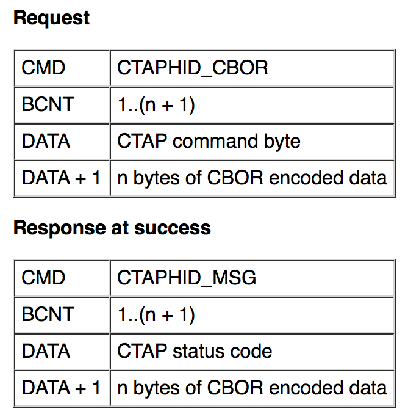

# One CardのFIDO 2.0対応について

## 概要

BLEデバイスであるOne Cardを、FIDO 2.0（以下FIDO2）デバイスとして動作させるようにするためのTODO調査になります。

<u>2018/05/22現在</u>、BLEトランスポート仕様の制定待ちの状態になっています。 
（仕様が未制定状態なのか、FIDO2に対応させる予定がないのかは不明です）

## 現状の仕様制定状況

FIDO2のハードウェア（Authenticator）に関する仕様「CLIENT TO AUTHENTICATOR PROTOCOL」（CTAP）について、下記オンライン・ドキュメントを参照して調査を行いました。 
[Client To Authenticator Protocol - FIDO Alliance Proposed Standard 27 September 2017](https://fidoalliance.org/specs/fido-v2.0-ps-20170927/fido-client-to-authenticator-protocol-v2.0-ps-20170927.html)

調査した結果、FIDO2固有の仕様を含んだトランスポート仕様が制定されているハードウェアは、USB HIDデバイスだけといった状況です。 
残念ながら、NFC、BLEに関するトランスポート仕様の制定は、U2Fサポートどまりとなっております。

FIDO2では、ハードウェア（Authenticator）に対して送受信できるデータ項目が格段に多くなっているため、FIDO2に対応したメッセージ形式（CBOR encoded data）で、メッセージ送受信を行う仕様になっています。 
（FIDO2クライアントJavaScript上のCBORと、FIDO2ハードウェアへ送受信するCBOR encoded dataの例は下図の通り）

ところが、上記オンライン・ドキュメントでは、FIDO2メッセージ（CBOR encoded data）をBLEデバイスに送信する仕様の記述が見つかりませんでした。 
ですので仕様上、BLEデバイスにより、FIDO2メッセージを送受信することができません。

結果として、One CardをFIDO2デバイスとして動作させることは、<u>2018/05/22現在</u>、不可能な状況です。

### ご参考：USB HIDデバイスのFIDO2トランスポート仕様

YubikeyなどのUSB HIDデバイスに関しては、以下のFIDO2トランスポート仕様が追加制定されています。

- 8.1.9.1.2 CTAPHID_CBOR (0x10)
- 8.1.9.1.5 CTAPHID_CANCEL (0x11)
- 8.1.9.1.7 CTAPHID_KEEPALIVE (0x3B)

（番号は、前述[CTAPオンライン・ドキュメント](https://fidoalliance.org/specs/fido-v2.0-ps-20170927/fido-client-to-authenticator-protocol-v2.0-ps-20170927.html)における章番号）

上記のうち、`CTAPHID_CBOR (0x10)`というのが、FIDO2メッセージ（CBOR encoded data）を送信するためのコマンドのようです。 
フォーマットは下図のようになっています。

ちなみに、従来のU2Fメッセージ（RAW encoded data）を送信するためのコマンドは、Request CMDとしての`CTAPHID_MSG (0x03)`という形で残されているようです。 
したがって、Yubikey NEOなどのUSB HID U2Fデバイスは、WebAuthnでもサポートされます。

## 方向性

前述の通り、One Card（FIDO U2Fデバイス）を、FIDO2デバイスとして動作させることは仕様上できない状況です。 
したがって、One CardをWebAuthnのもとで、引き続きBLE U2Fデバイスとして動作させる、というのが当面の方向性になるかと思われます。

PCブラウザーでのWebAuthnサポートということになりますと、具体的には下記のいずれかになるかと存じます。

- PCブラウザーのWebAuthn実装が、BLEデバイスをサポートするまで待つ 
ただし可能性としては低いかと思われます。

- PCブラウザーのWebAuthnエクステンションが公開された場合は、カスタマイズして対応 
ただしこの場合は、GoogleやDropboxといったアカウントに対する対応はできません。 
（Googleなどで用意しているエクステンションのIDが変わってしまうため） 
[ChromeにおけるBLE U2F対応例](../Research/CHROMEOSTEST.md)のように、Webコンテンツ側で任意のエクステンションIDを指定することができる、自社サイトなどでの独自対応となってしまいます。
