# OpenSSL C言語ライブラリー導入手順

## 概要

U2F管理ツール内で秘密鍵ファイル生成などを行うために必要な、OpenSSL C言語ライブラリーの導入手順を、下記に掲載いたします。

## インストール媒体の取得

ブラウザーで[OpenSSLのサイト](https://www.openssl.org/source/)を開きます。

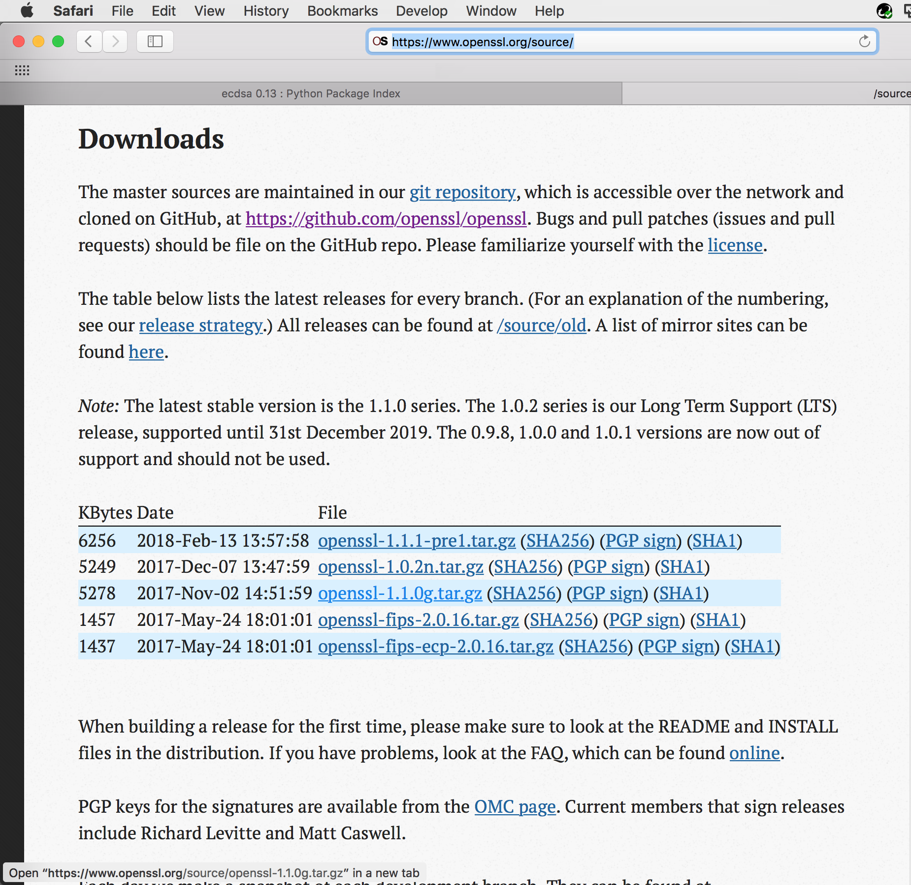

インストール媒体（openssl-1.1.0g.tar.gzというファイル）を、リンクをクリックしてダウンロードします。

ダウンロードしたファイルを解凍すると、下図のようなファイルが格納されています。

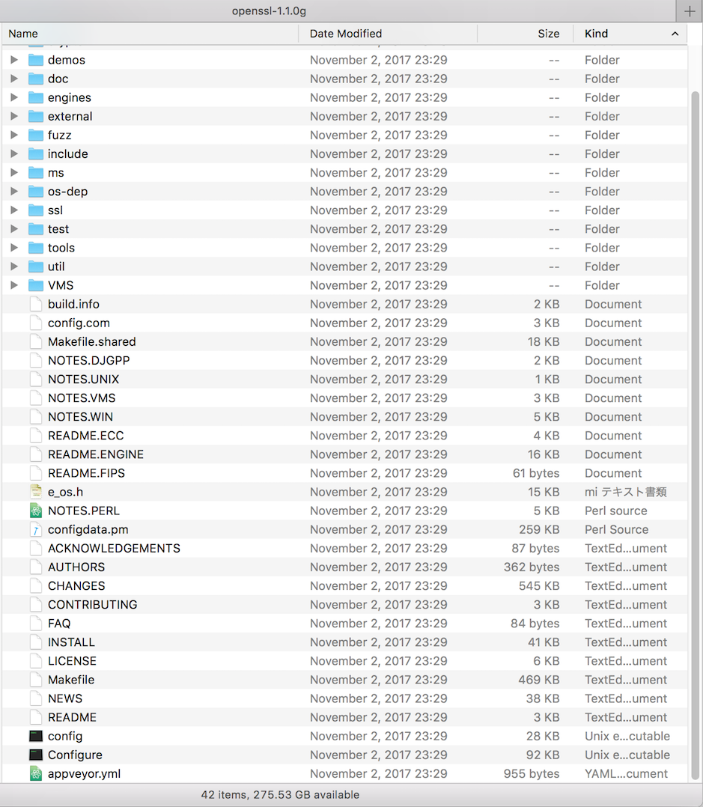

同梱の INSTALL というファイルを開くと、導入方法が記載されています。
```
 Quick Start
 -----------

 If you want to just get on with it, do:

  on Unix:

    $ ./config
    $ make
    $ make test
    $ make install
```

## macOSへの導入

macOSにOpenSSLを導入し、Xcodeプロジェクトに組み込むまでの手順は以下になります。

### インストールの実行

前述INSTALLの内容を参考に、インストールのためのコマンドを下記の通り実行します。<br>
（今回は、インストール先をユーザーディレクトリー配下に指定しております）

```
$ ./config --prefix=$HOME/openssl
$ make
$ make test
$ make install
```
ご参考：[上記コマンド実行時のログ](assets/openssl.make.log)

### Xcodeプロジェクトへの組込み

ユーザーディレクトリー配下にできたインクルードファイルと、libcrypto.aを、開発時に使用します。
macOS版の場合、U2FMaintenanceTool.appのXcodeプロジェクトに組み込んで使用することになります。

```
MacBookPro-makmorit-jp:lib makmorit$ pwd
/Users/makmorit/openssl/lib
MacBookPro-makmorit-jp:lib makmorit$ ls -al *.a
-rw-r--r--  1 makmorit  staff  3718816 Feb 15 13:16 libcrypto.a <---これを使用
-rw-r--r--  1 makmorit  staff   571720 Feb 15 13:16 libssl.a
MacBookPro-makmorit-jp:lib makmorit$
```

#### ヘッダーファイルの追加指定

XcodeのHeader Search Pathsに、OpenSSLのインクルードディレクトリーを下記のように指定します。

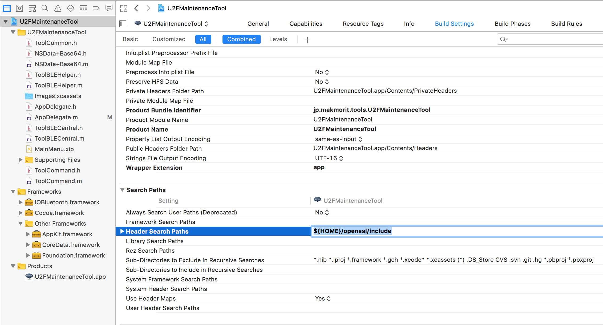

#### ライブラリーファイルの追加指定

先述のlibcrypto.aのアイコンを、Xcode左側にあるツリービューの、Frameworks/Other Frameworksというフォルダーにドラッグ＆ドロップします。

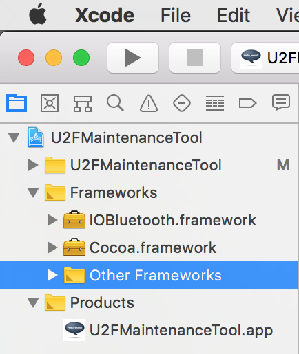

下図のようなダイアログがポップアップ表示されますので、そのままFinishをクリックします。

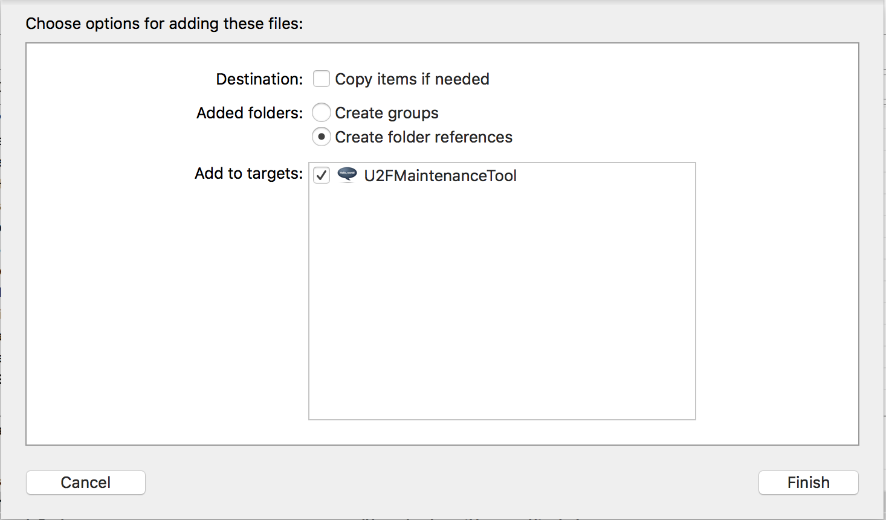

libcrypto.aがツリービューに追加されます。

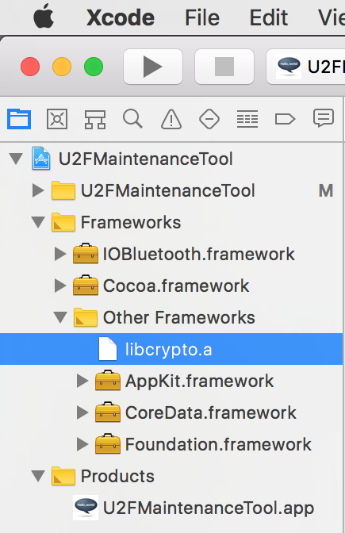

XcodeのLibrary Search Pathsに、（libcrypto.aが配置されている）OpenSSLのライブラリーディレクトリーを下記のように指定します。

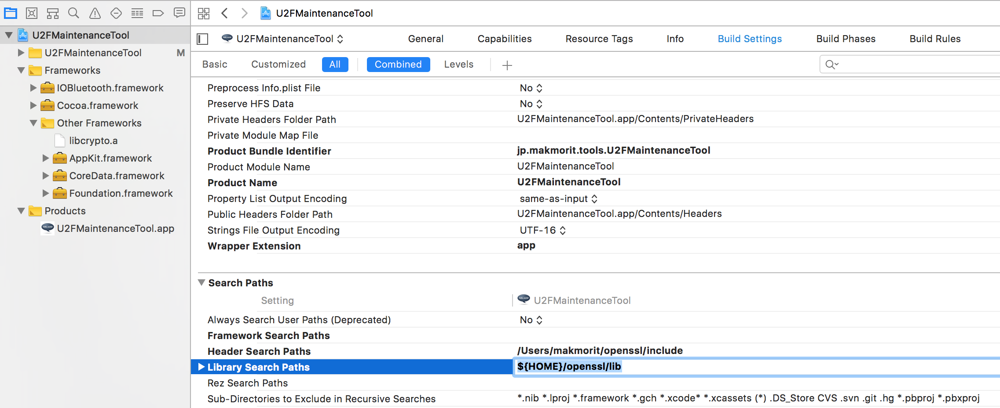

#### 指定したパスの確認

下図のように、指定したパスが自動計算されて表示されることを確認します。

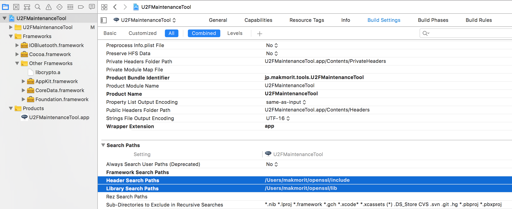

#### サンプルコードによる確認

下図のようなサンプルコードを入れた後、プロダクトのビルドを行います。<br>
エラーが発生しなければ、導入は成功です。

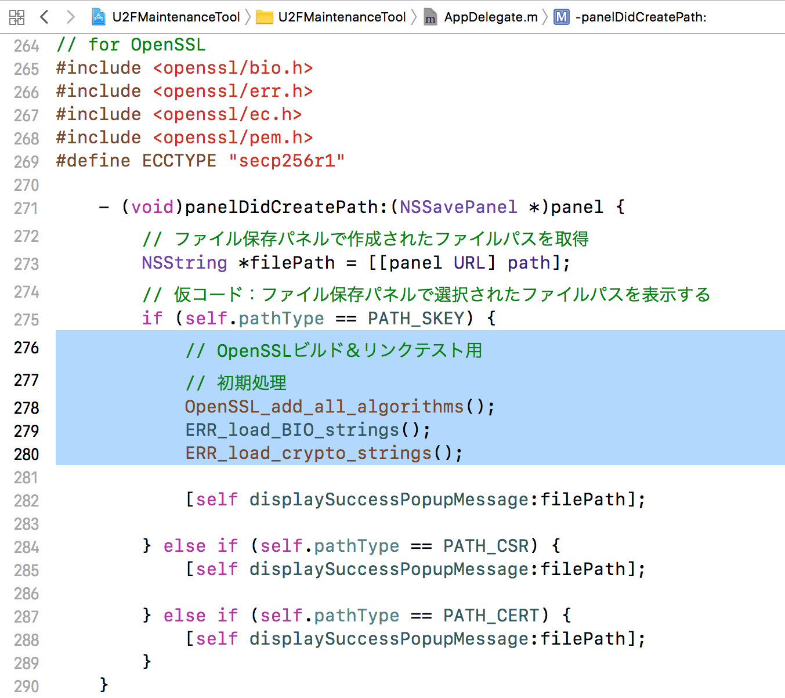

以上でXcodeプロジェクトへの組込みは完了です。


## Windowsへの導入

windows環境にOpenSSLを導入する手順は以下になります。

注：<br>
Windows版 OpenSSLライブラリーのファイル作成機能（＝fopenなどの関数を使用する機能）が、VS2015のC++で作成したアプリから実行できないことが判明したため、ライブラリーファイルは、本件開発では使用していません。<br>
このため、Windows版U2F管理ツールでは、下記手順によりビルドしたOpenSSLコマンド（openssl.exe）を利用し、ファイル作成機能を実行しております。

### perlの導入

Windowsにはperlコマンドがないので、ActivePerlというツールを使用するものとします。

導入手順は[こちらのページ](ACTIVEPERL.md)に別途まとめております。

### インストールの実行

前述INSTALLの内容を参考に、インストールのためのコマンドを実行します。<br>
今回は、インストール媒体をフォルダー（C:\\Users\\user\\openssl-1.1.0g）に配置し、インストール先をユーザーディレクトリー配下（C:\\Users\\user\\openssl）に指定しております。

#### メイクファイルの生成

下記コマンドを実行します。<br>
`perl Configure no-asm --prefix=C:\Users\user\openssl VC-WIN32`

```

C:\Users\user\openssl-1.1.0g>perl Configure no-asm --prefix=C:\Users\user\openssl VC-WIN32
Configuring OpenSSL version 1.1.0g (0x1010007fL)
    no-asan         [default]  OPENSSL_NO_ASAN
    no-asm          [option]   OPENSSL_NO_ASM
    no-crypto-mdebug [default]  OPENSSL_NO_CRYPTO_MDEBUG
    no-crypto-mdebug-backtrace [default]  OPENSSL_NO_CRYPTO_MDEBUG_BACKTRACE
    no-ec_nistp_64_gcc_128 [default]  OPENSSL_NO_EC_NISTP_64_GCC_128
    no-egd          [default]  OPENSSL_NO_EGD
    no-fuzz-afl     [default]  OPENSSL_NO_FUZZ_AFL
    no-fuzz-libfuzzer [default]  OPENSSL_NO_FUZZ_LIBFUZZER
    no-heartbeats   [default]  OPENSSL_NO_HEARTBEATS
    no-md2          [default]  OPENSSL_NO_MD2 (skip dir)
    no-msan         [default]  OPENSSL_NO_MSAN
    no-rc5          [default]  OPENSSL_NO_RC5 (skip dir)
    no-sctp         [default]  OPENSSL_NO_SCTP
    no-ssl-trace    [default]  OPENSSL_NO_SSL_TRACE
    no-ssl3         [default]  OPENSSL_NO_SSL3
    no-ssl3-method  [default]  OPENSSL_NO_SSL3_METHOD
    no-ubsan        [default]  OPENSSL_NO_UBSAN
    no-unit-test    [default]  OPENSSL_NO_UNIT_TEST
    no-weak-ssl-ciphers [default]  OPENSSL_NO_WEAK_SSL_CIPHERS
    no-zlib         [default]
    no-zlib-dynamic [default]
Configuring for VC-WIN32

It looks like you don't have either nmake.exe or dmake.exe on your PATH,
so you will not be able to execute the commands from a Makefile.  You can
install dmake.exe with the Perl Package Manager by running:

    ppm install dmake

CC            =cl
CFLAG         =-W3 -wd4090 -Gs0 -GF -Gy -nologo -DOPENSSL_SYS_WIN32 -DWIN32_LEAN_AND_MEAN -DL_ENDIAN -D_CRT_SECURE_NO_DEPRECATE -DUNICODE -D_UNICODE /MD /O2
SHARED_CFLAG  =
DEFINES       =OPENSSL_USE_APPLINK DSO_WIN32 NDEBUG OPENSSL_THREADS OPENSSL_NO_STATIC_ENGINE OPENSSL_PIC
LFLAG         =/nologo /debug
PLIB_LFLAG    =
EX_LIBS       =ws2_32.lib gdi32.lib advapi32.lib crypt32.lib user32.lib
APPS_OBJ      =win32_init.o ../ms/applink.o
CPUID_OBJ     =mem_clr.o
UPLINK_OBJ    =../ms/uplink.o
BN_ASM        =bn_asm.o
EC_ASM        =
DES_ENC       =des_enc.o fcrypt_b.o
AES_ENC       =aes_core.o aes_cbc.o
BF_ENC        =bf_enc.o
CAST_ENC      =c_enc.o
RC4_ENC       =rc4_enc.o rc4_skey.o
RC5_ENC       =rc5_enc.o
MD5_OBJ_ASM   =
SHA1_OBJ_ASM  =
RMD160_OBJ_ASM=
CMLL_ENC      =camellia.o cmll_misc.o cmll_cbc.o
MODES_OBJ     =
PADLOCK_OBJ   =
CHACHA_ENC    =chacha_enc.o
POLY1305_OBJ  =
BLAKE2_OBJ    =
PROCESSOR     =
RANLIB        =true
ARFLAGS       =/nologo
PERL          =C:\Perl\bin\perl.exe

THIRTY_TWO_BIT mode
BN_LLONG mode

Configured for VC-WIN32.

C:\Users\user\openssl-1.1.0g>
```

#### ビルドの実行

下記コマンドを実行します。<br>
`nmake > openssl.nmake.log 2>&1`

コマンド実行時は、<b>開発者コマンドプロンプト for VS2015を管理者として実行する</b>ことに注意します。

ビルド時のログは[openssl.nmake.log](assets/openssl.nmake.log)に出力されます。<br>
エラー等がなければ、０が戻ります（%ERRORLEVEL% で確認できます）。

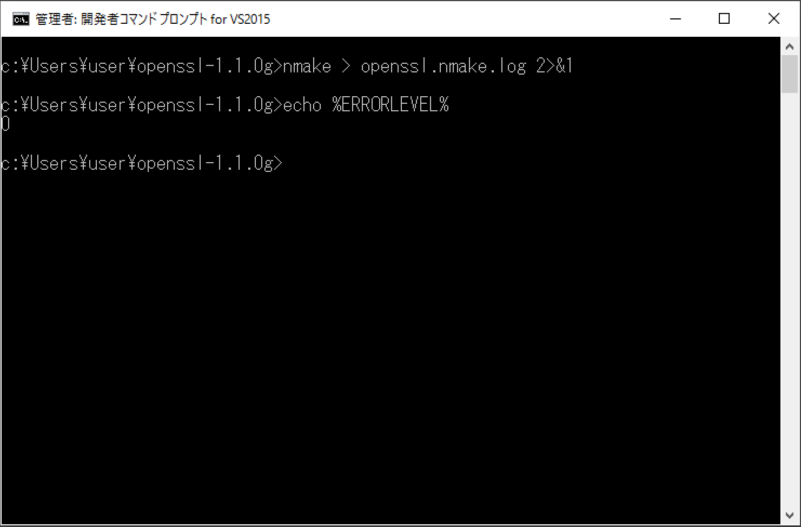

#### テストの実行

ビルドが完了したら、テストコマンド群によるテストを実行します。<br>
`nmake test > openssl.nmake.test.log 2>&1`

テスト時のログは[openssl.nmake.test.log](assets/openssl.nmake.test.log)に出力されます。<br>
エラー等がなければ、０が戻ります（%ERRORLEVEL% で確認できます）。

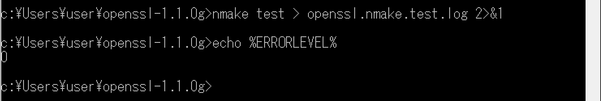

#### インストールの実行

ビルドが完了したら、インストールを実行します。<br>
`nmake install > openssl.nmake.install.log 2>&1`

インストール時のログは[openssl.nmake.install.log](assets/openssl.nmake.install.log)に出力されます。<br>
エラー等がなければ、０が戻ります（%ERRORLEVEL% で確認できます）。

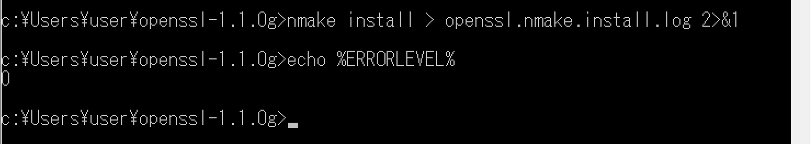

これでインストールは完了です。
