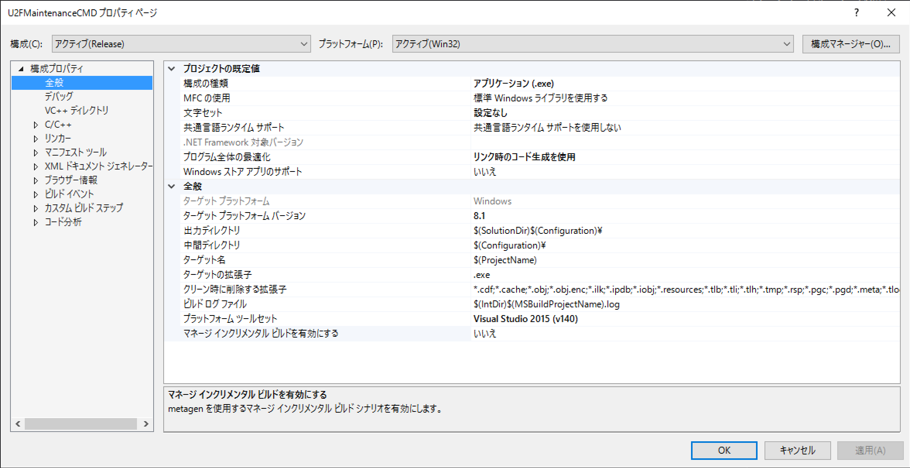
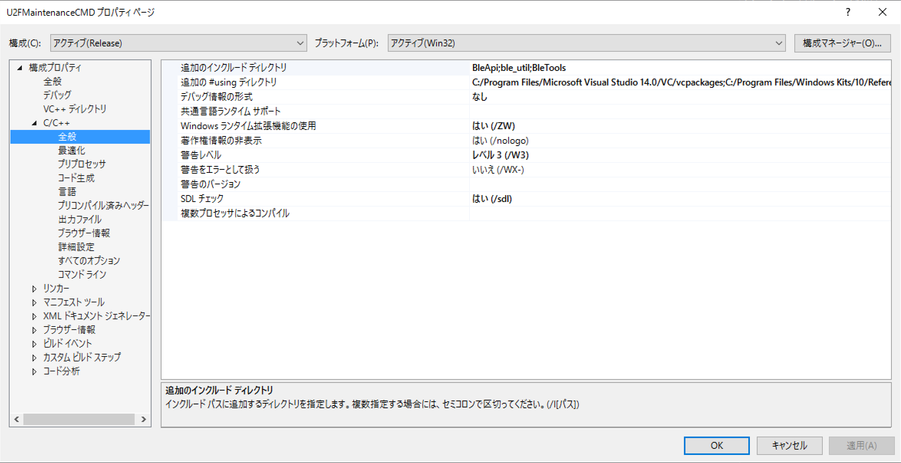
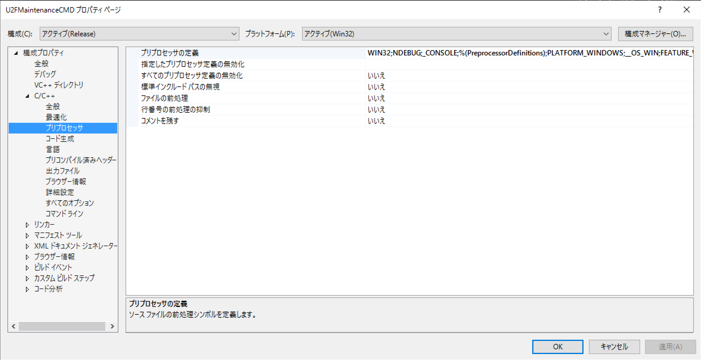
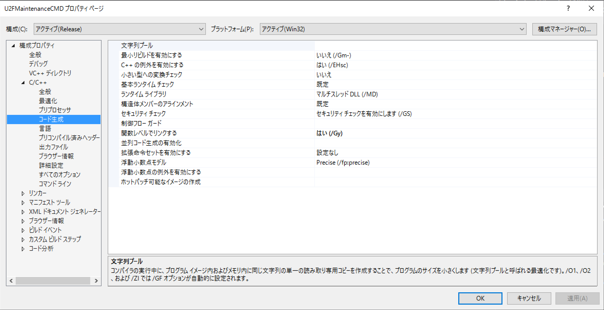
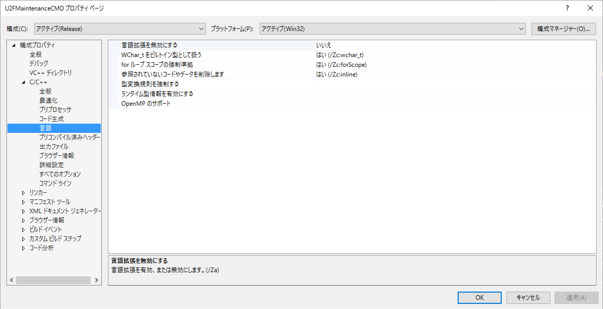
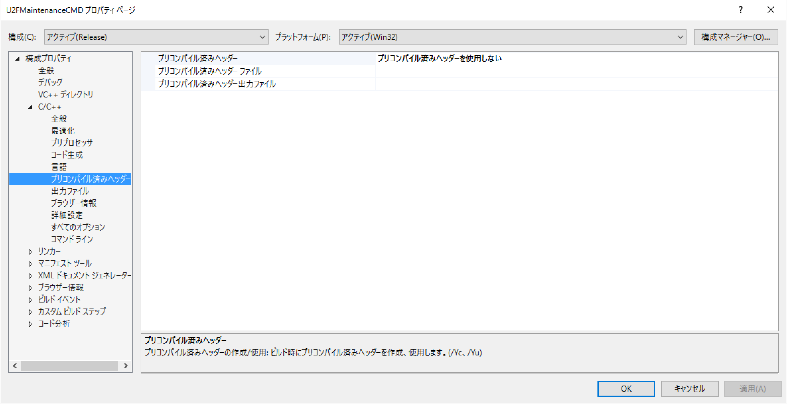
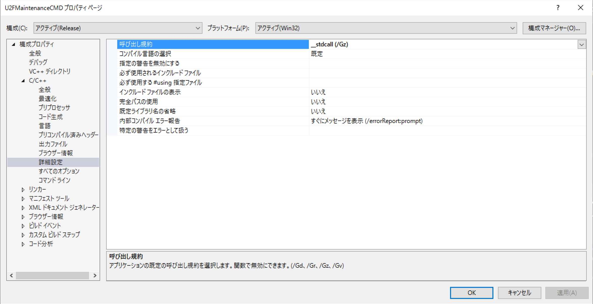

# VS2015プロジェクトの諸設定

## 概要

U2F管理ツール画面（U2FMaintenanceToolGUI.exe）、U2F管理コマンド（U2FMaintenanceToolCMD.exe）は、Visual Studio 2015を使用してビルドしています。

こちらの詳細設定情報について掲載します。

## U2F管理コマンド

### プロジェクト・プロパティ

#### 構成プロパティ - 全般

文字セットを「設定なし」に変更します。




#### C/C++

コマンドラインオプションのプレビューは下記の通りです。

```
/GS /GL /analyze- /W3 /Gy /Zc:wchar_t /I"BleApi" /I"ble_util" /I"BleTools" /Gm- /O2 /sdl /Fd"Release\vc140.pdb" /Zc:inline /fp:precise /D "WIN32" /D "NDEBUG" /D "_CONSOLE" /D "PLATFORM_WINDOWS" /D "__OS_WIN" /D "FEATURE_WINRT" /errorReport:prompt /WX- /Zc:forScope /ZW /Gz /Oy- /Oi /MD /Fa"Release\" /EHsc /nologo /Fo"Release\" /AI"C:/Program Files/Microsoft Visual Studio 14.0/VC/vcpackages" /AI"C:/Program Files/Windows Kits/10/References/" /AI"C:/Program Files/Windows Kits/10/UnionMetaData/"
```

#### C/C++ - 全般



- 追加のインクルードディレクトリ
```
BleApi;ble_util;BleTools
```
- 追加の#usingディレクトリ
```
C:/Program Files/Microsoft Visual Studio 14.0/VC/vcpackages;C:/Program Files/Windows Kits/10/References/;C:/Program Files/Windows Kits/10/UnionMetaData/
```

- デバッグ情報の形式 - なし

- Windowsランタイム拡張機能の使用 - はい

#### C/C++ - プリプロセッサ



- プリプロセッサの定義
```
WIN32;NDEBUG;_CONSOLE;%(PreprocessorDefinitions);PLATFORM_WINDOWS;__OS_WIN;FEATURE_WINRT
```

#### C/C++ - コード生成



#### C/C++ - 言語

機能は使用しません。



#### C/C++ - プリコンパイル済みヘッダー

機能は使用しません。



#### C/C++ - 詳細設定

呼び出し規約を設定します。


