# USB HIDサンプルアプリ動作確認手順

サンプルアプリ[`USB HID Generic Example`](https://infocenter.nordicsemi.com/topic/com.nordic.infocenter.sdk5.v15.2.0/usbd_hid_generic_example.html?cp=4_0_0_4_5_50_6)を使用して、nRF52840のUSB HID機能を確認する手順を掲載しています。

## 機材の準備

USB HIDデバイスとなるnRF52840を準備します。 
今回の検証では、[nRF52840 DK](https://www.mouser.jp/new/nordicsemiconductor/nordic-nrf52840-dev-kit/)という開発ボードを使用します。

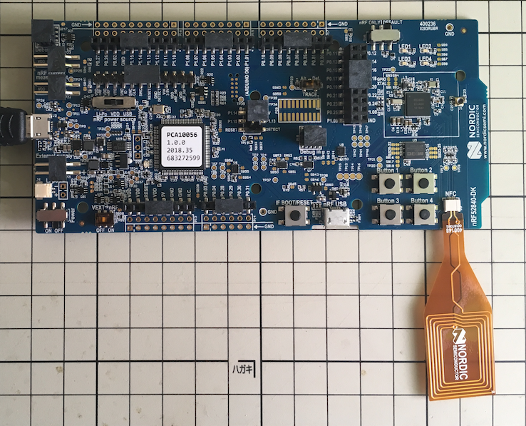

またPCと接続するため、USBケーブル（Type micro-B）を２本用意します。

## サンプルアプリケーションの準備

サンプルアプリ[`USB HID Generic Example`](https://infocenter.nordicsemi.com/topic/com.nordic.infocenter.sdk5.v15.2.0/usbd_hid_generic_example.html?cp=4_0_0_4_5_50_6)を、[NetBeans](NETBEANS.md)によりビルドし、nRF52840 DKに書込みます。

### サンプルアプリソースのコピー／配置

別途手順「[NetBeans開発環境構築手順](NETBEANS.md)」で、NetBeansとnRF5 SDK（v15.2）を導入したら、以下の場所にあるサンプルアプリを、フォルダーごと任意の場所にコピーします。

サンプルアプリの場所： 
`~/opt/nRF5_SDK_15.2.0/examples/peripheral/usbd_hid_generic`

コピー先は以下の場所としておきます。 
`~/GitHub/onecard-fido/nRF5_SDK_v15.2.0/examples/usb/usbd_hid_generic`

### Makefileの修正

ここで、サンプルアプリの場所（`~/opt/nRF5_SDK_15.2.0/`）と、コピー先の場所（`~/GitHub/onecard-fido/nRF5_SDK_v15.2.0/`）が異なるため、Makefileを事前に修正する必要があります。 
（修正を忘れると、プロジェクト新規作成後の自動ビルドに失敗してしまうための事前措置になります）

`~/GitHub/onecard-fido/nRF5_SDK_v15.2.0/examples/usb/usbd_hid_generic/pca10056/blank/armgcc`配下のMakefileというファイルをエディターで開き、 
`SDK_ROOT := ../../../../../..` とあるのを `SDK_ROOT := $(HOME)/opt/nRF5_SDK_15.2.0` と修正してください。

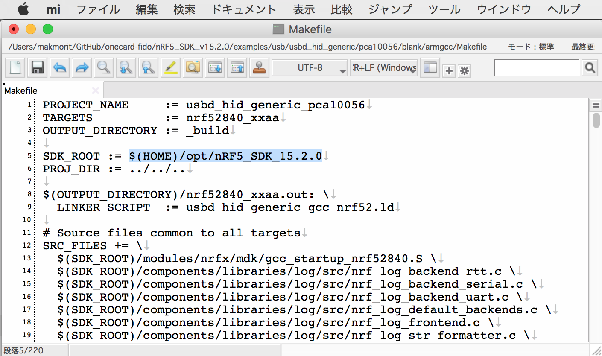

### NetBeansプロジェクトの作成

NetBeansを起動して「ファイル(F)--->新規プロジェクト(W)」を実行します。 
下図のような、新規プロジェクト画面が表示されますので、一覧から「既存のソースを使用するC/C++プロジェクト」を選択し「次 >」をクリックします。

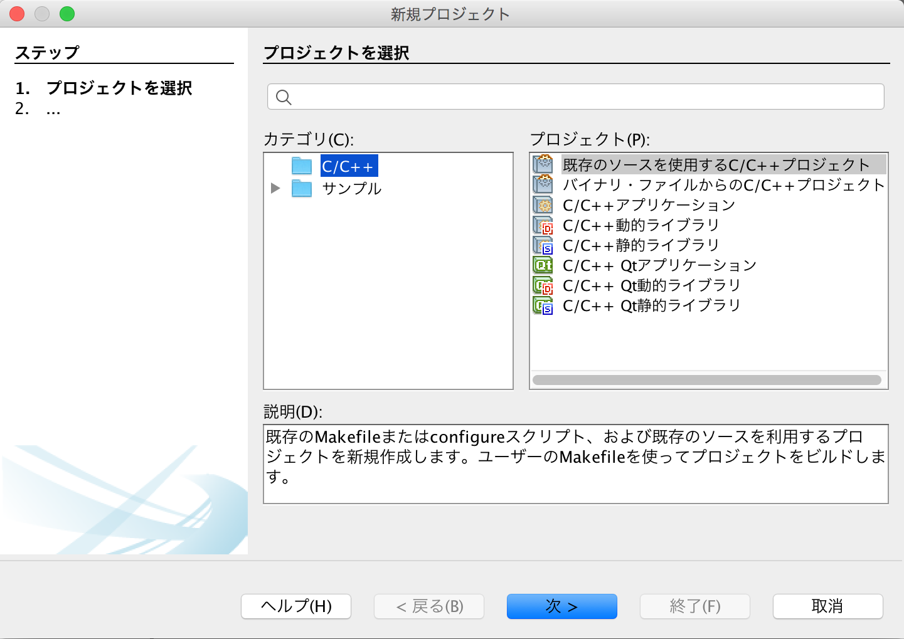

下図のような画面に遷移しますので、以下のように設定します。

- 既存のソースを含むフォルダを指定 - サンプルアプリが格納されているフォルダー「`examples/usb/usbd_hid_generic`」を指定します。 
下図の例では「`/Users/makmorit/GitHub/onecard-fido/nRF5_SDK_v15.2.0/examples/usb/usbd_hid_generic`」という文字列が設定されています。

- ツール・コレクション - 「GNU_ARM」を選択します。

- 構成モードを選択 - 「カスタム(C)」をチェックします。

設定が完了したら「次 >」をクリックします。

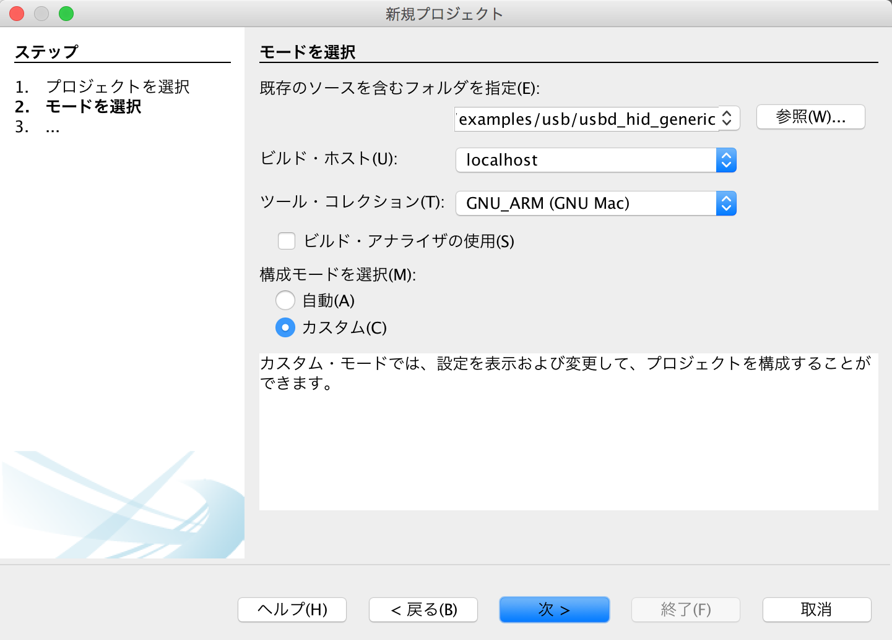

下図のような画面に遷移しますので、以下のように設定します。

- 「事前ビルド・ステップが必要」にチェック

- フォルダで実行(U) - サンプルアプリのサブフォルダー「`pca10056/blank/armgcc`」を指定します。 
下図の例では「`/Users/makmorit/GitHub/onecard-fido/nRF5_SDK_v15.2.0/examples/usb/usbd_hid_generic/pca10056/blank/armgcc`」という文字列が設定されています。

- 「カスタム・コマンド」にチェック

- コマンド(O) - 「make」と入力します。

設定が完了したら「次 >」をクリックします。

「4. ビルド・アクション」に遷移しますが、以降は「7. プロジェクトの名前と場所」に遷移するまではデフォルト設定のまま「次 >」をクリックします。 
「7. プロジェクトの名前と場所」に遷移したら、プロジェクト名(P)を「usbd_hid_generic」から「usbd_hid_generic_proj」に変更しておきます。 
（オリジナルのプロジェクト「usbd_hid_generic」を上書きしたくないための措置です）

設定が完了したら「終了(F)」をクリックします。

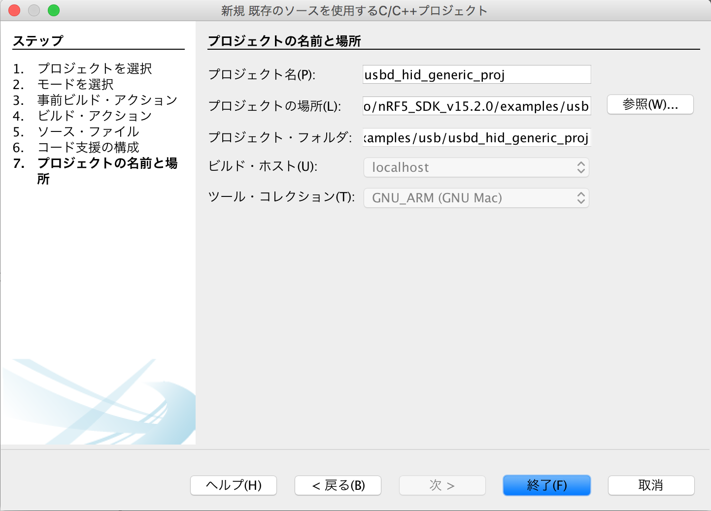

自動的にビルドがスタートしますので、しばらくそのまま待ちます。 
しばらくするとビルドが完了し「ビルド SUCCESSFUL」と表示されれば、ビルドは成功です。

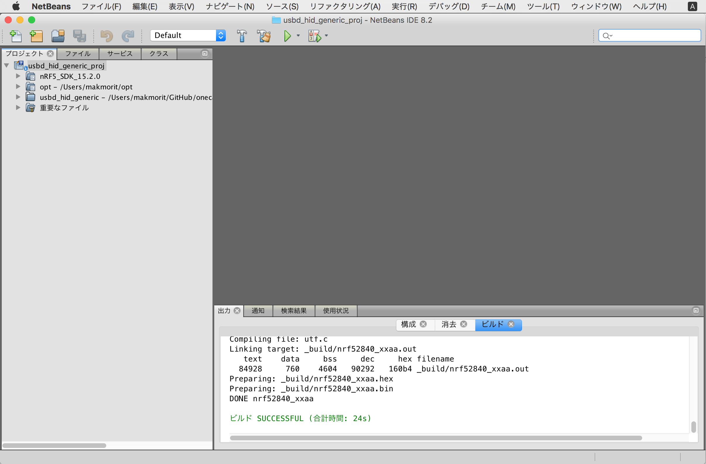

これでNetBeansにプロジェクト「usbd_hid_generic_proj」が作成されました。

## サンプルアプリケーションの導入

事前に、nRF52840 DKを、USBケーブルでPCと接続します。 
その後、nRF52840 DKの電源スイッチ（ボードの左端部）をOnにし、ボードに電源を投入します。

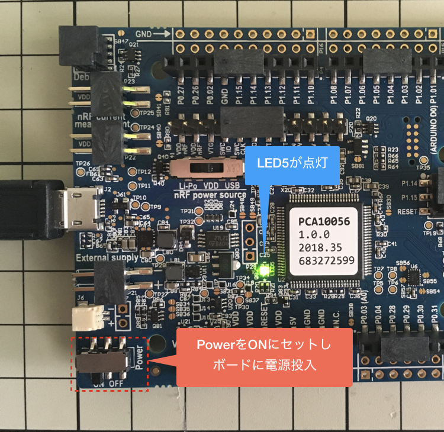

### プロジェクト設定の変更

NetBeansを起動し、プロジェクト「usbd_hid_generic_proj」を右クリックして「プロパティ」を実行します。

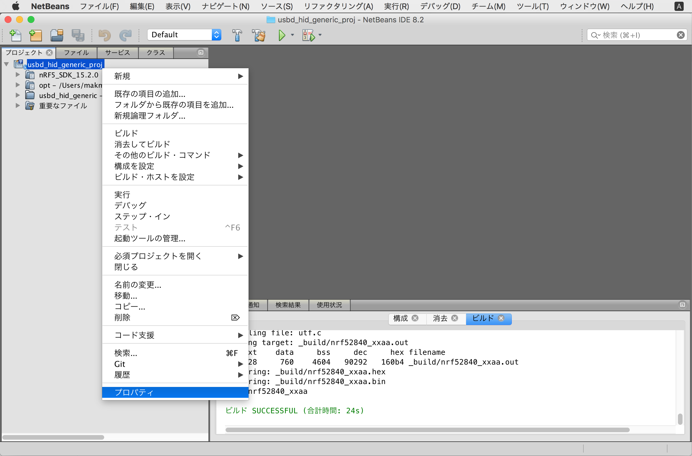

プロジェクト・プロパティ画面が表示されます。 
左ペインの「実行」をクリックしで、以下のように設定を変更します。

- コマンドの実行 - 「make flash」に変更します。

- 実行ディレクトリ - 実行するMakefileが配置されているディレクトリーに変更します。 
下図の例では `../usbd_hid_generic_proj/pca10056/blank/armgcc` という文字列が設定されています。

変更が完了したら「OK」をクリックして、いったんプロジェクト・プロパティ画面を閉じます。

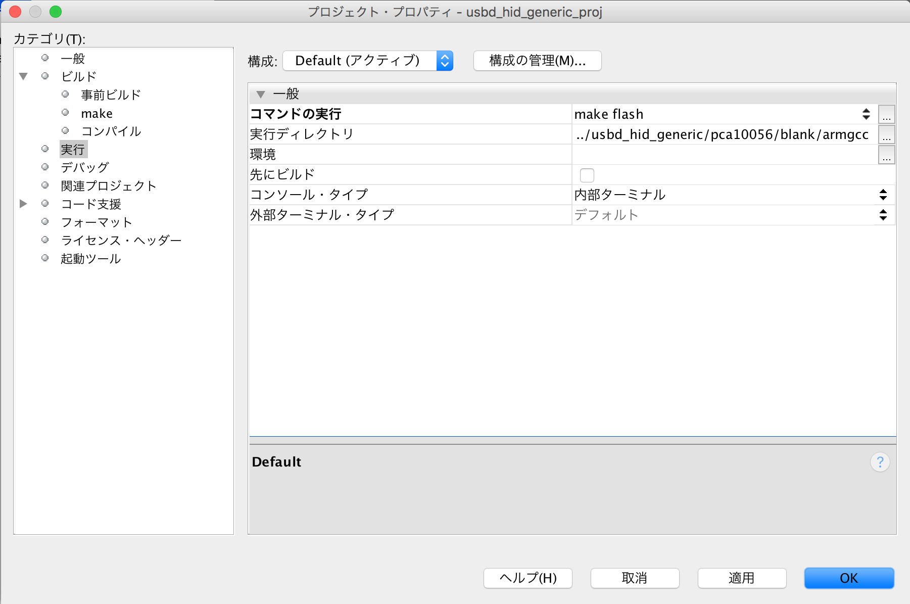

### サンプルアプリケーションの書込み

NetBeansの実行ボタンをクリックして「プロジェクト(usbd_hid_generic_proj)を実行」を実行します。

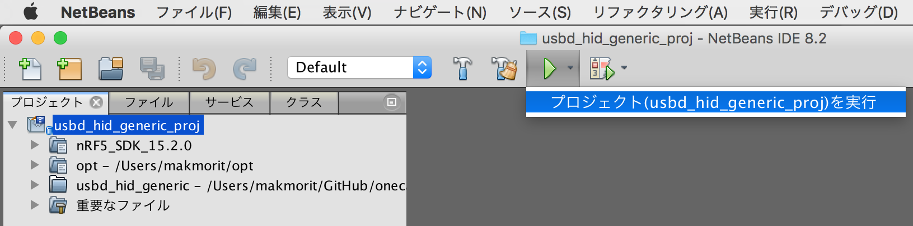

プログラムが自動的に書き込まれ、nRF52840 DK上でアプリケーションが実行されます。 
NetBeansの右下部のコンソールには「実行 FINISHED; 終了値0」と表示されます。

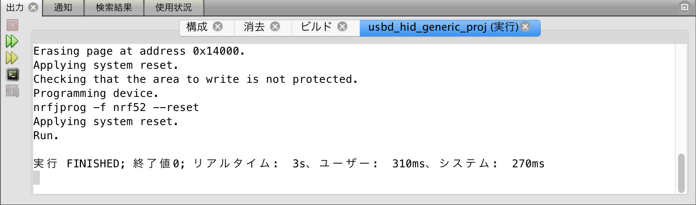

適宜、ボードからのデバッグ出力（UARTプリント）を確認します。 
nRF52840 DK上で、プログラム実行が開始され、下図のようなデバッグ出力が表示されれば、サンプルアプリケーションの導入は完了です。

## 動作確認

下記URLの情報を参考に、動作確認を実施します。 
[<b>Nordic Semiconductor Infocenter - USB HID Generic Example Example</b>](https://infocenter.nordicsemi.com/topic/com.nordic.infocenter.sdk5.v15.2.0/usbd_hid_generic_example.html?cp=4_0_0_4_5_50_6)

### PCとの接続

まずはnRF52840 DKとPCを、USBケーブルで接続します。 
すでに接続されている（プログラム書込み用の）J-LINKポートはそのままとし、下図の「nRF USB」というポートに別のUSBケーブルでPCと接続します。

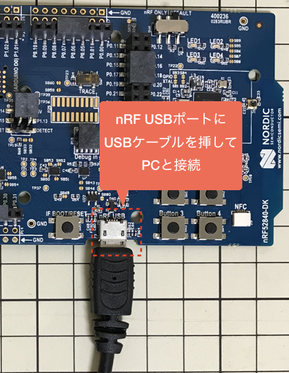

ほどなく、基板上のLED1が点灯すれば、接続は成功です。

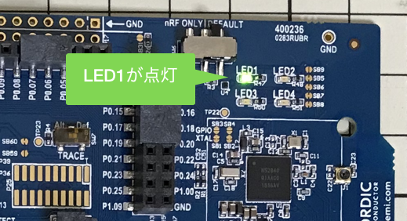

適宜、PCで認識されているかどうかをPC側で確認します。

下図はmacOSのシステムレポート画面で確認した例です。 
USBケーブルで接続されたnRF52840 DKが「nRF52 USB HID generic Demo」という名称で、USB HIDデバイスとして認識されていることが確認できます。

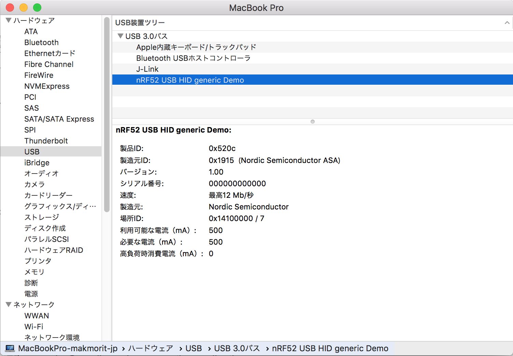

### マウスデバイスとしての機能確認

こちらのサンプルは、USB HIDマウスデバイスとして動作します。 
機能としては以下の通りです。

- Button 1 - 右方向にマウスカーソルが移動します。
- Button 2 - 下方向にマウスカーソルが移動します。
- Button 3 - マウスクリック（左クリック）が発生します。
- Button 4 - マウスクリック（右クリック）が発生します。

各々のボタンを押すと、画面上でマウスカーソル移動／マウスクリック発生が確認できます。

また、マウスデバイスとPC間でデータ（Mouse Report）がやりとりされると、下図のようにLED3が点灯／消灯します。

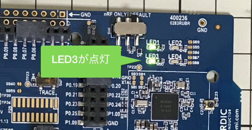
