# NetBeans開発環境構築手順

NetBeansとARM GCC、nRF5 SDKを使用し、nRF52840の開発環境を構築する手順を記載します。

以下の手順では、nRF52840のハードウェアとして、nRF52840 DKという評価ボードを使用しています。

## セットアップ用媒体取得

### NetBeans

こちらのサイトにアクセスします。<br>
https://netbeans.org/downloads/<br>
下図のような画面に遷移します。

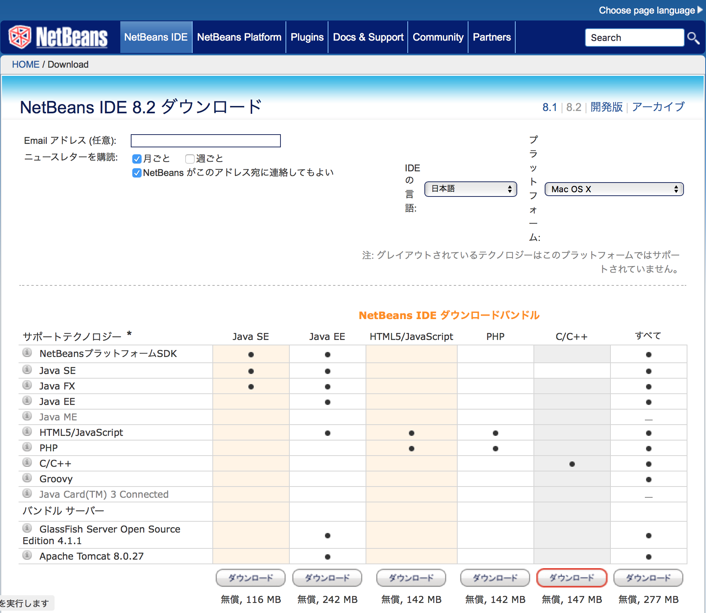

「NetBeans IDE ダウンロードバンドル」の「C/C++」をダウンロードします。<br>
「netbeans-8.2-cpp-macosx.dmg」というファイルがダウンロードされます。

### nRF5 SDK

こちらのサイトにアクセスします。<br>
https://www.nordicsemi.com/eng/Products/nRF52840-DK<br>
下図のような画面に遷移します。

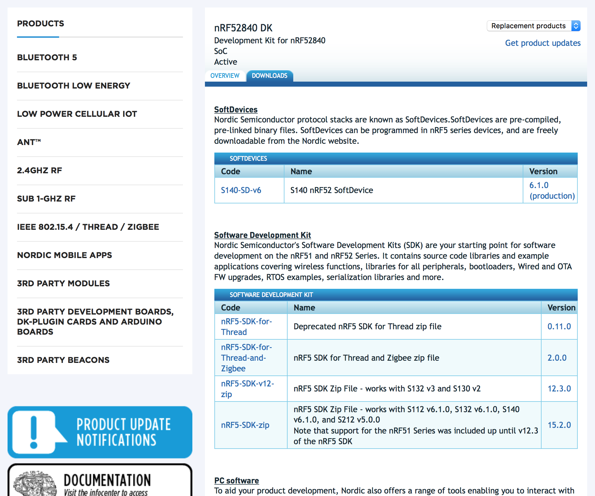

DOWNLOADSタブを開いて、下記のファイルをダウンロードします。

- nRF5-SDK-zip<br>
https://www.nordicsemi.com/eng/nordic/download_resource/59022/94/94590278/116085<br>
「nRF5_SDK_15.2.0_9412b96.zip」というファイルがダウンロードされます。

- nRF5x-Command-Line-Tools-OSX<br>
https://www.nordicsemi.com/eng/nordic/download_resource/58856/21/44330059/99977<br>
「nRF5x-Command-Line-Tools_9_7_3_OSX.tar」というファイルがダウンロードされます。


### ARM GCCツールチェイン

こちらのサイトにアクセスします。<br>
https://developer.arm.com/open-source/gnu-toolchain/gnu-rm/downloads<br>
下図のような画面に遷移します。

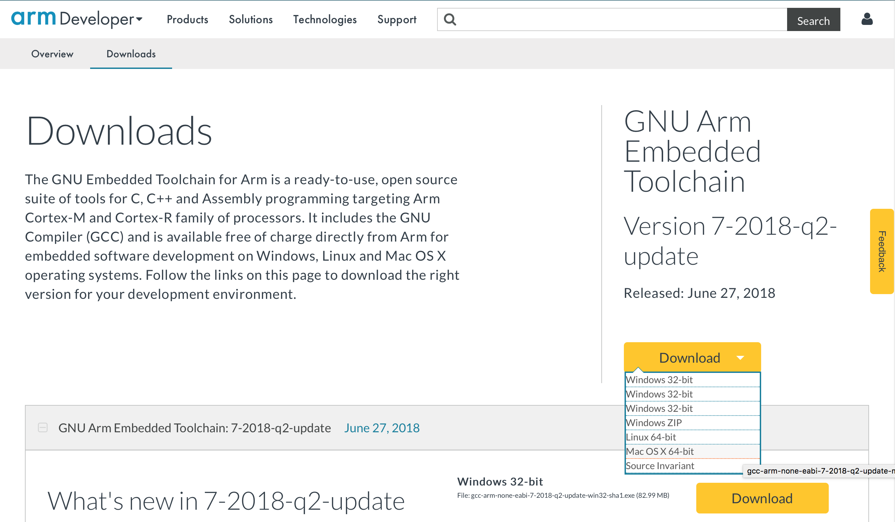

Downloadボタンのプルダウンを開いて「Mac OS X 64-bit」をクリックすると、ダウンロードが開始されます。<br>
「gcc-arm-none-eabi-7-2018-q2-update-mac.tar.bz2」というファイルがダウンロードされます。

### SEGGER J-Link

こちらのサイトにアクセスします。<br>
https://www.segger.com/downloads/jlink<br>
下図のような画面に遷移します。

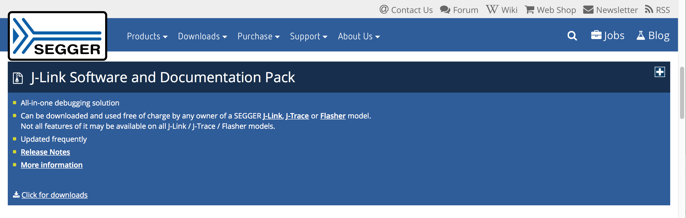

「J-Link Software and Documentation Pack」をクリックすると下図の画面のようになります。

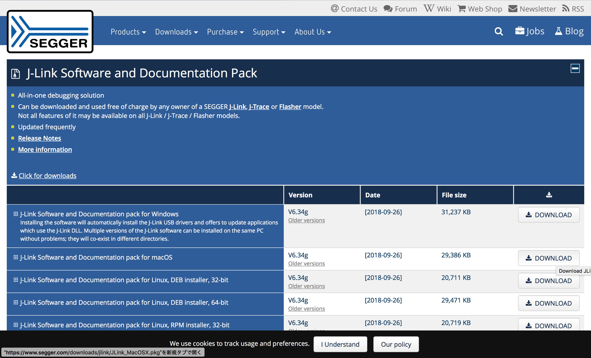

一覧の上から２番目「J-Link Software and Documentation pack for macOS」の、DOWNLOADボタンをクリックし、ツールをダウンロードします。<br>
「JLink_MacOSX_V634g.pkg」というファイルがダウンロードされます。


## セットアップ実行

### NetBeansのインストール

ダウンロードした「netbeans-8.2-cpp-macosx.dmg」をダブルクリックすると、インストーラーが起動しますので、画面の指示に従い操作を進めます。


アプリケーションフォルダーに「NetBeans」というサブフォルダーが出来ていればインストールは完了です。

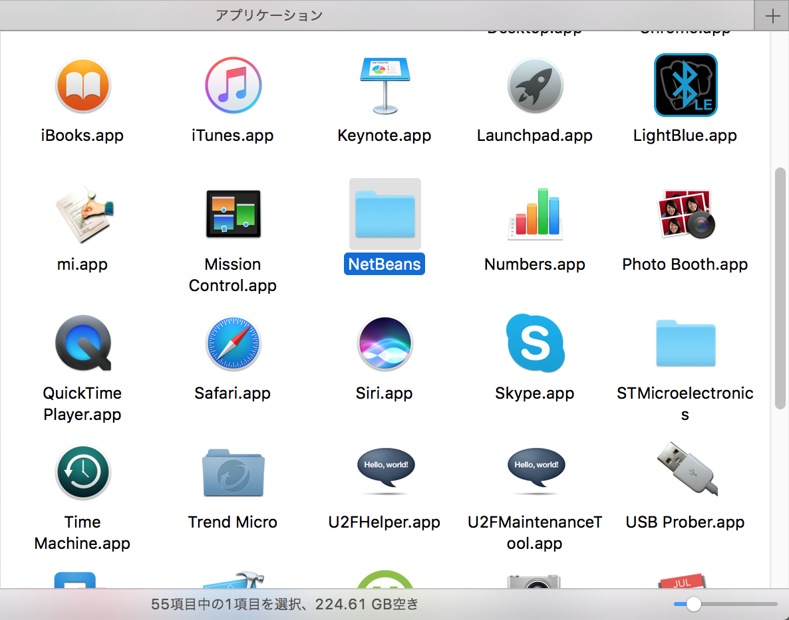

### SEGGER J-Linkのインストール

ダウンロードした「JLink_MacOSX_V634g.pkg」をダブルクリックすると、インストーラーが起動しますので、画面の指示に従い操作を進めます。

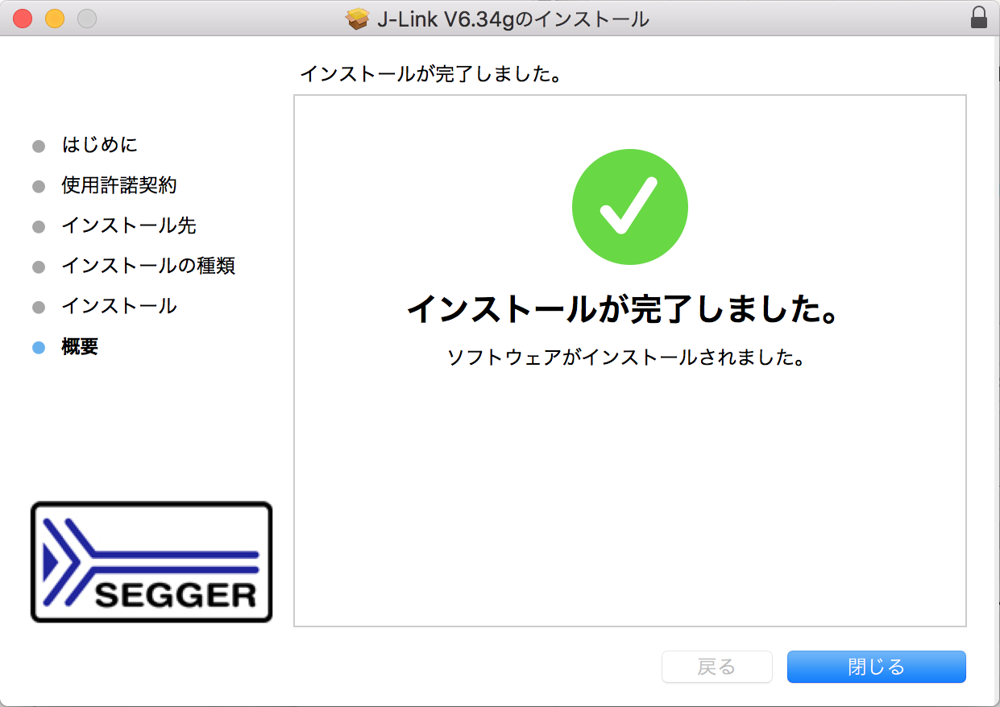

アプリケーションフォルダーに「SEGGER」というサブフォルダーが出来ていればインストールは完了です。

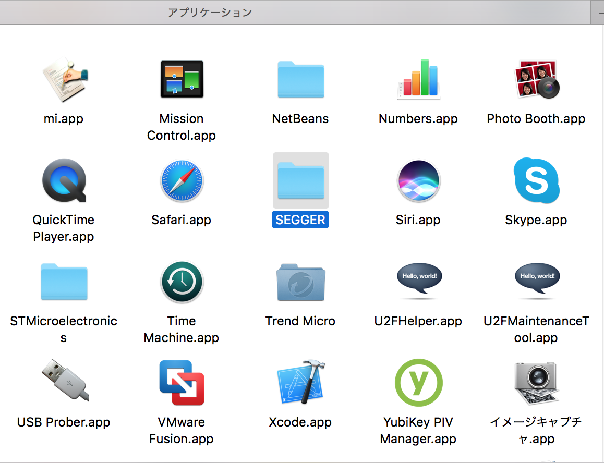

### ツールチェイン／SDKの配置

ARM GCC、nRF5 SDKを任意のフォルダーに配置します。<br>
以下は `$HOME/opt` というディレクトリー配下に配置する例になります。

ターミナルを開き、以下のコマンドを次々と実行していきます。

#### ARM GCCツールチェインの配置
```
mkdir -p ~/opt
cd ~/opt
tar xjvf ~/Downloads/gcc-arm-none-eabi-7-2018-q2-update-mac.tar.bz2
```

#### nRF5 SDKの配置
```
cd ~/opt
tar xjvf ~/Downloads/nRF5_SDK_15.2.0_9412b96.zip
mv nRF5_SDK_15.2.0_9412b96 nRF5_SDK_15.2.0
```

#### nRF5xコマンドラインツールの配置
```
cd ~/opt
mkdir -p nRF5x-Command-Line-Tools_9_7_3_OSX
cd nRF5x-Command-Line-Tools_9_7_3_OSX
tar xjvf ~/Downloads/nRF5x-Command-Line-Tools_9_7_3_OSX.tar
```

実行後は以下のようなディレクトリー構成になるかと存じます。

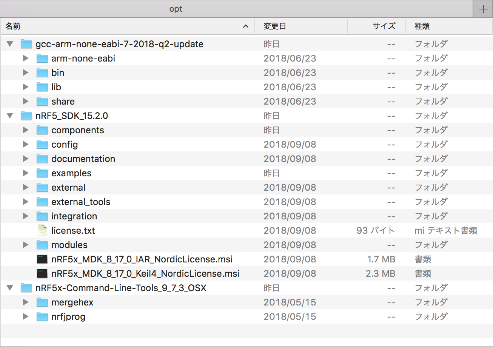

### nRF5 SDKの設定変更

#### バージョンの確認

ターミナルを開き、以下のコマンドを実行してツールチェインのバージョンを確認します。

```
cd ~/opt/gcc-arm-none-eabi-7-2018-q2-update/bin/
./arm-none-eabi-gcc --version
```

下記は実行例になります。<br>
バージョンは「7.3.1」であることが確認できます。

```
MacBookPro-makmorit-jp:opt makmorit$ cd ~/opt/gcc-arm-none-eabi-7-2018-q2-update/bin/
MacBookPro-makmorit-jp:bin makmorit$ ./arm-none-eabi-gcc --version
arm-none-eabi-gcc (GNU Tools for Arm Embedded Processors 7-2018-q2-update) 7.3.1 20180622 (release) [ARM/embedded-7-branch revision 261907]
Copyright (C) 2017 Free Software Foundation, Inc.
This is free software; see the source for copying conditions.  There is NO
warranty; not even for MERCHANTABILITY or FITNESS FOR A PARTICULAR PURPOSE.

MacBookPro-makmorit-jp:bin makmorit$
```

#### nRF5 SDKのMakefileを変更

`$HOME/opt/nRF5_SDK_15.2.0/components/toolchain/gcc` というディレクトリーにある「Makefile.posix」を開いて、以下のように設定します。

```
GNU_INSTALL_ROOT ?= /Users/makmorit/opt/gcc-arm-none-eabi-7-2018-q2-update/bin/
GNU_VERSION ?= 7.3.1
GNU_PREFIX ?= arm-none-eabi
```

ご参考：オリジナルとのdiff
```
MacBookPro-makmorit-jp:~ makmorit$ cd /Users/makmorit/opt/nRF5_SDK_15.2.0/components/toolchain/gcc/
MacBookPro-makmorit-jp:gcc makmorit$ diff Makefile.posix.original Makefile.posix
1,2c1,2
< GNU_INSTALL_ROOT ?= /usr/local/gcc-arm-none-eabi-6-2017-q2-update/bin/
< GNU_VERSION ?= 6.3.1
---
> GNU_INSTALL_ROOT ?= /Users/makmorit/opt/gcc-arm-none-eabi-7-2018-q2-update/bin/
> GNU_VERSION ?= 7.3.1
MacBookPro-makmorit-jp:gcc makmorit$
```

### NetBeansの設定変更

NetBeansを起動し、Preferencesを実行します。

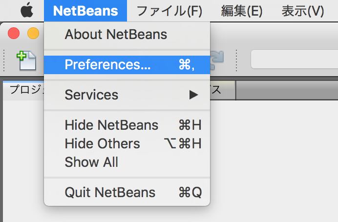

オプション画面が開きますので「C/C++」の「ビルド・ツール」タブを開きます。<br>
画面左側の「ツール・コレクション(C)」下部の「追加」ボタンをクリックします。

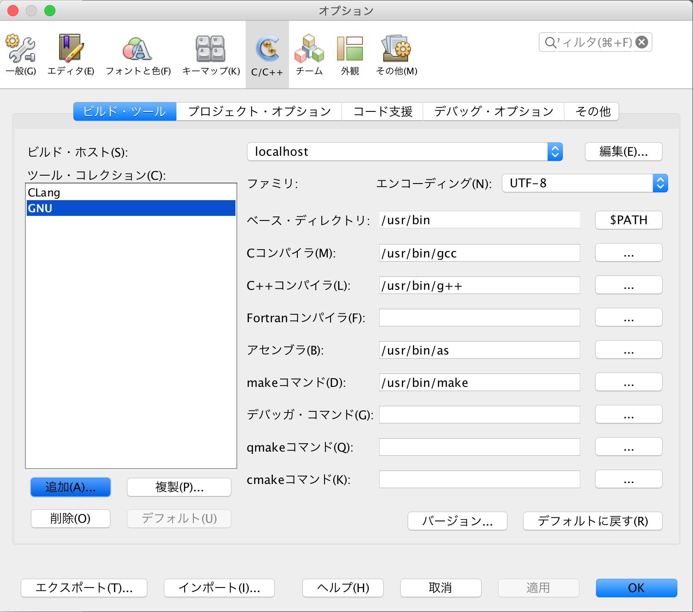

下図のようなポップアップが表示されるので、以下のように設定します。

- ベース・ディレクトリ - ARM GCCツールチェインのルートディレクトリーを選択
- ツール・コレクション・ファミリ - GNU Mac を選択
- ツール・コレクション名 - GNU_ARM と入力

選択／入力が完了したら「OK」をクリックします。

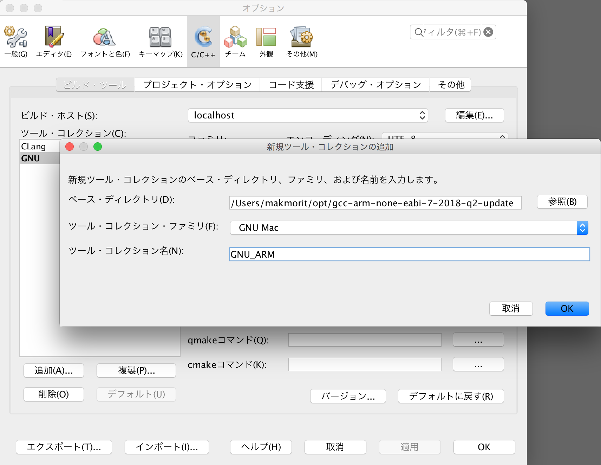

オプション画面に戻ったら、画面右上部の「$PATH」というボタンをクリックします。

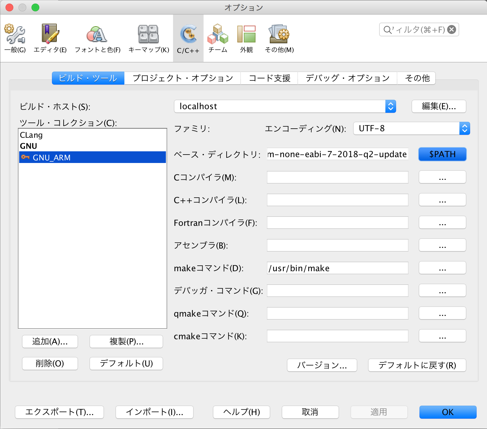

「実行コマンド・パスの変更」欄に`nrfjprog`（nRF5xコマンドライン・ツールのひとつ）のパスを追加します。<br>
下記例では「;${HOME}/opt/nRF5x-Command-Line-Tools_9_7_3_OSX/nrfjprog」という文字列を追加しています。

入力が完了したら「OK」をクリックします。

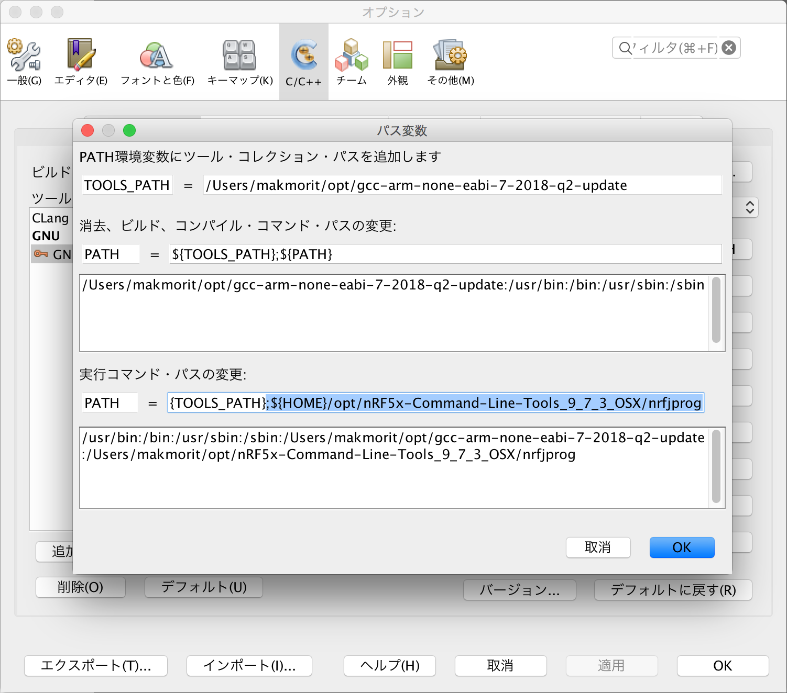

オプション画面に戻ったら、下図のように残りの項目を次々と設定します。

- Cコンパイラ - arm-none-eabi-gcc
- C++コンパイラ - arm-none-eabi-g++
- アセンブラ - arm-none-eabi-as
- デバッガ・コマンド - arm-none-eabi-gdb

設定が完了したら「OK」をクリックします。


## NetBeansの動作確認

Nordicから提供されているサンプル・アプリケーションを、NetBeansにインポートして、正常にビルドできるかどうか確認を行います。

nRF5 SDKに含まれている「ble_app_hrs」(`/Users/makmorit/opt/nRF5_SDK_15.2.0/examples/ble_peripheral/ble_app_hrs`)というサンプル・アプリケーションを使用します。

### プロジェクトの作成

NetBeansを起動し、ファイル--->新規プロジェクトを実行します。

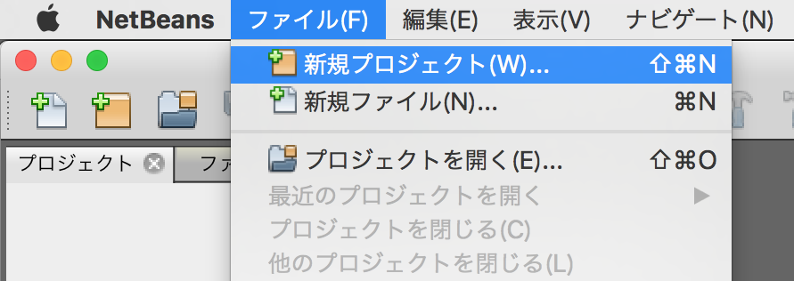

新規プロジェクト画面が表示されますので、一覧から「既存のソースを使用するC/C++プロジェクト」を選択し「次 >」をクリックします。

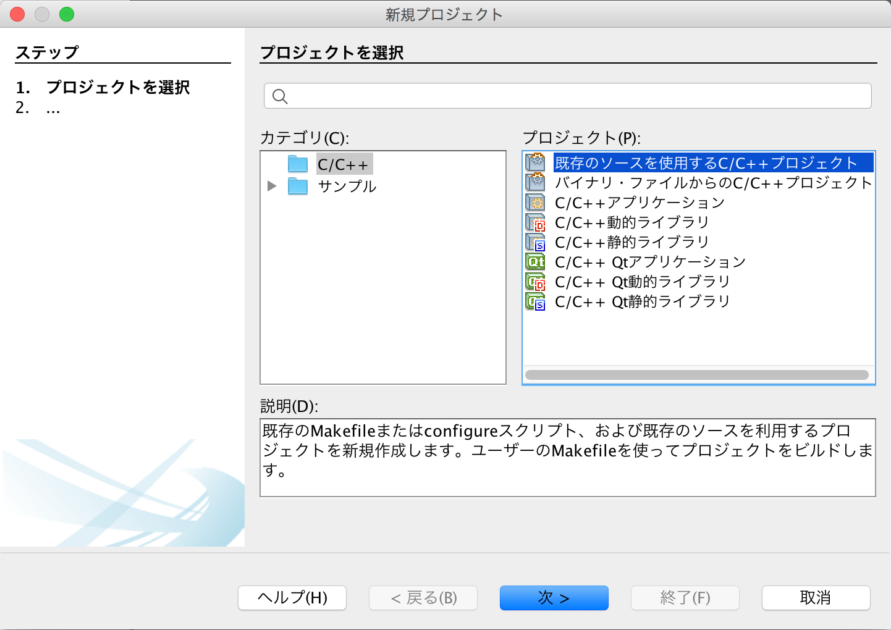

下図のような画面に遷移しますので、以下のように設定します。

- 既存のソースを含むフォルダを指定 - サンプルアプリが格納されているフォルダー「`examples/ble_peripheral/ble_app_hrs`」を指定します。<br>
下図の例では「`/Users/makmorit/opt/nRF5_SDK_15.2.0/examples/ble_peripheral/ble_app_hrs`」という文字列が設定されています。

- 構成モードを選択 - 「カスタム(C)」をチェックします。

設定が完了したら「次 >」をクリックします。

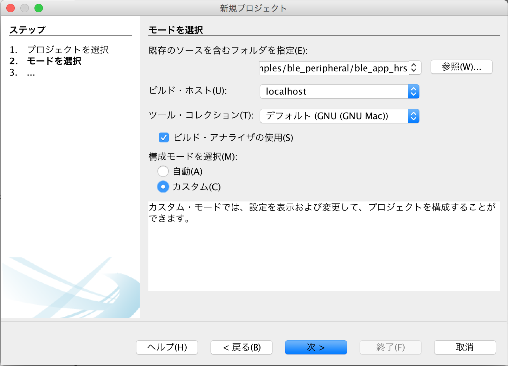

下図のような画面に遷移しますので、以下のように設定します。

- 「事前ビルド・ステップが必要」にチェック

- フォルダで実行(U) - サンプルアプリのサブフォルダー「`pca10056/s140/armgcc`」を指定します。<br>
下図の例では「`/Users/makmorit/opt/nRF5_SDK_15.2.0/examples/ble_peripheral/ble_app_hrs/pca10056/s140/armgcc`」という文字列が設定されています。

- 「カスタム・コマンド」にチェック

- コマンド(O) - 「make」と入力します。

設定が完了したら「次 >」をクリックします。

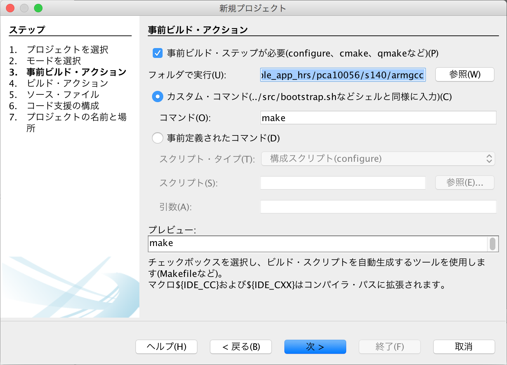

「4. ビルド・アクション」に遷移しますが、以降は「7. プロジェクトの名前と場所」に遷移するまではデフォルト設定のまま「次 >」をクリックします。

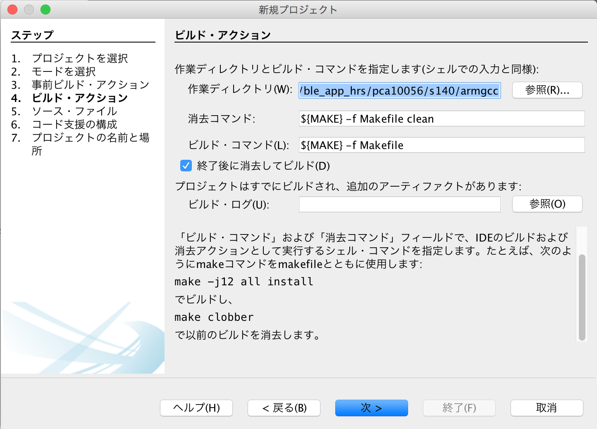

「7. プロジェクトの名前と場所」に遷移したら、プロジェクト名(P)を「ble_app_hrs」から「ble_app_hrs_test」に変更しておきます。<br>
（オリジナルのプロジェクト「ble_app_hrs」を上書きしたくないための措置です）

設定が完了したら「終了(F)」をクリックします。


自動的にビルドがスタートしますので、しばらくそのまま待ちます。


しばらくするとビルドが完了し「ビルド SUCCESSFUL」と表示されれば、ビルドは成功です。

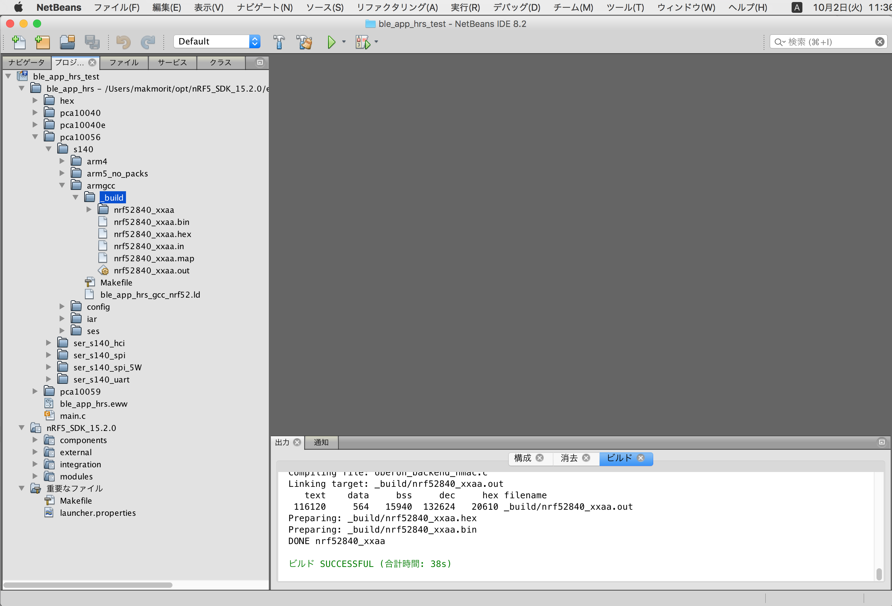

## nRF52840の動作確認

NetBeansでビルドしたサンプル・アプリケーションをnRF52840 DKにダウンロードして、正常に動作するかどうか確認を行います。

### プロジェクト・プロパティ変更

NetBeansを起動し、プロジェクト「ble_app_hrs_test」を右クリックして「プロパティ」を実行します。

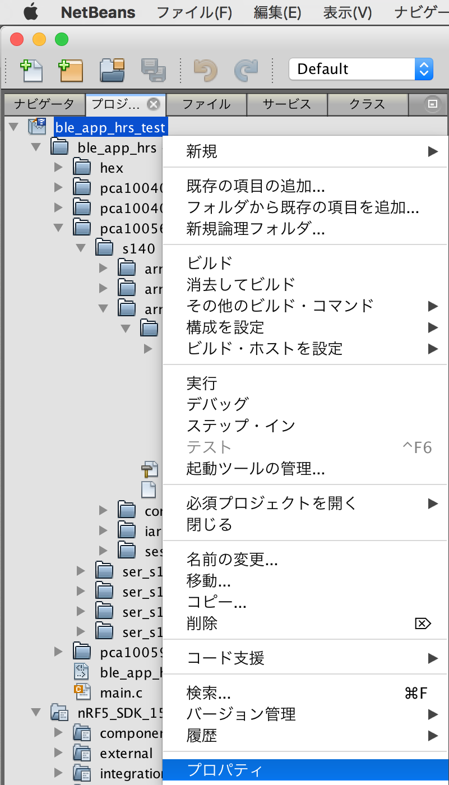

プロジェクト・プロパティ画面が表示されます。

左ペインの「ビルド」をクリックして、以下のように設定を変更します。

- ツール・コレクション - 「GNU_ARM」に変更します。

変更が完了したら「適用」をクリックします。

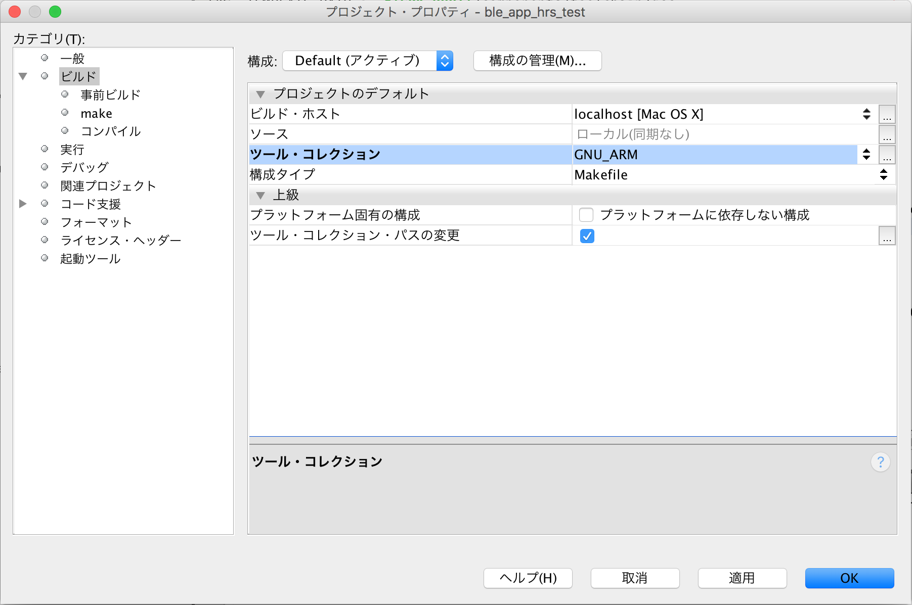

左ペインの「実行」をクリックしで、以下のように設定を変更します。

- コマンドの実行 - 「make erase flash_softdevice flash」に変更します。

- 実行ディレクトリ - 実行するMakefileが配置されているディレクトリーに変更します。<br>
下図の例では `/Users/makmorit/opt/nRF5_SDK_15.2.0/examples/ble_peripheral/ble_app_hrs_test/../ble_app_hrs/pca10056/s140/armgcc` という文字列が設定されています。

変更が完了したら「OK」をクリックして、いったんプロジェクト・プロパティ画面を閉じます。

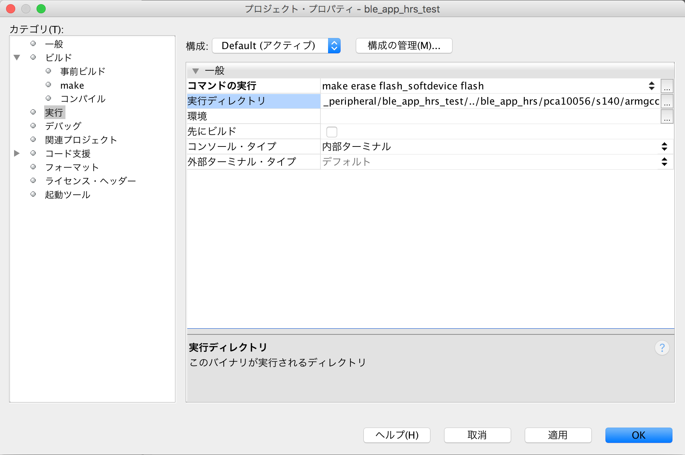

### ダウンロード

NetBeansの実行ボタンをクリックして「プロジェクト(ble_app_hrs_test)を実行」を実行します。

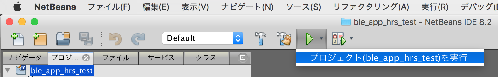

プログラムが自動的に書き込まれ、nRF52840 DK上でアプリケーションが実行されます。<br>
NetBeansの右下部のコンソールには「実行 FINISHED; 終了値0」と表示されます。

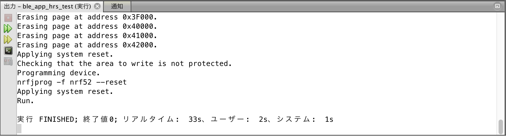

適宜、macOSのBLEを経由して接続します。<br>
以下は、LightBlueというソフトウェアを使用し、サンプルアプリ上で動作する「Device Information service」の「Manufacturer Name String」属性を参照しているところです。

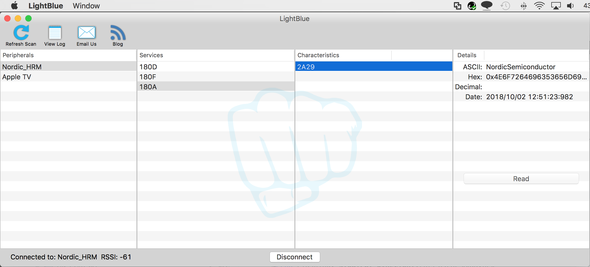

以上で、NetBeans開発環境構築は完了になります。
