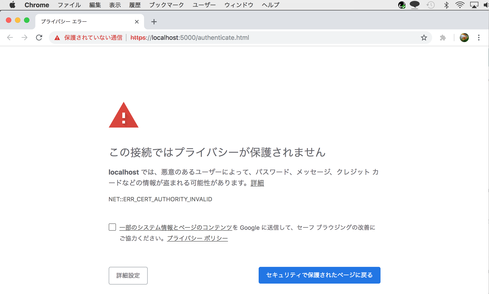
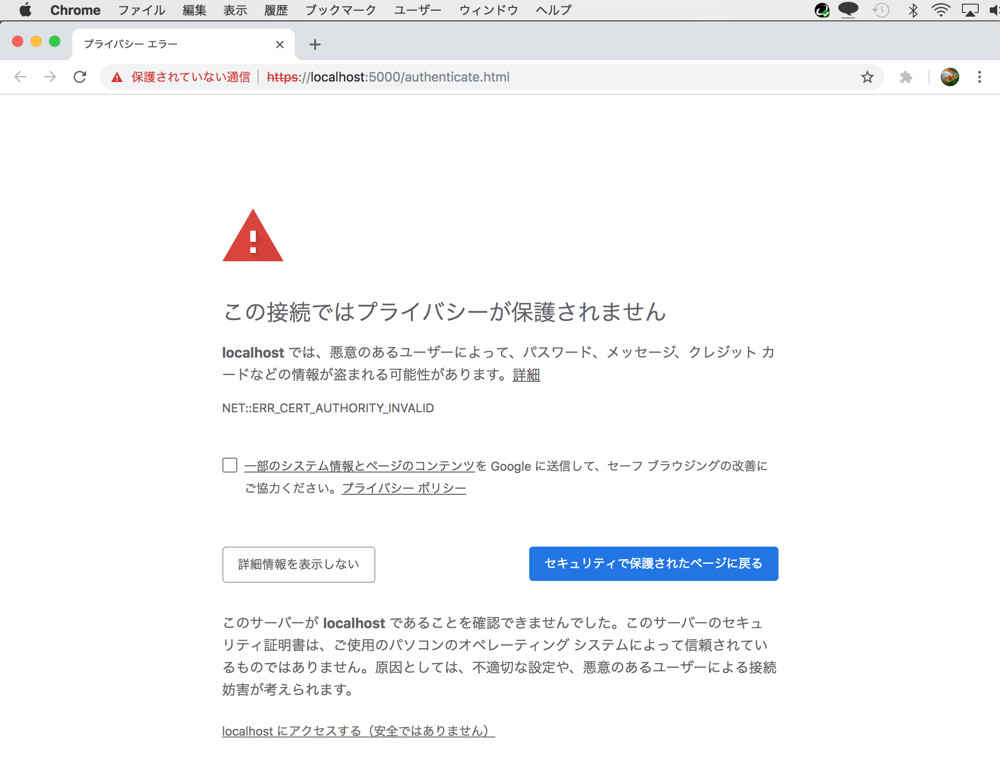
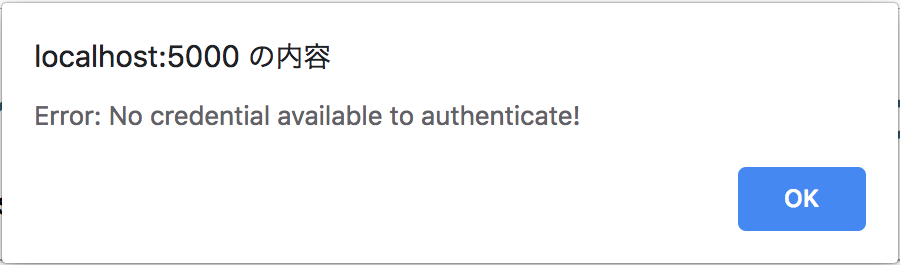
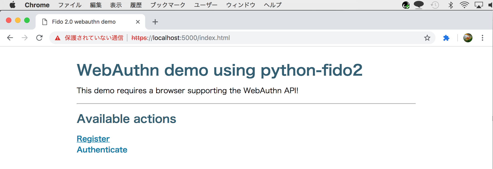
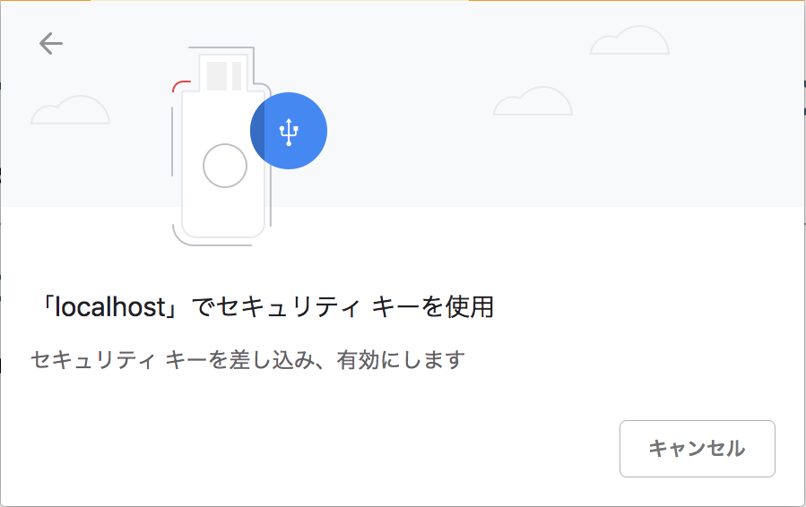
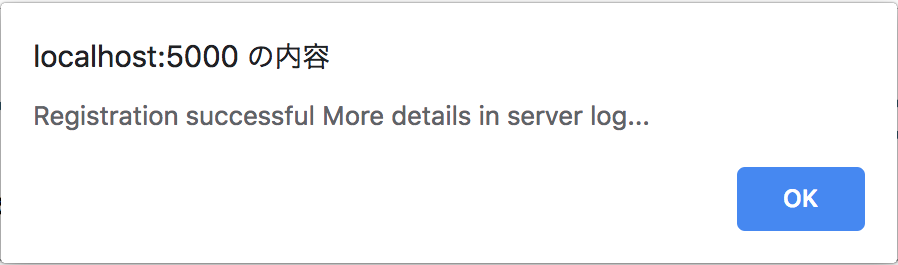
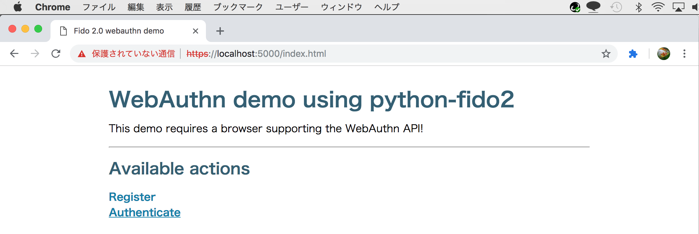
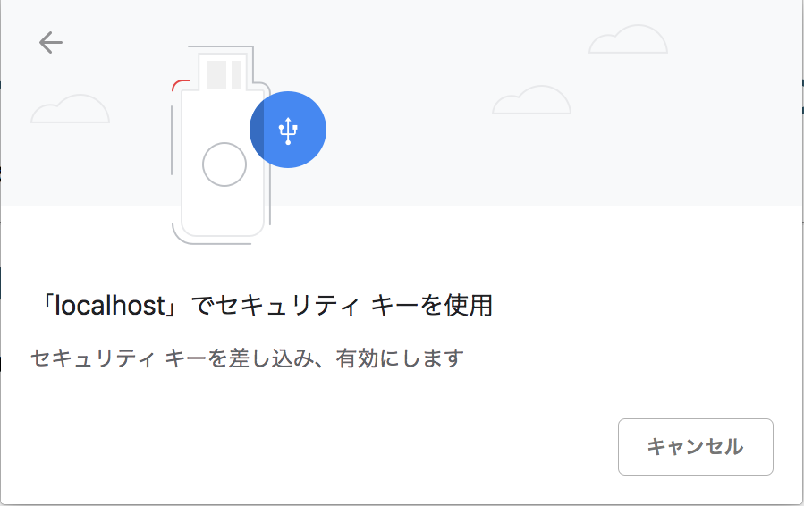
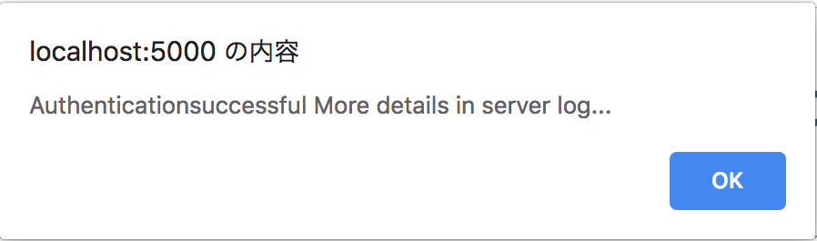

# WebAuthn確認手順

FIDO2ローカルテストサーバーとChromeブラウザー、FIDO 2.0認証器を使用し、WebAuthnの動作を確認する手順を掲載しております。

## FIDO2ローカルテストサーバーの始動／停止方法

### サーバーの始動

FIDO2ローカルテストサーバーが配置されているディレクトリー `<リポジトリールート>/onecard-fido/FIDO2DemoServer/python-fido2/examples/server` に移動します。

その後、コマンド `pipenv run server` でvirtualenvを起動し、FIDO2ローカルテストサーバーを始動させます。

```
MacBookPro-makmorit-jp:~ makmorit$ cd /Users/makmorit/GitHub/onecard-fido/FIDO2DemoServer/python-fido2/examples/server
MacBookPro-makmorit-jp:server makmorit$ pipenv run server

Example demo server to use a supported web browser to call the WebAuthn APIs
to register and use a credential.

See the file README.adoc in this directory for details.

Navigate to https://localhost:5000 in a supported web browser.

 * Serving Flask app "server" (lazy loading)
 * Environment: production
   WARNING: Do not use the development server in a production environment.
   Use a production WSGI server instead.
 * Debug mode: on
 * Running on https://127.0.0.1:5000/ (Press CTRL+C to quit)
 * Restarting with stat

Example demo server to use a supported web browser to call the WebAuthn APIs
to register and use a credential.

See the file README.adoc in this directory for details.

Navigate to https://localhost:5000 in a supported web browser.

 * Debugger is active!
 * Debugger PIN: 258-954-445
```

### サーバーの停止

`kill`コマンドでvirtualenvの親プロセスを停止させます。

プロセス番号の若いものが親プロセスになります。

```
MacBookPro-makmorit-jp:~ makmorit$ ps -ef | grep virtualenvs
  501 23715  4154   0  3:49PM ttys000    0:00.44 /Users/makmorit/.local/share/virtualenvs/server-PoQD-Aft/bin/python server.py
  501 23721 23715   0  3:49PM ttys000    0:06.36 /Users/makmorit/.local/share/virtualenvs/server-PoQD-Aft/bin/python server.py
  501 23852 23672   0  4:01PM ttys001    0:00.00 grep virtualenvs
MacBookPro-makmorit-jp:~ makmorit$ kill 23715
MacBookPro-makmorit-jp:~ makmorit$ ps -ef | grep virtualenvs
  501 23854 23672   0  4:01PM ttys001    0:00.00 grep virtualenvs
MacBookPro-makmorit-jp:~ makmorit$
```

## WebAuthnのテスト

### ホーム画面を表示

サーバーが始動している状態で、Chromeブラウザーを起動し、アドレス`https://localhost:5000`に移動します。<br>
信頼された証明書が導入されているサーバーではないため、下図のような警告が表示されます。



画面左下の「詳細設定」をクリックすると、下部に下図のようなメッセージが追加表示されます。



画面下部の「localhost にアクセスする（安全ではありません）」をクリックすると、下図のようなポップアップが表示されることがあります。<br>
この場合は「OK」をクリックします。




下図のようなホーム画面が表示されます。


### 登録（Register）

ホーム画面のリンク「Register」をクリックします。



下図のようなポップアップが表示されます。



ここで、FIDO 2.0認証器（Yubicoセキュリティキー）をPCに装着し、認証器のタッチパッドに触れます。


下図のようなポップアップが表示され、Register処理が成功します。




メッセージに従い、サーバーが稼働しているコンソールを参照すると、下記のようなログが表示され、Registerが成功したことが確認できます。
```
127.0.0.1 - - [12/Dec/2018 10:50:05] "GET /register.html HTTP/1.1" 200 -


{'publicKey': {'rp': {'id': 'localhost', 'name': 'Demo server'}, 'user': {'id': b'user_id', 'name': 'a_user', 'displayName': 'A. User', 'icon': 'https://example.com/image.png'}, 'challenge': b"v\xa2p<\r\x89b\x91\x1a\x11&}_w\xdd\x03\x88\xc3d\xc4\x18ET\x1c\x04C'\x9d\x81\t\xd2\xf1", 'pubKeyCredParams': [{'type': 'public-key', 'alg': -7}], 'excludeCredentials': [], 'timeout': 30000, 'attestation': <ATTESTATION.NONE: 'none'>, 'authenticatorSelection': {'requireResidentKey': False, 'userVerification': <USER_VERIFICATION.PREFERRED: 'preferred'>}}}


127.0.0.1 - - [12/Dec/2018 10:50:05] "POST /api/register/begin HTTP/1.1" 200 -
clientData {"challenge":"dqJwPA2JYpEaESZ9X3fdA4jDZMQYRVQcBEMnnYEJ0vE","origin":"https://localhost:5000","type":"webauthn.create"}
AttestationObject: AttestationObject(fmt: 'none', auth_data: AuthenticatorData(rp_id_hash: h'49960de5880e8c687434170f6476605b8fe4aeb9a28632c7995cf3ba831d9763', flags: 0x41, counter: 2, credential_data: AttestedCredentialData(aaguid: h'00000000000000000000000000000000', credential_id: h'08cc96cd49e2ae9854a1986c90e3c571774b4970a1f1e5bd59cd52ca983c4e30b060feae5d31c7293049acc26adcda01a60255875a5f94dd566959e4e9bee2d5', public_key: {1: 2, 3: -7, -1: 1, -2: b'j\x13\x8b\x81\xdev\xc4\xf0\x1d>\xcf\xd3\xebk\x16\x891y\x9d\x0f\xa9\xa5U\x7fK\xb7\xa9\xbcY\xa9\xe0\x87', -3: b"\xbe\xd9\xecg\xeb]\x01\x19\xdd;\xe3OW6\xc3\xa4\xdb\x1c=\x1b'\x96SZ\xba\x1a\xfbjW\xf3\x9b\xa3"}), att_statement: {})
REGISTERED CREDENTIAL: AttestedCredentialData(aaguid: h'00000000000000000000000000000000', credential_id: h'08cc96cd49e2ae9854a1986c90e3c571774b4970a1f1e5bd59cd52ca983c4e30b060feae5d31c7293049acc26adcda01a60255875a5f94dd566959e4e9bee2d5', public_key: {1: 2, 3: -7, -1: 1, -2: b'j\x13\x8b\x81\xdev\xc4\xf0\x1d>\xcf\xd3\xebk\x16\x891y\x9d\x0f\xa9\xa5U\x7fK\xb7\xa9\xbcY\xa9\xe0\x87', -3: b"\xbe\xd9\xecg\xeb]\x01\x19\xdd;\xe3OW6\xc3\xa4\xdb\x1c=\x1b'\x96SZ\xba\x1a\xfbjW\xf3\x9b\xa3"}
127.0.0.1 - - [12/Dec/2018 10:50:09] "POST /api/register/complete HTTP/1.1" 200 -
127.0.0.1 - - [12/Dec/2018 10:50:14] "GET /index.html HTTP/1.1" 200 -
```

### ログイン（Authenticate)

ホーム画面のリンク「Authenticate」をクリックします。



下図のようなポップアップが表示されます。



ここで、FIDO 2.0認証器（Yubicoセキュリティキー）をPCに装着し、認証器のタッチパッドに触れます。


下図のようなポップアップが表示され、Authenticate処理が成功します。



メッセージに従い、サーバーが稼働しているコンソールを参照すると、下記のようなログが表示され、Authenticateが成功したことが確認できます。

```
127.0.0.1 - - [12/Dec/2018 11:14:30] "GET /authenticate.html HTTP/1.1" 200 -
127.0.0.1 - - [12/Dec/2018 11:14:30] "POST /api/authenticate/begin HTTP/1.1" 200 -
clientData {"challenge":"xb_aSD20CA4Zde71-XtiAwJW12K9aROnwRnxvfJvhaY","origin":"https://localhost:5000","type":"webauthn.get"}
AuthenticatorData AuthenticatorData(rp_id_hash: h'49960de5880e8c687434170f6476605b8fe4aeb9a28632c7995cf3ba831d9763', flags: 0x01, counter: 3)
ASSERTION OK
127.0.0.1 - - [12/Dec/2018 11:14:36] "POST /api/authenticate/complete HTTP/1.1" 200 -
127.0.0.1 - - [12/Dec/2018 11:14:44] "GET /index.html HTTP/1.1" 200 -
```
