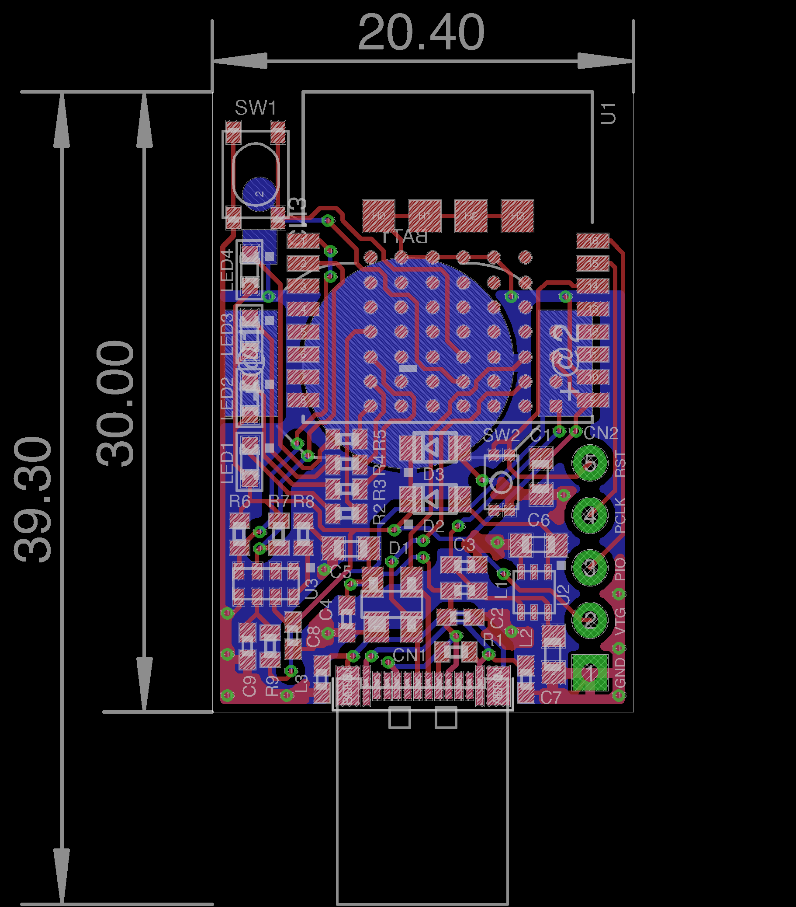

# BT40 Dongle（rev1）

最新更新日：2022/5/28

## 概要

日本国内の技適取得済みであるnRF5340搭載モジュール「BT40」を使用し、Fanstel社の評価基板「[EV-BT40](https://www.mouser.jp/ProductDetail/Fanstel/EV-BT40?qs=zW32dvEIR3sMMGv%2FNMlB9A%3D%3D)」を簡略する仕様で開発・製作中の、小型USBドングル基板です。

#### 特色
- 外形寸法＝3.9cm x 2cm（基板外形は 3cm x 2cm）
- FIDO2機能（WebAuthn）をサポート
- FIDO2機能はUSB HID／BLEの両トランスポートをサポート
- 署名検証機能付きBLEブートローダーを採用し、不正ファームウェアの書込みを抑止
- PIVカード／OpenPGPカードのエミュレーション機能を搭載
- USB給電／ボタン電池の２電源方式
- リアルタイムクロックモジュールを搭載

### [BT40 Dongle回路図](../../FIDO2Device/BT40Dongle/pcb_rev1/SECDONGL_001.pdf)

Fanstel社の評価基板「[EV-BT40](https://www.mouser.jp/ProductDetail/Fanstel/EV-BT40?qs=zW32dvEIR3sMMGv%2FNMlB9A%3D%3D)」をベースとし、電池電源、リアルタイムクロックモジュールの増設と、回路簡略化・配線変更を行っております。

### [nRF5340アプリケーション](../../nRF5340_app/README.md)

BT40 Dongleで使用するファームウェアです。

### [ファームウェア更新手順](../../MaintenanceTool/macOSApp/UPDATEFW_BLE.md)

BT40 Dongleのファームウェアを、[FIDO認証器管理ツール（macOS版）](../../MaintenanceTool/macOSApp)により更新する手順について説明しています。
