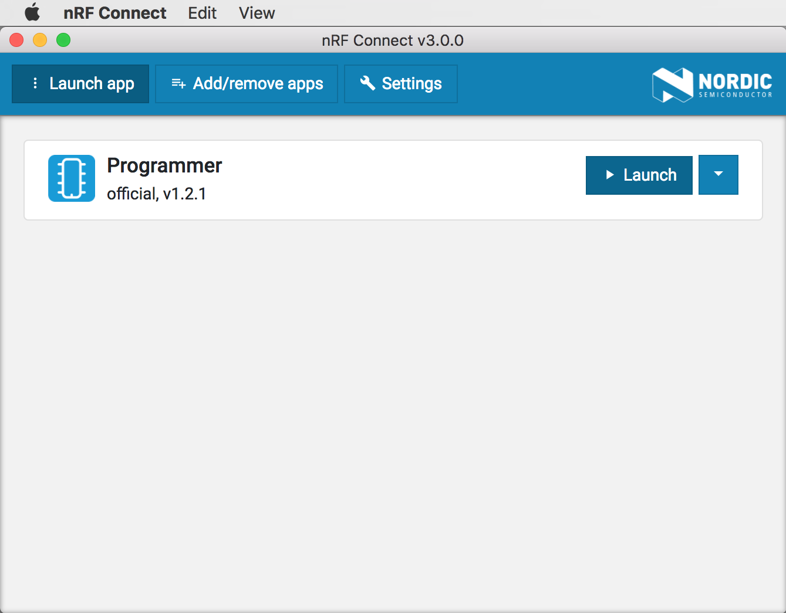
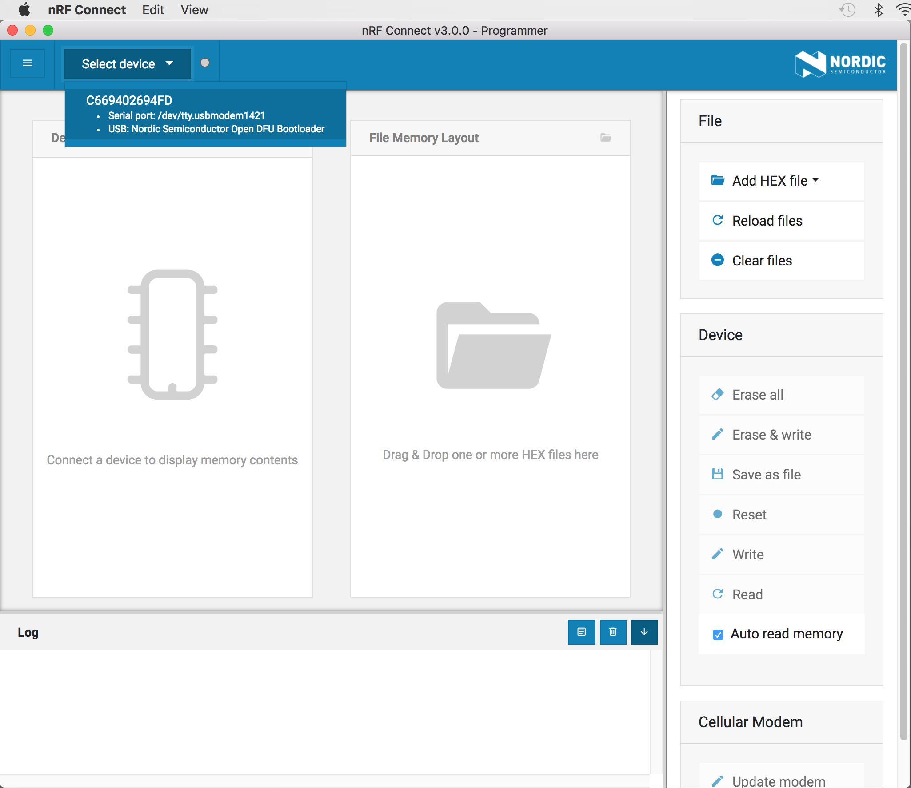
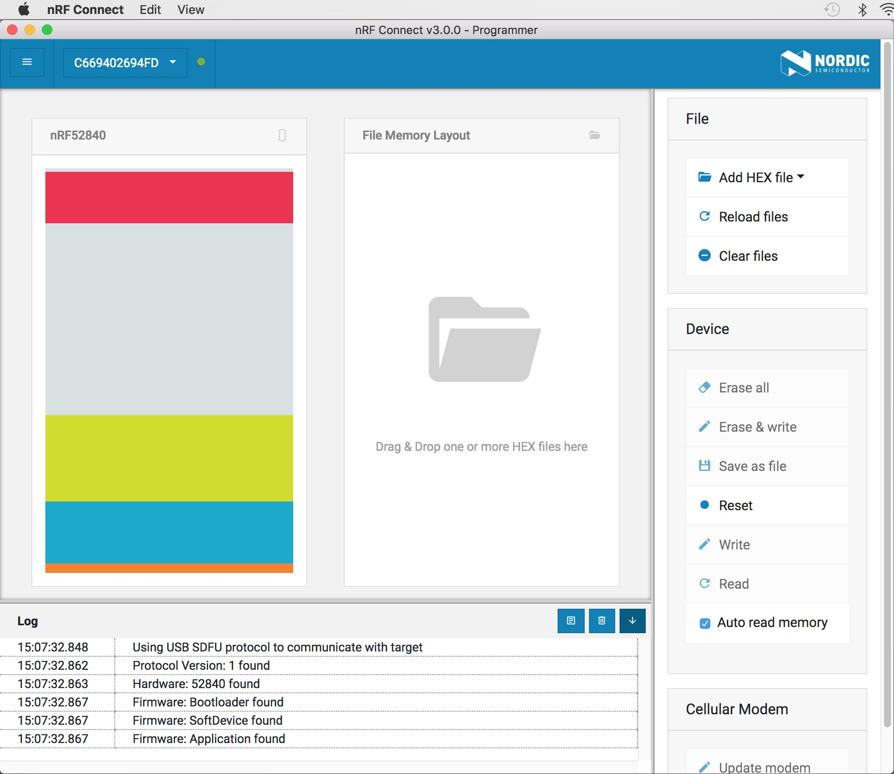
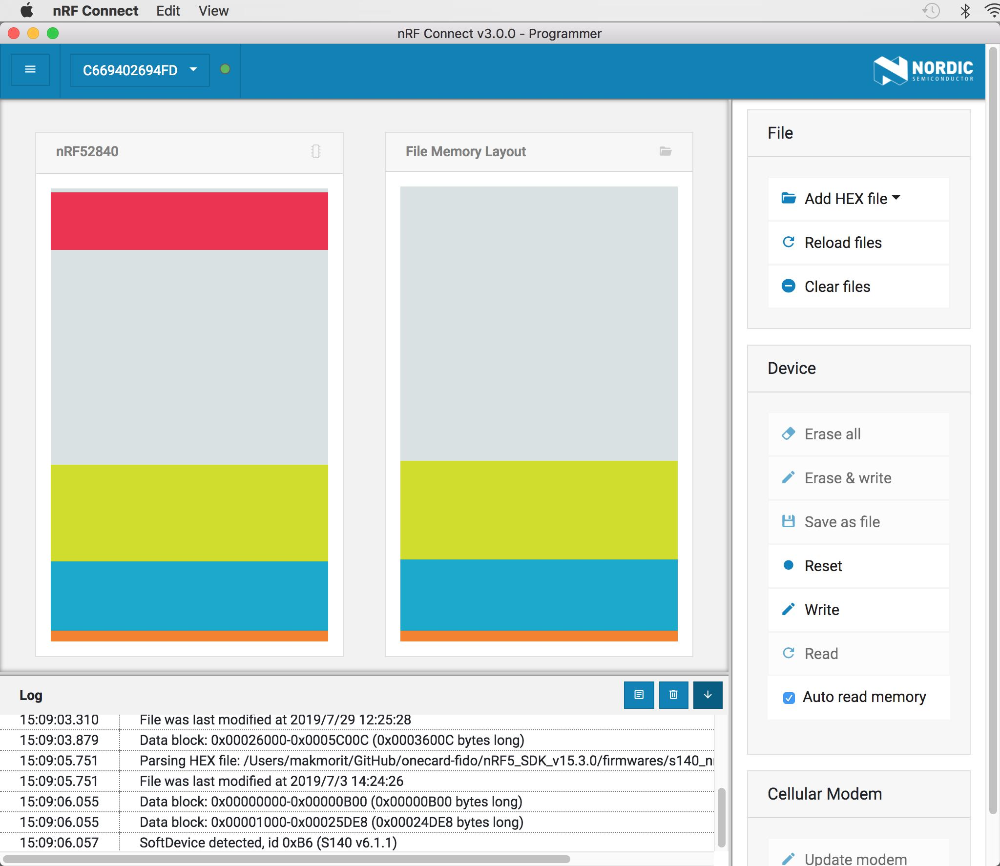
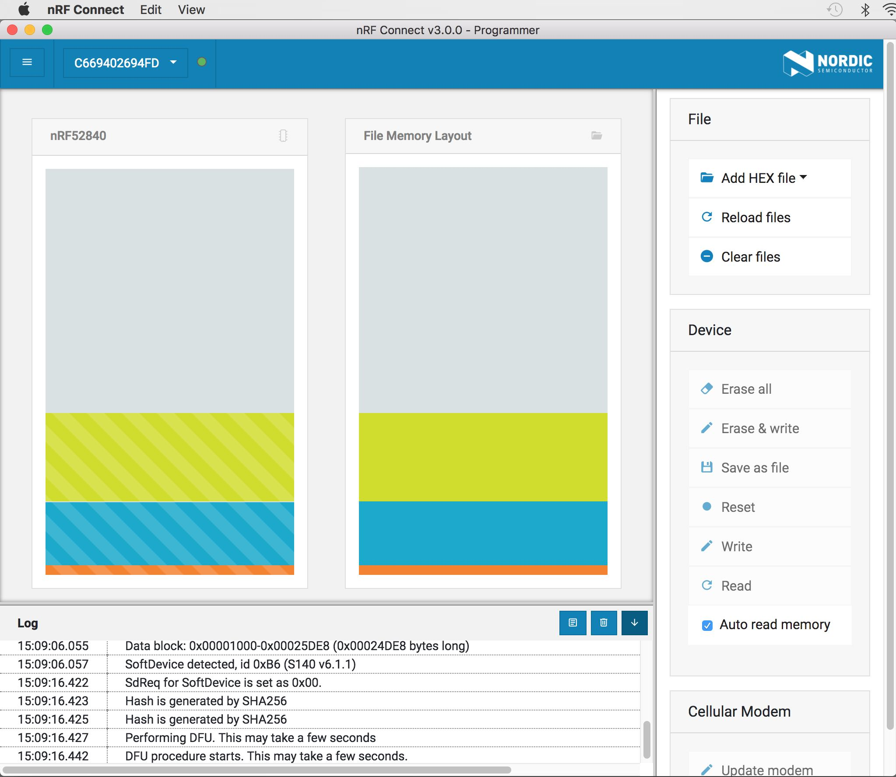
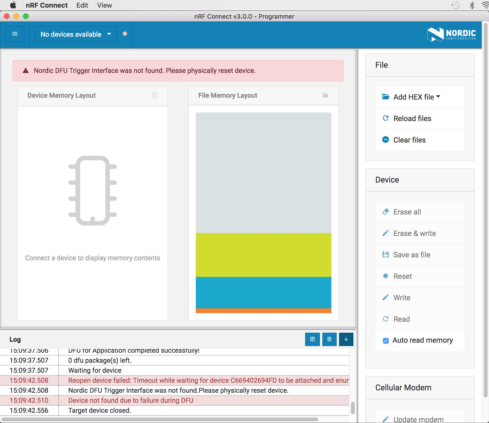

# アプリケーション書込み手順

MDBT50Q Dongleには、USBポート経由でアプリケーションの書込みができるよう、あらかじめ[USBブートローダー](USBBOOTLOADER.md)が書き込まれています。

このUSBブートローダーを使用し、[FIDO2認証器アプリケーション](https://github.com/diverta/onecard-fido/tree/master/nRF5_SDK_v15.3.0)をMDBT50Q Dongleに書き込む手順を掲載します。

### nRF Connect起動

MDBT50Q DongleをPCのUSBポートに装着後、リセットボタン（下図ご参照）を１回プッシュします。

基板上のLEDが赤色で緩く点滅するのを確認します。

あらかじめPCに導入済みのツール「nRF Connect」を起動します。 
（「nRF Connect」導入については、手順書「[nRF52840 Dongleプログラミング手順](https://github.com/diverta/onecard-fido/blob/master/Development/nRF52840/NRFCONNECTINST.md)」ご参照）

### 書込み準備

nRF Connectを起動します。 
画面上部の「Launch app」ボタンをクリックすると、Programmerという項目が表示されます。 
右横の「Launch」ボタンをクリックします。

プログラミングツールが起動します。 
画面左上の「Select device」ボタンをクリックし、プルダウンリストのデバイスを選択します。

下図のように、メモリーマップが画面左側に表示されます。

※上図の例は、すでにアプリケーションがMDBT50Q Dongleに書き込まれている状態です。 
アプリケーションが書き込まれていない状態ですと、メモリーマップの青色・緑色部分が表示されません。

### 書込み実行

以下のプログラム（.hexファイル）を、画面の中央部にドラッグ＆ドロップして、書込みプログラムを指定します。

- 格納フォルダー: `${HOME}/GitHub/onecard-fido/nRF5_SDK_v15.3.0/firmwares/
- ソフトデバイス: `s140_nrf52_6.1.1_softdevice.hex`
- アプリケーション: `nrf52840_xxaa.hex`

下図は、ソフトデバイス、アプリケーションの.hexファイルをドラッグ＆ドロップした後のイメージになります。

画面右下の「Write」ボタンをクリックすると、プログラムの書込み（ダウンロード）がスタートします。

プログラム書込みが終了すると、下図のようなメッセージが表示されます。 
これはnRF52840 Dongleがブートローダーモードではなく、アプリケーションが実行中になっているためのものですので、異常ではありません。

適宜、nRF Connectを終了させてください。

以上で、MDBT50Q Dongleへのアプリケーション書込みは完了になります。
