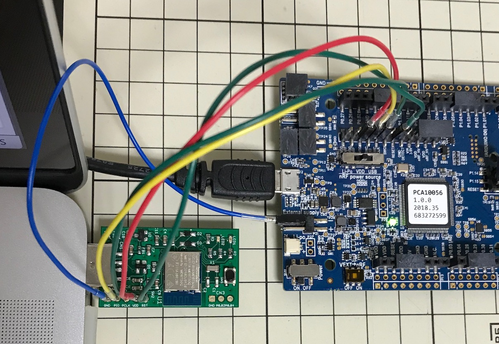
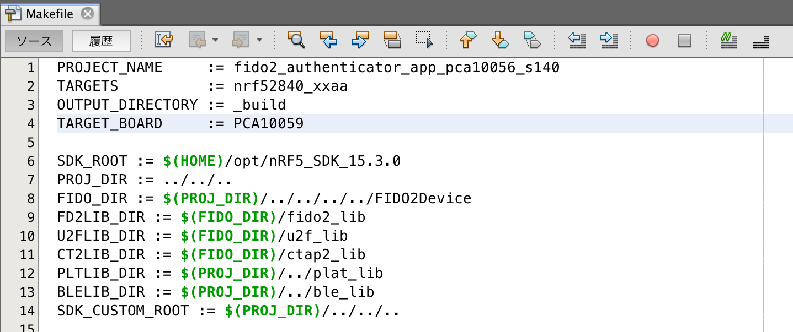
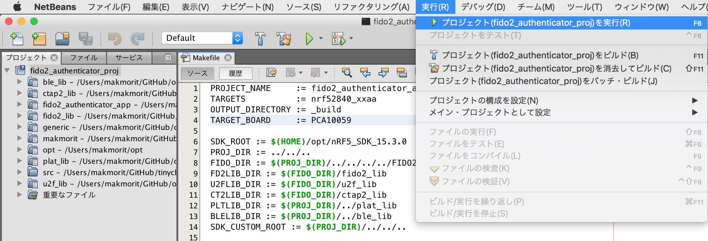
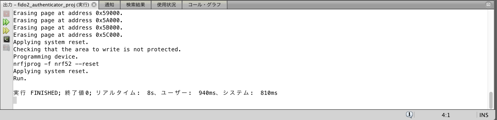
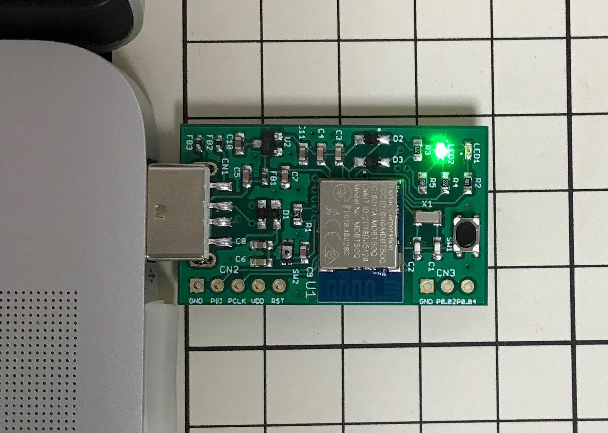

# アプリケーション書込み手順

nRF52840 DKに同梱されているJ-LinkのSWDインターフェースを使用して、MDBT50Q Dongleにアプリケーションを書き込む手順を掲載いたします。

## 書込み準備

### 動作確認時の環境

- macOS Sierra（10.12.6）
- nRF52840 DK（PCA10056）: プログラムの書込みに使用
- MDBT50Q Dongle（nRF52840）: プログラムの書込み先となるターゲット基板

### ハードウェアの準備

MDBT50Q DongleをPCのUSBポートに装着後、nRF52840 DKと接続します。 
接続するピンの対応関係は以下の通りです。

|ピンの名前 |MDBT50Q Dongle | | nRF52840 DK|
|:--|:-:|:-:|:-:|
|0V |GND  | <-->  |GND|
|SWD IO |PIO  | <-->  |SWDIO|
|SWD Clock |PCLK  | <--  |SWDCLK|
|SWD IO Level |VDD  | -->  |VTG|
|SWD Reset |RST  | <--  |RESET|

[注1] nRF52840 DK上の「P20」というコネクター（オスピン）に接続します。 
[注2] MDBT50Q Dongleの回路図はこちら（[FIDO2AUTH_001.pdf](https://github.com/diverta/onecard-fido/blob/master/FIDO2Device/pcb/FIDO2AUTH_001.pdf)）になります。

下図は実際に両者を接続した時のイメージになります。

### ファームウェアの準備

NetBeansを立ち上げ、プロジェクト「[fido2_authenticator_proj](https://github.com/diverta/onecard-fido/tree/master/nRF5_SDK_v15.3.0/examples/diverta)」を開きます。 
（NetBeansにつきましては、手順書「[NetBeansインストール手順](../../nRF5_SDK_v15.3.0/NETBEANSINST.md)」をご参照願います。）

Makefileを参照し、４行目が`TARGET_BOARD     := PCA10059`となっていることを<u><b>必ず確認してください</b></u>。

## 書込み実行

NetBeansのメニュー「プロジェクト(fido2_authenticator_proj)を実行」を実行します。

ビルドが実施されていない場合はビルド（コンパイル、リンク）が実行され、続いて書き込みが実行されます。 
書き込みが完了すると、「実行 FINISHED; 終了値0;」などと表示されます。

MDBT50Q Dongleが自動的にリセットされ、アプリケーションがスタートします。 
アイドル時であることを表示する緑色のLEDが点滅していることを確認します。

緑色LEDの点滅確認が終わったら、適宜、NetBeansを終了させてください。

以上で、MDBT50Q Dongleへのアプリケーション書込みは完了になります。
