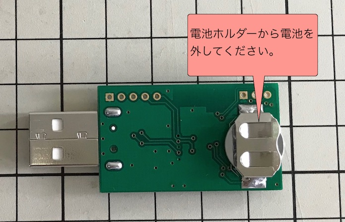
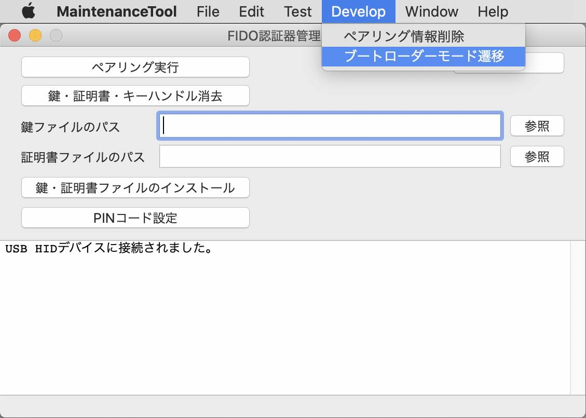

# アプリケーション書込み手順

MDBT50Q Dongleにプレインストールされている[簡易USBブートローダー](../../nRF5_SDK_v15.3.0/examples/dfu/README.md)を使用して、MDBT50Q Dongleに[FIDO2認証器アプリケーション](../../nRF5_SDK_v15.3.0/README.md)を書き込む手順を掲載いたします。

## 書込み準備

### ハードウェアの準備

まず最初に、MDBT50Q Dongleの背面にあるボタン電池ケースに、<b>電池が入っていないこと</b>を必ず確認します。

MDBT50Q DongleをPCのUSBポートに装着し、基板上のスイッチ「SW2」を１回プッシュします。

基板上のLED2（赤色）が緩く点滅し始め、USBブートローダーモード（USBポート経由でアプリケーション書込が可能なモード）に遷移します。

### ファームウェアの準備

ファームウェアは、すでにビルド済みの`.hex`ファイルが、GitHubリポジトリーの以下の場所に格納されています。
- ディレクトリー: [/nRF5_SDK_v15.3.0/firmwares/](../../../nRF5_SDK_v15.3.0/firmwares)
- アプリケーション: [nrf52840_xxaa.hex](../../nRF5_SDK_v15.3.0/firmwares/nrf52840_xxaa.hex)
- ソフトデバイス: [s140_nrf52_6.1.1_softdevice.hex](../../nRF5_SDK_v15.3.0/firmwares/s140_nrf52_6.1.1_softdevice.hex)

### 書込み用ツールの準備

書込み用ツール「nRF Connect for Desktop」を、あらかじめPCに導入しておきます。 
詳細につきましては、手順書[「nRF Connect for Desktop導入手順」](../../nRF5_SDK_v15.3.0/NRFCONNECTINST.md)をご参照ください。

## アプリケーションの書込み

### 書込み準備

nRF Connectを起動します。 
画面上部の「Launch app」ボタンをクリックすると、Programmerという項目が表示されます。 
右横の「Launch」ボタンをクリックします。

プログラミングツールが起動します。 
右側の「File Memory Layout」欄がブランクになっていることを確認します。

ブランクになっていない場合は、右側の「Clear Files」というリンクをクリックして「File Memory Layout」欄をブランクにしてください。

「File Memory Layout」欄に、先述の`.hex`ファイル２点をドラッグ＆ドロップします。 
かならず、[s140_nrf52_6.1.1_softdevice.hex](../../nRF5_SDK_v15.3.0/firmwares/s140_nrf52_6.1.1_softdevice.hex) --> [nrf52840_xxaa.hex](../../nRF5_SDK_v15.3.0/firmwares/nrf52840_xxaa.hex)の順でドラッグ＆ドロップしてください。

２点のファイルが、「File Memory Layout」欄に、下図のように配置されることを確認します。

画面左上部の「Select device」プルダウンをクリックして、シリアルポート（下図例では`/dev/tty.usbmodem1421`）を選択します。

しばらくすると、左側の「nRF52840」欄に、MDBT50Q Dongle側のメモリーイメージが表示されます。

これで書き込み準備は完了です。

### 書込み実行

画面右下部にある<b>「Write」</b>のリンクをクリックし、書込みをスタートさせます。 
下図のように「nRF52840」欄に斜めの縞模様が表示され、書込処理が進みます。

しばらくすると、下図のように画面下部のメッセージ欄が赤く変化し、自動的にMDBT50Q Dongleから切断されます。 
画面の「Quit」を実行して、nRF Connectを終了させます。

書込処理が終了すると、MDBT50Q Dongleが自動的にリセットされ、アプリケーションがスタートします。 
アイドル時であることを表示する緑色のLEDが点滅していることを確認します。

以上で、MDBT50Q Dongleへのアプリケーション書込みは完了になります。
