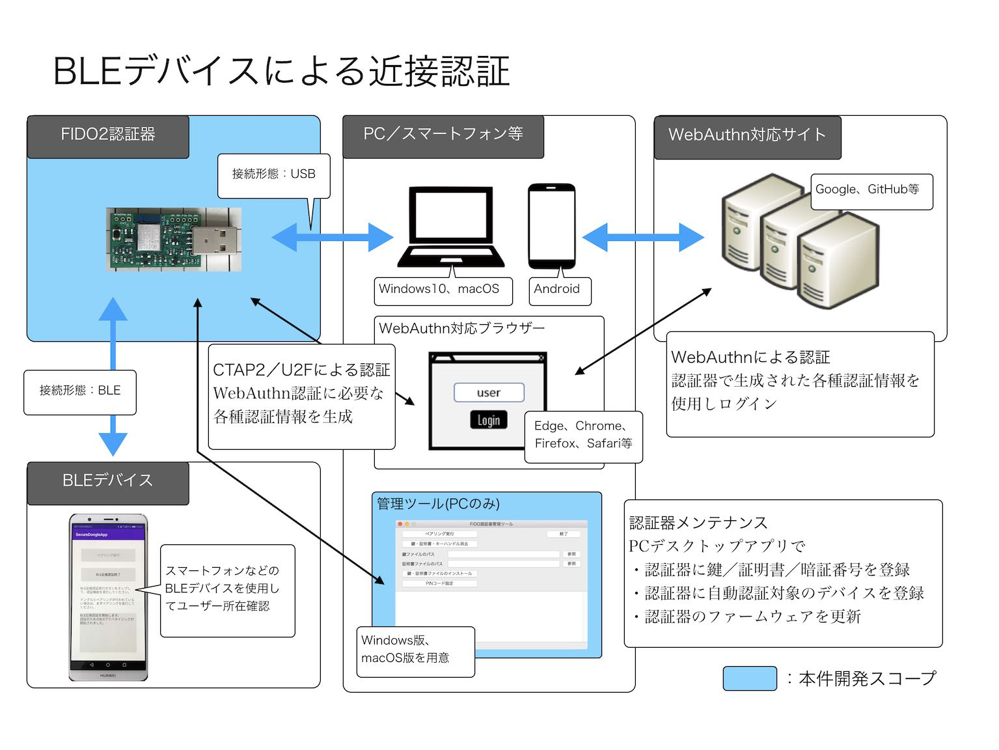
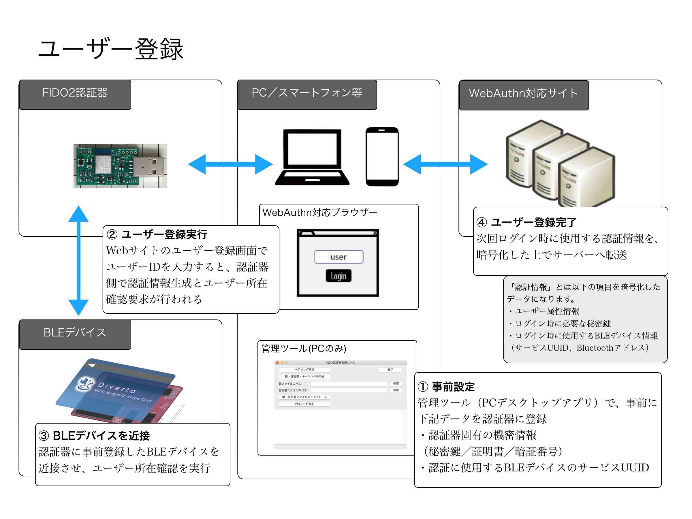
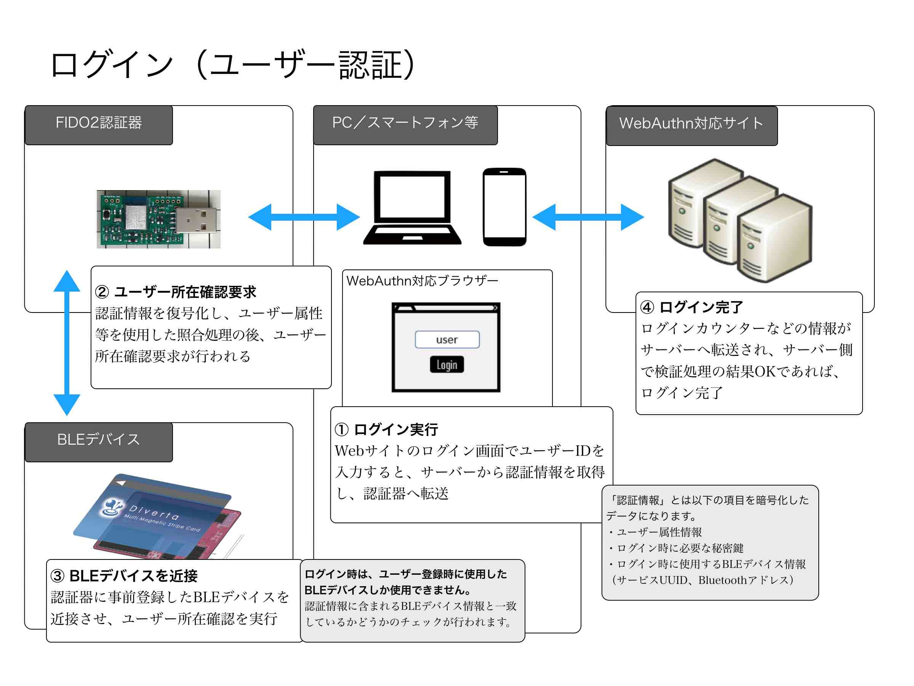

# BLEデバイスによる自動認証機能

## 概要

FIDO認証（WebAuthn）実行時、MDBT50Q Dongle上のボタンを押す代わりに、One CardなどのBLEデバイスを近づけることにより、認証処理を自動的に続行させる機能です。

### 事前設定

この機能を実行させる前に、事前にMDBT50Q Dongleに対し、以下の設定を行う必要があります。

- <b>スキャン対象サービスUUID</b> 
自動認証させたいBLEデバイスが持つサービスUUID（スキャン対象サービスUUID）を設定します。

- <b>スキャン秒数</b> 
スキャン対象サービスUUIDをもつBLEデバイスをスキャンする秒数を設定します。

### 制約事項

- <b>ビーコン等は使用不可</b> 
何らかのサービスUUIDを持つ、BLEペリフェラルデバイスのみが、この機能を利用できます。 
BLEビーコンなど、サービスUUIDを持たないBLEデバイスは利用できません。

- <b>ユーザー所在確認ボタンは使用不可</b> 
このBLEデバイスによる自動認証機能が実行中は、成り代わり防止の観点から、ボタン押下を検知しない実装としています。 
したがって、MDBT50Q Dongle上のボタン（ユーザー所在確認ボタン）は利用できません。

## 動作方法

### 自動認証パラメーターの設定

自動認証パラメーター（自動認証で使用するBLEデバイスのサービスUUIDや、そのスキャン秒数）を、事前にMDBT50Q Dongleに設定してください。 
設定は、管理ツールのツール設定画面上で行います。（下図はmacOS版管理ツール）

手順につきましては、下記の環境別手順書をご参照願います。 
- [macOS版管理ツールを使用した自動認証パラメーター設定手順](../../MaintenanceTool/macOSApp/BLEAUTHPARAM.md)
- [Windows版管理ツールを使用した自動認証パラメーター設定手順](../../MaintenanceTool/WindowsExe/BLEAUTHPARAM.md)

### 認証の実行

あらかじめ、One CardなどのBLEデバイスに電源を入れ（もしくはスリープ中であればボタンを押下してスリープ解除し）ておきます。

その後、以下の手順で、FIDO認証（WebAuthn）を実行します。
- 「[Edgeブラウザーを使用したWebAuthnテスト手順](WEBAUTHNTEST.md)」
- 「[Googleアカウントのログイン確認手順（PC）](PCCHROME.md)」

手順書では、ボタンを押すよう指示していますが、自動認証機能が稼働している場合は<b>「ボタンを押す」という操作が省略できます。</b>

## 開発情報（ご参考）

- <b>[BLEデバイスによる自動認証機能について](BLEDAUTHFUNC.md)</b> 
プログラム実装に関する情報を掲載しています。
