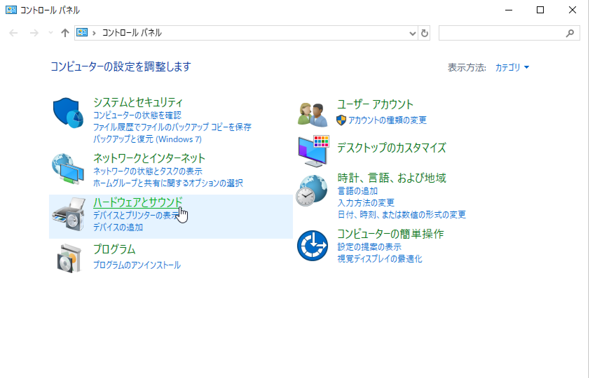
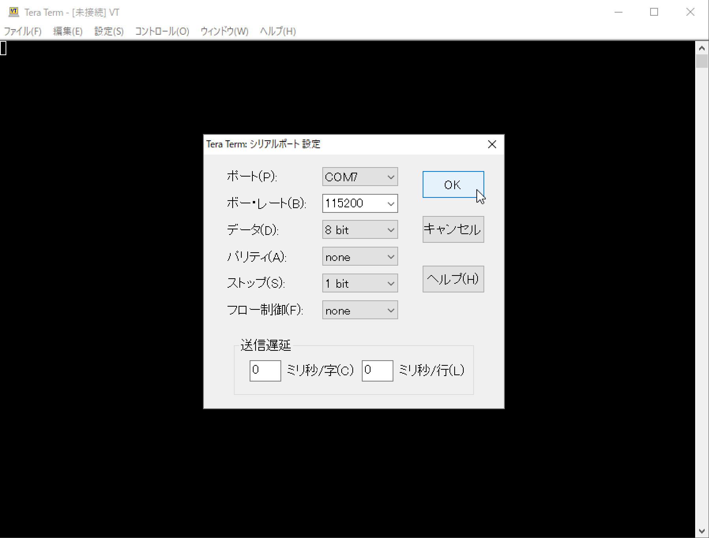
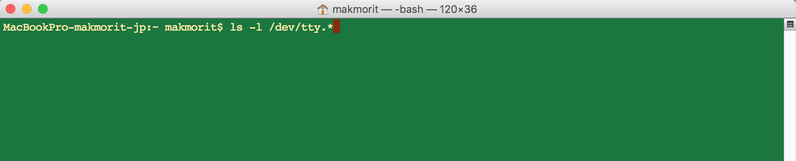
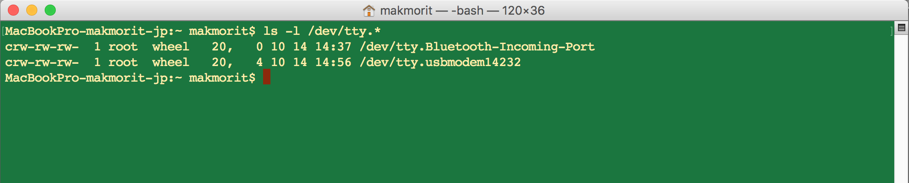
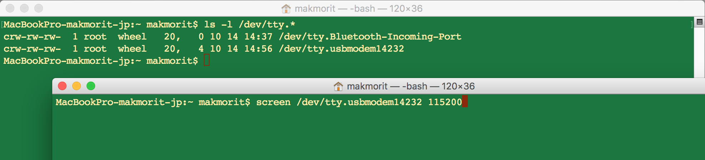
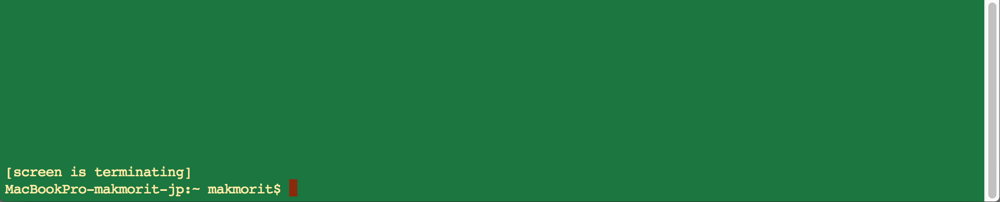

# 仮想COMポートへの接続手順

MDBT50Q DongleをPCのUSBポートに接続した時に有効となる、仮想COMポートへの接続手順を掲載します。

## 接続手順（Windows）

Windows10 PC環境での手順を記載いたします。

### 仮想COMポート番号の確認

MDBT50Q DongleをPCのUSBポートに装着します。 
装着時、MDBT50Q Dongleは、仮想COMポートとして認識されます。

Windowsのコントロールパネルを使用し、以下の手順で、仮想COMポート番号を確認します。

まずはコントロールパネルを起動し「ハードウェアとサウンド」をクリックします。

「デバイスとプリンター」をクリックします。

「未指定」の欄に「FIDO authenticator」と表示されているアイコンをダブルクリックします。

下図のようなプロパティ画面が表示されるので、タブ「ハードウェア」にある「USBシリアルデバイス」を参照し、ポート番号を確認します。 
下図の例では、ポート番号が「COM7」であることが確認できます。

### 仮想COMポートに接続

ターミナルアプリ「Tera Term」を使用し、仮想COMポートに接続します。

「Tera Term」を起動し、メニューから「設定 --> シリアルポート」を実行します。

設定画面で、先ほど確認したポート番号を指定します。 
下図例では「COM7」を指定しています。

その他の設定は下図の通りになります。 
「OK」をクリックして、設定画面を閉じます。

Tera Termの左上部に、ポート番号が表示されます。

適宜文字を入力して、画面に入力内容が表示（エコーバック）されるか確認してください。 
下図例では「qwerty[ENTER]」と入力した例になります。

これで仮想COMポートへの接続は完了です。

## 接続手順（macOS）

macOS PC環境での手順を記載いたします。

### 仮想COMポート番号の確認

MDBT50Q DongleをPCのUSBポートに装着します。 
装着時、MDBT50Q Dongleは、仮想COMポートとして認識されます。

macOSのターミナルアプリを使用し、以下の手順で、仮想COMポート番号を確認します。

ターミナルアプリを起動し、コマンド「`ls -l /dev/tty.*`」を実行します。

ターミナルアプリの画面に「`tty.usbmodemXXXX`」と記された仮想COMポートが表示されます。
下図の例では、仮想COMポート名が「`tty.usbmodem14232`」であることが確認できます。

### 仮想COMポートに接続

ターミナルアプリを使用し、仮想COMポートに接続します。 
コマンド「`screen /dev/tty.usbmodemXXXX 115200`」を実行します。

ターミナルアプリ画面の上部に、前述の実行コマンドが表示されます。

適宜文字を入力して、画面に入力内容が表示（エコーバック）されるか確認してください。 
下図例では「qwerty[ENTER]」と入力した例になります。

これで仮想COMポートへの接続は完了です。

### 仮想COMポートから切断

macOSの場合、ターミナルアプリを終了させただけでは、仮想COMポートの接続が切断されません。 
下記の手順で、切断するようお願いいたします。

仮想COMポートと接続されているターミナルアプリ画面を最上面に表示させたのち、まず[control]キーを押し、指を離さないまま [a]キーと [k]キーを同時に押します。 
下図のように、画面下部に「Really kill this window [y/n]」というメッセージが表示されます。

ここで、メッセージの通り [y]キーを押します。 
下図のように、画面下部に「[screen is terminating]」というメッセージが表示された後、仮想COMポートから切断され、コマンドプロンプトに制御が戻ります。

これで仮想COMポートからの切断は完了です。
