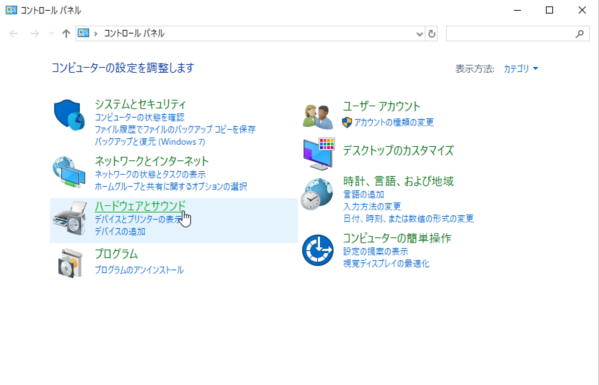
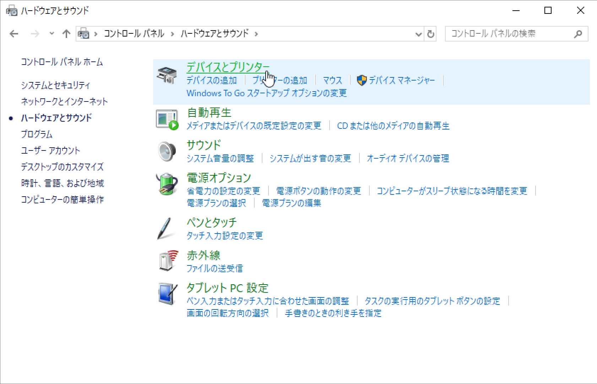
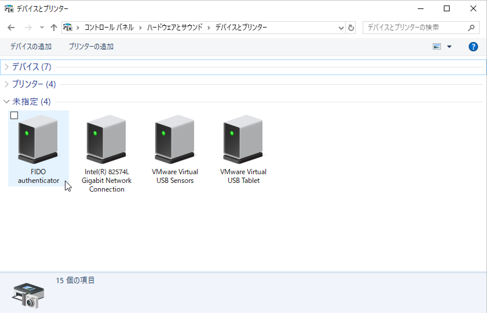
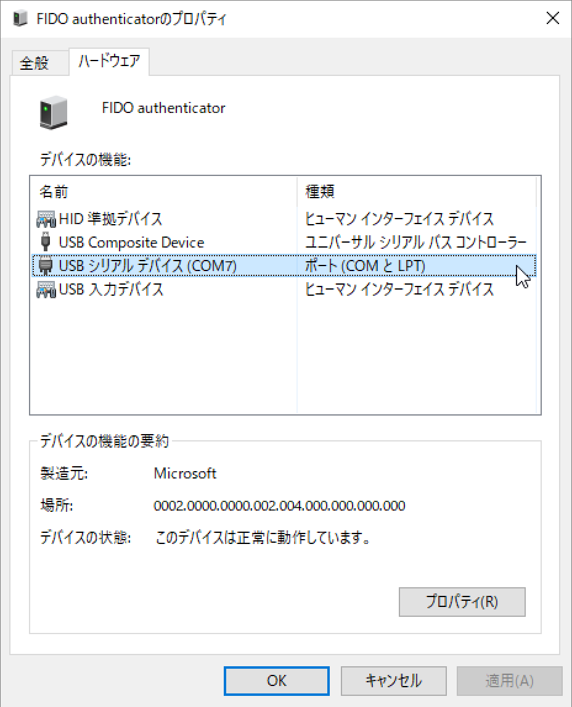

# デモ機能（RSSIログ出力）

## 概要

MDBT50Q Dongleに近接しているBLEデバイスのRSSI値を、１秒ごとに仮想COMポートにログ出力を行う機能です。

### ログ出力イメージ

最大５点のBLEデバイスのRSSI値が、下記のCSVイメージでログ出力されます。

```
<秒数カウンター>,<デバイス名1>,<デバイスのBluetoothアドレス1>,<RSSI値1>,...,<デバイス名5>,<デバイスのBluetoothアドレス5>,<RSSI値5>
```

[注1] 秒数カウンター＝ログ出力開始からの通算秒数になります。例えば１分後には`60`、１時間後には`3600`という値が表示されます。１日経過すると、再び`0`にリセットされます。

### 制約事項

このログ出力機能が実行中は、MDBT50Q Dongle他の機能（FIDOの認証機能や、鍵・証明書などのメンテナンス機能）は利用できません。

## 動作方法

以下、Windows10 PC環境での手順を記載いたします。

### 仮想COMポート番号の確認

MDBT50Q DongleをPCのUSBポートに装着します。<br>
装着時、MDBT50Q Dongleは、仮想COMポートとして認識されます。

Windowsのコントロールパネルを使用し、以下の手順で、仮想COMポート番号を確認します。

まずはコントロールパネルを起動し「ハードウェアとサウンド」をクリックします。



「デバイスとプリンター」をクリックします。



「未指定」の欄に「FIDO authenticator」と表示されているアイコンをダブルクリックします。



下図のようなプロパティ画面が表示されるので、タブ「ハードウェア」にある「USBシリアルデバイス」を参照し、ポート番号を確認します。<br>
下図の例では、ポート番号が「COM7」であることが確認できます。


