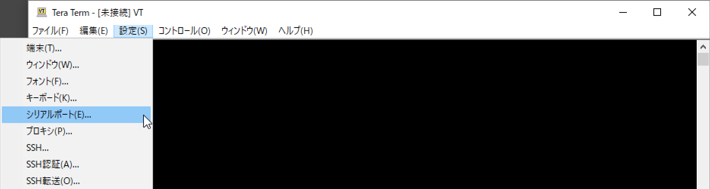
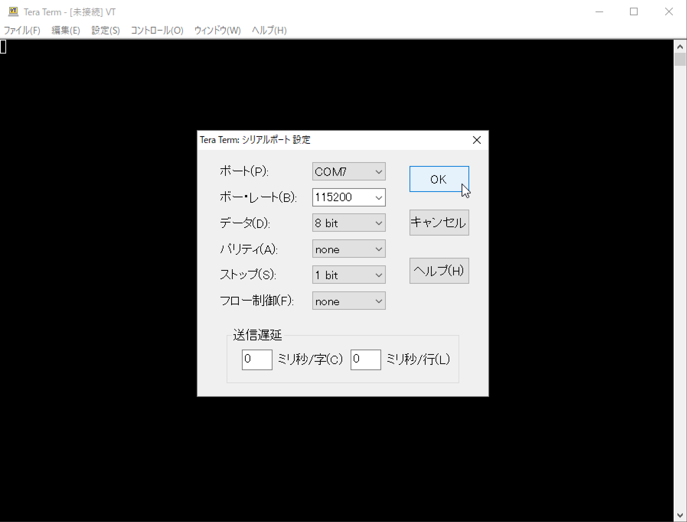
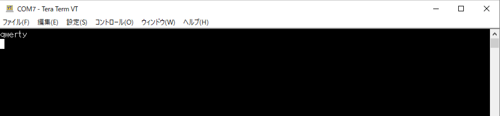
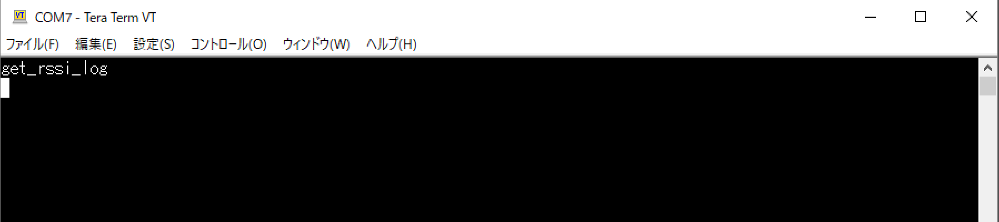
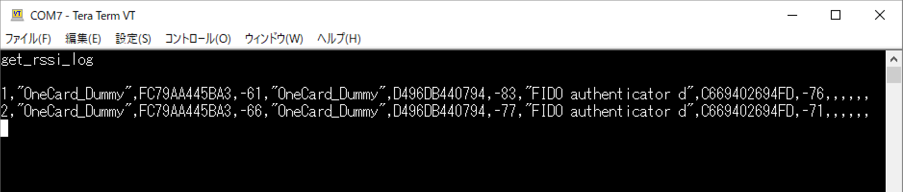

# デモ機能（RSSIログ出力）

## 概要

MDBT50Q Dongleに近接しているBLEデバイスのRSSI値を、１秒ごとに仮想COMポートにログ出力を行う機能です。

### ログ出力イメージ

最大５点のBLEデバイスのRSSI値が、下記のCSVイメージでログ出力されます。

```
<秒数カウンター>,<デバイス名1>,<デバイスのBluetoothアドレス1>,<RSSI値1>,...,<デバイス名5>,<デバイスのBluetoothアドレス5>,<RSSI値5>
```

[注1] 秒数カウンター＝ログ出力開始からの通算秒数になります。例えば１分後には`60`、１時間後には`3600`という値が表示されます。１日経過すると、再び`0`にリセットされます。

### 制約事項

このログ出力機能が実行中は、MDBT50Q Dongle他の機能（FIDOの認証機能や、鍵・証明書などのメンテナンス機能）は利用できません。

[注2] セキュリティー上の観点から、ログ出力機能で使用するUSB CDCサービスが稼働中は、USB HIDサービス（FIDOの認証機能や、鍵・証明書などのメンテナンス機能が使用）を閉塞させているための動きになります。

## 動作方法

以下、Windows10 PC環境での手順を記載いたします。

### 仮想COMポート番号の確認

MDBT50Q DongleをPCのUSBポートに装着します。<br>
装着時、MDBT50Q Dongleは、仮想COMポートとして認識されます。

Windowsのコントロールパネルを使用し、以下の手順で、仮想COMポート番号を確認します。

まずはコントロールパネルを起動し「ハードウェアとサウンド」をクリックします。


「デバイスとプリンター」をクリックします。


「未指定」の欄に「FIDO authenticator」と表示されているアイコンをダブルクリックします。


下図のようなプロパティ画面が表示されるので、タブ「ハードウェア」にある「USBシリアルデバイス」を参照し、ポート番号を確認します。<br>
下図の例では、ポート番号が「COM7」であることが確認できます。


### 仮想COMポートに接続

仮想COMポートに接続し、データ送受信を行うには、ターミナルアプリ「Tera Term」を使用します。

「Tera Term」を起動し、メニューから「設定 --> シリアルポート」を実行します。



設定画面で、先ほど確認したポート番号を指定します。<br>
下図例では「COM7」を指定しています。

その他の設定は下図の通りになります。<br>
「OK」をクリックして、設定画面を閉じます。



Tera Termの左上部に、ポート番号が表示されます。

適宜文字を入力して、画面に入力内容が表示（エコーバック）されるか確認してください。<br>
下図例では「qwerty[ENTER]」と入力した例になります。



これで仮想COMポートへの接続は完了です。

### ログの出力

ログ出力を開始させるためには、Tera Termに「get_rssi_log[ENTER]」と入力します。



程なくログ出力が開始され、Tera Term上にログが表示されます。<br>
下図例では、３点のBLEデバイスがスキャンされ、各々のRSSI値が表示されています。



Tera Termを終了させると、MDBT50Q Dongle側では、ログ出力は自動的に停止されます。
