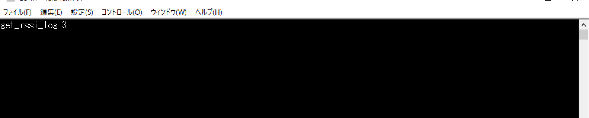
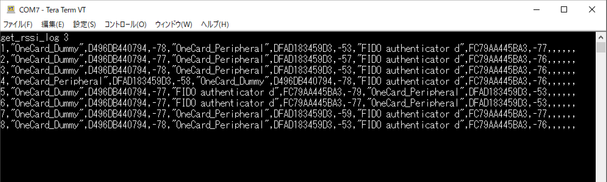

# デモ機能（RSSIログ出力）

## 概要

MDBT50Q Dongleに近接しているBLEデバイスのRSSI値を、指定間隔（１秒〜９秒）ごとに仮想COMポートにログ出力を行う機能です。

### ログ出力イメージ

最大５点のBLEデバイスのRSSI値が、下記のCSVイメージでログ出力されます。

```
<カウンター>,<デバイス名1>,<デバイスのBluetoothアドレス1>,<RSSI値1>,...,<デバイス名5>,<デバイスのBluetoothアドレス5>,<RSSI値5>
```

[注1] カウンター＝ログ出力開始からの通算回数になります。例えば１秒間隔出力の場合、１分後には`60`、１時間後には`3600`という値が表示されます。１年経過すると、再び`0`にリセットされます。

### 制約事項

このログ出力機能が実行中は、MDBT50Q Dongle他の機能（FIDOの認証機能や、鍵・証明書などのメンテナンス機能）は利用できません。

[注2] セキュリティー上の観点から、ログ出力機能で使用するUSB CDCサービスが稼働中は、USB HIDサービス（FIDOの認証機能や、鍵・証明書などのメンテナンス機能が使用）を閉塞させているための動きになります。

## 動作方法

以下、Windows10 PC環境での手順を記載いたします。

### 仮想COMポートに接続

ターミナルアプリ「Tera Term」を使用し、仮想COMポートに接続します。<br>
手順につきましては、手順書「[仮想COMポートへの接続手順](../../FIDO2Device/MDBT50Q_Dongle/CDCCONNECT.md)」をご参照願います。

### ログの出力

ログ出力を開始させるためには、Tera Termに「get_rssi_log <秒数>[ENTER]」と入力します。<br>
秒数には、１秒〜９秒の間が指定できます。



程なくログ出力が開始され、Tera Term上に、指定した秒数の間隔で、ログが表示されます。<br>
下図例では、３点のBLEデバイスがスキャンされ、各々のRSSI値が表示されています。



Tera Termを終了させると、MDBT50Q Dongle側では、ログ出力は自動的に停止されます。
