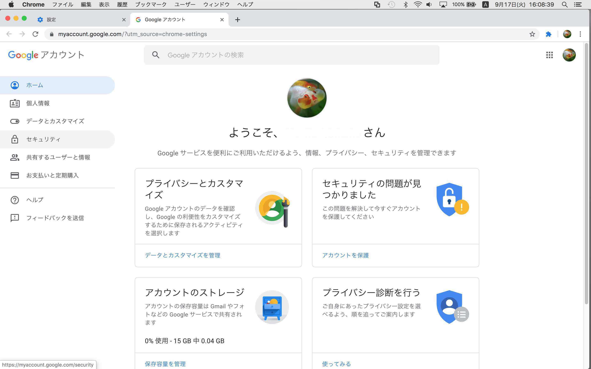
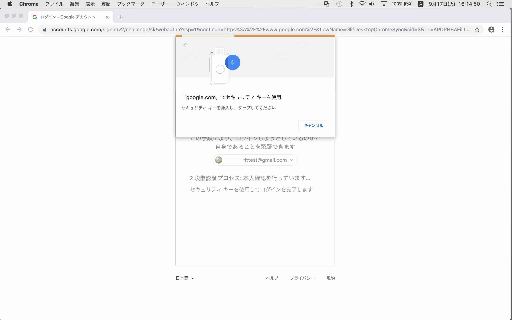
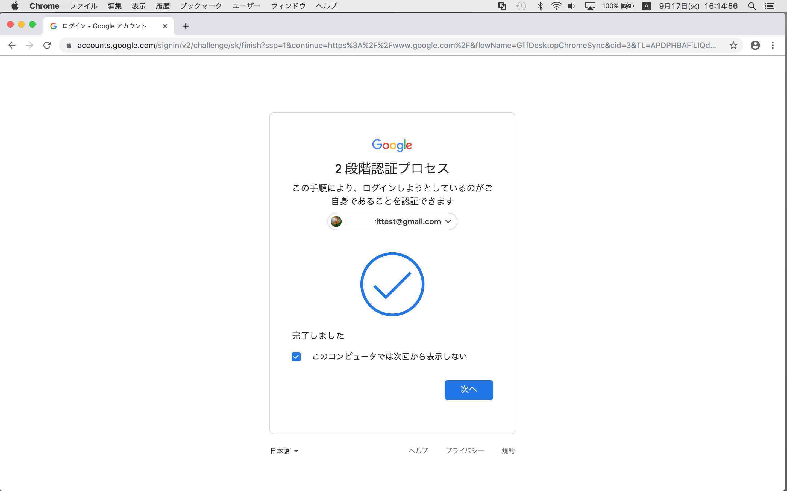
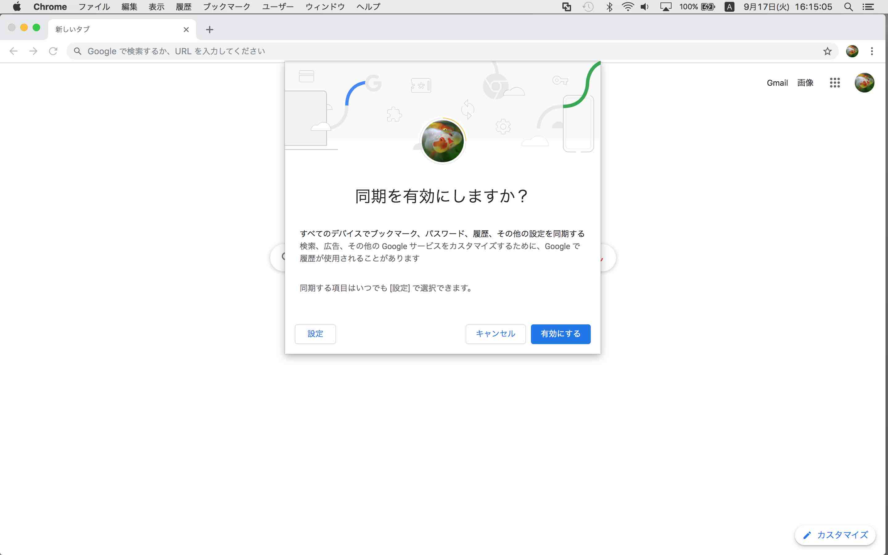

# Googleアカウントのログイン確認手順（PC）

## 概要
PC版Chromeブラウザーと、Googleアカウントを使用し、[MDBT50Q Dongle](README.md)によりGoogleアカウントのユーザー登録／ログイン（U2F Register／Authenticate）を確認する手順を掲載します。

## 事前準備

Googleアカウントが必要になります。 
また、使用するGoogleアカウントについて、２段階認証を有効にしておく必要があります。

下図は、Googleアカウントの２段階認証が有効になっていて、かつセキュリティ・キーがまだ登録（Register）されていない状態の例です。

#### 鍵・証明書のインストール

[FIDO認証器管理ツール](../../MaintenanceTool/README.md)を使用して、U2F Registerに必要な鍵・証明書のインストールを行います。

[FIDO認証器管理ツール](../../MaintenanceTool/README.md)を使用した鍵・証明書の導入手順は、別ドキュメント<b>「[鍵・証明書の導入手順（macOS版）](../../MaintenanceTool/macOSApp/INSTALLKEYCRT.md)」</b>、または<b>「[鍵・証明書の導入手順（Windows版）](../../MaintenanceTool/WindowsExe/INSTALLKEYCRT.md)」</b>をご参照願います。 

## セキュリティ キーの登録(U2F Register)

Chromeブラウザーを使用し、Googleアカウントにセキュリティ キー（MDBT50Q Dongle）を登録します。 
あらかじめ、PCのUSBポートに[MDBT50Q Dongle](README.md)を装着しておきます。

Chromeブラウザーを開き、環境設定メニューを実行します。

画面中央「ユーザー」ボックスの「Google アカウントの管理」をクリックします。

Googleアカウント管理画面の左側のメニュー「セキュリティ」をクリックします。

画面中央「Googleへのログイン」ボックスの「2段階認証プロセス」をクリックします。

２段階認証プロセスの設定ページに移動します。

２段階認証プロセスの設定ページの下側にある「セキュリティ キー」というボックスのリンク「セキュリティ キーを追加」をクリックします。

下図のような画面に遷移しますが、この時点ではすでに、MDBT50Q Dongleは接続されているので、気にせず「次へ」をクリックします。

下図のように画面が変化します。

ここでMDBT50Q Dongle上の緑色LEDが点滅を始めます（おおむね秒間２回）。

MDBT50Q Dongle上のボタンを１回プッシュすると、下図のような白いポップアップが表示されます。 
「許可」をクリックします。

下図のような画面に遷移しますので、任意の名称を入力して「完了」をクリックします。

下図のような画面に、登録されたセキュリティ キーが表示されます。

以上で、セキュリティ キーの登録(U2F Register)は完了となります。

## ユーザー情報の事前削除

Googleアカウントのログイン確認を行うためには、以下の手順により、PC上に残存しているユーザー情報をChromeから削除してください。

#### ユーザー同期をオフにする

Chromeの設定画面（下図）を表示し、画面中央上部の「オフ」ボタンをクリックします。

下図のようなポップアップ画面が表示されます。 
「ブックマーク、履歴、パスワード、その他の設定情報をこのデバイスから削除する」のチェックを必ず外し（これが重要）、右側の「オフにする」ボタンをクリックします。

「Chromeへようこそ」画面に遷移することを確認します。

以上で、ユーザー情報の削除は完了となります。

## セキュリティ キーを使ったログイン(U2F Authenticate)

セキュリティ キー（MDBT50Q Dongle）を使用し、Chromeブラウザーに、Googleアカウントでログインします。 
あらかじめ、PCのUSBポートに[MDBT50Q Dongle](README.md)を装着しておきます。

Chromeブラウザーを開き、画面右上部のユーザーアイコンをクリックし、下図のようなポップアップを表示させます。 
ポップアップ上の青いボタン「同期を有効にする」をクリックします。

下図のような画面に遷移します。

ここでMDBT50Q Dongle上の緑色LEDが点滅を始めます（おおむね秒間２回）。

MDBT50Q Dongle上のボタンを１回プッシュすると、下図のように「完了しました」というメッセージが表示されます。

適宜、下図画面で「有効」ボタンをクリックし、ユーザー同期を有効にします。

Chromeの初期画面に遷移します。

以上で、セキュリティ キーを使ったログイン(U2F Authenticate)は完了となります。
