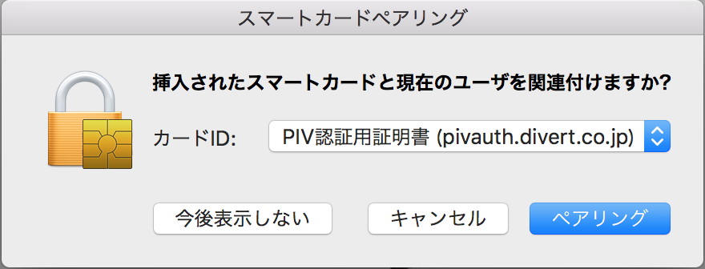
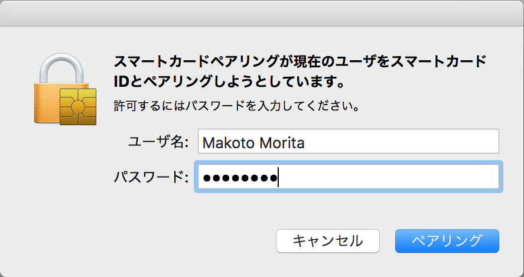
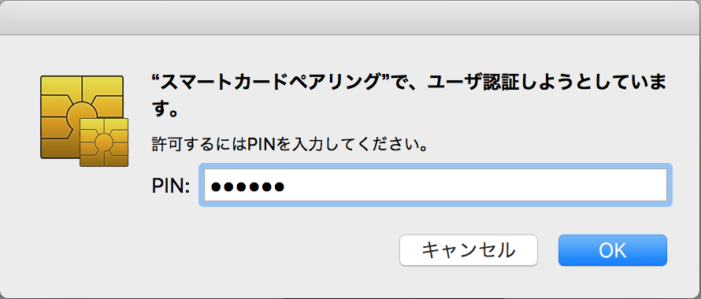
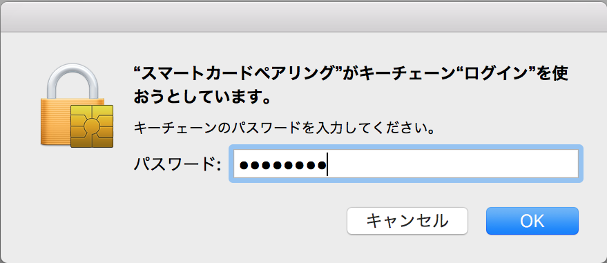
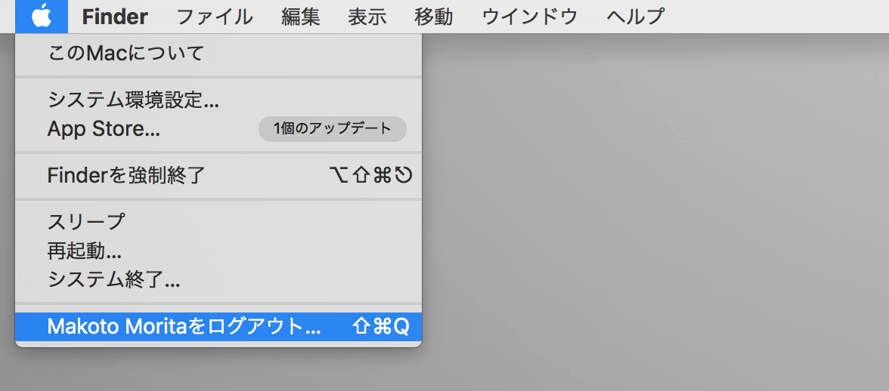
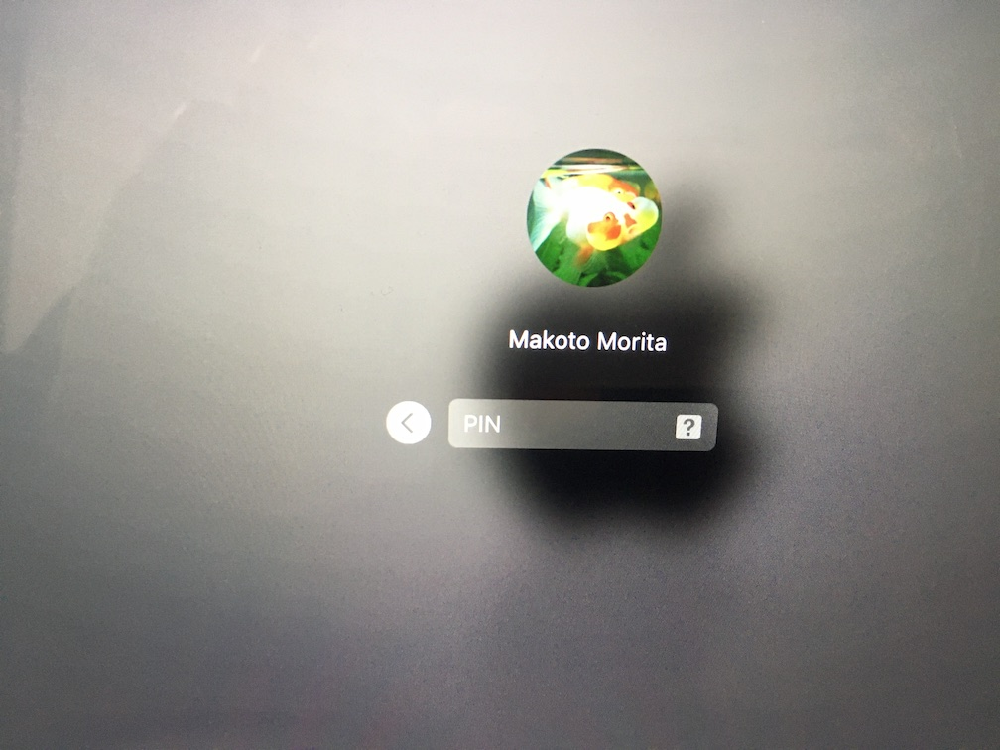
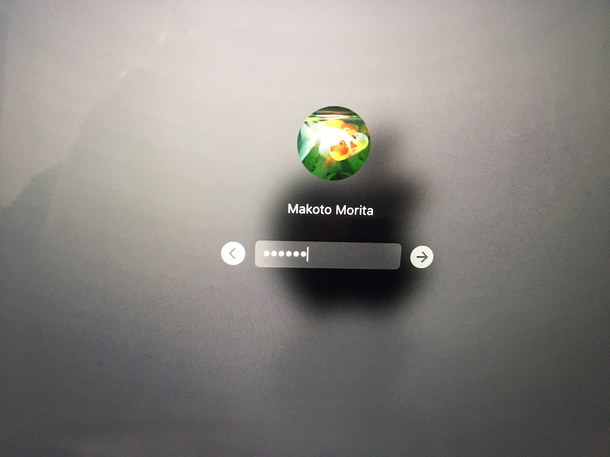
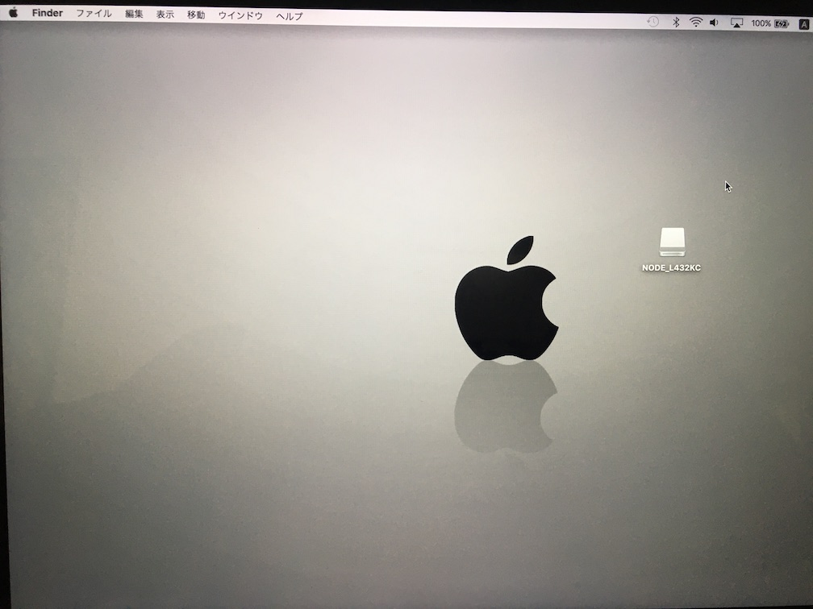

# PIN番号を使用したmacOSログイン確認手順

## 概要
[MDBT50Q Dongle](../../FIDO2Device/MDBT50Q_Dongle/README.md)に設定した[PIV機能](../../CCID/ccid_lib/README.md)を使用し、PIN番号によるmacOSログインを行うための確認手順を掲載します。

## 準備手順

下記手順書により、MDBT50Q DongleでPIV機能が使えるように準備を行います。

#### [CCIDドライバーインストール手順](../../CCID/INSTALLPRG.md)
[MDBT50Q Dongle](../FIDO2Device/MDBT50Q_Dongle/README.md)のCCIDインターフェース専用ドライバー（以下単に「CCIDドライバー」）を、macOS環境にインストールします。

#### [PIV機能の設定手順](../../MaintenanceTool/macOSApp/PIVSETTING.md)
管理ツールをmacOS環境に導入し、MDBT50Q DongleにPIV機能を設定します。 
リンク先ドキュメントの「管理ツールのインストール」〜「初期設定の実行」（ID設定の実行／鍵・証明書ファイルのインストール）の章をご参照願います。

## 作業手順

#### スマートカードペアリングの実行

[MDBT50Q Dongle](../../FIDO2Device/MDBT50Q_Dongle/README.md)を、PC（MacBook、iMac等）のUSBポートに装着します。 
初回装着の場合、以下のようなダイアログが表示されます。

「PIV認証用証明書」を選択し「ペアリング」ボタンをクリックします。

下図のようなダイアログが表示されます。 
macOSユーザーのパスワードを入力します。

下図のようなダイアログが表示されます。 
デフォルトPIN番号である`123456`を入力します。

下図のようなダイアログが表示されます。 
キーチェーンのパスワード（通常はユーザーパスワードと同じ）を入力します。

ダイアログが閉じられ、スマートカードペアリングが完了します。

#### macOSにログイン

いったんmacOSからログオフし、[MDBT50Q Dongle](../../FIDO2Device/MDBT50Q_Dongle/README.md)を、PCのUSBポートから外します。

macOSのログイン画面が表示されます。 
この後、ふたたび[MDBT50Q Dongle](../../FIDO2Device/MDBT50Q_Dongle/README.md)を、PC（MacBook、iMac等）のUSBポートに装着します。

下図のように、ユーザーパスワードではなく、PIN番号を入力するためのボックスが表示されます。

PIN番号を入力して、ログインを実行します。

通常のパスワードによるログインと同様、macOSにログインできます。

以上で、PIN番号によるmacOSログインは完了になります。
