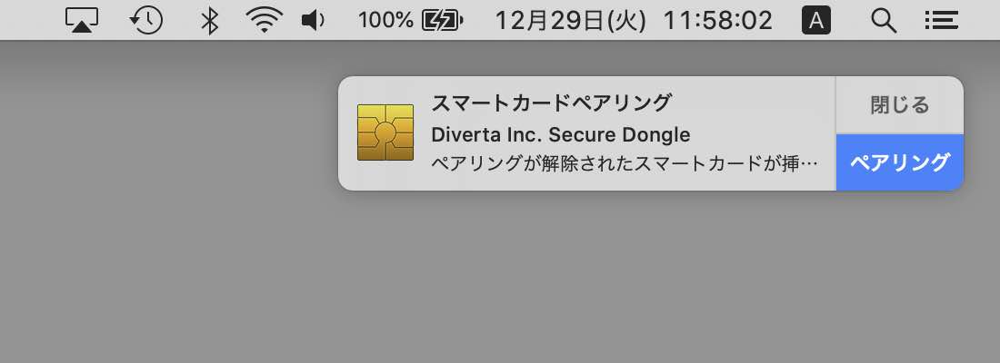
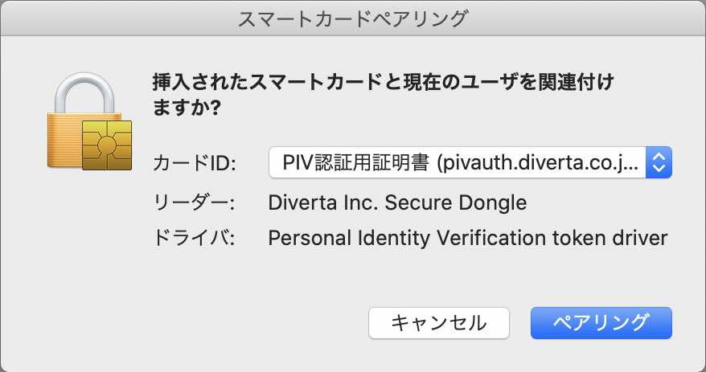
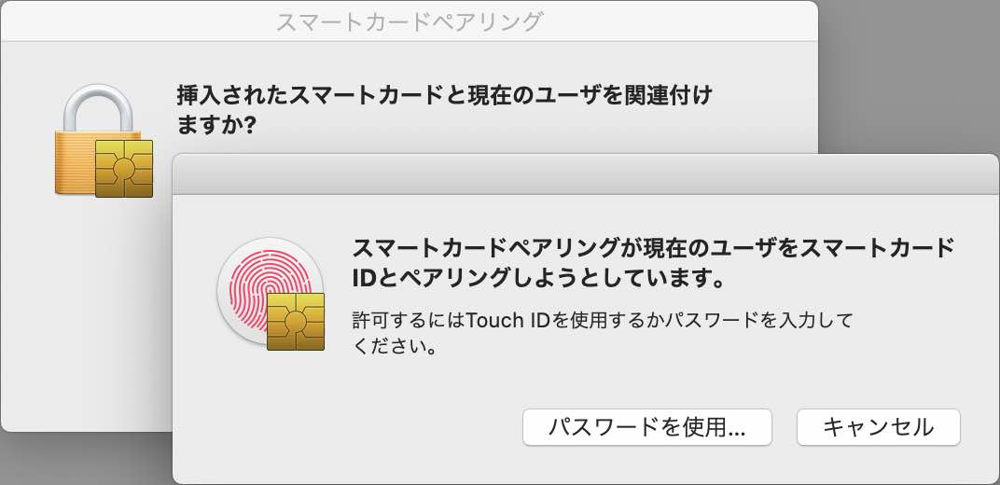
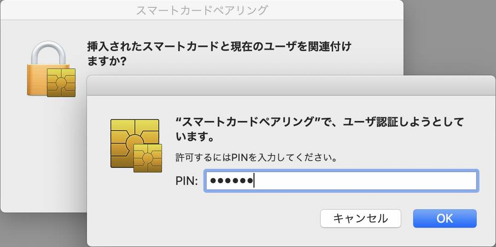
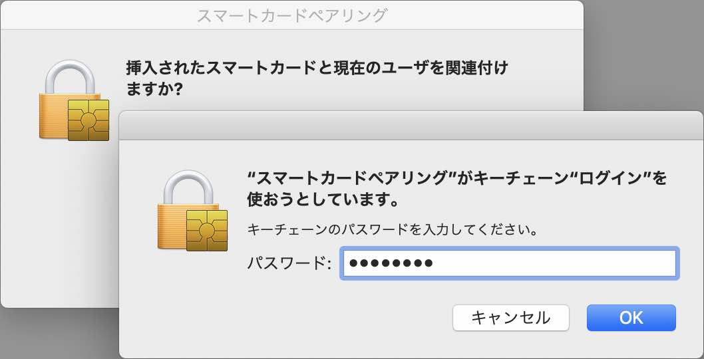
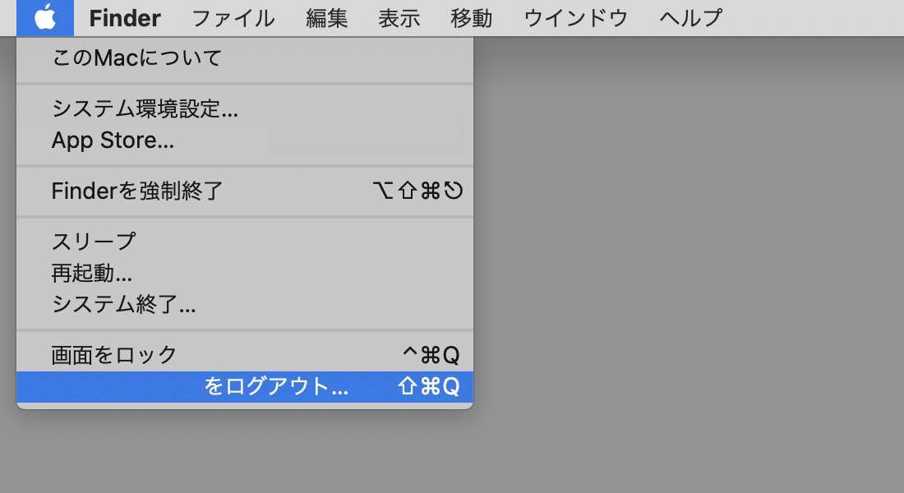
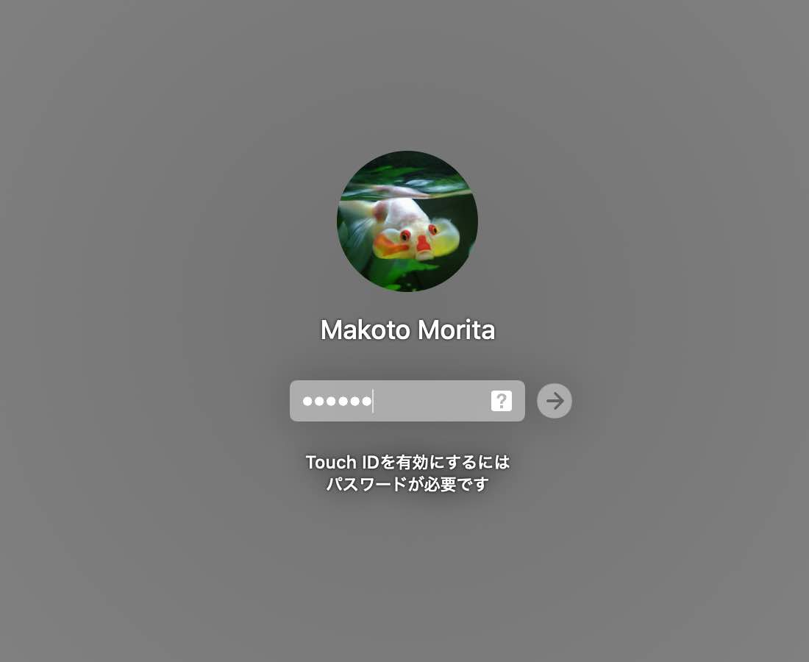

# PIN番号を使用したmacOSログイン確認手順

## 概要
[MDBT50Q Dongle](../../FIDO2Device/MDBT50Q_Dongle/README.md)に設定した[PIV機能](../../CCID/ccid_lib/README.md)を使用し、PIN番号によるmacOSログインを行うための確認手順を掲載します。

## 準備手順

下記手順書により、MDBT50Q DongleでPIV機能が使えるように準備を行います。

### [CCIDドライバーインストール手順](../../CCID/INSTALLPRG.md)
[MDBT50Q Dongle](../../FIDO2Device/MDBT50Q_Dongle/README.md)のCCIDインターフェース専用ドライバー（以下単に「CCIDドライバー」）を、macOS環境にインストールします。

### [管理ツールのインストール手順](../../MaintenanceTool/macOSApp/INSTALLPRG.md)
最新バージョンの[管理ツール](../../MaintenanceTool/macOSApp/MaintenanceTool.pkg)をmacOS環境に導入します。

### [ファームウェア更新手順](../../MaintenanceTool/macOSApp/UPDATEFIRMWARE.md)
最新バージョンのファームウェア（[nRF52840アプリケーション](../../nRF5_SDK_v15.3.0)）をMDBT50Q Dongleに導入します。

### [PIV機能の基本設定手順](../../MaintenanceTool/macOSApp/PIVSETTING.md)
macOS環境に導入した管理ツールにより、MDBT50Q Dongleに対し、PIV機能の基本設定を行います。 
リンク先ドキュメントの以下各章をご参照願います。 
・ソフトウェアのバージョン確認 
・PIV機能設定画面の表示 
・基本設定の実行（ID設定の実行／鍵・証明書ファイルのインストール）

## 作業手順

#### スマートカードペアリングの実行

[MDBT50Q Dongle](../../FIDO2Device/MDBT50Q_Dongle/README.md)を、PC（MacBook、iMac等）のUSBポートに装着します。

初回装着の場合、以下のようなダイアログが表示されます。 
右下部の「ペアリング」をクリックします。

下図のようなダイアログが表示されます。 
「PIV認証用証明書」を選択し「ペアリング」ボタンをクリックします。

下図のようなダイアログがポップアップ表示されます。 
macOSユーザーのパスワードを入力するか、Touch IDを使用します。

下図のようなダイアログが表示されます。 
PIN番号`123456`を入力し「OK」をクリックします。[注1]

下図のようなダイアログが表示されます。 
キーチェーンのパスワード（通常はユーザーパスワードと同じ）を入力し「OK」をクリックします。

ダイアログが閉じられ、スマートカードペアリングが完了します。

#### macOSにログイン

いったんmacOSからログオフし、[MDBT50Q Dongle](../../FIDO2Device/MDBT50Q_Dongle/README.md)を、PCのUSBポートから外します。

macOSのログイン画面が表示されます。 
この後、ふたたび[MDBT50Q Dongle](../../FIDO2Device/MDBT50Q_Dongle/README.md)を、PC（MacBook、iMac等）のUSBポートに装着します。

下図のように、ユーザーパスワードではなく、PIN番号を入力するためのボックスが表示されます。

PIN番号`123456`を入力して、ログインを実行します。[注1]

通常のパスワードによるログインと同様、macOSにログインできます。

以上で、PIN番号によるmacOSログインは完了になります。

[注1] PIN番号`123456`はPIV機能の初期値になります。管理ツールの[PIN番号管理機能](../../MaintenanceTool/macOSApp/PIVSETTING_OPT.md)により、PIN番号を初期値から変更した場合は、変更後のPIN番号を指定してください。
