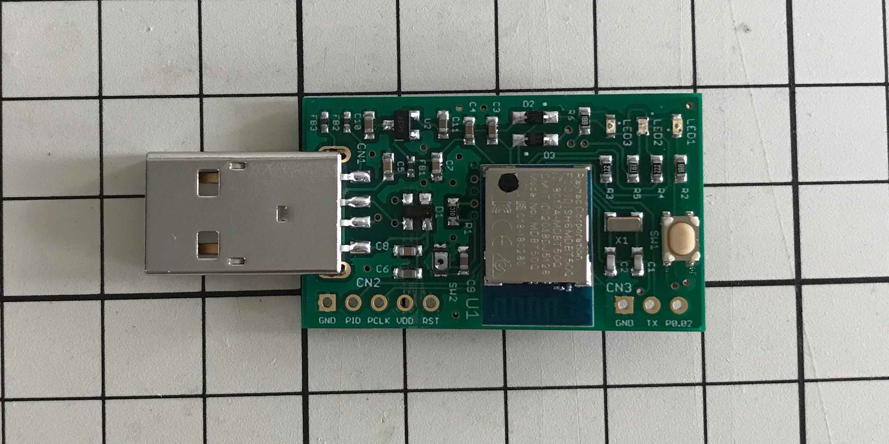

# MDBT50Q Dongle（rev2）

## 概要

日本国内の技適取得済みであるnRF52840搭載モジュール「MDBT50Q」を使用し、nRF52840 Dongleとほぼ同じ仕様で製作した、USBドングル基板です。

### [MDBT50Q Dongleの概要](HWSUMMARY_2.md)

基板、動作についての概要を説明しています。

### [MDBT50Q Dongle回路図](pcb_rev2/FIDO2AUTH_002.pdf)

nRF52840 Dongleをベースとし、電池電源の増設と、LEDの増設、若干の配線変更を行っております。

### [FIDO2認証器アプリケーション](../../nRF5_SDK_v15.3.0/README.md)

MDBT50Q Dongleで使用するファームウェアです。

### [ファームウェア更新手順](../../MaintenanceTool/macOSApp/UPDATEFIRMWARE.md)

MDBT50Q Dongleのファームウェアを、[FIDO認証器管理ツール（macOS版）](MaintenanceTool/macOSApp)により更新する手順について説明しています。

## 動作確認手順

### [Edgeブラウザーを使用したWebAuthnテスト手順（Windows10 PC）](WEBAUTHNTEST.md)

MDBT50Q Dongleと、Edgeブラウザー、デモサイトを使用して、WebAuthnのユーザー登録／ログイン（MakeCredential／GetAssertion）の動作確認をする場合の手順を掲載しています。

### [Googleアカウントのログイン確認手順（PC）](PCCHROME.md)

MDBT50Q Dongleと、Googleアカウント、Chromeブラウザーを使用して、U2F Register／Authenticateの動作確認をする場合の手順を掲載しています。

## デモ機能

BLEセントラルサービスを使用したデモンストレーション機能です。

### [BLEデバイスによる自動認証](DEMOFUNC_2.md)

FIDO認証（WebAuthn／U2F）実行時、MDBT50Q Dongle上のボタンを押す代わりに、One CardなどのBLEデバイスを近づけることにより、認証処理を自動的に続行させます。

## 開発情報

ただいま、<b>次期バージョン（rev2.1）</b>を開発中です。 
基板の小型化と、セキュリティー性の向上が主な特色になります。

- <b>基板の小型化</b> 
不要な機能／部品を排除した結果、rev2に比して、幅4mm、奥行き7mmのサイズ縮小を実現します。

- <b>セキュアIC「ATECC608A」を基板に新規導入</b> 
認証器固有の秘密鍵を、nRF52840のFlash ROMではなく、セキュアICに格納します。 
（サイト固有の認証情報を暗号化／復号化するためのパスワードも、セキュアICに格納します） 
rev2と同様、管理ツールにより秘密鍵インストールが可能ですが、一度インストールされた秘密鍵は、いかなる手段によっても参照できなくなります。

- <b>USBブートローダーに署名検証機能を追加</b> 
rev2の[簡易USBブートローダー](../../nRF5_SDK_v15.3.0/examples/dfu/README.md)に代わり、[署名機能付きのUSBブートローダー](../../nRF5_SDK_v15.3.0/firmwares/secure_bootloader)を導入します。 
これにより、何らかのツールを使用して、USB経由で不正なファームウェアを書込むといったことが不可能になります。

## ご参考情報

### [アプリケーション書込み手順](../../nRF5_SDK_v15.3.0/APPINSTALL.md)

MDBT50Q Dongleにプレインストールされている[簡易USBブートローダー](../../nRF5_SDK_v15.3.0/examples/dfu/README.md)を経由し、MDBT50Q Dongleに[FIDO2認証器アプリケーション](../../nRF5_SDK_v15.3.0/README.md)を書き込む手順を掲載しています。 
（ファームウェア単体開発時の運用になります）

### [簡易USBブートローダー](../../nRF5_SDK_v15.3.0/examples/dfu/README.md)

PCのUSBポート経由で、MDBT50Q Dongleに[FIDO2認証器アプリケーション](../../nRF5_SDK_v15.3.0/README.md)を書き込むことができるようにするためのファームウェアです。 
MDBT50Q Dongleにはすでに導入済みとなっております。
