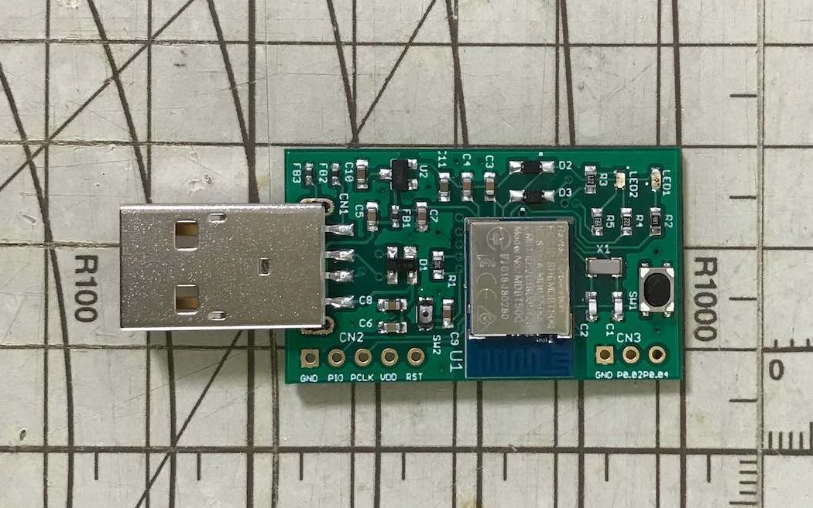

# MDBT50Q Dongle

## 概要

日本国内の技適取得済みであるnRF52840搭載モジュール「MDBT50Q」を使用し、nRF52840 Dongleとほぼ同じ仕様で製作した、USBドングル基板です。

MDBT50Q Dongleの回路図はこちら --> <b>[FIDO2AUTH_001.pdf](https://github.com/diverta/onecard-fido/blob/master/FIDO2Device/pcb/FIDO2AUTH_001.pdf)</b>

## 使用ファームウェア

MDBT50Q Dongleには、USBポート経由でアプリケーションの書込みができるよう、あらかじめ[USBブートローダー](USBBOOTLOADER.md)が書き込まれています。

また、MDBT50Q Dongleは、回路がnRF52840 Dongleと同等ですので、本プロジェクトで開発中の[FIDO2認証器アプリケーション](https://github.com/diverta/onecard-fido/tree/master/nRF5_SDK_v15.3.0)がそのまま利用できます。

アプリケーションの書込み手順はこちら --> <b>[アプリケーション書込み手順](APPINSTALL.md)</b>
