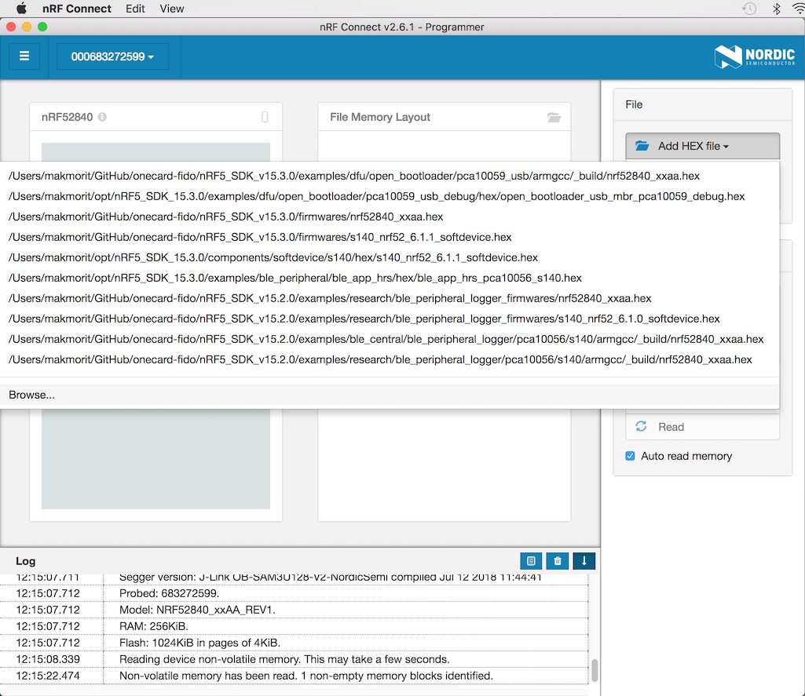
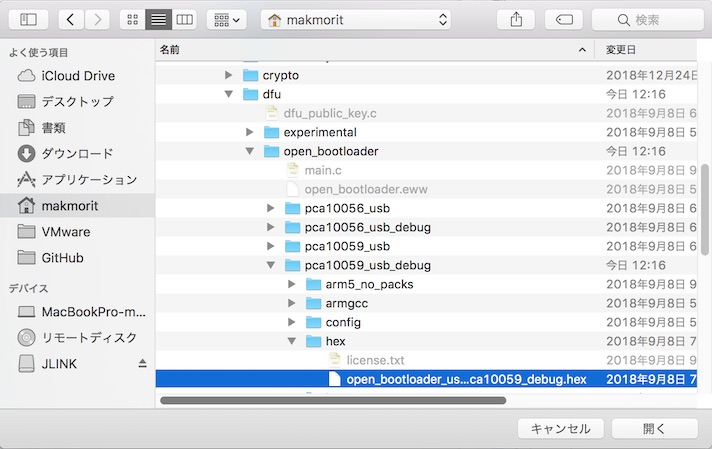
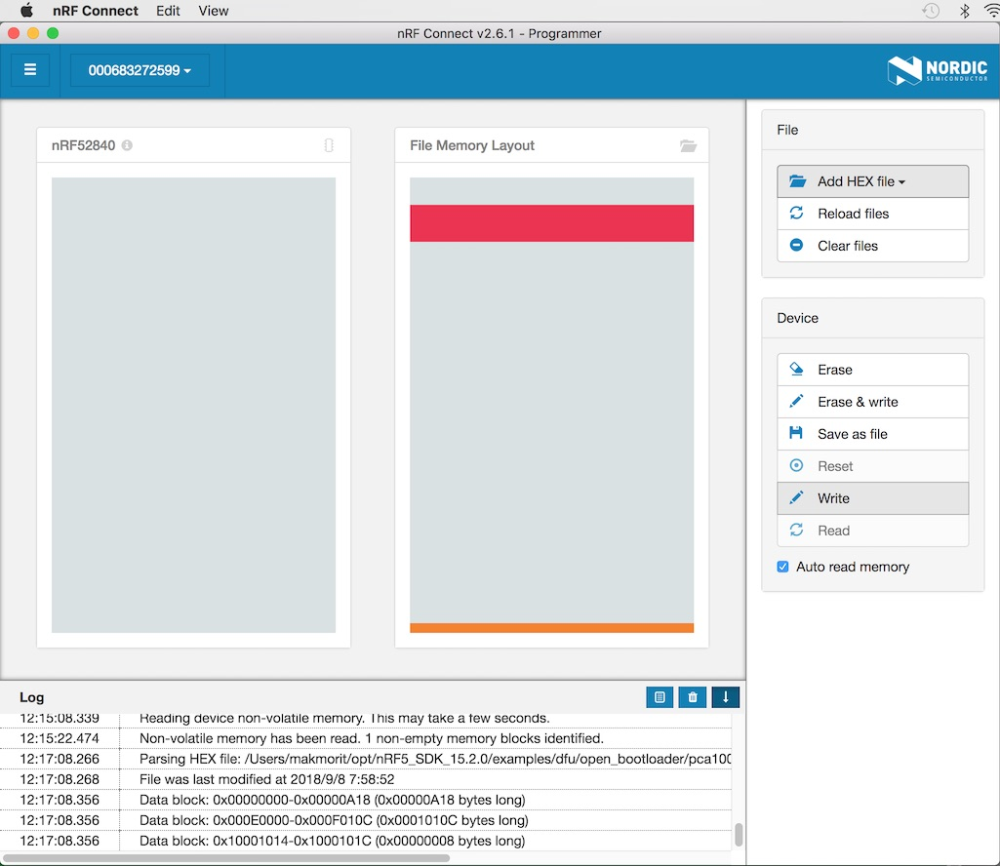
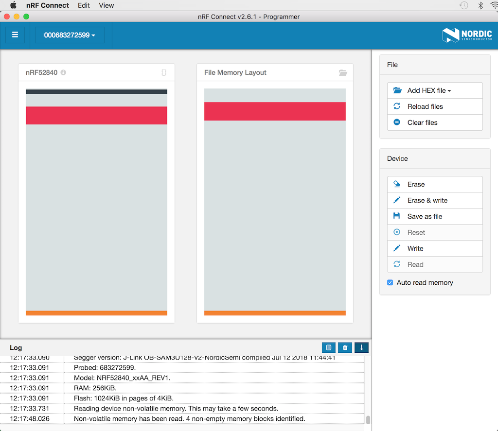
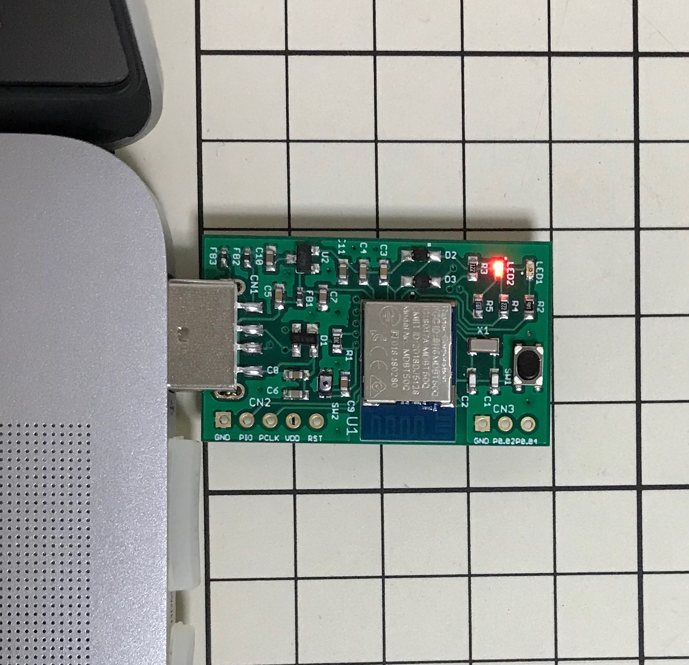
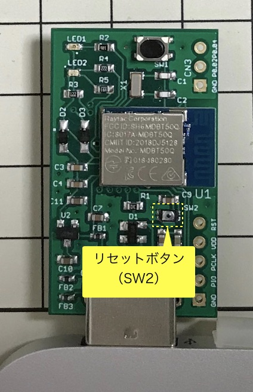

# USBブートローダー

## dfu/open_bootloader

nRF Connectツールにより、nRF52840にアプリケーションを書込むためのブートローダー・プログラムです。 
Nordicのサンプルアプリ[`Open Bootloader with DFU`](https://infocenter.nordicsemi.com/topic/com.nordic.infocenter.sdk5.v15.2.0/ble_sdk_app_open_bootloader.html)に添付されているhexファイルをそのまま使用します。

### 動作確認環境

- macOS Sierra（10.12.6）
- nRF52840 DK（PCA10056）: プログラムの書込みに使用
- MDBT50Q Dongle（nRF52840）: プログラムの書込み先となるターゲット基板

### 動作確認準備

MDBT50Q DongleをPCのUSBポートに装着後、nRF52840 DKと接続します。 
接続するピンの対応関係は以下の通りです。

|ピンの名前 |MDBT50Q Dongle | | nRF52840 DK|
|:--|:-:|:-:|:-:|
|0V |GND  | <-->  |GND|
|SWD IO |PIO  | <-->  |SWDIO|
|SWD Clock |PCLK  | -->  |SWDCLK|
|SWD IO Level |VDD  | -->  |VTG|
|SWD Reset |RST  | -->  |RESET|

[注1] nRF52840 DK上の「P20」というコネクター（オスピン）に接続します。 
[注2] MDBT50Q Dongleの回路図はこちら（[FIDO2AUTH_001.pdf](https://github.com/diverta/onecard-fido/blob/master/FIDO2Device/pcb/FIDO2AUTH_001.pdf)）になります。

下図は実際に両者を接続した時のイメージになります。

## ブートローダーの書込み

nRF52840 DKの電源を投入し、あらかじめPCに導入したツール「nRF Connect」を起動し「Programmer」を実行します。 
（「nRF Connect」については、手順書「[nRF52840 Dongleプログラミング手順](https://github.com/diverta/onecard-fido/blob/master/Development/nRF52840/NRFCONNECTINST.md)」ご参照）

画面右上のFileメニューから「Add HEX file」を実行します。

nRF5 SDKのフォルダー`nRF5_SDK_15.3.0/examples/dfu/open_bootloader/pca10059_usb_debug/hex/`
にある`open_bootloader_usb_mbr_pca10059_debug.hex`というファイルを選択します。

下図のように、右側のボックスにメモリーイメージが展開されます。 
Deviceメニューから「Write」を実行します。

画面左側のボックスに、メモリーイメージが展開され、ブートローダーの書き込みが正常終了したことを示します。

基板上のLEDが赤色で点滅することを確認したら、MDBT50Q DongleをPCから外し、MDBT50Q DongleとnRF52840 DKの配線を外します。

以上で、ブートローダーの書き込みは完了です。

## アプリケーションの書込み

ブートローダーによるアプリケーションの書込みは、SWD経由ではなく、PCのUSBポート経由で行います。

まず、MDBT50Q DongleをPCのUSBポートに装着後、リセットボタン（下図ご参照）を１回プッシュします。

基板上のLEDが赤色で緩く点滅するのを確認します。

あとは、nRF52840 Dongleと同じ手順で、ツール「nRF Connect」により、アプリケーションを書込みます。
