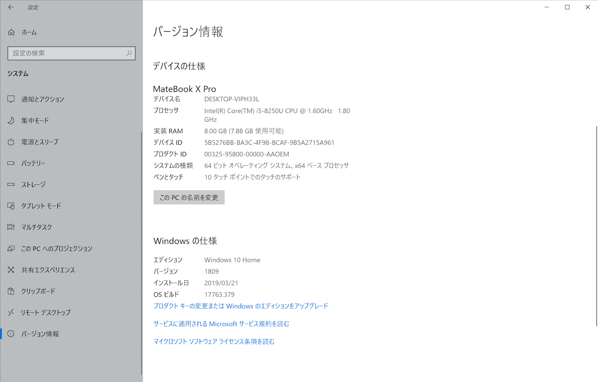
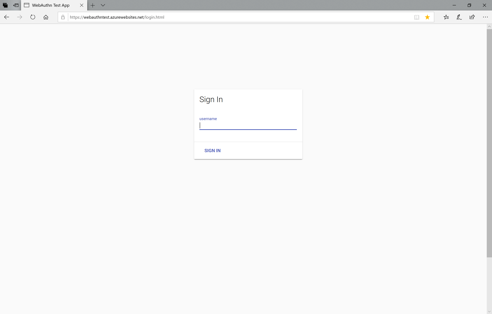
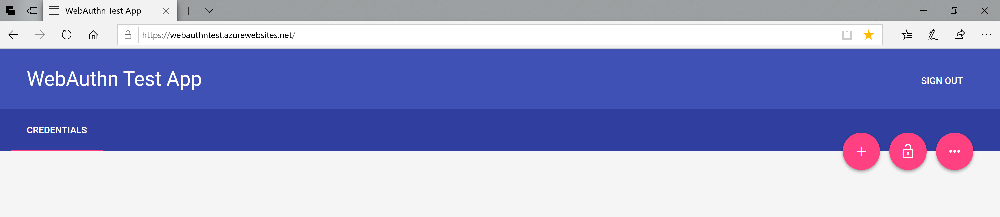
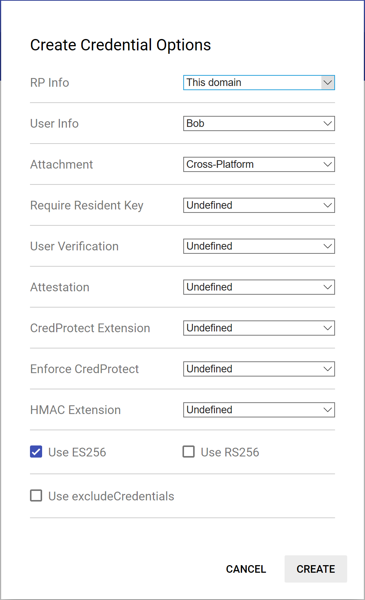
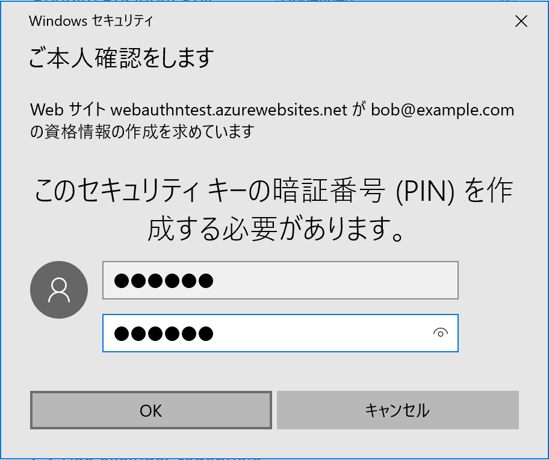
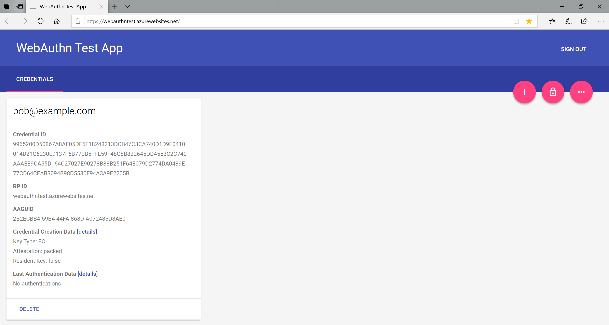
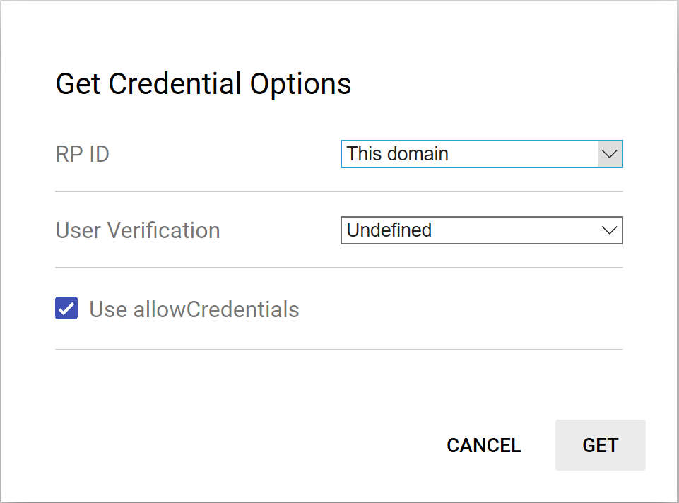
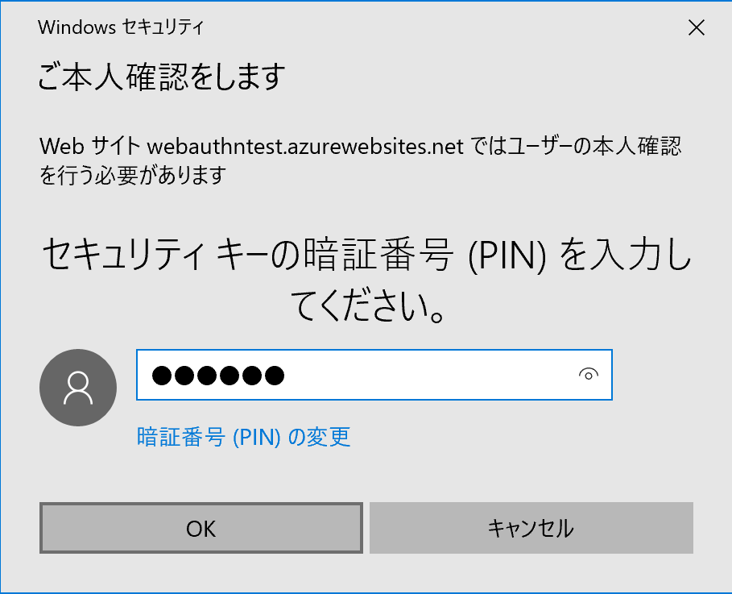
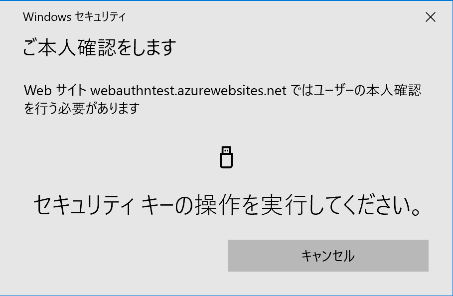
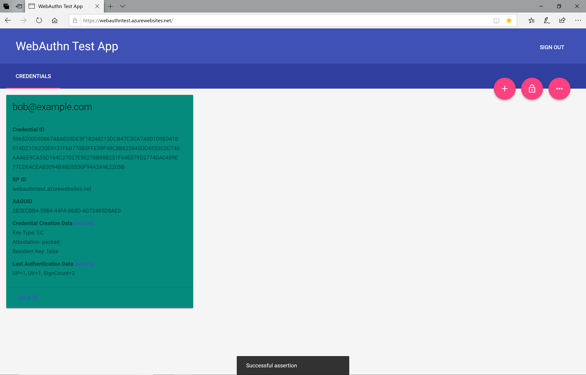

# Edgeブラウザーを使用したWebAuthnテスト手順

MDBT50Q Dongleと、最新バージョンのEdgeブラウザーを使用し、WebAuthnユーザー登録／ログインをPINコードにより行う手順を掲載しています。

## ソフトウェアの導入

### 最新Edgeブラウザーの導入

WebAuthnをサポートしているEdgeブラウザーは、単体で導入できません。 
したがって、Windows 10のシステムを最新バージョンに移行させる必要があります。

具体的には、Windows PCに「Windows 10 October 2018 Update」を導入します。 
導入したら、Windows 10のバージョン情報を参照し、バージョンが「1809」になっていることを確認してください。

## FIDO2認証器の準備

#### アプリケーションを導入

[FIDO2認証器アプリケーション](https://github.com/diverta/onecard-fido/tree/master/nRF5_SDK_v15.3.0)を、MDBT50Q Dongleに書込みます。 
書込み手順につきましては、<b>[アプリケーション書込み手順](../../nRF5_SDK_v15.3.0/APPINSTALL.md)</b>をご参照ください。

ファームウェアは、GitHubリポジトリーの以下の場所に格納されています。
- ディレクトリー: onecard-fido/nRF5_SDK_v15.3.0/firmwares/
- アプリケーション: [nrf52840_xxaa.hex](../../nRF5_SDK_v15.3.0/firmwares/nrf52840_xxaa.hex)
- ソフトデバイス: [s140_nrf52_6.1.1_softdevice.hex](../../nRF5_SDK_v15.3.0/firmwares/s140_nrf52_6.1.1_softdevice.hex)

#### 管理ツールを導入

[FIDO認証器管理ツール](../../MaintenanceTool/README.md)を、PC環境（Windows 10）に導入します。 
以下の手順書をご参照願います。

* <b>[インストール手順（Windows版）](../../MaintenanceTool/WindowsExe/INSTALLPRG.md) </b>

#### 鍵・証明書を導入

PC環境に導入した管理ツールを使用し、MDBT50Q Dongleに、鍵・証明書を導入します。 
以下の手順書をご参照願います。

* <b>[鍵・証明書の導入手順（Windows版）](../../MaintenanceTool/WindowsExe/INSTALLKEYCRT.md) </b>

## WebAuthn機能テストの実行

MDBT50Q DongleとEdgeブラウザーを使用し、WebAuthn機能（ユーザー登録／ログイン）のテストを実施します。

### ユーザー登録

Edgeブラウザーを起動し、URL「[https://webauthntest.azurewebsites.net/login.html](https://webauthntest.azurewebsites.net/login.html)」を実行すると、WebAuthn機能のデモページが表示されます。

MDBT50Q Dongleは、PCのUSBポートに装着しておきます。

表示されたWebページ中央部にある「Sign In」枠内の「username」欄に、適宜ユーザー名を入力後『SIGN IN」ボタンをクリックします。

「WebAuthn Test App」のホーム画面に遷移します。 
画面右上部の赤い「＋」のアイコン（３つのうち左端のアイコン）をクリックします。

下図のような「Create Credential Options」画面がポップアップ表示されます。 
以下のように項目を変更設定します。
- RP Info: This domain
- User Info: Bob
- Attatchment: Cross-Platform
- Use RS256: チェックを外す

項目を変更設定したら、画面右下部の「CREATE」ボタンをクリックします。

程なく、PINを新規入力する画面が表示されます。 
テキストボックスに、適宜PIN（暗証番号）を入力し、OKをクリックします。

下図のような、ユーザー所在確認を求める画面が表示されます。

MDBT50Q Dongle上の緑色LEDが点滅し始めますので、基板上のボタンを１回プッシュします。

MDBT50Q Dongleからレスポンスが戻り、しばらくすると、下図のようにユーザー登録処理が成功したことを通知するメッセージ「Successfully created credential」が画面下端に表示されます。

これで、ユーザー登録のテストは完了です。

### ログイン

前述の「WebAuthn Test App」ホーム画面を表示し、MDBT50Q DongleをPCのUSBポートに装着しておきます。 
画面右上部の赤い鍵のアイコン（３つのうち真ん中のアイコン）をクリックします。

下図のような「Get Credential Options」画面がポップアップ表示されます。 
以下のように項目を変更設定します。
- RP ID: This domain
- User Verification: Undefined

項目を変更設定したら、画面右下部の「GET」ボタンをクリックします。

程なく、PINを入力する画面が表示されます。 
テキストボックスに、先ほど作成したPIN（暗証番号）を入力し、OKをクリックします。

下図のような、ユーザー所在確認を求める画面が表示されます。

MDBT50Q Dongle上の緑色LEDが点滅し始めますので、基板上のボタンを１回プッシュします。

MDBT50Q Dongleからレスポンスが戻り、しばらくすると、下図のようにログイン処理が成功したことを通知するメッセージ「Successful assertion」が画面下端に表示されます。

これで、ログインのテストは完了です。
