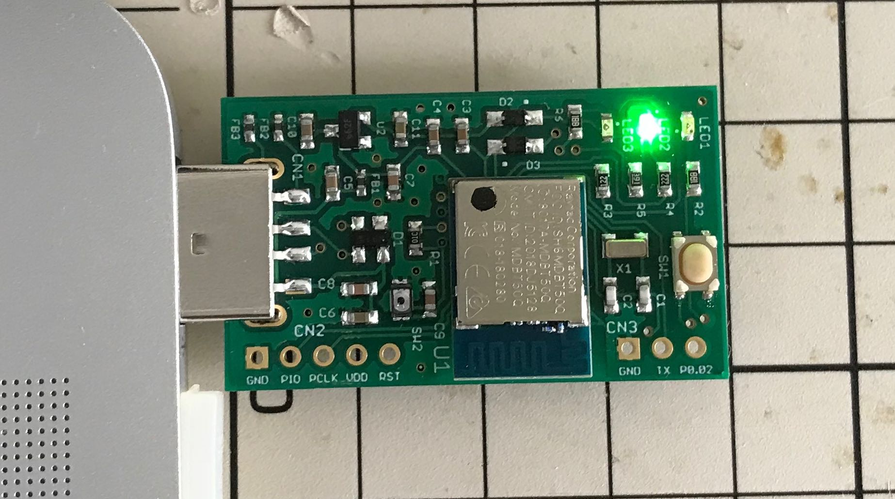
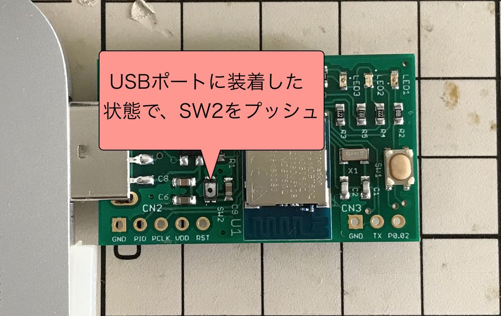

# [開発運用] アプリケーション書込み手順

MDBT50Q Dongleにプレインストールされている[USBブートローダー（署名機能付き）](../../../nRF5_SDK_v15.3.0/firmwares/secure_bootloader/README.md)を使用して、MDBT50Q Dongleに[FIDO2認証器アプリケーション](../../../nRF5_SDK_v15.3.0/README.md)を書き込む手順を掲載いたします。

## 書込み準備

### ハードウェアの準備

まず最初に、MDBT50Q Dongleの背面にあるボタン電池ケースに、<b>電池が入っていないこと</b>を必ず確認します。


MDBT50Q DongleをPCのUSBポートに装着します。<br>
アイドル時であることを表示する緑色のLEDが点滅していることを確認します。



### ファームウェアの準備

ビルド済みのファームウェア更新イメージファイルが、GitHubリポジトリーの以下の場所に格納されています。
- ディレクトリー: [`/nRF5_SDK_v15.3.0/firmwares/`](../../../nRF5_SDK_v15.3.0/firmwares)
- ファームウェア更新イメージファイル: `appkg.PCA10059.nn.nn.nn.zip`

`appkg.PCA10059.nn.nn.nn.zip`の`nn.nn.nn`は、バージョン番号になります。<br>
例えば、バージョン`0.2.11`のファームウェア更新イメージファイル名は、`appkg.PCA10059.0.2.11.zip`となります。

### 書込み用ツールの準備

書込み用ツール「nRF Util」を、あらかじめPCに導入しておきます。<br>
詳細につきましては、手順書[「nRF Utilインストール手順」](../../../nRF5_SDK_v15.3.0/NRFUTILINST.md)をご参照願います。

### Python3ライブラリーの準備

後述のPython3スクリプト「[`HookUpHIDBLMode.py`](../../../nRF5_SDK_v15.3.0/HookUpHIDBLMode.py)」を実行させるために必要な依存ライブラリー「hidapi」を、あらかじめPCに導入しておきます。<br>
詳細につきましては、手順書[「hidapiインストール手順」](../../../nRF5_SDK_v15.3.0/PYHIDAPIINST.md)をご参照願います。

## アプリケーションの書込み

### ブートローダーモードに遷移

Python3スクリプト「[`HookUpHIDBLMode.py`](../../../nRF5_SDK_v15.3.0/HookUpHIDBLMode.py)」を実行し、MDBT50Q Dongleをブートローダーモードに遷移させます。<br>
以下のコマンドを実行します。

```
GITHUB_DIR=${HOME}/GitHub/onecard-fido
python3 ${GITHUB_DIR}/nRF5_SDK_v15.3.0/HookUpHIDBLMode.py
```

下記は実行例になります。

```
bash-3.2$ GITHUB_DIR=${HOME}/GitHub/onecard-fido
bash-3.2$ python3 ${GITHUB_DIR}/nRF5_SDK_v15.3.0/HookUpHIDBLMode.py
HID device: path=b'IOService:/AppleACPIPlatformExpert/PCI0@0/AppleACPIPCI/XHC1@14/XHC1@14000000/HS03@14100000/FIDO authenticator@14100000/IOUSBHostInterface@0/AppleUserUSBHostHIDDevice', usage_page=61904, usage=1
---- sent data ----
b'ffffffff860008d4e5f607182930410000000000000000000000000000000000'
b'0000000000000000000000000000000000000000000000000000000000000000'
---- received data ----
b'ffffffff860011d4e5f607182930410100330102050002070000000000000000'
b'0000000000000000000000000000000000000000000000000000000000000000'
---- INIT done ----
---- sent data ----
b'01003301c5000000000000000000000000000000000000000000000000000000'
b'0000000000000000000000000000000000000000000000000000000000000000'
---- received data ----
b'01003301c5000100000000000000000000000000000000000000000000000000'
b'0000000000000000000000000000000000000000000000000000000000000000'
---- command done ----
bash-3.2$
```

コマンド実行が完了すると、MDBT50Q Dongleが自動的に、ブートローダーモードに遷移します。<br>
MDBT50Q Dongleの緑色・黄色のLEDが同時点灯していることを確認します。




### 書込み実行

nRFコマンドラインツールで`nrfutil dfu usb-serial`コマンドを実行し、仮想COMポート経由で、ファームウェア更新イメージファイルを転送します。<br>
具体的には、以下のコマンドを投入します。

```
FIRMWARES_DIR="${HOME}/GitHub/onecard-fido/nRF5_SDK_v15.3.0/firmwares"
cd ${FIRMWARES_DIR}
PACKAGE=`ls appkg.PCA10059.*.zip`
PORTNAME=`ls /dev/tty.usbmodem*`
echo command [nrfutil dfu usb-serial -pkg ${PACKAGE} -p ${PORTNAME}]
nrfutil dfu usb-serial -pkg ${PACKAGE} -p ${PORTNAME}
```

下記は実行例になります。

```
bash-3.2$ FIRMWARES_DIR="${HOME}/GitHub/onecard-fido/nRF5_SDK_v15.3.0/firmwares"
bash-3.2$ cd ${FIRMWARES_DIR}
bash-3.2$ PACKAGE=`ls appkg.PCA10059.*.zip`
bash-3.2$ PORTNAME=`ls /dev/tty.usbmodem*`
bash-3.2$ echo command [nrfutil dfu usb-serial -pkg ${PACKAGE} -p ${PORTNAME}]
command [nrfutil dfu usb-serial -pkg appkg.PCA10059.0.2.11.zip -p /dev/tty.usbmodemFC79AA445BA31]
bash-3.2$ nrfutil dfu usb-serial -pkg ${PACKAGE} -p ${PORTNAME}
  [####################################]  100%          
Device programmed.
bash-3.2$ 
```

### 書込み完了

書込処理が終了すると、MDBT50Q Dongleが自動的にリセットされ、アプリケーションがスタートします。<br>
アイドル時であることを表示する緑色のLEDが点滅していることを確認します。


以上で、MDBT50Q Dongleへのアプリケーション書込みは完了になります。
