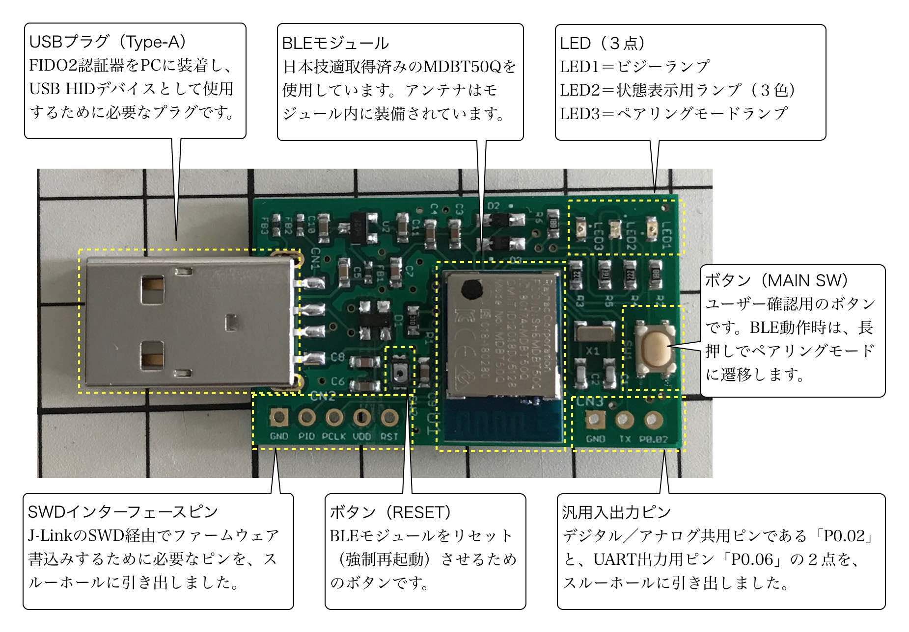
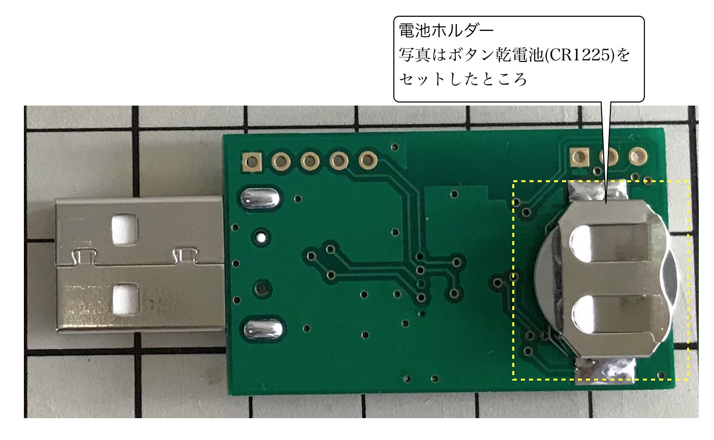
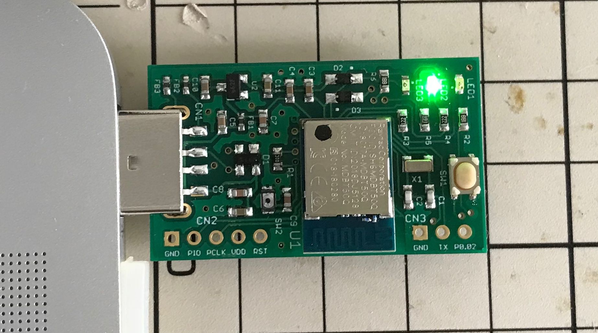
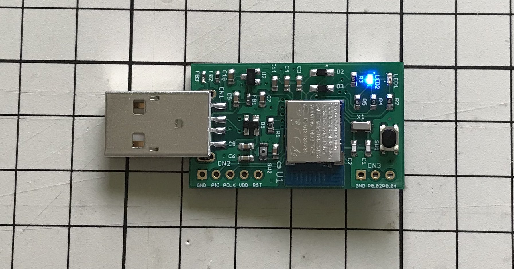
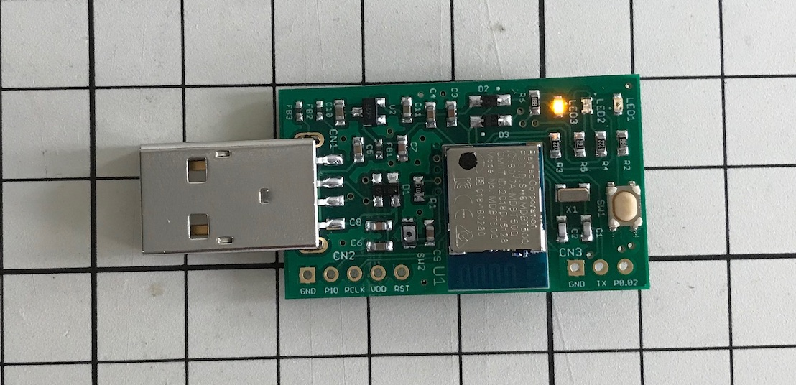

# MDBT50Q Dongle（rev2）の概要

## 基板の概要

日本国内の技適取得済みであるnRF52840搭載モジュール「MDBT50Q」をそのまま使用し、USB回路、ユーザーインターフェース回路、外部電源回路を追加した、USBドングル基板です。

#### 表面

#### 裏面

## 動作の概要

### 電源と動作モード

２電源方式となっています（充電機能はありません）。 
ただし、PCのUSBポートへの装着状態で、動作モードが自動的に切り替わります。

#### USB HIDモード

PCのUSBポートに装着すると、USB HIDデバイスとして動作します。[注1][注2] 
アイドル時は３色LEDが緑色で点滅します。

#### BLEペリフェラルモード（非ペアリングモード）

基板背面の電池ホルダーにボタン乾電池（CR1225）をセットすると、BLEペリフェラルデバイスとして動作します。[注2] 
アイドル時は３色LEDが青色で点滅します。

#### BLEペリフェラルモード（ペアリングモード）

前述の非ペアリングモードの状態で、ボタンを３秒以上長押しすると、ペアリングモードに遷移します。[注3] 
下図のように、ペアリングモードであることを示す、黄色LEDが点灯します。[注4]

[注1] ボタン乾電池がセットされていない場合は、PCのUSBから電源を取得し、USB HIDデバイスとして動作します。 
[注2] ボタン乾電池がセットされている状態でも、PCのUSBポートに装着している間は、常にUSB HIDデバイスとして動作します。 
[注3] [管理ツール](../../../MaintenanceTool/README.md)を使用し、macOS、Windowsとのペアリングができるようになります。 
[注4] ボタン長押しから３秒経過すると黄色LEDが点灯し、その後ボタンから指を話すと、いったん黄色LEDが消灯してしまいますが、プログラム制御（リセット実行）による動きであり、異常ではありません。

### LED点灯制御

基板上に３点のLEDが配置されています。 
（LED2は３色LEDとなっております）

各LEDの点灯制御は以下の通りです。

|LED |LEDの色 |点灯制御 |動作モード |アプリケーションの状態 |
|:-|:-:|:-:|:-:|:-|
|LED1|赤 |連続点灯|USB HID／BLE|アプリケーションハング時／ビジー時[注1]|
|LED1|赤 |高速点滅|USB HID|リセットコマンド実行のためユーザー確認中[注2]|
|LED2|赤 |通常点滅|USB HID|BLEペリフェラルスキャン中[注3]|
|LED2|緑 |緩く点滅|USB HID|アイドル時（機能未実行または無通信時。以下同）|
|LED2|青 |緩く点滅|BLE|アイドル時|
|LED2|緑 |通常点滅|USB HID／BLE|ユーザー登録／ログイン実行のためのユーザー所在確認中[注4]|
|LED2|白 |連続点灯|USB HID／BLE|クリティカルエラー発生時[注5]|
|LED3|黄 |連続点灯|BLE|ペアリングモード時|
|LED3|黄 |通常点滅|BLE|ペアリングエラー発生時|

- 通常点滅＝秒間２回の点滅
- 高速点滅＝秒間５回の点滅
- 緩く点滅＝約２秒ごとに点滅

[注1] アプリケーションハング時は、USB HIDモード時はPCのUSBポートからの抜き差し、BLEペリフェラルモード時はボタン電池の抜き差しにより、元のアイドル時に戻ります。 
[注2] 管理ツールの「PINコード解除」機能実行時に発生します。 
[注3] PCのUSBポートに装着中は、BLEペリフェラルのスキャンを実行することができます。 
[注4] WebAuthnのユーザー登録／ログイン時に発生します。 
[注5] FIDO2で規定するセキュリティー違反（例えば3回連続でPIN入力エラー）があった場合に発生します。３色LEDの赤・緑・青・赤全色が点灯し、見かけ上は白色となります。
