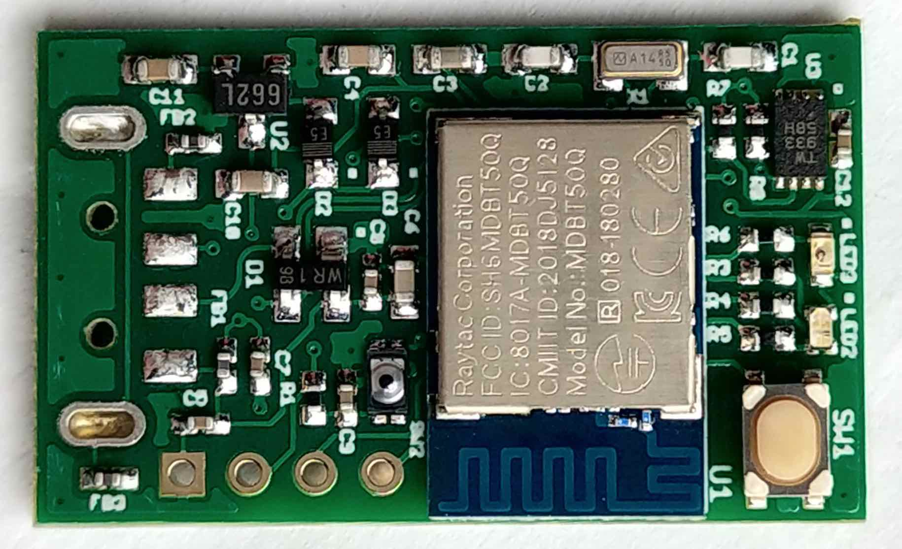

# MDBT50Q Dongle（rev2.1）

## 概要

日本国内の技適取得済みであるnRF52840搭載モジュール「MDBT50Q」を使用し、nRF52840 Dongleとほぼ同じ仕様で製作した、USBドングル基板です。

### [MDBT50Q Dongleの概要](HWSUMMARY.md)

基板、動作についての概要を説明しています。

### [MDBT50Q Dongle回路図](FIDO2AUTH_0021.pdf)

nRF52840 Dongleをベースとし、電池電源の増設と、LEDの増設、若干の配線変更を行っております。

### [FIDO2認証器アプリケーション](../../../nRF5_SDK_v15.3.0/README.md)

MDBT50Q Dongleで使用するファームウェアです。

### [ファームウェア更新手順](../../../MaintenanceTool/macOSApp/UPDATEFIRMWARE.md)

MDBT50Q Dongleのファームウェアを、[FIDO認証器管理ツール（macOS版）](../../../MaintenanceTool/macOSApp)により更新する手順について説明しています。

## 動作確認手順

### [Edgeブラウザーを使用したWebAuthnテスト手順（Windows10 PC）](../../../FIDO2Device/MDBT50Q_Dongle/WEBAUTHNTEST.md)

MDBT50Q Dongleと、Edgeブラウザー、デモサイトを使用して、WebAuthnのユーザー登録／ログイン（MakeCredential／GetAssertion）の動作確認をする場合の手順を掲載しています。

### [Googleアカウントのログイン確認手順（PC）](../../../FIDO2Device/MDBT50Q_Dongle/PCCHROME.md)

MDBT50Q Dongleと、Googleアカウント、Chromeブラウザーを使用して、U2F Register／Authenticateの動作確認をする場合の手順を掲載しています。

## 新機能

BLEセントラルサービスを使用した新しい機能です。

### [BLEデバイスによる自動認証](../../../FIDO2Device/MDBT50Q_Dongle/BLEDAUTH.md)

FIDO認証（WebAuthn／U2F）実行時、MDBT50Q Dongle上のボタンを押す代わりに、One CardなどのBLEデバイスを近づけることにより、認証処理を自動的に続行させます。

## ご参考情報

### このフォルダーの内容

MDBT50Q Dongle（rev2.1）を製作するための基板設計データです。 
「EAGLE 7.7.0」を使用して作成しています。

- [bom](bom) - 部品表（CSV）
- [centroid](centroid) - 部品配置データ
- [gerber](gerber) - プリント基板設計データ
- [FIDO2AUTH_0021.sch](FIDO2AUTH_0021.sch) - 回路図データ
- [FIDO2AUTH_0021.brd](FIDO2AUTH_0021.brd) - プリント基板配線データ

### [アプリケーション書込み手順](../../../nRF5_SDK_v15.3.0/APPINSTALL.md)

MDBT50Q Dongleにプレインストールされている[USBブートローダー（署名機能付き）](../../../nRF5_SDK_v15.3.0/firmwares/secure_bootloader/README.md)を経由し、MDBT50Q Dongleに[FIDO2認証器アプリケーション](../../../nRF5_SDK_v15.3.0/README.md)を書き込む手順を掲載しています。 
（ファームウェア単体開発時の運用になります）

### [USBブートローダー（署名機能付き）](../../../nRF5_SDK_v15.3.0/examples/dfu/secure_bootloader/README.md)

PCのUSBポート経由で、MDBT50Q Dongleに[FIDO2認証器アプリケーション](../../../nRF5_SDK_v15.3.0/README.md)を書き込むことができるようにするためのファームウェアです。 
MDBT50Q Dongleにはすでに導入済みとなっております。
