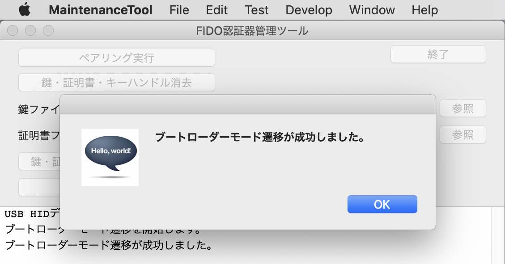

# [開発運用] アプリケーション書込み手順

MDBT50Q Dongleにプレインストールされている[USBブートローダー（署名機能付き）](../../../nRF5_SDK_v15.3.0/firmwares/secure_bootloader/README.md)を使用して、MDBT50Q Dongleに[nRF52840アプリケーション](../../../nRF5_SDK_v15.3.0/README.md)を書き込む手順を掲載いたします。

## 書込み準備

### ハードウェアの準備

まず最初に、MDBT50Q Dongleの背面にあるボタン電池ケースに、<b>電池が入っていないこと</b>を必ず確認します。


MDBT50Q DongleをPCのUSBポートに装着します。<br>
アイドル時であることを表示する緑色のLEDが点滅していることを確認します。


### ファームウェアの準備

ビルド済みのファームウェア更新イメージファイルが、GitHubリポジトリーの以下の場所に格納されています。
- ディレクトリー: [`/nRF5_SDK_v15.3.0/firmwares/`](../../../nRF5_SDK_v15.3.0/firmwares)
- ファームウェア更新イメージファイル: `appkg.PCA10059_02.nn.nn.nn.zip`

`appkg.PCA10059_02.nn.nn.nn.zip`の`nn.nn.nn`は、バージョン番号になります。<br>
例えば、バージョン`0.2.11`のファームウェア更新イメージファイル名は、`appkg.PCA10059_02.0.2.11.zip`となります。

### 書込み用ツールの準備

書込み用ツール「nRF Util」を、あらかじめPCに導入しておきます。<br>
詳細につきましては、手順書[「nRF Utilインストール手順」](../../../nRF52840_app/NRFUTILINST.md)をご参照願います。

### 管理ツールの準備

[FIDO認証器管理ツール](../../../MaintenanceTool/README.md)をPCにインストールします。<br>
以下の手順書をご参照願います。

* <b>[インストール手順（macOS版）](../../../MaintenanceTool/macOSApp/INSTALLPRG.md) </b>
* <b>[インストール手順（Windows版）](../../../MaintenanceTool/WindowsExe/INSTALLPRG.md) </b>

## アプリケーションの書込み

### ブートローダーモードに遷移

管理ツールのメニュー「ブートローダーモード遷移」を実行し、MDBT50Q Dongleをブートローダーモードに遷移させます。<br>
（下図はmacOS版による実行イメージになります）


処理続行を確認するポップアップが表示されるので「Yes」ボタンをクリックします。


実行が完了し、ポップアップが表示されます。



MDBT50Q Dongleが自動的に、ブートローダーモードに遷移します。<br>
MDBT50Q Dongleの緑色・黄色のLEDが同時点灯していることを確認します。


### 書込み実行

nRFコマンドラインツールで`nrfutil dfu usb-serial`コマンドを実行し、仮想COMポート経由で、ファームウェア更新イメージファイルを転送します。<br>
具体的には、以下のコマンドを投入します。

```
FIRMWARES_DIR="${HOME}/GitHub/onecard-fido/nRF5_SDK_v15.3.0/firmwares"
cd ${FIRMWARES_DIR}
PACKAGE=`ls appkg.PCA10059_02.*.zip`
PORTNAME=`ls /dev/tty.usbmodem*`
echo command [nrfutil dfu usb-serial -pkg ${PACKAGE} -p ${PORTNAME}]
nrfutil dfu usb-serial -pkg ${PACKAGE} -p ${PORTNAME}
```

下記は実行例になります。

```
bash-3.2$ FIRMWARES_DIR="${HOME}/GitHub/onecard-fido/nRF5_SDK_v15.3.0/firmwares"
bash-3.2$ cd ${FIRMWARES_DIR}
bash-3.2$ PACKAGE=`ls appkg.PCA10059_02.*.zip`
bash-3.2$ PORTNAME=`ls /dev/tty.usbmodem*`
bash-3.2$ echo command [nrfutil dfu usb-serial -pkg ${PACKAGE} -p ${PORTNAME}]
command [nrfutil dfu usb-serial -pkg appkg.PCA10059_02.0.2.11.zip -p /dev/tty.usbmodemD6209557A6AE1]
bash-3.2$ nrfutil dfu usb-serial -pkg ${PACKAGE} -p ${PORTNAME}
  [####################################]  100%          
Device programmed.
bash-3.2$
```

### 書込み完了

書込処理が終了すると、MDBT50Q Dongleが自動的にリセットされ、アプリケーションがスタートします。<br>
アイドル時であることを表示する緑色のLEDが点滅していることを確認します。


以上で、MDBT50Q Dongleへのアプリケーション書込みは完了になります。
