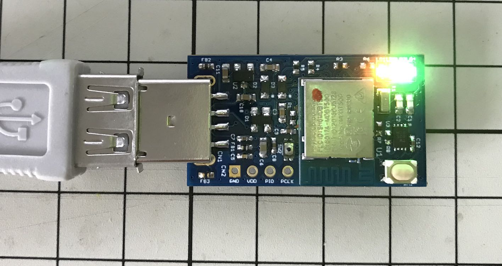

# MDBT50Q Dongle（rev2.2）の概要

## 基板の概要

日本国内の技適取得済みであるnRF52840搭載モジュール「MDBT50Q」をそのまま使用し、USB回路、ユーザーインターフェース回路、外部電源回路を追加した、USBドングル基板です。

### 表面

### 裏面

## 動作の概要

### 電源と動作モード

２電源方式となっています（充電機能はありません）。 
PCのUSBポートへの装着状態で、動作モードが自動的に切り替わります。

#### USB HIDモード

PCのUSBポートに装着すると、USB HIDデバイスとして動作します。[注1][注2] 
アイドル時は緑色LEDが点滅します。

#### BLEペリフェラルモード（非ペアリングモード）

基板背面の電池ホルダーにボタン乾電池（CR1225）をセットすると、BLEペリフェラルデバイスとして動作します。[注2] 
アイドル時は青色LEDが点滅します。

#### BLEペリフェラルモード（ペアリングモード）

MDBT50Q Dongleがペアリングされていない場合、または非ペアリングモードでボタンを３秒以上長押しすると、ペアリングモードに遷移します。[注3] 
下図のように、ペアリングモードであることを示す、橙色LEDが連続点灯します。

[注1] ボタン乾電池がセットされていない場合は、PCのUSBから電源を取得し、USB HIDデバイスとして動作します。 
[注2] ボタン乾電池がセットされている状態でも、PCのUSBポートに装着している間は、常にUSB HIDデバイスとして動作します。 
[注3] [管理ツール](../../../MaintenanceTool/README.md)を使用し、macOS、Windowsとのペアリングができるようになります。 

#### USB CDCモード（ブートローダーモード）

[管理ツール](../../../MaintenanceTool/README.md)から「ファームウェア更新」を実行すると、ブートローダーモードに遷移し、ファームウェアが転送可能な状態となります。 
下図のように、橙色LEDと緑色LEDが同時に点灯します。

### LED点灯制御

基板上に４点のLEDが配置されています。

各LEDの点灯制御は以下の通りです。

|LED |LEDの色 |点灯制御 |動作モード |アプリケーションの状態 |
|:-|:-:|:-:|:-:|:-|
|LED1|橙 |連続点灯|BLE|ペアリングモード時|
|LED1|橙 |通常点滅|BLE|ペアリング情報の無効を検知時[注1]|
|LED1|橙 |高速点滅|BLE|ペアリング情報の消失を検知時[注2]|
|LED2|赤 |連続点灯|USB HID／BLE|アプリケーションハング時／ビジー時[注3]|
|LED2|赤 |高速点滅|USB HID|リセットコマンド実行のためユーザー確認中[注4]|
|LED3|緑 |緩く点滅|USB HID|アイドル時（機能未実行または無通信時。以下同）|
|LED3|緑 |通常点滅|USB HID／BLE|ユーザー登録／ログイン実行のためのユーザー所在確認中[注5]|
|LED4|青 |緩く点滅|BLE|アイドル時|
|LED1/LED3|橙・緑 |連続点灯|USB CDC|ブートローダーモード時|
|LED2/LED3/LED4|赤・緑・青 |連続点灯|USB HID／BLE|クリティカルエラー発生時[注6]|

- 通常点滅＝秒間２回の点滅
- 高速点滅＝秒間５回の点滅
- 緩く点滅＝約２秒ごとに点滅

[注1] PC側のペアリング情報を環境設定画面から削除してしまった後、PCからMDBT50Q DongleのBLE機能を実行すると発生します。 
[注2] 管理ツールの「ペアリング情報削除」機能により、MDBT50Q Dongleからすべてのペアリング情報を消去した後、PC側に残存しているペアリング情報を使用して、再度ペアリングを試行すると発生します。 
[注3] アプリケーションハング時は、USB HIDモード時はPCのUSBポートからの抜き差し、BLEペリフェラルモード時はボタン電池の抜き差しにより、元のアイドル時に戻ります。 
[注4] [管理ツール](../../../MaintenanceTool/README.md)の「PINコード解除」機能実行時に発生します。 
[注5] WebAuthnのユーザー登録／ログイン時に発生します。 
[注6] FIDO2で規定するセキュリティー違反（例えば3回連続でPIN入力エラー）があった場合に発生します。赤色LED・緑色LED・青色LEDが同時点灯します。

### 電源オン制御

MDBT50Q Dongleの基板背面にある電池ホルダーに、ボタン乾電池（CR1225）をセットした当初は、スリープ状態となっております。 
基板上の全てのLEDは消灯しており、スリープ状態である事を示しています。

BLE経由で認証器の機能をご利用の際は、まずMDBT50Q Dongleをアイドル状態（PCからの要求を待ち受けている状態）に遷移させる必要があります。 
スリープ状態時に、基板上のボタンを１回押すと、アイドル状態に遷移し、青色LEDが点滅を開始します。[注1]

[注1] MDBT50Q Dongleがペアリングされていない場合は、ペアリングモードにおけるアイドル状態に遷移し、橙色LEDが連続点灯します。

### 電源オフ制御

MDBT50Q Dongleは、アイドル状態が３分程度続くと、自動的にスリープ状態に遷移します。 
これにより、LEDが消灯し、電池電源の消耗を防ぎます。

他方、アイドル状態時に、基板上のボタンを１回押すと、強制的にスリープ状態に遷移させることができます。[注1]

[注1]スリープ状態時に、基板上のボタンを１回押すと、再びアイドル状態に遷移し、青色LEDが点滅を開始（ペアリングモードの場合は橙色LEDが連続点灯）します。
