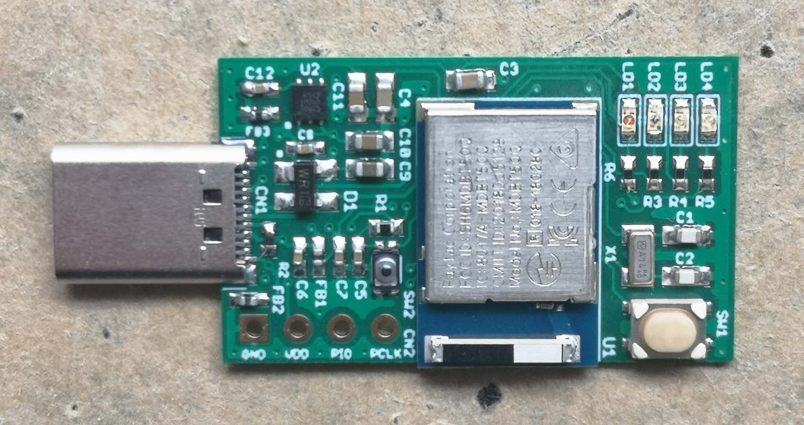

# MDBT50Q Dongle Mini（rev1）

## 概要

日本国内の技適取得済みであるnRF52840搭載モジュール「MDBT50Q」を使用し、nRF52840 Dongleとほぼ同じ仕様で製作した、USBドングル基板です。

#### 特色
- 外形寸法＝3.9cm x 1.8cm
- FIDO2機能（WebAuthn）をサポート
- FIDO2機能はUSB HIDトランスポートをサポート
- USB給電方式（Type-Cプラグ）
- 署名検証機能付きUSBブートローダーを採用し、不正ファームウェアの書込みを抑止
- CCIDインターフェースを装備し、PIV／OpenPGPカードエミュレーションが可能
- BLEセントラルデバイスとしても動作可能

#### MDBT50Q Dongleとの比較

|項目|[MDBT50Q Dongle mini (rev1)](../../FIDO2Device/MDBT50Q_Dongle_mini/pcb_rev1/README.md)|[MDBT50Q Dongle (rev2.1.2)](../../FIDO2Device/MDBT50Q_Dongle/pcb_rev2_1_2/README.md)|コメント|
|:---|:---|:---|:---|
|外形寸法|3.9cm x 1.8cm|4.9cm x 1.9cm||
|給電方式|USB給電|USB給電＋ボタン電池||
|USBプラグ|Type-C|Type-A||
|Bluetoothモジュール|MDBT50Q-1MV2|MDBT50Q-P1MV2||
|セキュアIC（ATECC608A）|非搭載|搭載||
|セキュアUSBブートローダー|搭載|搭載|相違無し|
|FIDO2機能|搭載|搭載|相違無し|
|FIDO2トランスポート|USBのみ|USB／BLE|BLEはボタン電池装着時|
|スマートカードエミュレーション機能|搭載|搭載|相違無し|
|BLEセントラル機能|搭載|搭載|相違無し|

### [MDBT50Q Dongle Miniの概要](../../FIDO2Device/MDBT50Q_Dongle_mini/pcb_rev1/README.md)

基板、動作についての概要を説明しています。

### [MDBT50Q Dongle Mini回路図](../../FIDO2Device/MDBT50Q_Dongle_mini/pcb_rev1/SECDONGL_001.pdf)

nRF52840 Dongleをベースとし、LEDの増設、若干の配線変更を行っております。

### [nRF52840アプリケーション](../../nRF52840_app/README.md)

MDBT50Q Dongle Miniで使用するファームウェアです。

### [ファームウェア更新手順](../../MaintenanceTool/macOSApp/UPDATEFIRMWARE.md)

MDBT50Q Dongleのファームウェアを、[FIDO認証器管理ツール（macOS版）](../../MaintenanceTool/macOSApp)により更新する手順について説明しています。

## 動作確認手順

### [Edgeブラウザーを使用したWebAuthnテスト手順（Windows10 PC）](../../FIDO2Device/MDBT50Q_Dongle/WEBAUTHNTEST.md)

MDBT50Q Dongleと、Edgeブラウザー、デモサイトを使用して、WebAuthnのユーザー登録／ログイン（MakeCredential／GetAssertion）の動作確認をする場合の手順を掲載しています。

### [Googleアカウントのログイン確認手順（PC）](../../FIDO2Device/MDBT50Q_Dongle/PCCHROME.md)

MDBT50Q Dongleと、Googleアカウント、Chromeブラウザーを使用して、U2F Register／Authenticateの動作確認をする場合の手順を掲載しています。

### [PIN番号を使用したmacOSログイン確認手順](../../FIDO2Device/MDBT50Q_Dongle/PIVPINLOGIN.md)

MDBT50Q Dongleに設定したPIV機能を使用し、PIN番号によるmacOSログインを行うための確認手順を掲載しています。

## オプション機能

BLEセントラルサービスを使用したオプション機能です。

### [BLE近接認証](../../FIDO2Device/MDBT50Q_Dongle/BLEDAUTH.md)

FIDO認証（WebAuthn／U2F）実行時、MDBT50Q Dongle上のボタンを押す代わりに、スマートフォンなどのBLEデバイスを近づけることにより、認証処理を自動的に続行させます。
