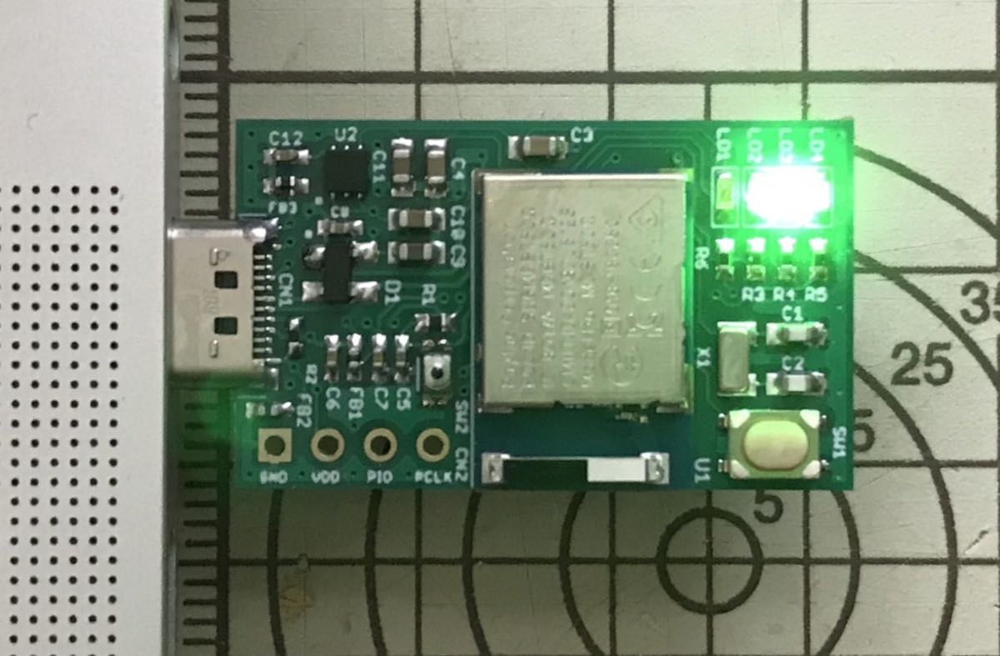

# MDBT50Q Dongle Mini（rev1）の概要

## 基板の概要

日本国内の技適取得済みであるnRF52840搭載モジュール「MDBT50Q」をそのまま使用し、USB回路、ユーザーインターフェース回路、外部電源回路を追加した、USBドングル基板です。

#### 表面

#### 裏面

## 動作の概要

### 電源と動作モード

USB給電方式となっています。 
動作モードはUSB HID／CCID／CDCモードになります。

#### USB HID／CCIDモード

PCのUSBポートに装着すると、USB HID／CCIDデバイスとして動作します。 
（HIDはFIDO機能と管理機能、CCIDはPIV／OpenPGPカードエミュレーション機能で使用します）

アイドル時は緑色LEDが点滅します。

#### USB CDCモード（ブートローダーモード）

[管理ツール](../../../MaintenanceTool/README.md)から「ファームウェア更新」を実行すると、ブートローダーモードに遷移し、ファームウェアが転送可能な状態となります。 
下図のように、橙色LEDと緑色LEDが同時に点灯します。

### LED点灯制御

基板上に４点のLEDが配置されています。

各LEDの点灯制御は以下の通りです。

|LED |LEDの色 |点灯制御 |動作モード |アプリケーションの状態 |
|:-|:-:|:-:|:-:|:-|
|LED2|赤 |連続点灯|USB HID／BLE|アプリケーションハング時／ビジー時[注1]|
|LED2|赤 |高速点滅|USB HID|リセットコマンド実行のためユーザー確認中[注2]|
|LED2|赤 |通常点滅|USB HID|BLEペリフェラルスキャン中[注3]|
|LED3|緑 |緩く点滅|USB HID|アイドル時（機能未実行または無通信時。以下同）|
|LED3|緑 |通常点滅|USB HID／BLE|ユーザー登録／ログイン実行のためのユーザー所在確認中[注4]|
|LED1/LED3|橙・緑 |連続点灯|USB CDC|ブートローダーモード時|
|LED2/LED3/LED4|赤・緑・青 |連続点灯|USB HID／BLE|クリティカルエラー発生時[注5]|

- 通常点滅＝秒間２回の点滅
- 高速点滅＝秒間５回の点滅
- 緩く点滅＝約２秒ごとに点滅

[注1] アプリケーションハング時は、PCのUSBポートからの抜き差し、またはリセットボタン押下により、元のアイドル時に戻ります。 
[注2] [管理ツール](../../../MaintenanceTool/README.md)の「PINコード解除」機能実行時に発生します。 
[注3] PCのUSBポートに装着中は、BLEペリフェラルのスキャンを実行することができます。 
[注4] WebAuthnのユーザー登録／ログイン時に発生します。 
[注5] FIDO2で規定するセキュリティー違反（例えば3回連続でPIN入力エラー）があった場合に発生します。赤色LED・緑色LED・青色LEDが同時点灯します。
