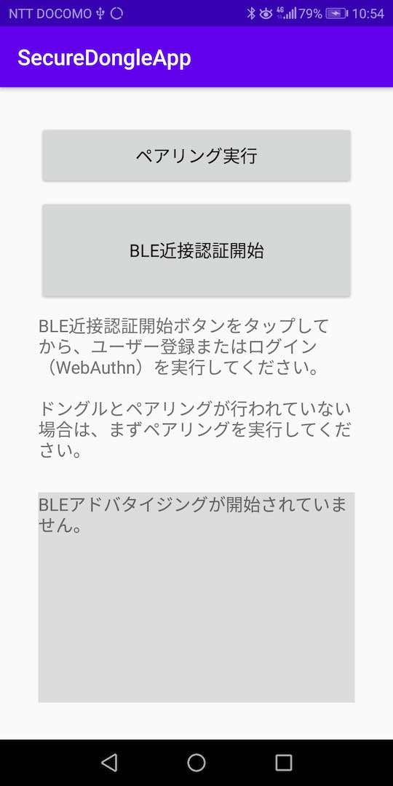
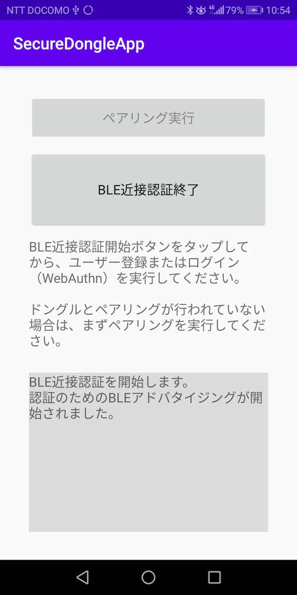
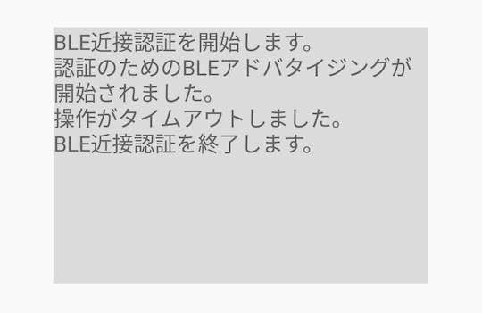
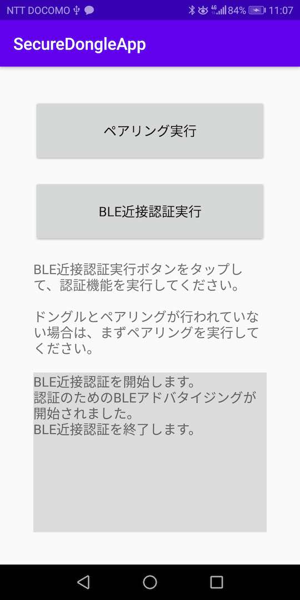
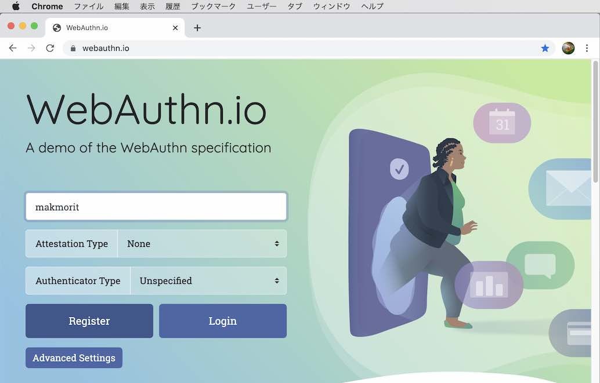
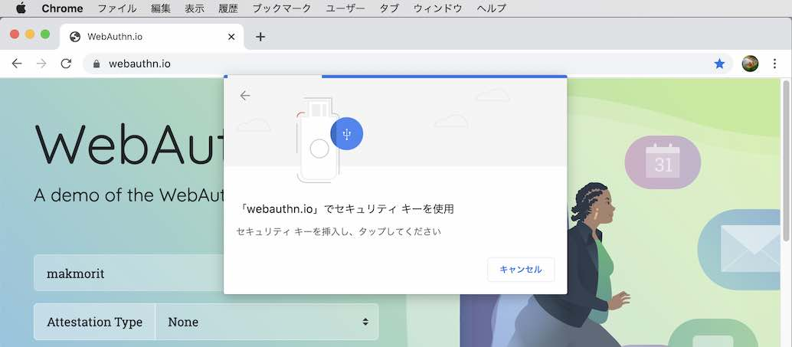
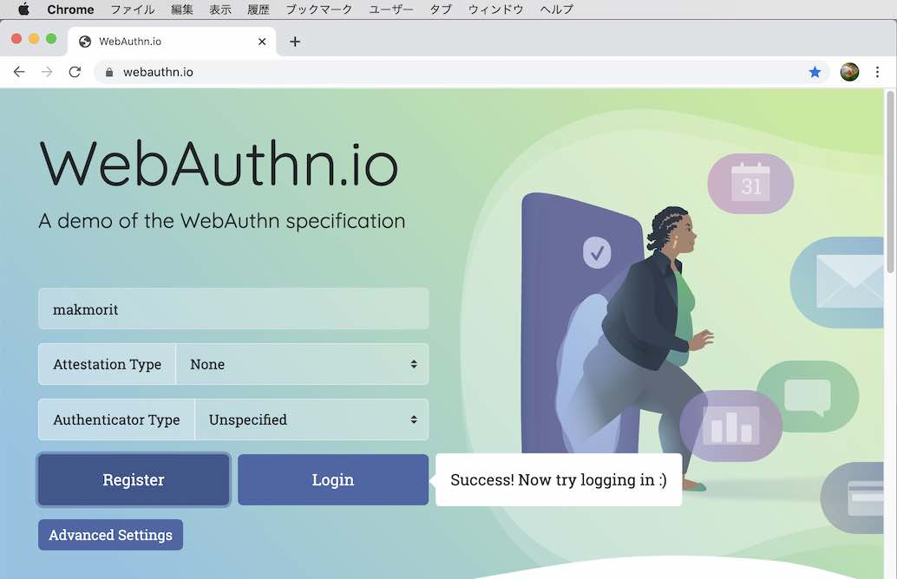
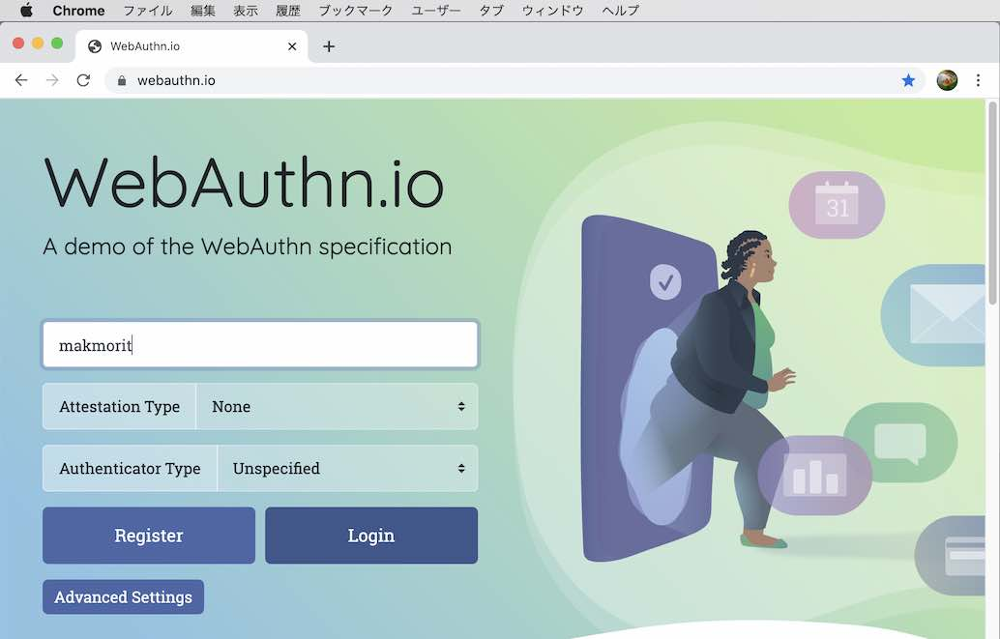
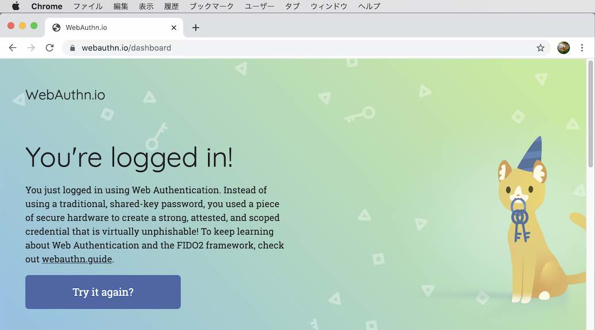

# BLE近接認証手順

## 概要

BLE近接認証アプリを使用し、WebAuthnのユーザー登録／ログインを実行する手順を掲載しています。

#### 機能概要

FIDO認証（WebAuthn）実行時、MDBT50Q Dongle上のボタンを押す代わりに、BLE近接認証アプリを導入したスマートフォンを近づけることにより、[認証処理を自動的に続行させる機能](../../../FIDO2Device/MDBT50Q_Dongle/BLEDAUTH.md)です。

## 事前準備

この機能を実行させる前の事前準備は以下の通りです。

- BLE近接認証アプリのインストール
- 自動認証パラメーターの設定

#### BLE近接認証アプリのインストール

Androidスマートフォンに、BLE近接認証アプリをインストールし、MDBT50Q Dongleとペアリングしておきます。 
手順につきましては「<b>[インストール手順](INSTALLPRG.md)</b>」をご参照願います。

#### 自動認証パラメーターの設定

自動認証パラメーター（BLE近接認証で使用するBLEデバイスのサービスUUIDや、そのスキャン秒数）を、事前にMDBT50Q Dongleに設定してください。 
設定は、管理ツールのツール設定画面上で行います。（下図はmacOS版管理ツール）

手順につきましては、下記の環境別手順書をご参照願います。 
- [macOS版管理ツールを使用した自動認証パラメーター設定手順](../../../MaintenanceTool/macOSApp/BLEAUTHPARAM.md)
- [Windows版管理ツールを使用した自動認証パラメーター設定手順](../../../MaintenanceTool/WindowsExe/BLEAUTHPARAM.md)

## 認証の実行

以下の順番で操作します。
- 近接認証開始
- FIDO認証（ユーザー登録／ログイン）の実行

#### 近接認証開始

Androidに導入した「[BLE近接認証アプリ](README.md)」を起動します。 
起動したら、画面上の「BLE近接認証実行」をタップします。

BLEアドバタイジングが開始され、MDBT50Q Dongleが、Androidを対象のBLEデバイスとして認識可能な状態となります。 
この後、FIDO認証を実行します。

#### 操作タイムアウトについて

このBLEアドバタイジングは、何もしないと１分ほどでタイムアウトして自動停止するようになっております。 
その場合は下図のようなメッセージが表示されます。

必要に応じて、再度「BLE近接認証実行」をタップし、BLEアドバタイジングを開始させるようにします。

#### FIDO認証の実行

以下の手順で、FIDO認証（WebAuthn）を実行します。
- 「[Edgeブラウザーを使用したWebAuthnテスト手順](../../../FIDO2Device/MDBT50Q_Dongle/WEBAUTHNTEST.md)」
- 「[Googleアカウントのログイン確認手順（PC）](../../../FIDO2Device/MDBT50Q_Dongle/PCCHROME.md)」

手順書では、ボタンを押すよう指示していますが、BLE近接認証アプリによりBLEアドバタイジングが開始している場合は<b>「ボタンを押す」という操作が省略できます。</b>

FIDO認証の実行が完了すると、約７秒後に、自動的にBLEアドバタイジングが停止し、メッセージ「BLE近接認証を終了します。」が表示されます。

以上で、FIDO認証の実行は完了になります。

## デモサイトによる確認

macOS環境において、Chromeブラウザーを使用し「[WebAuthn.io](https://webauthn.io/)」というデモサイトでWebAuthnのユーザー登録／ログインを実行する手順を掲載します。

#### ユーザー登録

「[BLE近接認証アプリ](README.md)」の「BLE近接認証実行」を開始します。

その後、Chromeブラウザーで[WebAuthn.io](https://webauthn.io/)サイトを開きます。 
ブラウザー画面上にユーザー名を半角英数字で入力後<b>「Register」をクリック</b>します。

下図のようなポップアップ画面が表示されますが、別段何の操作もしないで待ちます。

程なく、下図のようにメッセージ「Success! ...」が表示されます。

以上でユーザー登録は完了となります。

#### ログイン

「[BLE近接認証アプリ](README.md)」の「BLE近接認証実行」を開始します。

その後、Chromeブラウザーで[WebAuthn.io](https://webauthn.io/)サイトを開きます。 
ブラウザー画面上にユーザー名を半角英数字で入力後<b>「Login」をクリック</b>します。

下図のようなポップアップ画面が表示されますが、別段何の操作もしないで待ちます。

程なく、下図のようにメッセージ「You're logged in!」が表示されます。

以上でログインは完了となります。
