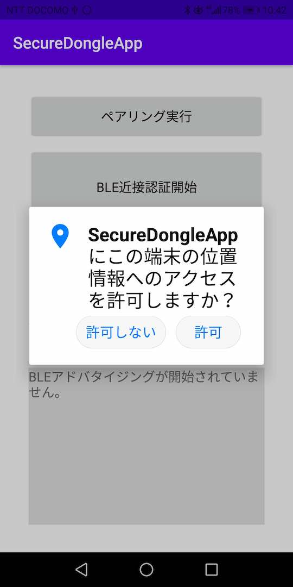

# BLE近接認証アプリインストール手順

## 概要
BLE近接認証アプリをAndroid環境にインストールする手順を掲載しています。

以下の順番で作業を進めます。
- アプリのダウンロードと事前設定
- インストールの実行
- ドングルとのペアリング

## アプリのダウンロードと事前設定

[Android版 BLE近接認証アプリ](executable/app-release.apk)を、GitHubからダウンロードします。 
該当ページの「Download」ボタンをタップすると、[app-release.apk](executable/app-release.apk)がダウンロードできます。

ダウンロード中に下図のようなメッセージが表示されたら「OK」をタップしてください。 
（Google Playを経由しないアプリのダウンロードであるため、このようなメッセージが表示されてしまいます。何卒ご容赦ください）

ダウンロードが完了したら「開く」をタップしてください。

下図のような画面に遷移したら「設定」をタップします。

設定画面に遷移したら、下図のように、右側のトグルをOnに設定します。

以上で、アプリのダウンロードと事前設定は完了です。

## インストールの実行

ダウンロードしたファイルを開きます。 
本例では例として、ダウンロードというアプリを開きます。

ダウンロードされたアプリがアイコンで一覧表示されますので、先ほどダウンロードした「app-release.apk」をタップします。

下図のような確認画面に遷移したら「インストール」をタップし、インストールを続行します。

インストール完了画面に遷移したら「開く」をタップし、アプリを起動させます。

下図のような確認メッセージが表示されたら、必ず「許可」を選択してください。 
（「許可しない」を選択すると、Bluetoothを使用することができず、結果としてBLE近接認証機能が実行できません。）

下図のようにBLE近接認証アプリが起動します。

以上でインストールは完了になります。

## ドングルとのペアリング

アプリのインストールが完了したら、MDBT50Q DongleとAndroidとの間で、Bluetoothペアリングを実行します。

#### ペアリングモードに遷移

Bluetoothペアリングを実行するためには、事前に、MDBT50Q Dongleをペアリングモードに遷移させる必要があります。

ペアリング対象となるMDBT50Q Dongleを、PC等のUSBポートに装着し、電源が入った状態にします。 
この状態で、基板上のボタンを３秒間ほど長押しします。

下図のように、橙色のLEDが点灯します。 
これで、MDBT50Q Dongleがペアリングモードに遷移しました。

#### ペアリングの実行

アプリ画面の「ペアリング実行」をタップします。

ペアリング処理が開始されます。

ペアリング処理が完了すると、画面下部に「ペアリングが成功しました。」というメッセージが表示されます。

ペアリング対象となるMDBT50Q Dongleの方では、ペアリング完了後、１０秒以内に自動的にペアリングモードが解除されます。 
ペアリングモードが解除されると、基板上の緑色のLEDが点滅します。

以上で、ペアリングの実行は完了となります。

これで、MDBT50Q Dongleが<b>[BLE近接認証機能](../../../FIDO2Device/MDBT50Q_Dongle/BLEDAUTH.md)</b>用のBLEデバイスとして利用することができます。
