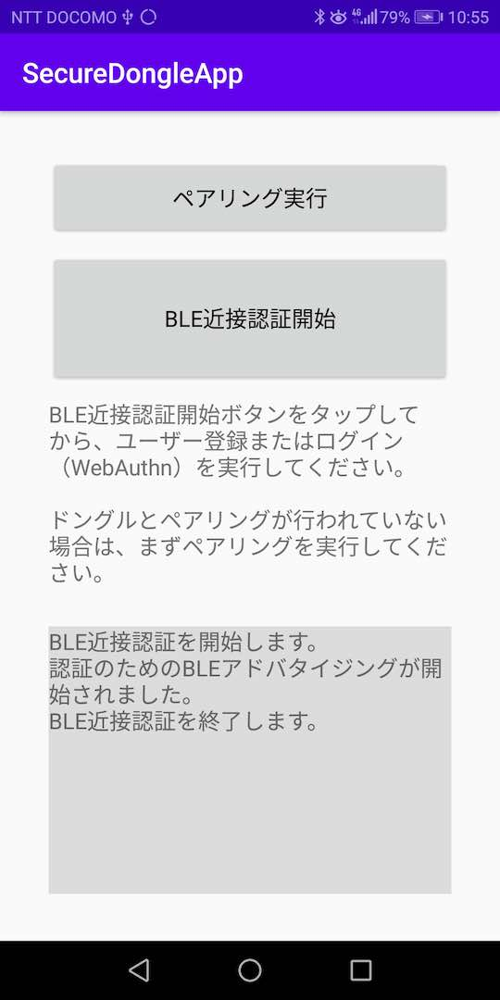

# Android版 BLE近接認証アプリ

## 概要
<b>[BLE近接認証機能](../../../FIDO2Device/MDBT50Q_Dongle/BLEDAUTH.md)</b>において、[MDBT50Q Dongle](../../../FIDO2Device/MDBT50Q_Dongle/README.md)の基板上のボタンを押す代わりに、スマートフォンのボタンを押すことにより、FIDO認証を実行できるようにするアプリです。

#### 機能
* ペアリング実行
* BLE近接認証実行

#### 画面イメージ

#### 動作環境
Android Version 8.0〜

## 手順書

- <b>[インストール手順](INSTALLPRG.md)</b> 
BLE近接認証アプリをAndroid環境にインストールする手順を掲載しています。

- <b>[BLE近接認証手順](BLEAUTH.md)</b> 
BLE近接認証アプリを使用し、WebAuthnのユーザー登録／ログインを実行する手順を掲載しています。
