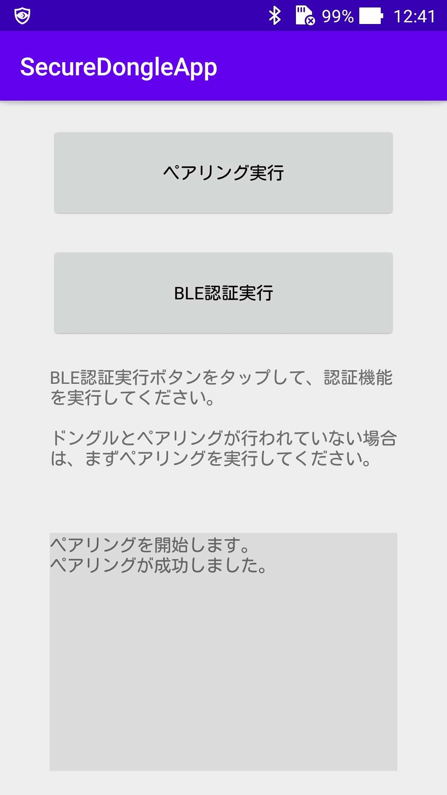

# BLE近接認証アプリ

## 概要
<b>[BLE近接認証機能](../../FIDO2Device/MDBT50Q_Dongle/BLEDAUTH.md)</b>において、[MDBT50Q Dongle](../../FIDO2Device/MDBT50Q_Dongle/README.md)の基板上のボタンを押す代わりに、スマートフォンのボタンを押すことにより、FIDO認証を実行できるようにするアプリです。

Android版を用意しました。
（iOS版は、後日対応予定です）

## 機能
* ペアリング実行
* BLE近接認証実行

## [Android版](Android)

#### 画面イメージ

#### 動作環境
Android Version 8.0〜

## [iOS版](iOS)

#### 画面イメージ
後報

#### 動作環境
iOS Version 13.0〜
