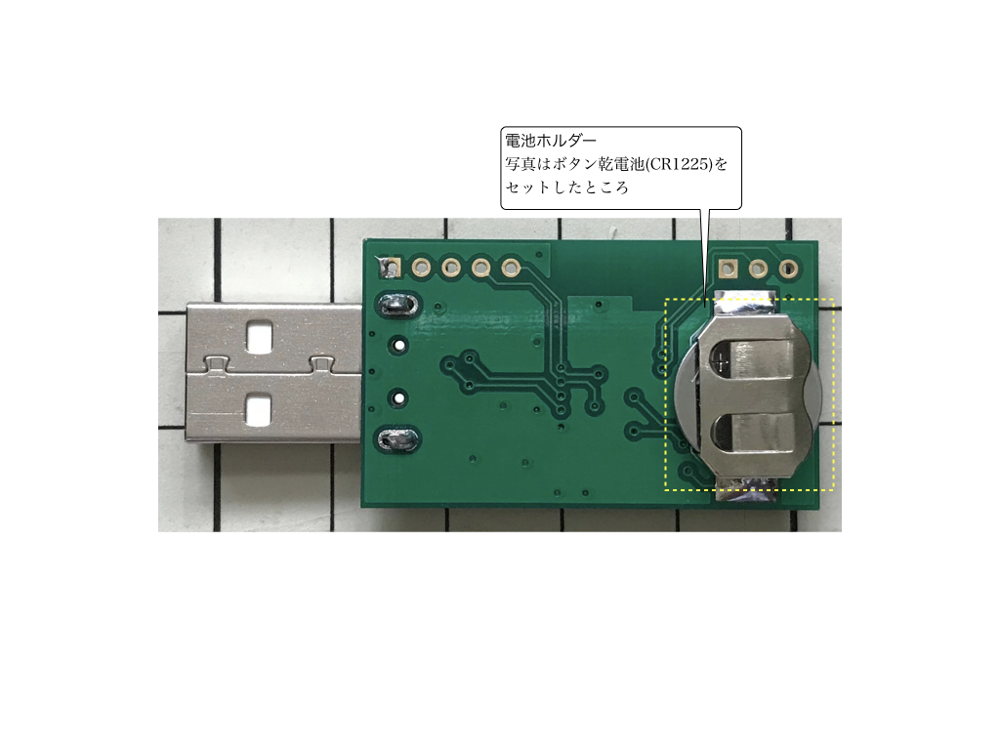
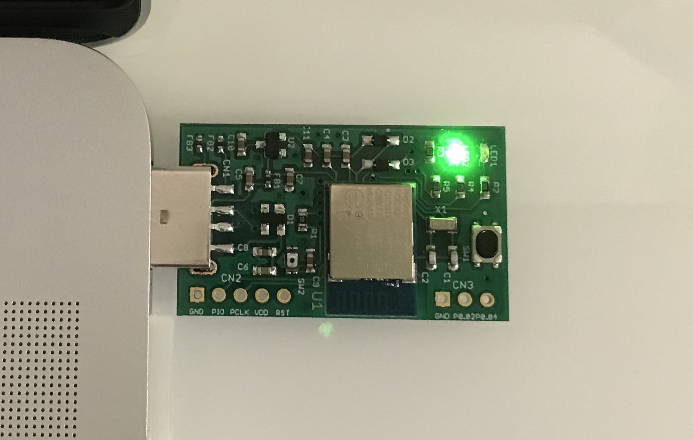
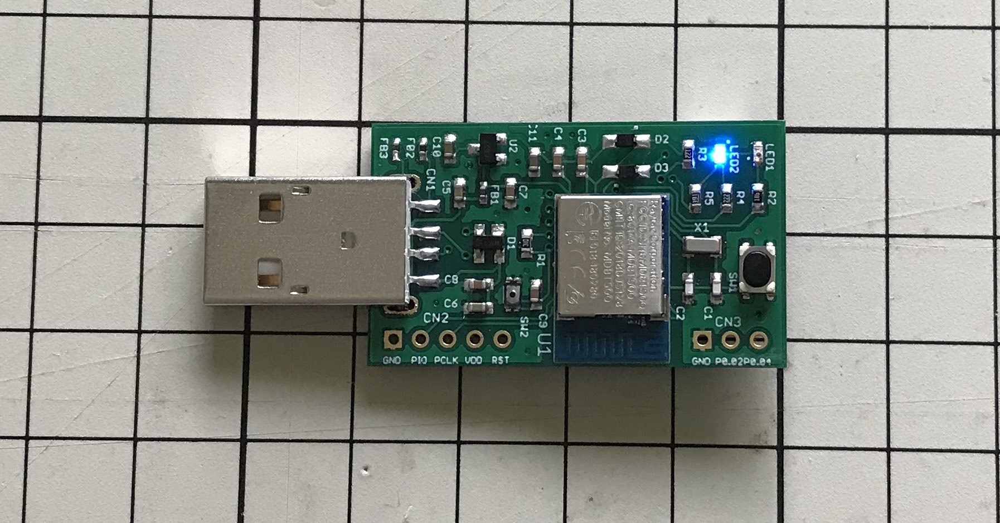

# MDBT50Q Dongleの概要

## 基板の概要

日本国内の技適取得済みであるnRF52840搭載モジュール「MDBT50Q」をそのまま使用し、USB回路、ユーザーインターフェース回路、外部電源回路を追加した、USBドングル基板です。

#### 表面

#### 裏面

## 動作の概要

### 電源と動作モード

２電源方式となっています（充電機能はありません）。 
ただし、PCのUSBポートへの装着状態で、動作モードが自動的に切り替わります。

#### USB HIDモード

PCのUSBポートに装着すると、USB HIDデバイスとして動作します。[注1][注2] 
アイドル時は３色LEDが緑色で点滅します。

#### BLEペリフェラルモード

基板背面の電池ホルダーにボタン乾電池（CR1225）をセットすると、BLEペリフェラルデバイスとして動作します。[注2] 
アイドル時は３色LEDが青色で点滅します。

[注1] ボタン乾電池がセットされていない場合は、PCのUSBから電源を取得し、USB HIDデバイスとして動作します。 
[注2] ボタン乾電池がセットされている状態でも、PCのUSBポートに装着している間は、常にUSB HIDデバイスとして動作します。 

### LED点灯制御

基板上に３色LEDが配置されていますが、こちらの点灯制御は以下の通りとなっています。

|LEDの色 |点灯制御 |動作モード |アプリケーションの状態 |
|:-|:-:|:-:|:-|
|緑 |緩く点滅|USB HID|アイドル時（機能未実行または無通信時。以下同）|
|緑 |通常点滅|USB HID／BLE|ユーザー登録／ログイン実行のためのユーザー所在確認中[注1]|
|青 |緩く点滅|BLE|アイドル時|
|赤 |連続点灯|BLE|ペアリングモード時|
|赤 |通常点滅|BLE|ペアリングエラー発生時|
|赤 |高速点滅|BLE|リセットコマンド実行のためユーザー確認中[注2]|
|白 |連続点灯|USB HID／BLE|クリティカルエラー発生時[注3]|
|- |消灯|USB HID／BLE|アプリケーションハング時／ビジー時[注4][注5]|

- 通常点滅＝秒間２回の点滅
- 高速点滅＝秒間５回の点滅
- 緩く点滅＝約２秒ごとに点滅

[注1] WebAuthnのユーザー登録／ログイン時に発生します。 
[注2] 管理ツールの「PINコード解除」機能実行時などで発生します。 
[注3] FIDO2で規定するセキュリティー違反（例えば3回連続でPIN入力エラー）があった場合に発生します。３色LEDの赤・緑・青・赤全色が点灯し、見かけ上は白色となります。 
[注4] アプリケーションハング時は、基板上のRESETボタンを押下すると、元のアイドル時に戻ります。 
[注5] 他の未割り当てLEDに、点灯制御を割り当てることを計画しております。
