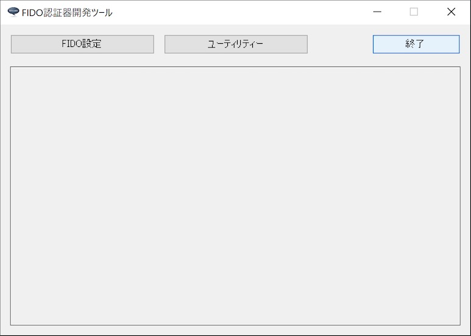

# FIDO認証器開発ツール

## 概要
PC環境から、FIDO認証器の動作に必要な各種設定／動作テスト等を行う、ベンダー向けのツールです。

macOS版と、Windows版を用意しました。

## 機能
* FIDO鍵・証明書設定
* ログファイル格納ディレクトリー参照機能

## [macOS版](../MaintenanceTool/macOSApp/DEVTOOL.md)

#### 画面イメージ

#### 動作環境
macOS Sierra (Version 10.12.6)〜

## [Windows版](../MaintenanceTool/WindowsExe/DEVTOOL.md)

#### 画面イメージ

#### 動作環境
Windows 10 (64bit版)
