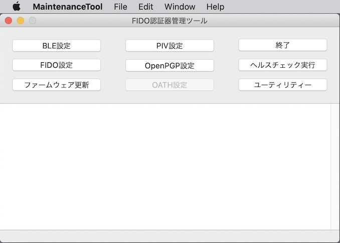
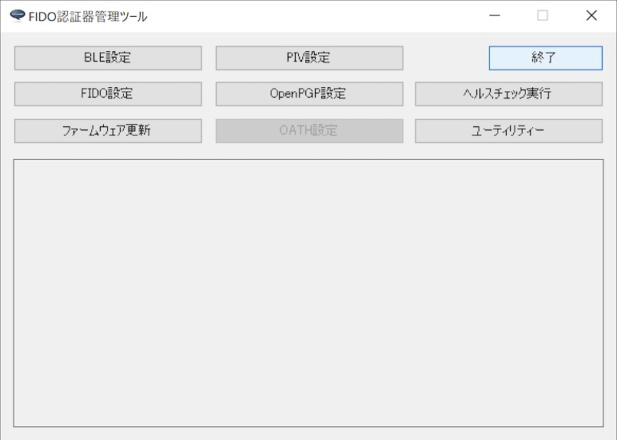

# FIDO認証器管理ツール

## 概要
PC環境から、FIDO認証器の動作に必要な各種設定／動作テスト等を行う、エンドユーザー向けのツールです。

macOS版と、Windows版を用意しました。

## 機能
* ペアリング実行／解除
* FIDO鍵・証明書設定（macOS版のみ）
* PINコード設定
* CTAP2ヘルスチェック実行
* U2Fヘルスチェック実行
* コマンドテスト機能
* Flash ROM情報取得機能
* バージョン情報取得機能
* PIV機能設定（macOS版のみ）
* OpenPGP機能設定
* ファームウェア更新機能
* ログファイル格納ディレクトリー参照機能

## [macOS版](../MaintenanceTool/macOSApp/README.md)

#### 画面イメージ

#### 動作環境
macOS Sierra (Version 10.12.6)〜

## [Windows版](../MaintenanceTool/WindowsExe/MNTTOOL.md)

#### 画面イメージ

#### 動作環境
Windows 10 (64bit版)
