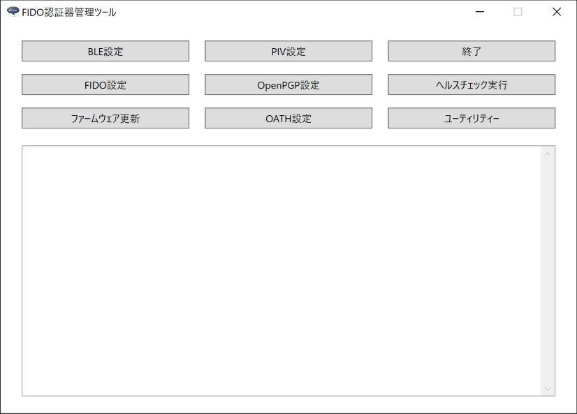

# FIDO認証器管理ツール

最終更新日：2023/3/13

## 概要
PC環境から、FIDO認証器の動作に必要な各種設定／動作テスト等を行うためのツールです。 
[macOS版](../MaintenanceTool/macOSApp/README.md)と、[Windows版](../MaintenanceTool/dotNET/README.md)を用意しました。

## エンドユーザー向けの機能

* ペアリング実行／解除要求
* ペアリング情報削除
* PINコード設定
* FIDO認証情報消去
* CTAP2ヘルスチェック実行
* U2Fヘルスチェック実行
* PINGテスト機能
* Flash ROM情報取得機能
* バージョン情報取得機能
* PIV機能設定
* OpenPGP機能設定
* OATH機能設定（最終更新日現在、Windows版のみ搭載）
* ファームウェア更新機能
* ログファイル格納ディレクトリー参照機能
* 認証器の時刻設定機能

## ベンダー向けの機能
エンドユーザー向けの機能に加え、下記機能を追加しています。

* FIDO鍵・証明書インストール／削除
* ブートローダーモード遷移機能
* ファームウェア再起動機能

## [macOS版](../MaintenanceTool/macOSApp/README.md)

#### 画面イメージ

#### 動作環境
macOS Big Sur (Version 11)〜macOS Monterey (Version 12)

## [Windows版](../MaintenanceTool/dotNET/README.md)

#### 画面イメージ

#### 動作環境
Windows 10 (64bit版)、Windows 11
