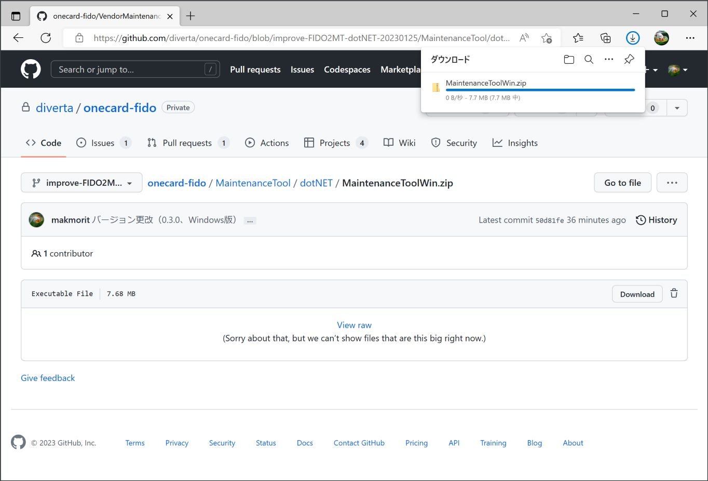

# FIDO認証器管理ツール

最終更新日：2023/1/12

## 概要
PC環境から、FIDO認証器の動作に必要な各種設定／動作テスト等を行うためのツールです。

最終更新日現在、macOS版が利用できます。 
（Windows版は、ただいま再構築中です）

## エンドユーザー向けの機能

* ペアリング実行／解除要求
* ペアリング情報削除
* PINコード設定
* FIDO認証情報消去
* CTAP2ヘルスチェック実行
* U2Fヘルスチェック実行
* PINGテスト機能
* Flash ROM情報取得機能
* バージョン情報取得機能
* PIV機能設定
* OpenPGP機能設定
* OATH機能設定（最終更新日現在、開発中）
* ファームウェア更新機能
* ログファイル格納ディレクトリー参照機能
* 認証器の時刻設定機能

## ベンダー向けの機能
エンドユーザー向けの機能に加え、下記機能を追加しています。

* FIDO鍵・証明書インストール／削除
* ブートローダーモード遷移機能
* ファームウェアリセット機能

## [macOS版](../MaintenanceTool/macOSApp/README.md)

#### 画面イメージ

#### 動作環境
macOS Sierra (Version 10.12.6)〜macOS Catalina (Version 10.15.7)

## Windows版（ただいま再構築中）

#### 画面イメージ

#### 動作環境
Windows 10 (64bit版)、Windows 11
