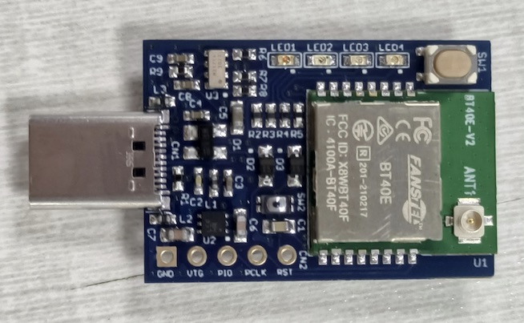
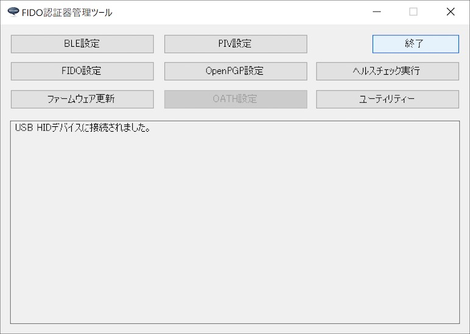
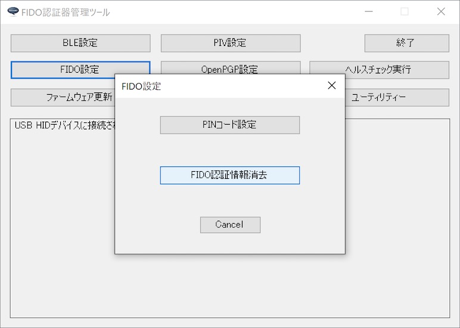
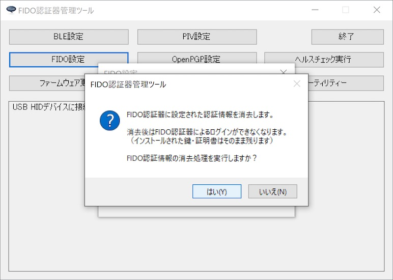
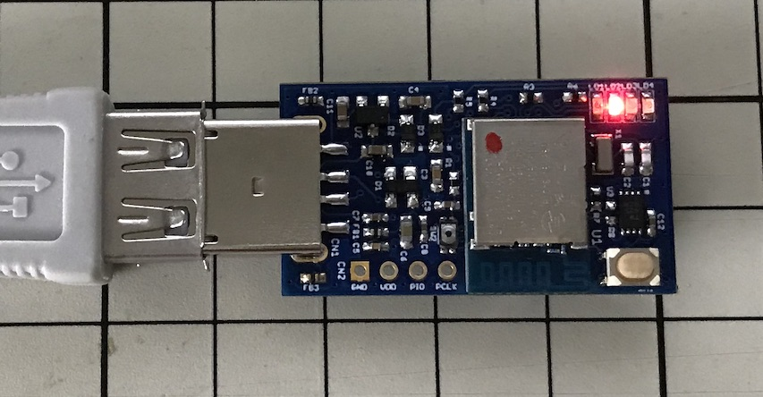
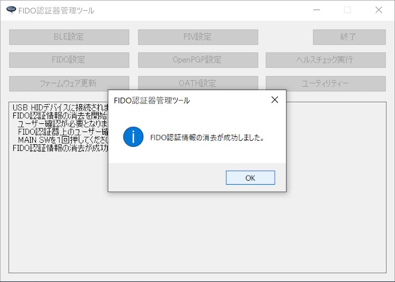

# FIDO認証情報の消去手順

## 概要

[FIDO認証器管理ツール](../../MaintenanceTool/WindowsExe/MNTTOOL.md)から、FIDO認証情報を消去する手順について掲載します。

## 認証器の準備

#### 使用機材

本ドキュメントでは「[BT40 Dongle](../../FIDO2Device/BT40Dongle/README.md)」を、FIDO2認証器として使用します。

#### 管理ツールを導入

[FIDO認証器管理ツール](../../MaintenanceTool/README.md)を、PC環境（Windows）に導入します。 
以下の手順書をご参照願います。

* <b>[インストール手順（Windows版）](INSTALLPRG.md) </b>

## FIDO認証情報の消去

管理ツールにより、認証器に設定されたFIDO認証情報の消去ができます。

### 注意事項

FIDO認証情報（認証器に登録されているユーザー情報やログイン情報）を削除すると、U2F／WebAuthnによるサイトへの再ログインができなくなりますので、ご注意ください。

### 消去手順

管理ツールを起動し、USBポートにFIDO2認証器を装着します。

管理ツール画面下部のメッセージ欄に「USB HIDデバイスに接続されました。」と表示されることを確認したら、管理ツールのFIDO設定画面で「FIDO認証情報消去」ボタンをクリックします。

確認ダイアログが表示されます。 
処理を続行したい場合は「はい(Y)」をクリックします。

管理ツール画面下部のメッセージ表示欄に、ユーザー確認が必要な旨のガイダンスが表示されます。

認証器上の赤色LEDが高速点滅するので、認証器上のMAIN SW（タクトスイッチ）を１回プッシュしてください。

程なく、下図のようなポップアップ画面が表示され、処理が完了します。

これで、FIDO認証情報の消去は完了です。
